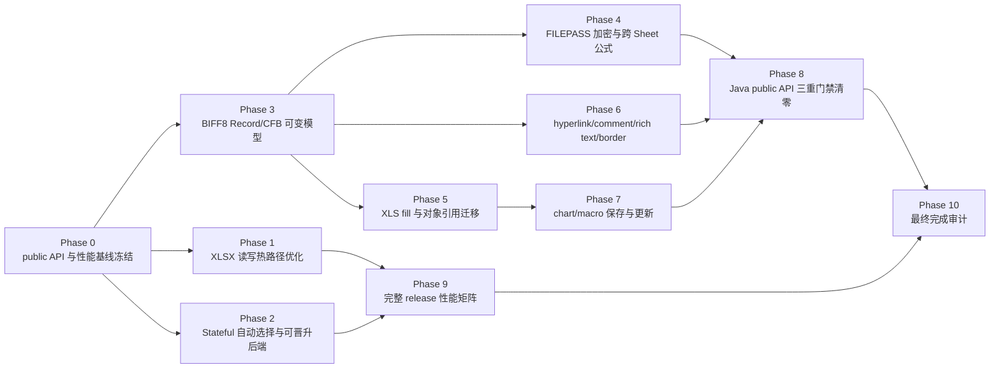
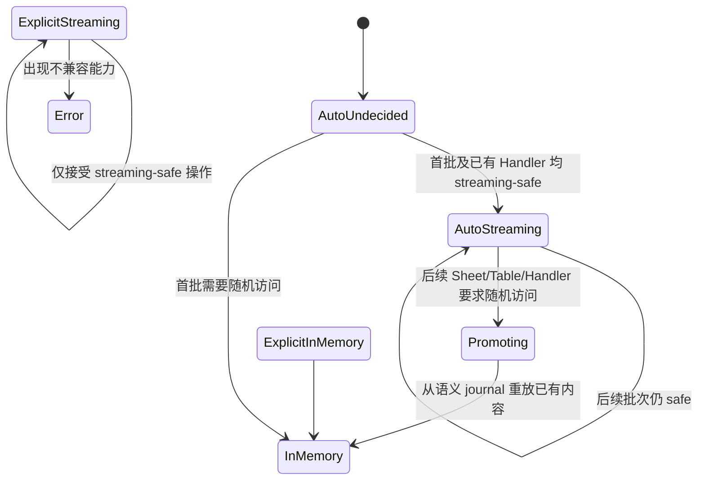

# easyexcel-rust Java 4.0.3 API、性能与 BIFF8 完整优化计划

> 状态：执行中（2026-08-08 当前工作树快照；尚未达到最终停止条件）
>
> 基线日期：2026-08-08
>
> Java 基线：`/Users/wandl/workspaces/workspace-github/easyexcel`，EasyExcel `v4.0.3`
>
> Rust 基线：`/Users/wandl/workspaces/workspace-github-easy-4-rust/easyexcel-rust`

## 1. 目标与不可妥协的完成定义

本计划解决以下八项发布阻断问题：

1. Rust 的 XLSX 流式写和 Event 读吞吐不得继续显著落后 Java。
2. XLS/BIFF8 密码写入和读取必须与 Java EasyExcel/Apache POI 互操作。
3. XLS placeholder fill 必须覆盖 Java 的标量、集合、重复填充和行移动语义。
4. XLS hyperlink、comment、rich text、chart、macro、border 必须达到 Java 可观察行为等价。
5. BIFF8 公式必须支持跨 Sheet 引用和正确的缓存值。
6. Stateful `.build()` 必须可靠自动选择/晋升写入后端，不能把风险留给调用方猜测。
7. 兼容门禁必须从“Java 测试文件清单”升级为完整 Java `javap` 与 Rust public API 逐方法门禁。
8. 必须实际执行冷/稳态、7 样本、并发和 30 分钟 soak 的完整性能发布门禁。

只有同时满足以下条件才能宣布目标完成：

| 维度 | 完成条件 |
|---|---|
| API | Java 4.0.3 每个 public 类型、构造器、方法和公开常量均有显式 Rust 语义映射 |
| 三重门禁 | 每个 Java public API ID 同时具备编译存在、Rust 行为断言、Java 运行产物/golden；任一缺失即失败 |
| XLSX 性能 | release 单 worker 的 `xlsx-stream-write` 和 `xlsx-event-read`，Rust/Java 中位吞吐比均不低于 `1.00`；统计区间下界不低于 `0.95` |
| 资源 | Rust 单 worker 峰值 RSS 不超过 64 MiB，且不比已固定 Rust 基线回退 15%；临时磁盘不超过 Java 同场景的 25% |
| BIFF8 | 本计划列出的能力不再返回 `Unsupported`，也不存在成功返回但输出丢失的 no-op |
| 互操作 | Java 产物由 Rust 读取、Rust 产物由 Java/POI 读取，行模型、元数据、公式、密码和模板对象均通过双向验证 |
| 发布性能 | release profile 全矩阵、并发 1/2/4/8/16、冷/稳态各 7 样本和 30 分钟 70/30 soak 全部执行并留存原始证据 |
| 回归 | workspace 全测试、all-features、Clippy、格式、文档、CodeGraph 同步全部通过 |

以下不能作为完成证据：仅有同名测试、仅能编译、仅 Rust 自己读回、仅单样本性能、仅能保存字段、仅能保留未知记录但未验证 Excel/POI 打开。

## 2. 当前基线与直接证据

> 本节表格记录计划制定时的原始基线；其后的“执行进度快照”记录当前实现，
> 防止把历史缺口描述误当成现状。

| 问题 | 当前证据 | 判断 |
|---|---|---|
| One-shot 自动流式 | `crates/easyexcel/src/write/builder/excel_writer_builder.rs:401-411,615-643` 只在 `do_write` 前调用安全判定 | 已有可靠子集 |
| Stateful 自动流式 | `crates/easyexcel/src/write/builder/excel_writer_builder.rs:395-399` 的 `build()` 直接创建 `ExcelWriter`，未执行自动选择 | 未解决 |
| Java 默认行为 | Java `ExcelWriterBuilder.java:51-58` 说明 `inMemory` 默认 false；`WorkBookUtil.java:31-52` 默认创建 `SXSSFWorkbook` | Rust stateful 默认未对齐 |
| XLS 密码 | `crates/easyexcel/src/write/write_xls.rs:50-53` 直接拒绝；`easyexcel-xls/src/biff8/encrypt.rs:1-30` 明示不是逐记录协议 | 未实现 |
| Java XLS 密码基线 | Java `WorkBookUtil.java:53-66` 设置 `Biff8EncryptionKey` 并调用 `HSSFWorkbook.writeProtectWorkbook` | 必须按 POI 产物实现 |
| XLS fill 原语 | `crates/easyexcel/src/write/xls_adapter/template.rs:76-95` 已有标量/集合替换入口 | 可复用但不足以支持行移动 |
| XLS fill 行移动 | Java `ExcelWriteFillExecutor.java:94-174` 处理 wrapper、方向、forceNewRow 和 `shiftRows` | Rust 尚未接入公开 fill |
| 跨 Sheet 公式 | `easyexcel-xls/src/biff8/ptg.rs:7-10` 声明不支持；tokenizer 位于 `ptg/builtin_functions_to_parser.rs:448-463` | 未实现 |
| Hyperlink | URL HLINK 已能写/读；Java `HyperlinkData` 还包括 DOCUMENT、EMAIL、FILE | 部分实现 |
| Comment | BIFF8 读链已具备；`xls_write.rs:437-439` 写入明确拒绝 | 部分实现 |
| Rich text | `xls_write.rs:443-446` 仅压平成普通文本；读取器可跳过/读取 rich-run 字节 | 降级实现 |
| Border | `easyexcel-xls/src/biff8/encode.rs:203` 将 border 位保持为零 | 未实现 |
| Chart/Macro | `easyexcel-xls/src/biff8/workbook.rs:11-13` 明示不支持；模板 CFB 尚未证明完整复制所有 storage/stream | 未实现 |
| Public API 门禁 | `scripts/verify-java-parity-gates.sh:25-40` 以 Java 测试目录为输入 | 不是 public API 门禁 |
| 性能基线 | `benchmarks/results/million-20260808/REPORT.md:8-23`：Rust 写 105,346 行/秒，Java 写 199,743 行/秒；Rust 读约 128K–138K，Java 读约 307K–343K | 吞吐显著落后 |
| Release 规范 | `benchmarks/spec/benchmark-suite-v1.json:15-59` 已定义 1M、冷/稳态、7 次、并发和资源阈值 | 尚未完整执行 |
| 跨运行时性能门禁 | `benchmarks/scripts/compare_results.py:325-344` 只展示 Java/Rust 比值，不阻断发布 | 必须补门禁 |

### 2.1 执行进度快照（2026-08-08）

| 范围 | 当前结果 | 尚未关闭的边界 |
|---|---|---|
| 单机单线程吞吐 | 同机复测中，Rust 读中位约 384,358 rows/s、Java 约 368,812；Rust 写约 257,799、Java 约 199,743 | 仍需 clean SHA、冷/稳态各 7 样本、完整多样本、1/2/4/8/16 并发与 30 分钟 soak |
| 本地 release 矩阵诊断 | 1M 行 cold、单 worker、7 样本写入组中 Rust 中位 247,363 rows/s、Java 中位 182,745，Rust/Java=1.354，95% bootstrap 下界 1.192；Rust CV 7.815%，Java CV 17.913% | Java CV 超过 10%，该组按规则判为环境无效，不能作为发布通过证据；需在固定 Linux runner 从头执行全矩阵 |
| Benchmark runner | 交叉重读与 checksum 均成功后立即删除单样本 25MB 输出，只保留 JSON、hash、fixture、GC log；新增回归测试，避免完整矩阵占用 60GB 以上临时空间 | 未完成的本地结果只作诊断，release 仍要求 clean SHA、固定环境和完整样本 |
| Stateful | 已加入保守 Auto、journal、后到 Handler/多批次晋升路径；显式流式仍 fail-closed | 仍需最终全矩阵和公开文档审计 |
| BIFF8 密码/公式 | CryptoAPI 双向互操作和跨 Sheet Ref3d/Area3d 已通过 Java POI 验证 | Sheet-range 3D 的全部歧义边界仍需 golden 扩充 |
| XLS fill | 标量、集合、横向/纵向、repeat、force-new-row、样式、公式 token、Escher 锚点、chart series、DV/CF/NAME 引用迁移已实现 | 仍需纳入最终多样本发布矩阵，并扩充未知坐标记录的 fail-closed fixture |
| XLS metadata | URL/DOCUMENT/EMAIL/FILE hyperlink、comment、rich-text 双向读写、border、macro Preserve/Strip/Replace 已实现；模板 chart 可保存并随插行迁移；生成式 BIFF8 Bar/Line/Pie 已支持锚点、标题、多系列/系列标题及跨 Sheet AI 引用；SST/CONTINUE 读取保留 UTF-16 run/FONT 索引并映射为高层 `CellValue::RichText`/`RichTextStringData` | comment 高级属性仍需继续对齐 |
| Handler mutation | 后端中立 `ChartMutation`（Bar/Line/Pie）已同时接入 XLSX 与生成式 XLS；BIFF8 产物已由 POI 5.2.5 回读标题/系列/区域并由 LibreOffice 转换确认图表类型与可见标题；生成式 XLS 的 `SetCell` 已在保存前应用 | 模板 mutation 仍 fail-closed；模板对象继续走原位保存/迁移路径 |
| Public API 门禁 | Java 3236 项、Rust default/all-features 各 10905 项快照已生成；证据目录（含递归 include）、执行 attestation、源码 SHA、命令参数/退出码和确定性 overlay 已接入；XLS/XLSX analyser、`XlsxTagHandler` 接口与首批 XLSX 抽象 handler、XLS handler 基类及全部 19 个 BIFF8 record handler 完成后，合计 205 项达到 compile probe + Rust behavior + Java golden 的 `verified` 条件 | 当前仍有 938 candidate、28 ambiguous、2065 unmapped，发布门禁保持 fail-closed |
| 当前回归 | `easyexcel` 1411、`easyexcel-xls` 111 测试通过；`easyexcel`/`easyexcel-xls` all-target strict Clippy 与 `cargo fmt --all -- --check` 通过；CodeGraph 已同步且索引为最新 | workspace all-features、文档和最终发布门禁仍待执行 |

## 3. 总体架构与实施顺序



关键设计原则：

- 先建立可失败的证据门禁，再实现能力，避免继续增加“有类型、没行为”的 API。
- BIFF8 只允许规范记录级实现；禁止再次引入整文件 RC4、伪 OLE stream 或纯字符串降级。
- 性能优化不能绕过 converter、handler、15 位数字规则、日期窗口或错误传播。
- Stateful 自动模式允许从流式晋升到内存，但不得重复执行用户 Handler。
- Chart/Macro 以 Java 可观察行为为准：模板对象必须保存并随行移动修正；需要创建/替换时提供后端中立 mutation API。
- 所有未知/未支持分支 fail-closed；不得返回成功后静默丢弃数据。

## 4. Phase 0：建立真正的 public API 与基准基线

### 4.1 Java API 提取

新增 `scripts/generate_java_public_api.py`：

1. 从固定 SHA 构建 `easyexcel-4.0.3.jar`、`easyexcel-core-4.0.3.jar`、`easyexcel-support-4.0.3.jar`。
2. 保存 JAR SHA-256、JDK 版本、Git SHA 和 Maven lock/dependency tree。
3. 对每个 class 执行 `javap -public -s -constants`，包括嵌套 public 类型、枚举值、构造器、重载方法和 public 常量。
4. 使用 JVM descriptor 生成稳定 ID，例如：
   `com.alibaba.excel.write.builder.ExcelWriterBuilder#inMemory(Ljava/lang/Boolean;)L...;`。
5. 将 synthetic、bridge 方法单独标记，但不静默删除；由规则文件说明是否属于用户可调用 API。
6. 生成 `docs/java-public-api-v4.0.3.json` 和人类可读的 `docs/java-public-api-v4.0.3.md`。

当前 core JAR 有 355 个 `.class` 条目，但正式 public 类型/方法数量必须由脚本产生，不能把这个 class 条目数冒充 API 数。

### 4.2 Rust public API 提取

新增 `scripts/generate_rust_public_api.py`：

1. 固定 nightly/rustdoc JSON 或固定版本的 `cargo-public-api`。
2. 对 workspace 所有发布 crate 生成 public item ID，包含 re-export 后最终路径、泛型约束、trait method、关联类型、常量和 feature gate。
3. 生成 `docs/rust-public-api.json`；同一 item 的多个 re-export 需归并但保留入口。
4. CI 检查 API 快照是否与源代码漂移。

### 4.3 逐方法映射与三重证据模型

新增 `parity/java-rust-public-api.yaml`，每个 Java API ID 必须包含：

```yaml
java_id: com.alibaba.excel.write.builder.ExcelWriterBuilder#inMemory(...)
rust_ids:
  - easyexcel::write::builder::ExcelWriterBuilder::in_memory
compile_probe: public_api_compile::excel_writer_builder_in_memory
behavior_tests:
  - stateful_auto_selection::explicit_in_memory_wins
java_golden:
  - writer_memory_mode/default_sxssf.json
status: verified
semantic_notes: Rust bool replaces nullable Boolean; None behavior covered separately.
```

规则如下：

- `rust_ids` 只是映射，不算编译存在证明；compile probe 必须实际引用签名并通过编译。
- 一个行为测试可覆盖多个 API，但必须在测试元数据中显式列出每个 API ID。
- Java golden 必须由固定 Java 4.0.3 运行产生，不能手写为 Rust 当前行为。
- 无文件输出的方法也必须输出 canonical JSON：返回值、对象状态、回调序列、异常类/消息、所有权/关闭语义。
- POI 类型泄漏的 Java API映射到 Rust 后端中立 handle/mutation API，并用最终工作簿效果作 golden；不能仅写“语言差异”。
- `unsupported`、`mapped_unverified`、`partial_unverified`、缺 golden、孤儿 Rust public API 均阻断发布。

### 4.4 Phase 0 验收

- 对全部 Java JAR 重跑两次，API JSON 字节一致。
- 删除任一 Rust API、行为测试或 golden 后，门禁分别在对应阶段失败。
- 重载方法不会互相顶替；nullable、异常和关闭语义均有独立场景。
- `scripts/verify-java-parity-gates.sh` 不再以 `easyexcel-test/src/test/java` 作为第一阶段的权威清单，而以 `java-public-api-v4.0.3.json` 为权威。

## 5. Phase 1：解决 XLSX 吞吐落后 Java

### 5.1 先获得可复现火焰图

针对 `xlsx-stream-write` 和 `xlsx-event-read` 分别采集：

- CPU samples、函数 self-time、系统调用、压缩耗时。
- 每行/每单元格 allocation 数、分配字节、字符串 clone 次数。
- ZIP 压缩比、写入 syscall 数和平均 buffer 大小。
- converter、日期格式化、XML escape、数字格式化、handler 分派各自占比。
- 冷启动与 steady-state 分开；只分析 prebuilt release binary。

输出保存到 `benchmarks/profiles/<git-sha>/`，并形成 `HOTSPOTS.md`。没有 profile 证据不得直接更换底层库。

重点检查现有热路径：

- `crates/easyexcel/src/write/append_rows.rs:78-186` 每行构造 `Vec<WriteCellData>`、dynamic columns 和 handler context。
- `crates/easyexcel/src/write/excel_writer_core/state_and_conversion.rs:53-120` 的行转换和错误重包装。
- `easyexcel-xlsx` 的 inline string、数字、日期 XML 编码和 ZIP 写入。
- `crates/easyexcel/src/analysis/v07/handlers/sax/xlsx_row_handler.rs` 与 shared string/格式化路径。

### 5.2 写入快路径

按 profile 顺序实施，每一步单独跑 benchmark，不能一次混入多项优化：

1. 为 scalar streaming schema 建立一次性 `StreamingSchemaPlan`：预计算列选择、converter、样式 ID、日期格式、表头和 XML cell 类型。
2. 引入可复用的 `RowScratch`，复用 cell buffer、XML buffer 和错误上下文；消除每行 `Vec`/`String` 重建。
3. 数字使用固定 `ryu`/`itoa` buffer，日期直接写 Excel serial，字符串只在确需转义时分配。
4. 无用户 Handler 时使用零动态分派快路径；有 Handler 时保持当前完整生命周期。
5. 将 XML 写入合并为 64–256 KiB buffered chunks，减少每 cell 写调用。
6. 评估 ZIP deflate level 和 buffer；文件大小不得超过 Java 同产物 10%，不得以 store/no-compression 冒充吞吐优化。
7. 若上述优化后 Rust/Java 稳态中位比仍低于 0.90，在 `easyexcel-xlsx` 增加专用 `StreamingXlsxWriter`，直接生成 worksheet XML/关系/样式，而不是继续经过通用 workbook cell 对象。

快路径必须保留：Java 15 位有效数字、1900/1904 日期、UTF-16 边界、错误值、空行、include/exclude、转换器错误位置及 ZIP 结构。

### 5.3 读取快路径

1. 为 `quick-xml` 事件复用 attribute/text buffers，避免 `local_name().to_string()`、cell ref 和格式字符串 clone。
2. Shared strings 采用借用/arena 或索引 reader；只有 Listener/模型真正取得所有权时才 clone。
3. 预编译 XF→格式化策略，避免每 cell 查表和重复 locale 解析。
4. 将 typed row converter 建成按 schema 缓存的函数表，避免每行字段名搜索。
5. 对纯 scalar/no-extra/no-formula 场景提供 fast dispatch；请求 extra/formula/error 时自动进入完整路径。
6. 校验读取停止、Listener 异常、`hasNext`、空行与跨工作簿 stop 不被快路径改变。

### 5.4 性能验收

并发采用两级策略，不能破坏 Java 的 Listener 顺序和 Handler 语义：

1. 默认并发边界是工作簿任务级：worker 1/2/4/8/16 分别并行处理独立文件，每个文件内部保持有序流式解析/写入。这是发布矩阵的吞吐与扩展性权威口径。
2. 单工作簿内部仅为显式 opt-in 的 `parallel_map`/并发 Listener 增加“单线程 XML 解码 → 有界行队列 → N 个无状态转换 worker → 按 row index 有序提交”管线；普通 `ReadListener` 不并发调用。
3. 队列容量必须有上限并纳入 RSS 门禁；首个 worker 错误触发取消，解析线程和其他 worker 必须可收敛退出，错误仍携带原 sheet/row/column。
4. 单 Sheet 写入因 XML、shared strings、ZIP entry 和 Handler 生命周期要求有序，不做逐 Cell 并行；只允许在写入前对用户显式声明为纯函数的转换阶段并行化。
5. 内部并发只有在单文件 2/4 worker 的稳态中位吞吐提升至少 20%、RSS 不超门槛、输出 checksum/字节结构可交叉重读时才保留；否则维持轻量单线程热路径。

更新 `benchmark-suite-v1.json`：

- 添加 `min_rust_to_java_median_ratio: 1.00`。
- 添加 `min_rust_to_java_confidence_lower_bound: 0.95`。
- 对 XLSX stream write/event read 的 cold/steady、worker 1/2/4 至少启用跨运行时阻断；8/16 记录扩展性并要求不低于 0.90。
- 保留 CV≤10%、Rust 自身吞吐回退≤10%、RSS 回退≤15%。

完成条件：相同 SHA、相同机器、7 个有效样本下，写和读均达到上述比值；checksum、交叉重读、文件大小和内存门槛同时通过。

## 6. Phase 2：Stateful `.build()` 的可靠自动流式选择

### 6.1 状态机设计

引入 `WriteBackendSelection`：



三种用户语义保持明确：

- 未显式选择：`Auto`，允许可靠晋升。
- `.in_memory(true)`：始终内存。
- `.in_memory(false)` / `.constant_memory(true)`：始终流式，遇到不兼容操作立即报错，不偷偷切换。

### 6.2 Handler 能力声明

为 `WriteHandler` 增加后端中立能力：

- `StreamingSafe`
- `RequiresRowWindow(n)`
- `RequiresRandomAccess`
- `RequiresFinalSheetPass`
- `Unknown`

第三方 Handler 默认 `Unknown → RequiresRandomAccess`，保证安全；项目内置 Handler 逐个声明并由行为测试证明。Sheet/Table 级新 Handler 在每批写入前参与选择。

### 6.3 可晋升语义 journal

Stateful AutoStreaming 同时维护紧凑的语义 journal：

- 保存最终 `WriteCellData`、物理坐标、样式/merge/image/comment/formula 元数据和 sheet/table 边界。
- journal 使用临时文件，不把多批次数据留在 RSS；可选 gzip 只影响 journal，不改变输出。
- 晋升时重放已有结果到内存 workbook，但不再次调用已经执行过的用户 Handler。
- 当前批次 Handler 在晋升完成后只执行一次；异常、callback 顺序和 `write_excel_on_exception` 与 Java 对齐。
- finish 时仍为 streaming 则直接完成并删除 journal；所有错误路径和 Drop 均清理临时文件。

### 6.4 Stateful 验收场景

- 默认 `.build()` + 10 批 scalar 写：自动流式，RSS 有界，产物与 Java SXSSF golden 等价。
- 第二批增加 random-access Handler：自动晋升，首批内容不丢失，Handler 不重复执行。
- 多 Sheet 中后创建高级 Sheet：安全晋升整个 workbook 或经证明可安全混合后端。
- 显式 constant-memory 遇到 comment/rich text/random-access Handler：首个冲突点返回稳定错误。
- 模板、合并、auto-width、图片、公式、数据验证和 workbook mutation 均有选择测试。
- stateful release benchmark 不要求调用方添加 `.constant_memory(true)` 也能保持有界内存。

主要修改区域：

- `crates/easyexcel/src/write/builder/excel_writer_builder.rs:395-435`
- `crates/easyexcel/src/excel_writer.rs`
- `crates/easyexcel/src/write/shared_write_handler.rs`
- `crates/easyexcel/src/write/excel_writer_core/state_and_conversion.rs`
- `crates/easyexcel/src/write/gzip_spill.rs`（扩展或替换为完整 journal）

## 7. Phase 3：重构 BIFF8 底座为可变 Record/CFB 模型

密码、fill、chart、macro 和跨 Sheet 公式都要求全局记录/偏移协同，必须先完成底座：

1. 建立 `Biff8WorkbookModel`、`Biff8Globals`、`Biff8WorksheetModel`、`Biff8ObjectModel`。
2. 已知记录解析成 typed record；未知记录保留原始 SID、payload、相对顺序和所属 substream。
3. 写入采用两遍：第一遍收集 SST/FONT/XF/EXTERNSHEET/对象 ID/行偏移，第二遍输出 BOF、全局和 sheet substream。
4. 集中维护 BoundSheet offset、INDEX/DBCELL、DIMENSION、SST/CONTINUE、对象记录顺序和最大 8,224-byte record 切分。
5. CFB 模板不能只重建 `Workbook` stream；必须复制完整 storage tree、CLSID、stream、名称和属性，再替换明确修改的 stream。
6. 提供 `RecordTransform`/`RecordSink`，加密、行重定位和 golden dump 使用同一条序列化链。
7. 移除或私有化会产生伪能力的 `write_raw_bytes`/`Images` stream 路径，直到真正接入 Workbook drawing records。

验收：对 Java 生成的普通、带对象、带宏、带 chart 的 `.xls` 做 parse→无修改保存；POI/LibreOffice 可打开，所有 CFB stream SHA 和 BIFF record dump 除允许变化字段外保持一致。

## 8. Phase 4：实现 BIFF8 密码与跨 Sheet 公式

### 8.1 FILEPASS 记录级加密

删除“整个 Workbook stream 做一次 RC4”的实验语义，按 POI `Biff8RC4` 行为实现：

1. 先用 Java 4.0.3/POI 生成固定密码 golden，记录 `FILEPASS` 布局、初始未加密记录范围和 record payload 加密边界。
2. 实现密码 hash、salt、verifier、verifier hash 和正确密码验证，不再以“解密后恰好是 BOF”间接判断。
3. record header 保持可解析；按 BIFF8 规则重置/推进 block cipher，正确处理 CONTINUE、BOUNDSHEET offset 和跳过字段。
4. 写入 `FILEPASS`、workbook write-protection 相关记录，使 Rust 产物与 Java `Biff8EncryptionKey + writeProtectWorkbook` 行为一致。
5. 读取链在 CFB Workbook stream 发现 FILEPASS 后要求 password；缺失/错误密码返回专门的 `InvalidPassword`，不暴露损坏格式假象。
6. path、owned writer、borrowed writer、模板写、stateful finish 全部接入。
7. 密码状态不得使用进程全局变量；并发写不同密码必须互不污染。

互操作矩阵：

- Java 加密 XLS → Rust 正确密码读成功；错误/空密码失败。
- Rust 加密 XLS → Java EasyExcel/POI 正确密码读成功；错误/空密码失败。
- Rust 加密模板写 → 原 chart/macro/comment 保留。
- 1/65,535/65,536 行边界和多 CONTINUE 记录均验证。

### 8.2 跨 Sheet 公式

新增 workbook-global `Biff8LinkTable`：

1. 发出 internal SUPBOOK 与 EXTERNSHEET 记录。
2. 编码 `PtgRef3d`、`PtgArea3d`，支持 `Sheet2!A1`、`'销售 数据'!$A$1`、Sheet range 和区域引用。
3. tokenizer 支持 `!`、带引号 Sheet 名和转义单引号；不再在 `scan_identifier` 提前拒绝。
4. 两遍公式编译先分配 `ixti`，再写 FORMULA token。
5. cached evaluator 用完整 workbook 和 sheet name/index 映射计算跨 Sheet 值；循环引用、缺失 Sheet 和错误传播与 POI golden 对齐。
6. fill 行移动时同步修正跨 Sheet token 和 chart series 公式。

验收：Rust/Java 双向覆盖单 cell、area、绝对/相对、带空格 Sheet 名、Sheet range、缺失 Sheet、循环引用和 1900/1904 日期；POI FormulaEvaluator、LibreOffice 重算及 Rust cached value 三者一致。

## 9. Phase 5：完整 XLS placeholder fill

复用当前 placeholder parser，但替换“只覆写第一行”的局部算法：

1. 从模板所有 sheet 构建 placeholder AST：普通文本、转义 braces、标量、未命名集合、`FillWrapper` 命名集合、横向/纵向方向。
2. 引入每 `(sheet, wrapper, placeholder)` 独立 cursor，支持多次 fill 调用。
3. 实现 `forceNewRow` 的 BIFF8 行迁移；生成 old→new 坐标映射。
4. 对以下记录应用坐标映射：ROW、cell records、FORMULA、MERGECELLS、HLINK、NOTE/OBJ/TXO、MSODRAWING anchor、DV/CF、NAME、chart series。
5. `autoStyle=true` 克隆原 XF/FONT/FORMAT/border/rich text；false 使用调用方样式。
6. 更新 DIMENSION、INDEX/DBCELL、BoundSheet offsets、SST 引用和 cached formula。
7. 支持 scalar/list/row/map/typed model、horizontal、empty collection、重复调用、多 Sheet、fill 后 write、path/bytes/reader/writer 和加密模板。
8. 如果模板含无法安全迁移的未知坐标记录，在实现该记录之前必须报出 SID 和位置；最终发布前本计划要求的 chart/macro/comment 等记录不得再触发此错误。

Java golden 直接使用官方 `simple.xls`、`composite.xls`、`complexFillWithTable.xls`；若上游只有 `.xlsx` 模板，则新增等价 `.xls` fixture 并由 Java 4.0.3 生成期望产物。

当前执行结果（2026-08-08）：`forceNewRow` 的坐标映射已覆盖 workbook-global `NAME`、worksheet `CONDFMT/CF` 与 `DV`。公式迁移按 BIFF8 token 语义区分 `PtgRef/PtgArea` 的绝对存储坐标和 `PtgRefN/PtgAreaN` 的相对偏移，并同步修正 CF 公式基准行、SqRef 与 DV 双公式。新增的真实 fixture 由 POI 5.2.5 生成；Rust 插入两行后，POI 5.2.5 可重新打开，并观察到名称范围 `Data!$A$7:$A$8`、条件格式范围 `A7:A8`、公式 `$A7>0`、数据有效性范围 `A7:A8` 以及填充值 `one/two/three`。对照实验中 POI 自身 `HSSFSheet.shiftRows` 未迁移 DV 范围，因此 Rust 这里按本计划的完整坐标迁移要求补齐该边界，而不是复制该遗漏。`easyexcel-xls` 111 项与 `easyexcel` 1411 项全量测试、严格 Clippy 和格式门禁均通过。

## 10. Phase 6：BIFF8 cell metadata 与样式补齐

### 10.1 Hyperlink

现有 URL HLINK 作为起点，补齐 Java `HyperlinkType`：

- URL、DOCUMENT、EMAIL、FILE、NONE。
- UNC/file moniker、document location、email 地址、相对/绝对路径。
- first/last row/column 范围，不局限单 cell。
- label、tooltip、Unicode、空地址和非法 NUL 错误。
- Java→Rust 与 Rust→POI 双向 golden。

### 10.2 Comment

实现完整 `MSODRAWING/OBJ/TXO/CONTINUE/NOTE` 写链：

- author、rich text、可见性、cell 坐标、HSSFClientAnchor 的 dx/dy/row/col。
- 全局 drawing group ID、sheet drawing ID、shape ID 不冲突。
- 多 comment、删除/覆盖、Unicode、长文本 CONTINUE。
- fill 行移动后 NOTE 与 anchor 同步迁移。

### 10.3 Rich text

- 将 `Biff8Value::Text` 扩展为带格式 runs 的 UnicodeString/SST entry。
- 写入 rich-run count、`(ich, ifnt)` 数组、CONTINUE 宽/窄字符切换和 ExtRst。
- whole-string font 与 interval font 叠加顺序按 Java UTF-16 下标。
- 读取返回 `RichTextStringData`，不再只返回平面 String。
- 公式 STRING record、comment TXO 和普通 SST 共用经验证的 UTF-16/run 编码器。

当前执行结果（2026-08-08）：普通 SST 的分段解码器已不再跳过 rich-run 数组，事件分派状态同时保存纯文本视图与 `Biff8SstString` 的 UTF-16 `(ich, ifnt)` 信息；实际 `read_xls` 行物化链扫描 workbook-global FONT 表（包含 BIFF8 缺失索引 4 的映射规则），将每个 run 解析为半开 UTF-16 `IntervalFont`，并通过公开同步读取 API 返回 `CellValue::RichText`。`RichTextStringData::from_excel_cell` 也已改为保留已有 whole/interval font 元数据。生成式 XLS 写后读回用例确认 `A😀BC` 的代理对字符区间 `[1,3)`、三段 run 和粗体属性均保留；纯字符串读取兼容视图不变。

### 10.4 Border

- 扩展 `Biff8StyleRequest`/XF encoder，支持 Java `BorderStyleEnum` 全部样式。
- 支持 top/bottom/left/right style 与 indexed/custom palette color。
- 样式去重 key 必须包含 border；防止共享 XF 被错误复用。
- 覆盖边界组合、merge 外框和 fill clone。

验收：每项必须有 byte-level record test、Rust public API 行为测试、Java golden、POI/LibreOffice 打开验证；不允许只检查 SID 存在。

## 11. Phase 7：Chart 与 Macro

### 11.1 Chart

分两个层级交付，两个层级都是发布必需：

1. **模板等价**：完整保留 chart BOF substream、OBJ/MSODRAWING、series/axis/title/legend records；fill/shiftRows 后更新 chart series 的 Ptg 引用和 anchors。
2. **后端中立创建能力**：为 Java Handler 能创建的常用 bar/line/pie chart 建立 `ChartMutation`，支持数据区域、标题、位置和 series；通过 Handler context 提交 mutation，不暴露 POI 类型。

不要求实现 Excel 所有 chart record，但 javap/golden 清单中可由 EasyExcel public Handler 路径观察到的行为必须覆盖；未覆盖的 chart mutation 不能被标记 verified。

当前执行结果（2026-08-08）：模板 Chart BOF/OBJ/MSODRAWING、series AI 与 anchor 的保存和行移动修正已经完成；后端中立 `ChartMutation` 已可在 XLSX 和生成式 BIFF8 中创建 Bar/Line/Pie，支持标题、双单元格锚点、多个 series、series title、分类/数值区域及跨 Sheet `PtgArea3d` 链接。兼容样本 `10-chart-bar.xls`、`11-chart-line.xls`、`12-chart-pie.xls`、`13-chart-multiple.xls` 已纳入 `generate_compat_fixtures`。POI 5.2.5 已回读图表数、标题、系列标题和区域；LibreOffice 已确认单图表样本转换后分别为 `barChart`、`lineChart`、`pieChart` 且保留可见标题。POI 自身的同 Sheet 多图表 Drawing 输出在 LibreOffice 中只保留一个图表，因此多图表行为以 POI 可观察结果为兼容基线，不把该上游限制冒充 Rust 独有能力。

### 11.2 Macro

- 默认模板策略为 Preserve：复制 `_VBA_PROJECT_CUR`、project streams、storage tree 和相关 workbook records。
- 提供显式 `Preserve/Strip/Replace` policy；Replace 接受调用方提供的 VBA project bytes，不执行宏。
- 加密、fill、普通 write 和无修改 round-trip 均不得损坏宏签名/stream；若修改会使数字签名失效，返回可观察警告/状态并在文档说明。
- 测试只验证结构、SHA、POI/LibreOffice 可打开和宏存在；测试环境绝不执行 VBA。

## 12. Phase 8：把 public API 三重门禁清零

按包推进，而不是按已有测试文件推进：

1. facade/builders/lifecycle
2. metadata/data/style/annotation/enums
3. converters
4. read/listener/cache/context/executor
5. write/handler/fill/executor/context
6. utility/support/exception
7. web integration crates 中映射到 Java core 的入口

每完成一个包：

- `unmapped` 必须归零。
- compile probe 必须在 stable/default-features 和 all-features 下通过。
- behavior test 必须断言可观察效果和错误分支。
- Java golden 必须由固定 Java SHA 重生成并在 Rust 侧消费。
- API manifest 必须反向检查孤儿 Rust compatibility item，发现只保存不生效/no-op 时实现或删除。

最终 `verify-java-parity-gates.sh` 依次执行：

1. Java JAR SHA + `javap` 快照一致性。
2. Rust public API 快照一致性。
3. Java→Rust 逐方法映射完整性。
4. generated compile probes。
5. behavior tests。
6. Java golden export freshness与 Rust consumption。
7. manifest 中所有 API 状态均为 `verified`。

当前执行结果（2026-08-08）：原先只判断 `compile_probes/behavior_tests/java_golden` 字段非空的门禁已替换为可执行证据目录。验证器现在要求证据 ID 存在、绑定当前 Java ID、覆盖全部 Rust ID、compile probe 同时覆盖 stable/default-features 与 stable/all-features、源码文件 SHA 未漂移，并校验证据运行结果的 catalog SHA、命令参数、退出码。证据目录支持递归 include，并已有相对路径递归测试。候选生成器已加入 Rust owner/member 索引，全量生成从约 30 秒以上降至约 0.20 秒；`EasyExcelFactory → EasyExcel` 只通过显式 owner/overload 规则映射。Rust 补充 `EasyExcel::new()`，现有 `EasyExcelFactory` 类型别名可同样构造；typed reader builder 新增临时输入 guard，`read(InputStream, listener[/Class])` 的内存流在真实读取 10 行前不会被提前删除。Java 4.0.3 exporter 已生成 facade overload、`ExcelReader`、`ExcelWriter`、`ExcelBuilder`、`ExcelBuilderImpl`、`ExcelAnalyser` 与 `ExcelAnalyserImpl` 生命周期 contract；Rust 侧验证 builder family、直接构造、两组 `addContent`、四组 write/fill overload、Supplier 单次求值、返回对象身份、context/executor、当前 Sheet 即时 merge、finish/close 与异常 finish。`ExcelWriter` 的 XLSX/XLS 模板会话已统一承载 fill、普通 write 与 merge，回归测试验证三类操作不会在 finish 时丢失；普通 XLSX 写入的 `ExcelBuilder#merge` 通过序列化后补写 OOXML merge metadata，避免底层 merge API 清空左上角已有值，模板 XLSX/XLS 则分别修改同一个 OOXML 包与真实 BIFF8 `MERGECELLS` record。Java golden 同样执行模板 `fill → merge → finish` 并由 POI 回读 `A1:B1`。读取内核新增 `ExcelAnalyserImpl::from_read_workbook`，`ReadWorkbook` 可保存文件来源，显式 `excelType` 优先于扩展名；Java/Rust 均验证真实 executor、Sheet 列表、稳定 context、全表读取和幂等 finish。`ExcelAnalyser#analysis` 现直接接受 Sheet 列表与 `read_all`，空列表错误先 finish，强类型 listener 路径独立保留为 `analysis_with_listener`，因此接口参数体验与现有 reader 两者兼容。`ExcelReadExecutor` 进一步恢复 Java 的无参 `execute()` 与 `sheetList()` 形状，XLSX/XLS/CSV 均通过真实解析回归，Rust 强类型入口保留为 `execute_with_listener`。`CsvExcelReadExecutor` 构造器现在真实接收并持有 `DefaultCsvReadContext`，上下文保留文件与有效选项；默认 Sheet 的 Java `null` 名称映射为空串，直接 `execute()` 后 currentSheet 和解析器初始化状态与 Java golden 一致。CSV、XLS、XLSX 三组 ReadContext 及其 Default 实现的类型、构造器和格式专用 holder getter 均通过相同 Java lifecycle contract 与 Rust 行为测试；XLSX golden 同步复现 Java analyser 对 relationship map 的初始化前置条件。default/all-features 编译、行为测试和 Java freshness 命令全部通过。facade 31 项、`ExcelReader` 11 项、`ExcelWriter` 13 项、`ExcelBuilder` 7 项、`ExcelBuilderImpl` 8 项、`ExcelAnalyser` 5 项、`ExcelAnalyserImpl` 6 项、`ExcelReadExecutor` 3 项、`CsvExcelReadExecutor` 4 项，以及 CSV/XLS/XLSX 三组 Context 共 21 项已全部 verified。当前 3236 项状态为 109 verified、993 candidate、28 ambiguous、2106 unmapped；剩余 3127 项继续阻断发布，没有把候选冒充完成。

补充进展（2026-08-08）：`XlsListSheetListener` 与 `XlsSaxAnalyser` 已完成构造、执行、Sheet 列表和 BIFF record 分派证据；`XlsRecordHandler` 的类型、`support`、`processRecord` 及空 marker interface `IgnorableXlsRecordHandler` 也完成同级证据。候选器新增通用规则：仅当 Java interface 没有任何自有 public member、Rust 又缺少独立类型条目且同 owner 只有唯一公开 marker 查询成员时，才生成候选，仍不自动 verified。随后 `BoundSheetRecordHandler`、`BofRecordHandler`、`BlankRecordHandler`、`BoolErrRecordHandler`、`NumberRecordHandler`、`IndexRecordHandler`、`EofRecordHandler` 的类型、构造和 `processRecord` 均加入 Java POI 直接执行、Rust dispatcher 状态断言及 compile probe；`MergeCellsRecordHandler` 另覆盖 feature-gated `support` 与 A1:B2 区间四边界，`NoteRecordHandler` 覆盖 comment gate、shapeId 文本缓存与行列坐标；`LabelRecordHandler` 补齐 BIFF8 内联字符串实际解码与 dispatcher 状态，`SstRecordHandler`、`LabelSstRecordHandler` 覆盖共享字符串缓存、命中解析、自动裁剪和缓存缺失空单元格分支；`FormulaRecordHandler`、`StringRecordHandler` 以挂起公式状态联合验证，并修复 Rust 对公式字符串错误应用 `autoTrim` 的差异，覆盖前后空格保持、完成后清理临时状态和孤立 StringRecord 忽略；`RkRecordHandler` 对齐 Java 将 RK 数值记录转换为 EMPTY 单元格的行为，`ObjRecordHandler` 对齐仅缓存 comment 对象 ID、忽略非 comment 对象的门禁语义；`HyperlinkRecordHandler` 使用 POI 5.2.5 序列化出的真实 URL 记录验证地址和二维范围，`TextObjectRecordHandler` 使用真实 `OBJ -> TXO -> CONTINUE -> NOTE` 链验证 shapeId 文本关联，并修复 Rust 未按 `COMMENT` extra 开关执行 `support` 门控的差异；`DummyRecordHandler` 不再保留 no-op，而是对齐 `MissingCellDummyRecord` 的 `putIfAbsent` 和 `LastCellOfRowDummyRecord` 的行结束/状态清理语义。`AbstractXlsRecordHandler` 则以 Java 抽象类反射、默认 `support` 和 Rust supertrait compile/behavior 证据完成 3 项对齐；`XlsxSaxAnalyser` 进一步补齐 Java 同名公开共享字符串部件常量，并以 Java 4.0.3 直接构造、Sheet 元数据和真实 `execute()` 对照覆盖类型、构造、常量及两个方法共 5 项。候选器同时修复带 supertrait 的 Rust trait 名称解析、Rust associated const 索引，并仅对抽象构造边界及 `AbstractXlsRecordHandler -> XlsRecordHandler` 成员继承采用严格映射。当前快照为 Java 3236、Rust default/all-features 各 10905；状态为 191 verified、952 candidate、28 ambiguous、2065 unmapped，剩余 3045 项继续 fail-closed。此统计取代上一段末尾的 109 项快照。

补充进展（2026-08-08，XLSX Handler）：`XlsxTagHandler` 接口的 4 个动态分派方法、`AbstractXlsxTagHandler` 的默认 `support=true` 与三个 no-op 回调，以及 `AbstractCellValueTagHandler` 对指定字符切片的追加语义，已通过 Java 接口引用/匿名子类和 Rust trait/对应类型直接对照。当前状态为 205 verified、938 candidate、28 ambiguous、2065 unmapped，剩余 3031 项继续 fail-closed；此统计取代上一段末尾的 191 项快照。

## 13. Phase 9：执行完整多样本性能发布门禁

### 13.1 执行前提

- Java 与 Rust 必须是干净、已提交、可追溯 SHA；当前未提交工作树不能作为发布性能证据。
- 固定 self-hosted runner、CPU governor、电源、磁盘、无后台构建/索引。
- JDK 17/G1/`-Xms512m -Xmx4g`、Rust 1.97.1、UTC、locale、依赖锁、spec SHA 全部写入 environment manifest。
- 先运行 PR smoke，再 nightly；只有二者稳定才运行 release。

### 13.2 必跑矩阵

- 1,000,000 行，cold + steady，各 7 个有效样本。
- XLSX Event Read / Streaming Write：worker 1/2/4/8/16。
- XLSX full write/workbook read/roundtrip、XLS read/write、CSV read/write：单 worker。
- Java 产物和 Rust 产物均由双方读取。
- release soak：每个 runtime 两个 30 分钟 phase，顺序 `Rust → Java → Java → Rust`，70% read / 30% write，16 workers。

建议命令以 `benchmarks/README.md:93-120` 为权威；所有 runner 必须提前 release 构建，不把 Cargo/Maven 编译计入测量。

### 13.3 报告与阻断

`compare_results.py` 必须新增跨运行时阈值，而不是继续停留在 `:325-344` 的展示模式。报告至少包含：

- median/MAD/p50/p95/p99/CV。
- rows/s、cells/s、MiB/s。
- process wall/user/system CPU。
- RSS、Java heap/GC、Rust allocator。
- temp disk peak、final bytes、compression ratio。
- concurrency speedup/efficiency。
- Rust/Java ratio及置信区间。
- checksum、observed rows、cross-read、reopen、错误数。

任何样本缺失、重复、环境漂移、CV>10%、checksum 不一致、Rust/Java 比值未达标、RSS/temp 超限都使 release gate 失败；不得挑选最好结果发布。

## 14. 测试金字塔与验证命令

### 14.1 单元测试

- BIFF record byte layout：FILEPASS、SUPBOOK/EXTERNSHEET、PtgRef3d/Area3d、HLINK、NOTE/TXO/OBJ、rich SST、XF border、chart records。
- state machine：自动选择、晋升、显式策略、Handler capability。
- public API manifest parser、descriptor normalization、overload 和 rustdoc path mapping。
- benchmark sample validator、置信区间和跨 runtime ratio gate。

### 14.2 集成测试

- Java→Rust 和 Rust→Java/POI 双向文件矩阵。
- XLS fill 所有官方场景。
- stateful 多批次/多 Sheet/后到 Handler。
- 加密 path/stream/template/concurrency。
- chart/macro round-trip 和坐标迁移。

### 14.3 E2E 与外部验证

- Apache POI 打开、读元数据、FormulaEvaluator。
- LibreOffice headless 打开/另存/重算。
- 可选 Excel 人工 smoke 只作为补充，不替代自动门禁。
- 1M release benchmark 与 30 分钟 soak。

### 14.4 每个 Phase 的统一本地门禁

```shell
cargo fmt --check
cargo clippy --workspace --all-targets --all-features -- -D warnings
cargo test --workspace --all-features
cargo check --workspace --all-features
git diff --check
python3 scripts/generate_java_public_api.py --check ...
python3 scripts/generate_rust_public_api.py --check
python3 scripts/verify_public_api_parity.py
./scripts/verify-java-parity-gates.sh /Users/wandl/workspaces/workspace-github/easyexcel
codegraph sync
```

## 15. 风险、预警与应对

| 风险 | 预警信号 | 应对 |
|---|---|---|
| BIFF8 全局记录重写破坏未知对象 | POI 能读但 chart/macro 消失 | CFB/record 无修改 round-trip 先行，unknown record 原位保留 |
| 自动晋升重复 Handler 副作用 | callback count 大于 Java | journal 保存 handler 后结果，重放不再次调用 Handler |
| 性能快路径行为漂移 | checksum 相同但 style/extra 不同 | 只对严格 capability profile 启用；同一 Java golden 跑 fast/full 两条路径 |
| 为追吞吐牺牲压缩/资源 | 文件暴涨或 temp disk 激增 | 文件大小、RSS、temp 同时做阻断条件 |
| API 映射人为“合并”掉重载 | manifest 数量下降但 javap 未变 | JVM descriptor 为主键，overload 必须独立记录 |
| Java golden 不可重现 | 同 SHA 两次产物不同 | canonicalize 时间戳/随机 salt；加密 golden 比较结构与可读性，不比较随机密文字节 |
| Chart 范围过大 | 记录支持无限扩张 | 以 Java public Handler golden 场景为边界；模板保存和基础创建能力先全通过 |
| Macro 安全风险 | 测试环境执行宏 | 只处理 opaque bytes/structure，禁止执行，默认 Preserve 并提供显式 Strip |
| release benchmark 环境抖动 | CV>10% | 判定环境无效，修复 runner 后重跑全部样本，不挑数据 |

## 16. 里程碑与交付检查点

| 里程碑 | 必须交付 | 退出条件 |
|---|---|---|
| M0 Evidence | javap/rustdoc API 快照、baseline profile、门禁 schema | 删除证据可证明门禁 fail-closed |
| M1 Performance Core | XLSX fast write/read、跨 runtime 性能阈值 | nightly 7 样本达到 ≥0.95，行为全绿 |
| M2 Stateful | Auto/Explicit 状态机、journal、promotion | 多批次和后到 Handler golden 全绿 |
| M3 BIFF8 Substrate | typed record model、两遍写、完整 CFB clone | 复杂 Java XLS 无修改 round-trip |
| M4 Security/Formula | FILEPASS 双向互操作、3D formulas | Java/Rust/POI/LibreOffice 全通过 |
| M5 Fill/Metadata | XLS fill、hyperlink/comment/rich/border | 官方 fill 与 metadata golden 全绿 |
| M6 Object Preservation | chart/macro 保存、迁移、基础 mutation | 模板 fill 后对象仍可用 |
| M7 API Closure | 所有 Java API 三重证据 | manifest 100% `verified` |
| M8 Release | 完整 matrix + soak + report | 所有性能/资源/正确性阈值通过 |
| M9 Completion Audit | 按本计划逐项复核源、测试、产物、报告 | 无缺失/弱证据/未验证项 |

## 17. 最终停止条件

出现以下任一情况不得宣布完成：

- 任一 Java public API 没有三个证据 ID。
- 任一列出 BIFF8 能力仍为 `Unsupported`、flattened、marker-only 或 no-op。
- Stateful 默认仍要求用户猜测 `.constant_memory(true)` 才能避免高内存。
- 仅 Rust 自读成功，没有 Java/POI 互操作。
- 只运行单次百万行样本，没有完整 release 矩阵和 soak。
- Rust 吞吐仍显著低于 Java，仅以内存优势解释为“已优化”。
- 性能结果来自 dirty/uncommitted SHA 或无法复现环境。

本计划全部里程碑完成后，才能更新兼容文档为 Java 4.0.3 API/行为等价，并对 active goal 执行最终完成审计。
