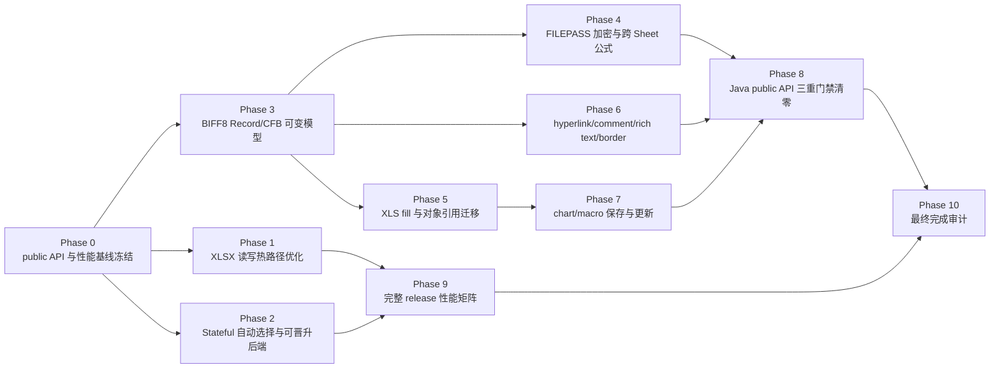
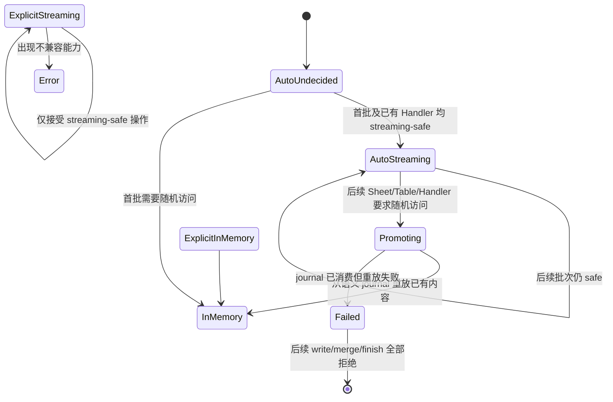

# easyexcel-rust Java 4.0.3 API、性能与 BIFF8 完整优化计划

> 状态：编码阶段已静态收口，验证阶段待执行（2026-08-09 当前工作树快照；尚未达到最终停止条件）
>
> 主进度口径：`verified 205/3236`；当前证据快照另有 `candidate 938`、`ambiguous 28`、
> `unmapped 2065`。`205/3236` 是唯一对外完成度，不以静态编码、同名类型或计划勾选替代。
> 新版候选器与门禁已编码为逐项记录 `existing_implementation`、`idiomatic_alternative`、
> `needs_implementation` 及真实 carrier crate，但禁测期尚未重生成 schema v2 全量快照，因此不得
> 宣称 `classified/coded 3236/3236`。解除禁止测试、构建和门禁前不得提升 verified，也不得用
> 本轮静态编码宣称 Java 4.0.3 行为等价或发布完成。
>
> 基线日期：2026-08-08
>
> Java 基线：`/Users/wandl/workspaces/workspace-github/easyexcel`，EasyExcel `v4.0.3`
>
> Rust 基线：`/Users/wandl/workspaces/workspace-github-easy-4-rust/easyexcel-rust`

## 1. 目标与不可妥协的完成定义

本计划解决以下八项发布阻断问题：

1. Rust 的 XLSX 流式写和 Event 读吞吐不得继续显著落后 Java。
2. XLS/BIFF8 密码写入和读取必须与 Java EasyExcel/Apache POI 互操作。
3. XLS placeholder fill 必须覆盖 Java 的标量、集合、重复填充和行移动语义。
4. XLS hyperlink、comment、rich text、chart、macro、border 必须达到 Java 可观察行为等价。
5. BIFF8 公式必须支持跨 Sheet 引用和正确的缓存值。
6. Stateful `.build()` 必须可靠自动选择/晋升写入后端，不能把风险留给调用方猜测。
7. 兼容门禁必须从“Java 测试文件清单”升级为完整 Java `javap` 与 Rust public API 逐方法门禁。
8. 必须实际执行冷/稳态、7 样本、并发和 30 分钟 soak 的完整性能发布门禁。

只有同时满足以下条件才能宣布目标完成：

| 维度 | 完成条件 |
|---|---|
| API | Java 4.0.3 每个 public 类型、构造器、方法和公开常量均有显式 Rust 语义映射 |
| 三重门禁 | 每个 Java public API ID 同时具备编译存在、Rust 行为断言、Java 运行产物/golden；任一缺失即失败 |
| XLSX 性能 | release 单 worker 的 `xlsx-stream-write` 和 `xlsx-event-read`，Rust/Java 中位吞吐比均不低于 `1.00`；统计区间下界不低于 `0.95` |
| 资源 | Rust 单 worker 峰值 RSS 不超过 64 MiB，且不比已固定 Rust 基线回退 15%；临时磁盘不超过 Java 同场景的 25% |
| BIFF8 | 本计划列出的能力不再返回 `Unsupported`，也不存在成功返回但输出丢失的 no-op |
| 互操作 | Java 产物由 Rust 读取、Rust 产物由 Java/POI 读取，行模型、元数据、公式、密码和模板对象均通过双向验证 |
| 发布性能 | release profile 全矩阵、并发 1/2/4/8/16、冷/稳态各 7 样本和 30 分钟 70/30 soak 全部执行并留存原始证据 |
| 回归 | workspace 全测试、all-features、Clippy、格式、文档、CodeGraph 同步全部通过 |

以下不能作为完成证据：仅有同名测试、仅能编译、仅 Rust 自己读回、仅单样本性能、仅能保存字段、仅能保留未知记录但未验证 Excel/POI 打开。

## 2. 当前基线与直接证据

> 本节表格记录计划制定时的原始基线；其后的“执行进度快照”记录当前实现，
> 防止把历史缺口描述误当成现状。

| 问题 | 当前证据 | 判断 |
|---|---|---|
| One-shot 自动流式 | `crates/easyexcel/src/write/builder/excel_writer_builder.rs:401-411,615-643` 只在 `do_write` 前调用安全判定 | 已有可靠子集 |
| Stateful 自动流式 | 原始基线中 `build()` 直接创建 `ExcelWriter`，未执行自动选择 | 原始缺口；当前已编码 Auto/journal/promotion，待解除禁测后验证 |
| Java 默认行为 | Java `ExcelWriterBuilder.java:51-58` 说明 `inMemory` 默认 false；`WorkBookUtil.java:31-52` 默认创建 `SXSSFWorkbook` | 原始缺口；当前自动模式已编码，待验证 |
| XLS 密码 | 原始基线直接拒绝密码并且只有非逐记录加密草案 | 原始缺口；当前 CryptoAPI 逐记录双向路径已编码，待最终互操作门禁 |
| Java XLS 密码基线 | Java `WorkBookUtil.java:53-66` 设置 `Biff8EncryptionKey` 并调用 `HSSFWorkbook.writeProtectWorkbook` | 必须按 POI 产物实现 |
| XLS fill 原语 | `easyexcel-xls` 已有标量/集合定位、行移动与类型化单元格写入；`easyexcel` 只负责 `CellValue` 适配 | 已按引擎所有权复用并接线 |
| XLS fill 行移动 | Java `ExcelWriteFillExecutor.java:94-174` 处理 wrapper、方向、forceNewRow 和 `shiftRows` | 原始缺口；当前公开 fill 与 BIFF8 引擎已接线，待验证 |
| 跨 Sheet 公式 | 原始 tokenizer/PTG 模型不支持 Ref3d/Area3d | 原始缺口；当前两遍解析与 3D token 已编码，待扩充 golden |
| Hyperlink | 原始实现仅覆盖 URL HLINK | 原始缺口；当前 URL/DOCUMENT/EMAIL/FILE 已编码，待最终门禁 |
| Comment | 原始读链具备、写链拒绝 | 原始缺口；当前 NOTE/TXO/OBJ 与模板更新已编码，待最终门禁 |
| Rich text | 原始写链压平文本 | 原始缺口；当前 SST/CONTINUE rich runs 双向路径已编码，待最终门禁 |
| Border | 原始 XF encoder 将 border 位保持为零 | 原始缺口；当前后端中立样式到 BIFF8 XF 已编码，待最终门禁 |
| Chart/Macro | 原始生成式 chart 与 CFB macro 保存均未实现 | 原始缺口；当前基础 chart mutation 和 macro Preserve/Strip/Replace 已编码，待最终门禁 |
| Public API 门禁 | `scripts/verify-java-parity-gates.sh:25-40` 以 Java 测试目录为输入 | 不是 public API 门禁 |
| 性能基线 | `benchmarks/results/million-20260808/REPORT.md:8-23`：Rust 写 105,346 行/秒，Java 写 199,743 行/秒；Rust 读约 128K–138K，Java 读约 307K–343K | 吞吐显著落后 |
| Release 规范 | `benchmarks/spec/benchmark-suite-v1.json:15-59` 已定义 1M、冷/稳态、7 次、并发和资源阈值 | 尚未完整执行 |
| 跨运行时性能门禁 | `benchmarks/scripts/compare_results.py:325-344` 只展示 Java/Rust 比值，不阻断发布 | 必须补门禁 |

### 2.1 执行进度快照（2026-08-08）

| 范围 | 当前结果 | 尚未关闭的边界 |
|---|---|---|
| 单机单线程吞吐 | 同机复测中，Rust 读中位约 384,358 rows/s、Java 约 368,812；Rust 写约 257,799、Java 约 199,743 | 仍需 clean SHA、冷/稳态各 7 样本、完整多样本、1/2/4/8/16 并发与 30 分钟 soak |
| 本地 release 矩阵诊断 | 1M 行 cold、单 worker、7 样本写入组中 Rust 中位 247,363 rows/s、Java 中位 182,745，Rust/Java=1.354，95% bootstrap 下界 1.192；Rust CV 7.815%，Java CV 17.913% | Java CV 超过 10%，该组按规则判为环境无效，不能作为发布通过证据；需在固定 Linux runner 从头执行全矩阵 |
| Benchmark runner | 交叉重读与 checksum 均成功后立即删除单样本 25MB 输出，只保留 JSON、hash、fixture、GC log；新增回归测试，避免完整矩阵占用 60GB 以上临时空间 | 未完成的本地结果只作诊断，release 仍要求 clean SHA、固定环境和完整样本 |
| Stateful | 已加入保守 Auto、journal、后到 Handler/多批次晋升路径；显式流式仍 fail-closed；泛型 builder 与 Java-compatible builder 均公开 `.in_memory(...)`/`.constant_memory(...)`，未显式调用时保持 `AutoUndecided`；手写 `ExcelRow` 默认不再依据可伪造的 schema 猜测值安全性，derive 实现显式证明静态标量能力；table 写入、workbook handler 延迟 mutation 与高级 `workbook_mut` 均进入同一选择/晋升判定；流式批次中途失败进入终止 `Failed` | 新增值能力契约、table/mutation/高级入口和失败态接线处于禁测期 coded 状态；仍需最终全矩阵和公开文档审计 |
| BIFF8 密码/公式 | CryptoAPI 双向互操作和跨 Sheet Ref3d/Area3d 已通过 Java POI 验证 | Sheet-range 3D 的全部歧义边界仍需 golden 扩充 |
| XLS fill | 标量、集合、横向/纵向、repeat、force-new-row、样式、公式 token、Escher 锚点、chart series、DV/CF/NAME 引用迁移已实现；Java-compatible Builder 的标量 fill 已改为严格使用所选 Sheet；追加行、标量和集合填充在 BIFF8 引擎内以快照事务提交；模板填充不再先调用 `as_text()`，而是由引擎返回最终物理位置，再复用已有富文本、HLINK 与 NOTE/TXO 写入能力 | 类型化模板接线处于禁测期 coded 状态；仍需纳入最终多样本发布矩阵，并扩充未知坐标记录的 fail-closed fixture |
| XLS/XLSX metadata | URL/DOCUMENT/EMAIL/FILE hyperlink、comment、rich-text 双向读写、border、macro Preserve/Strip/Replace 已实现；批注可见性、同坐标覆盖与模板/生成式删除链已编码；Workbook 全局 DGG 已改为统一分配 drawing/shape id，模板 XLS 批注追加/删除同步维护全局 DGG 与 Sheet DG/SPGR；模板 XLSX 的 placeholder fill、保留包追加行和 mutation set-cell 均通过同一个 typed value decoration 展开器写入 comment/hyperlink/images，富文本保持 inline rich runs，不再使用 comment-only 特例或静默降级；模板 chart 可保存并随插行迁移；生成式 BIFF8 Bar/Line/Pie 已支持锚点、标题、多系列/系列标题及跨 Sheet AI 引用；SST/CONTINUE 读取保留 UTF-16 run/FONT 索引并映射为高层 `CellValue::RichText`/`RichTextStringData` | 新增的 typed decoration、批注覆盖/删除与 DGG 统一分配代码处于禁测期 coded 状态，尚未取得 byte-level/POI/LibreOffice 证据 |
| Handler mutation | 后端中立 `ChartMutation`（Bar/Line/Pie）与 `RemoveComment` 已接入生成式/模板 XLSX、生成式/模板 XLS；BIFF8 产物此前已由 POI 5.2.5 回读标题/系列/区域并由 LibreOffice 转换确认图表类型与可见标题；生成式 XLS 的 `SetCell` 已在保存前应用 | 新增 `RemoveComment` 尚未执行门禁；其他模板 mutation 未由本条自动视为完成 |
| Public API 门禁 | Java 3236 项；最后一次已执行证据快照为 205 verified、938 candidate、28 ambiguous、2065 unmapped。该 `205/3236` 仅是冻结进度基线，不因当前编码自动增长 | 当前 `docs/rust-public-api.json` 实际只包含 facade `easyexcel` 一个 package，无法代表多 crate workspace；已修改提取器要求覆盖全部可发布 crate，待解除“禁止测试/门禁”后重生成并执行三重证据 |
| 性能发布门禁编码 | release 比较器已 fail-closed 要求完整矩阵、固定 baseline、Rust/Java 吞吐阈值、Rust 64 MiB RSS 上限、临时磁盘比例，以及四段 soak 的顺序、时长、trial/worker 完整性、逐 phase 70/30 配比与原始结果 SHA | 禁测期间只完成静态编码与 CodeGraph 同步；尚未执行任何 benchmark，不能记为性能通过 |
| 当前回归 | 禁测前快照曾有 `easyexcel` 1411、`easyexcel-xls` 111 测试及 strict Clippy/fmt 通过；本轮编码后只执行了 `git diff --check` 与 CodeGraph 同步 | 旧测试结果不覆盖当前工作树；workspace all-features、文档和最终发布门禁仍待解除禁测后执行 |

## 3. 总体架构与实施顺序



关键设计原则：

- 先建立可失败的证据门禁，再实现能力，避免继续增加“有类型、没行为”的 API。
- BIFF8 只允许规范记录级实现；禁止再次引入整文件 RC4、伪 OLE stream 或纯字符串降级。
- 性能优化不能绕过 converter、handler、15 位数字规则、日期窗口或错误传播。
- Stateful 自动模式允许从流式晋升到内存，但不得重复执行用户 Handler。
- Chart/Macro 以 Java 可观察行为为准：模板对象必须保存并随行移动修正；需要创建/替换时提供后端中立 mutation API。
- 所有未知/未支持分支 fail-closed；不得返回成功后静默丢弃数据。

### 3.1 逐类型推进不是逐类型照搬

`205/3236` 继续作为 Java public API 的主进度条，但每个 Java API ID 在编码阶段先完成
所有权与实现策略分类，再决定是否新增代码：

| 实现策略 | 判定 | 动作 | 计入 verified 的条件 |
|---|---|---|---|
| `existing_implementation` | 正确 crate 已有同语义类型、trait、方法或常量 | 直接建立 Java ID → Rust public API ID 映射；只修真实语义差异 | 后续补齐 compile、Rust behavior、Java golden 三证据 |
| `idiomatic_alternative` | Java 运行时对象在 Rust 中由 module/free function、derive/schema、trait、enum 或引擎 crate 等价承载 | 记录显式 owner/member alias 和语义说明；禁止制造同名空壳 | 三证据必须证明可观察语义，而不是只证明替代物存在 |
| `needs_implementation` | 全 workspace 搜索后不存在可承载实现 | 在职责 crate 新增真实逻辑，再由 facade 薄重导出或适配 | 新实现完成且三证据齐全 |
| Rust extension | Rust 提供 Java 没有的惯用能力 | 保留并登记 `rust_extensions`，不强行匹配 Java API | 必须有用途说明，且不得与 Java 映射重复 |

每个推进批次必须列出精确 Java API ID，并分别报告三类策略数量、carrier crate、改动文件与
仍缺的证据。只有三重证据执行通过的 ID 才进入 `verified` 分子；候选器推断、静态分类和已编码
但未执行的证据均留在独立统计中。禁止用一个 owner 已存在来批量确认其全部成员，也禁止用一个
facade 重导出掩盖真正的引擎 owner。

推进顺序按“未覆盖 Java API 数 × 现有承载率 × 调用链集中度”排序。CSV/metadata/holder
等高占比类型族应先盘点 `easyexcel-csv`、`easyexcel-model`、`easyexcel-format`、
`easyexcel-cache`、`easyexcel-xls`、`easyexcel-xlsx` 的既有实现；facade 只保留统一入口和
Java 体验适配。`Ehcache` 这类已被架构替代的依赖、`MemberUtils` 这类已由编译期
schema/derive 替代的反射工具，不得为了提高同名计数重新引入。

当前静态所有权盘点的第一批高占比结果：冻结清单中 `CsvSheet` 144 项、
`CsvWorkbook` 83 项、`CsvCellStyle` 59 项、`CsvCell` 50 项、`CsvRow` 36 项，
合计 372 项都有 `easyexcel-csv` 真实 owner，但不能因此把 372 项整体标成已有实现。
逐成员复核 Java 源码后，其中 128 项是真正读写 CSV 值、格式、顺序缓存或输出生命周期的
`existing_implementation`；234 项只是 POI 大接口要求的空操作、固定值、`null` 或不支持能力，
另有 10 项 `equals/hashCode`，共 244 项归为 `idiomatic_alternative`。候选器将后两类绑定到
现有 CSV owner/格式能力边界，不要求在 Rust 复制数百个同名空方法；facade 也不得重写
`easyexcel-csv` 已有状态和算法。legacy `Ehcache` 的 Java API 已退役，其契约由
`easyexcel-cache::SharedStringCachePolicy/SharedStringCacheHandle`、Memory/File/Moka 三类独立后端，
以及 facade 的 `ReadCache` 生命周期和 `ReadCacheSelector` 配置共同承载；它不是
`MokaCache` 的别名，也不得恢复 Ehcache 依赖或同名空壳。`MemberUtils` 映射到
`class_utils + derive/schema`，两者属于 `idiomatic_alternative`。这些数量只是编码分类，
不在禁测期间增加 verified 数。

同一规则覆盖 `CsvRichTextString`：构造、字符串值和长度由 `easyexcel-csv` 的真实对象承载；
`applyFont`、`clearFormatting` 与 formatting-run 查询只是 Java 为实现 POI `RichTextString`
保留的 no-op/固定值槽位，CSV 格式无法持久化这些状态。候选器将这些成员绑定到现有 CSV owner
并标为 `idiomatic_alternative`，不会把固定返回值冒充 XLS/XLSX 富文本实现，也不会再向 facade
复制一套字体区间状态。

第二批静态分类处理 Java 对象模型中的惯用差异：清单共有 73 个 `equals(Object)`、72 个
`hashCode()` 和 308 个构造器。候选器不再要求 Rust 复制 Java `Object` 方法：前两类分别
映射到现有类型的 `PartialEq/Eq` 与 `Hash` 语义；无参构造在找不到真实 `new()` 时允许以
`Default` 作为候选。三类都只是 `idiomatic_alternative` 候选，后续 compile probe 必须
真实调用相应 trait，behavior/golden 必须核对相等性、哈希一致性和每个默认字段；缺少 trait
的类型仍保持阻断。参数化构造器不允许回退到 `Default`。这一规则防止为提高计数批量生成
`equals`、`hash_code` 空壳，同时保留 Java 可观察语义门禁。

第三批 Holder/metadata 静态审计确认：`Holder`、`ConfigurationHolder`、`ReadHolder`、
`ReadRowHolder`、`FieldCache`、`FieldWrapper` 的生命周期/API 兼容对象仍由 facade 承载；
字段发现和反射缓存的实际工作由 `easyexcel-derive` schema 与 `class_utils` 承载，不能把
Java 反射对象复制进格式引擎。审计同时发现 `ReadHolder` 曾错误暴露 `analysisContext()`，
而不是 Java 接口的 `readListenerList()`/`excelReadHeadProperty()`，且读写 Holder trait 未表达
`ConfigurationHolder` 父契约；现已修正为委托既有 `AbstractHolder` 状态。候选器也改为记录
候选来源：只有真正回退到 `Default` 的无参构造、module/free-function、marker/supertrait 等
才标为 `idiomatic_alternative`，已有同 owner `new()` 的构造不再被误分类。以上均为 coded/
classified 进展，禁测期间不增加 `205/3236` verified 基线。

具体 Holder 不能只依赖 Rust `Deref` 模拟 Java 继承：`Deref` 能复用方法，却不能让
`ReadWorkbookHolder`、`ReadSheetHolder`、CSV/XLS/XLSX 专用 Holder 真实满足
`ReadHolder` trait bound，写入侧三个具体 Holder 亦同。现已逐类型声明显式 trait 委托，
共覆盖 8 个读取 Holder 和 3 个写入 Holder；状态和算法仍复用各自既有 `Abstract*Holder`，
所以分类为 `existing_implementation` 的契约接线，而不是复制 11 份字段/算法。静态边界审计
逐文件要求这些声明存在；它们仍属于 coded/classified，不提升 verified。

进一步按 Java 构造器逐成员审计发现，具体 Holder 虽然类型和 getter/setter 已存在，
`WriteWorkbookHolder::from_write_workbook` 曾只保存工作簿外壳与格式，遗漏父
`WriteBasicParameter`、输出流、模板输入副本、charset、BOM、auto-close、mandatory stream、
password、inMemory 和异常写出配置；`ReadWorkbookHolder::from_read_workbook` 也遗漏输入流及
三个 nullable 开关的有效默认。现已增加统一 `WriteBasicParameter::from_options` 并在两个构造
入口传播全部已有状态，静态审计逐字段锁定这些接线。该修复属于
`existing_implementation` 的生命周期语义补齐，不在 Holder 或格式引擎复制数据结构。

Holder 构造器候选不能统一机械映射到 `new()`：`WriteWorkbookHolder(WriteWorkbook)`、
`ReadWorkbookHolder(ReadWorkbook)`、各格式 `*ReadSheetHolder(ReadSheet,
ReadWorkbookHolder)` 等参数化构造必须分别落到 `from_write_workbook`、
`from_read_workbook`、`from_read_sheet`。本轮增加 descriptor-aware
`holder_constructor_names()`；同时补齐此前只有 `(sheet_no, sheet_name)` Rust 扩展构造、却
缺少真实 Java 生命周期入口的 XLS/XLSX `from_read_sheet`，并修正基类父 Holder 参数的借用/
克隆所有权。Java 无参 Sheet Holder 由 `default_construction` 承载，不再误配到需要参数的
`new(...)`。这属于 existing implementation 的真实接线和两个缺失构造实现，不复制父类状态。

`WriteWorkbookHolder` 的样式缓存也不能用“字符串 key 分配递增整数”模拟 Java/POI：该实现既
没有执行 `WriteCellStyle`/`WriteFont`/`DataFormatData` 合并，也无法表达来源样式存在时关闭
字体和数据格式缓存的语义。现已改为保存后端中立的语义对象并复用现有 `style_util` 合并算法：
空写入样式返回来源样式，本次写入字段覆盖来源字段，无来源时复用等值字体/数据格式，有来源时
按 Java 行为绕过两类缓存。XLS 的 XF/FONT/FORMAT 索引和 XLSX 的 styles table 仍由各格式
引擎在最终写入阶段分配；Holder 只承载 Java 生命周期和缓存决策。该类型归为
`existing_implementation` 的语义补齐，POI `CellStyle`/`Font` 返回类型差异属于
`idiomatic_alternative`，不在 facade 引入第二套物理样式引擎。

POI 样式枚举族同样按“已有实现优先”处理：`FillPatternTypeEnum`、`BorderStyleEnum`、
`HorizontalAlignmentEnum`、`VerticalAlignmentEnum` 的全部 50 个 Java 枚举常量及底层格式映射
早已存在，不能因为旧 API 提取器忽略 Rust enum variant 就重复定义。现已让 workspace public API
提取器识别 `pub variant/pub field`，候选器执行 `SCREAMING_SNAKE_CASE -> PascalCase` 精确归一化；
四个枚举补充按 Java 声明顺序排列的 `ALL` 和区分大小写的 `FromStr`，分别作为 Java 自动生成
`values()`/`valueOf(String)` 的 Rust 惯用替代。枚举值和 POI 映射属于
`existing_implementation`，集合/解析入口属于 `idiomatic_alternative`；共覆盖该族 62 个旧快照
unmapped 条目的静态归类路径，但禁测期间仍不提升 verified。

同一策略随后扩展到清单中的全部 22 个 Java enum owner：14 个通用枚举、4 个 POI 样式枚举、
3 个 metadata 内嵌枚举以及 `ExcelTypeEnum` 均保留原有 Rust 类型与业务映射，只补 `ALL`、
Java 常量名和区分大小写的 `FromStr`。`CellDataTypeEnum` 的 Rust `Formula/Image` 扩展明确不进入
Java `values()` 集合；`ImageType` 保留 Java `PICTURE_TYPE_*` 名称和 2..7 编号；三个 Java `$`
内嵌 owner 显式映射到已有独立 Rust enum。由此 `values/valueOf` 统一归为
`idiomatic_alternative`，常量 variant 与已有 getter/业务方法归为 `existing_implementation`，
而不是为每个 enum 生成 Java 风格静态函数和重复常量。

`ExcelTypeEnum` 另有一个不是编译器生成的 `valueOf(ReadWorkbook)`，不能与 `FromStr` 混为一谈。
现已补公开薄适配：显式 excelType 优先，无密码文件保持 Java 的小写扩展名优先级，其余文件和
已物化输入字节委托 `easyexcel-io` 魔数探测；缺少输入或探测失败保留 Java 可识别的错误语义。
这项是 `needs_implementation -> coded`，格式检测算法仍只有引擎一份。

候选器的内嵌 owner 解析同时由错误的 `Outer$Inner -> OuterInner` 改为取最后一级 `Inner`。
该规则直接复用每对象独立文件中的 `AnchorType`、`ImageType`、`UniqueDataFlagKey`、各 Builder/
Key 类型，避免为每个 Java `$` 类型维护一次性 alias，也避免把真实已有实现误报为
`needs_implementation`。若不同外部类存在同名 inner，候选仍保持 ambiguous 并由 descriptor/
所有权证据消歧，绝不静默选中。

`ReadCellData` 的 22 个旧快照 unmapped 成员也按重载语义复核：值、原始 `BigDecimal`、格式、
坐标、clone 以及全部构造/静态工厂的真实实现已经存在，缺陷是候选器曾把 7 个 Java 构造器
机械映射到 Rust 内部六参数 `new`。现以 JVM descriptor 分派到 `empty`、`from_type`、
`from_type_and_string`、`from_boolean`、`from_string`、`from_number`、`new_instance`，并区分
`newEmptyInstance`、`newInstanceOriginal` 与两个 `clone()` 返回 descriptor。`equals/hashCode`
继续使用现有 `PartialEq` 与 Rust `Hash` 门禁策略；若类型尚未实现 `Hash`，该项保持候选阻断，
不会因其他 20 项已编码而冒充 verified。

`DataFormatData`（11 项）和 `ExcelContentProperty`（15 项）复核后也不需要重写：前者的共享
实现位于 `easyexcel-model`，已有 nullable index/format、原位 merge、clone 和默认构造，本轮
只补可证明 `hashCode` 替代的 `Hash` derive，并让通用 `clone()` 候选识别现有 `clone_data`；
后者已完整承载样式、字体、日期/数字格式以及 `EMPTY`，Java `Field/Converter` 则以
derive/schema 的 `field_name/converter_key` 后端中立键替代。前者主体是
`existing_implementation`，`clone/equals/hashCode` 是 trait/命名惯用替代；后者的反射对象
getter/setter 是 `idiomatic_alternative`，不得把 Java reflection 或 converter 实例下沉到格式
引擎。无法由 trait 或静态 schema 证明的项继续阻断 verified。

`AnalysisContext` 接口族采用已有的 Rust 生命周期拆分而非照搬：listener 热路径继续接收轻量、
可克隆的 `AnalysisContext` 快照；Java 接口中会改变 Sheet/Row/Holder 状态的 16 个成员由
`AnalysisContextImpl` 承载。候选器现在把接口成员 owner 指向真实 Impl，并按 descriptor 区分
`readRowHolder()`/`readRowHolder(value)` 与 `readSheetList()`/`readSheetList(value)`；源码补齐
唯一缺失的 deprecated `getInputStream()` Holder 委托。该族整体属于
`idiomatic_alternative`：状态和事件处理器仍只有一个所有者，不把输入字节、Sheet 列表、Holder
复制进每个 listener 快照；compile/behavior 证据必须同时证明只读回调上下文和可变 Impl 生命周期。

Style 高占比族继续采用“API 配置对象 + 中立 style model + 格式引擎编码”三层承载：
`StyleProperty`/`WriteCellStyle` 留在 facade，字段值由既有 `ExcelCellStyle`/`ExcelFontStyle`
承载，BIFF8 XF/PALETTE 与 OOXML style table 分别留在 `easyexcel-xls`/`easyexcel-xlsx`。
本轮修正了一个会制造假候选的 API 形状：`StyleProperty` 现在有真实 Java 无参 `new()`/
`Default`，原内部 `build(self)` 改名为 `into_cell_style()`；Java 的两个静态
`build(HeadStyle|ContentStyle)` 重载显式映射到已有的 `HeadStyle::to_property()` 与
`ContentStyle::to_property()`，归类为 `idiomatic_alternative`，不复制第二套样式转换逻辑。
逐方法审计同时修正 `WriteCellStyle` 的两个伪兼容形状：原 `build(self)` 与 Java 静态
`build(StyleProperty, FontProperty)` 无关，现已改为组合已有中立 style/font carrier，并保留
“两个参数都缺失返回 null”的 `Option` 语义；`WriteCellStyle::merge` 与 `WriteFont::merge`
改为原位修改目标对象，值式 Rust 调用另用 `merged`。`FontProperty.build` 的两个注解重载则
显式映射到现有 `HeadFontStyle::to_property`/`ContentFontStyle::to_property`，不复制注解解析。
同一盘点还确认冻结清单中的 `FillPatternTypeEnum` 24 项、`BorderStyleEnum` 19 项、
`HorizontalAlignmentEnum` 13 项、`VerticalAlignmentEnum` 10 项、`CellDataTypeEnum` 12 项和
`BooleanEnum` 7 项（含类型条目）均已有真实 Java 值域与转换调用链，共 85 项归类为
`existing_implementation`；候选器记录 facade/model/XLS/XLSX 的分层 carrier，不在格式 crate
复制枚举。该数字仍只是 classified/coded 盘点，不提升 verified。

Handler Context 类型族也不能因为 Rust 内部运行时名称不同就误判为缺失或替代：
`CellWriteHandlerContext` 40 项、`RowWriteHandlerContext` 20 项、
`SheetWriteHandlerContext` 10 项、`WorkbookWriteHandlerContext` 8 项已经分别以同名公开
`type alias` 指向真实 `Write*Context`，回调链使用的就是该运行时对象。候选器现将类型条目按
同名 alias 映射，将成员索引透明落到其底层 owner，并把共 78 项保持为
`existing_implementation`；不再用粗粒度 owner 改名把它们误报成
`idiomatic_alternative`，也不复制第二套 context 状态。成员索引和签名过滤共用唯一
`rust_member_owner()` 解析，避免外层已解引用到 `Write*Context`、内层又按 Java alias 名过滤而
产生“计划已分类、候选实际为空”的假进度。

纯静态工具类按 Rust module/free-function 语义处理：冻结清单中的 `WriteHandlerUtils` 21 项、
`FileUtils` 18 项、`WorkBookUtil` 9 项、`StringUtils` 9 项已有对应模块及真实调用链，共 57 项
归类为 `idiomatic_alternative`。候选器记录 `easyexcel-io`、`easyexcel-utils`、model 与格式引擎
等真实 carrier；facade 中的同名 module 只负责重导出或 Java 风格参数适配，不创建无状态工具
struct，也不把文件 I/O、字符串规则或工作簿构造逻辑重新搬回门面。

静态成员多不代表一定采用 module 替代。`ExcelXmlConstants` 共 42 项（类型、无参构造和
40 个常量），40 个协议值由 `easyexcel-xlsx::ooxml_constants` 唯一维护，facade 同时保留
同名 `ExcelXmlConstants` 及其关联常量；因此类型和 40 个字段属于
`existing_implementation`，仅 Java 可实例化的无参构造由 Rust `Default` 表达为
`idiomatic_alternative`。`BuiltinFormats` 同样保留名义类型。候选器增加
`NOMINAL_STATIC_UTILITY_OWNERS`，防止通用“全静态类 → module”规则抢先吞掉这些真实同名
实现。`DateUtils` 的 37 项也已有 facade 同名类型/关联成员，日期换算算法继续唯一归属
`easyexcel-model`，因此同样纳入名义静态类型；无名义类型的 `NumberUtils` 等仍采用职责
crate 中的 module/free function。

Stateful 配置的显式性也必须保持：`compress_temp_files(true)` 的文档和行为都表示强制
常量内存，现已同步把 memory selection 标为 `ExplicitStreaming`；否则 Auto 状态可能在
观察到随机访问 Handler 后静默改选内存，违背调用方明确配置。未调用
`in_memory`/`constant_memory`/压缩溢出入口时仍保持 Auto journal + 安全晋升语义。

模板富值链路也按“已有能力优先接线”处理。普通 XLSX 写入原本已有 UTF-16 富文本分段、
字体规格、hyperlink generation 与图片锚点/缩放能力，真正缺失的是 template XML/package
handoff。现已由 `easyexcel-xlsx` 增加 `TemplateRichText` typed-cell、统一
`TemplateDecorationPlacement` 以及 hyperlink/image package 合并；集合、标量和追加行共用
同一最终物理坐标模型。富文本仍复用既有字体规格，图片仍由既有 generation 编译后合并
drawing/media，门面只把 `RichTextStringData`、`HyperlinkData`、`ImageData` 转为中立对象，
不再把 hyperlink/rich text 降为普通字符串，也不再把 image 静默变成空单元格。坐标保留
Java 的“非零绝对值优先，否则使用相对当前单元格”规则，package 修改使用快照事务提交。
以上仍为 coded/classified；禁测期间不增加 `205/3236` verified。

注解 family 的冻结 Java 清单共 14 个 owner、92 个 API ID：`ExcelIgnore`、
`ExcelIgnoreUnannotated`、`ExcelProperty`、日期/数字格式以及九个写样式注解。逐 owner 静态复核
确认 92 项均已有 facade 参数对象、`easyexcel-derive` 解析器、metadata carrier 和格式引擎消费链；
JVM annotation/Class 返回形状归 `idiomatic_alternative`，字段默认值与最终消费归
`existing_implementation`。因此该批计入 classified/coded，不新增 92 份 annotation 空壳，也不
提升 `205/3236` verified。

BIFF8 模板富值遵循同一原则：`easyexcel-xls` 原本已经拥有 typed cell、rich-run FONT、
HLINK、NOTE/TXO 和占位符/行移动算法，缺口是模板入口在 facade 中提前 `as_text()`。现已由
引擎新增类型化标量/集合填充入口并返回最终物理位置，`easyexcel` 适配层复用既有
`template_cell` 与 decoration 编码；未复制占位符扫描或行移动算法，也没有为 Java 类型计数
新增空壳。该链路仍为 coded/classified，解除禁测并取得三证据前不提升 `205/3236`。

Stateful Auto 同样不能只看“类型名字像标量”就推断首批实际值安全。`ExcelRow` 现增加
fail-closed 的静态标量能力契约：手写实现默认返回 false，`easyexcel-derive` 生成的实现才明确
返回 true，并继续叠加字段类型、converter、Handler、模板和布局条件。这样 `DynamicRow` 或手写
行即使运行时返回 comment/image/rich text，也会在写入前选择内存后端；table 写入补入同一
`ensure_backend_for_write`，workbook Handler 已提交的 mutation 也会阻止错误进入流式后端。
这些属于现有 journal/晋升机制的安全接线，而不是增加第二套 writer。

XLSX 保留包的普通追加和 mutation 也已消除 comment-only 分叉：
`easyexcel-xlsx::template_value_decorations` 作为唯一递归展开器，负责从嵌套
`TemplateCellValue` 中提取 comment、hyperlink 和多图片；placeholder fill、stateful
template append、`WriteMutation::SetCell` 都在最终物理坐标上调用同一 package API。
门面不再自行编译一份批注工作簿，也不复制 OOXML relationship/drawing 逻辑。
非模板 workbook mutation 的单图片分支也不再以“缺少显式锚点”为由拒绝：它现在与已有
`Images` 分支共用 `insert_image_data + ImageLayout::default()`，保持普通行写入的默认单元格
锚点语义。该项属于 `existing_implementation` 的遗漏接线，不新增图片实现或 Java 同名空壳。

`ClassUtils.ContentPropertyKey` 与 `ClassUtils.FieldCacheKey` 也不能为了门面 API 数量继续挤在
`class_utils.rs` 中。两者已经拆为独立对象文件，分别完整保留 `TypeId` 类型身份、字段名和
include/exclude 索引集合的 `Eq`/`Hash` 值语义；`ClassUtils` 只保留 derive/schema 驱动的工具
函数，并通过显式重导出兼容既有 `util::class_utils::*Key` 路径。静态边界审计同时要求两个
真实 owner 存在且禁止类型定义回流到 `ClassUtils`。这属于修正已有实现的位置与承载关系，
不是新增两份缓存或反射实现，也不提升冻结的 `205/3236`。

同一静态审计继续清理了另外两个错误聚合点：`BeanMapUtils.EasyExcelNamingPolicy` 已迁入
`easy_excel_naming_policy.rs`，保留 `INSTANCE` 与 `ByEasyExcelCGLIB` 语义；CGLIB `BeanMap`
没有照搬，而是由独立 `bean_map.rs` 承载既有 `ExcelRow`/converter 强类型替代，构造入口限制在
`BeanMapUtils`。`ExcelWriteFillExecutor.UniqueDataFlagKey` 也迁入独立对象文件，完整保留三元身份
及 `Eq`/`Hash`。原模块仅显式重导出以兼容现有路径，静态边界审计禁止这些类型重新内嵌。
因此该批次同时包含 `existing_implementation` 的位置修复和 CGLIB 的
`idiomatic_alternative`，没有复制 Java 运行时字节码生成设施，仍不增加 verified。

`AnalysisCell` 的 20 项成员已经由现有坐标、变量、准备数据、类型、前缀和 collection 首行
状态以及 getter/setter、坐标型 `Eq`/`Hash` 承载；真正缺口只是 Java 公共无参构造。现已增加
`Default`，保留 Java 的零坐标和可空标量，同时按 Rust 内部不变量把可空集合规范化为空集合、
可空 cellType 规范化为 `Common`；显式坐标构造继续复用该默认值。该 owner 因此按
`existing_implementation + idiomatic_alternative(Default)` 分类，不为 Lombok 再生成重复模型。

`BasicParameter` 的动态表头、模型类型名、converter 注册、trim、1904 日期窗、locale、科学计数
和字段缓存位置已经由现有参数对象与 read/write builder 共同承载；Java `Class<?>` 与 `Locale`
分别使用编译期类型名和语言标签，是明确的 `idiomatic_alternative`。本轮只补齐数字紧邻名称的
精确 snake_case 入口 `get_use1904windowing`/`set_use1904windowing`，旧的分词别名继续兼容；
其余构造、getter/setter、`Eq` 均复用现有实现，不再新增第二份参数袋。

数字紧邻单词并非 `BasicParameter` 特例。候选器现对所有成员同时生成 Java 直译形式
（如 `use1904windowing`）和 Rust 分词形式（`use_1904_windowing`），保留两者以避免破坏
`string0` 等真实编号字段。这样 `GlobalConfiguration`、日期窗口配置及类似 owner 可以直接
复用已有方法，不再为每个数字名称手写一次 alias，也不会因命名器缺陷误报 missing。

`CellData<T>` 的字段、默认构造、`checkEmpty` 和 12 个 getter/setter 原本已经存在，但直接
derive `PartialEq` 会错误地把父类 `AbstractCell` 的行列坐标纳入比较，而 Java Lombok 默认
`callSuper = false`。现已改为显式 `PartialEq`/`Eq`/`Hash`：只比较和哈希 type、number、
string、boolean、业务 data 与 formula，行列坐标继续用于定位但不参与值相等；`FormulaData`
补入 Hash carrier。该项修复的是现有类型的 Java 可观察语义，不复制 Read/WriteCellData。

`Head` 沿用现有表头路径、样式属性与格式引擎消费链，但不再把 Java 反射 `Field` 和独立的
`fieldName` 压成同一个字符串。新增 `field_key` 以后，`get/setField` 操作后端中立字段键，
`get/setFieldName` 仍操作显示/模型字段名；Java 六参数构造器映射为 `from_java_fields`，null
head list 规范化为空集合，nullable Boolean 规范化为内部 false。普通 derive 路径的 `new`
同时初始化两个字段名以保持已有行为。这是反射对象的 `idiomatic_alternative`，表头模型与
XLS/XLSX 写入实现仍只保留一份。

`ConverterKeyBuild.ConverterKey` 已从静态 build 模块拆到独立 `converter_key.rs`，继续以
`TypeId + Option<CellDataType>` 复用现有 registry 分派，不复制 Java primitive/boxed 归一化。
Key 补齐 `get/setClazz` 的 TypeId 替代并保留 derive `Eq`/`Hash`；Java 两个 `buildKey(Class)`
重载分别落到 `build_key_for_type` 和 `build_key_for_type_and_cell_data`，既有泛型 `build_key<T>`
继续服务惯用调用。静态审计禁止 Key 类型回流到 build module，候选器按 descriptor 选择真实
重载，因此该 8 项 nested owner 按已有实现与后端中立替代分类，而不是用一个模糊同名候选充数。

逐类型对照也必须允许删除 Rust 自己制造的伪兼容面。`XlsxSaxAnalyser` 的 Java public 清单只有
构造器、`SHARED_STRINGS_PART_NAME`、`execute()` 与 `sheetList()`；`readComments` 和
`parseXmlSource` 并非 public API。Rust 曾额外公开两个无参数方法并固定返回 `Unsupported`，既没有
复现 Java 签名，也没有承载行为。现已删除这两个 public 空壳；comment replay 与 XML 解析继续由
`easyexcel-xlsx` Event Reader/quick-xml 调用链真实承载。该项归为清除错误 Rust extension，不能
用删除空壳提高 verified 数，也不在 facade 复制 SAX/OPCPackage。

全 workspace 名义类型盘点进一步确认：除纯静态工具 owner 外，唯一没有 Rust 名义类型、且确实
保存实例状态的是 `EasyExcelTempFileCreationStrategy`。现已在 `easyexcel-io` 增加真实策略对象，
保留默认/可空目录构造、`poifiles` 目录被外部删除后的双重检查恢复、前缀/后缀临时文件和临时目录
创建；facade 只薄重导出。Java `deleteOnExit`/`File` 返回值由 `NamedTempFile`/`TempDir` RAII 守卫
替代，因此该 7 项 owner 归为 `needs_implementation -> coded` 后的
`idiomatic_alternative`，文件系统状态和恢复算法只存在于 `easyexcel-io`。

其余 24 个无名义 Rust 类型的 Java owner 均为纯静态工具类，并且当前 workspace 已有对应真实
module。候选器现显式登记 module-only 清单，避免依赖 javap 声明文本的启发式：集合、布尔、整数、
位置和 Sheet 匹配归 `easyexcel-utils`；数字解析/格式化归 `easyexcel-format`；文件、流和格式探测
归 `easyexcel-io`；反射相关 Class/Field/BeanMap 归 derive/schema 替代；样式和 Workbook 工具只在
facade 适配 POI 参数，物理编码仍归 XLS/XLSX 引擎。Java 可实例化的无状态构造器映射 module 本身，
全部归 `idiomatic_alternative`，不得为这些 owner 新增 24 个零字段 struct。

工具 module 的存在也不能直接等于成员语义已对齐。`NumberUtils` 的 Java 七个 `parse*` public
方法全部带 `ExcelContentProperty`，当前 Rust 已在 `easyexcel-format` 真实实现 DecimalFormat
pattern、Java 截断/溢出转换，并在 facade 提供 `*_with_property` 薄适配；旧候选器却会优先命中
同名的无属性 Rust 扩展。现已增加 owner-aware 名称分派，七个 descriptor 只允许映射到属性感知
入口。该项复用已有格式引擎，不新增解析算法，也防止“方法存在但忽略注解格式”的假候选。

`FileTypeUtils` 则暴露了另一个返回载体错配：Java 返回 `ImageType`/POI 数字编号并允许修改
`defaultImageType`，旧 Rust module 返回字符串扩展名。现已让 facade 使用现有 `ImageType` 与
线程安全 `RwLock` 承载公开默认值，JPEG/PNG 识别继续委托 `easyexcel-io`，实际格式引擎的 GIF/BMP
增强探测不被 Java 兼容面削弱。三个 Java 成员归为后端中立 `idiomatic_alternative`，不把 POI
对象或第二份文件头算法放进 facade。

`WriteHandlerUtils` 的 20 个成员同样按 descriptor 精确分派：带 `runOwnWriteHandler` 的四个
Workbook/Sheet 重载只映射到现有 `*_with_run_own`，完整 Cell context 构造只映射到保留
`Head`、`ExcelContentProperty` 和 cell-data 列表的 `*_with_metadata`；简化 Rust 扩展不再抢占
Java 候选。Handler 链与 context 状态仍由已有 write/context 模块承载。

`ConverterUtils` 原先还有一个公开的字符串→`TypeId` 简化函数，既不接收 `ReadCellData`、字段
配置、converter registry 或分析上下文，又会在未覆盖类型上返回 `Unsupported`。现已降为内部
文本 fallback；`ConverterRegistry` 增加共享原有 newest-wins、cell-type key 和 nullable 规则的
动态 `TypeId` 分派，公开 `convert_to_java_object` 先执行注册转换器再执行内建标量回退。
`convertToStringMap` 候选固定指向保留稀疏列/EMPTY-null 语义的入口，`defaultClassGeneric` 用
`TypeId::of::<String>()` 表达。Java reflection `Field/Class` 仍归 schema/TypeId 替代，不复制反射。

静态工具字段不能因 owner 已映射到 module 就被忽略。`IoUtils.EOF`、
`IntUtils.MAX_POWER_OF_TWO`、`StringUtils.EMPTY/SPACE` 已分别补到 `easyexcel-io` 与
`easyexcel-utils`，facade 仅重导出；候选器也已支持 module 下的 const/static，而不再只匹配函数。
`ClassUtils.CLASS_CONTENT_CACHE/CONTENT_CACHE/FIELD_CACHE` 不复制成 Rust 全局可变 Map：它们由
derive 生成的静态 schema、单态化与既有 `class_utils` 生命周期承载，明确归
`idiomatic_alternative`。`FieldUtils.nullObjectClass` 则映射为
`TypeId::of::<NullObject>()`，空字段值现在返回该真实 sentinel，而不是丢失为 `None`。
`PoiUtils.CUSTOM_HEIGHT` 继续映射到后端中立 `WriteRowContext` 的显式高度状态，BIFF 位字段和
OOXML 属性读取留在各自格式引擎。这一批同时说明：常量值属于可观察 API 时必须真实实现；仅为
Java 反射/POI 后端服务的可变对象则使用已有 Rust 载体，不能照搬第二套状态。

可变 public static 也按可观察语义处理，但不照搬 Java 数据竞争模型。`PageReadListener` 现以
`AtomicUsize BATCH_COUNT` 保存进程级默认批量值，并增加 Consumer 形状的默认/显式批量构造；
原有接收 `AnalysisContext + Result` 的 `new` 继续作为 Rust 增强入口。`UrlImageConverter` 的连接/
读取超时改由两个毫秒原子配置驱动 `Default`，复现 Java 在创建 converter 前修改全局字段的效果，
显式 `Duration` 构造仍保留。`DefaultWriteHandlerLoader.DEFAULT_WRITE_HANDLER_LIST` 不实现成共享
可变 trait-object 全局列表，而由 `default_write_handler_list()` 每次返回按 Java 顺序新建的
Dimension、DefaultRow、FillStyle 三个 Handler，避免跨 workbook 泄漏 Handler 状态。这三项均为
`idiomatic_alternative`，候选器按 descriptor/字段载体精确绑定。

`DateUtils.defaultDateFormat/defaultLocalDateFormat` 不是普通 final 常量：Java 调用方修改后会影响
Date/LocalDate/LocalDateTime converter 与无格式参数的 format 重载。Rust 现保留 model crate 的
标准格式常量作为不可变协议值，同时在 facade 增加两个 `LazyLock<RwLock<String>>` 运行时配置及
get/set 入口；日期 converter 在每次构造 `WriteCellData` 时读取当前值，`DateUtils.format*` 的默认
分支也读取同一配置。这样不会把 facade 的进程级策略下沉并污染 `easyexcel-model`，也不会出现
“字段可修改但实际转换仍使用编译期常量”的假兼容。

`EasyExcelConstants.EXCEL_MATH_CONTEXT` 也不能降级为一个 `15` 常量。Java 的可观察语义是
15 位有效数字加 `HALF_UP`；当前 `ReadCellData.newInstanceOriginal` 曾直接使用
`BigDecimal::with_prec(15)`，没有显式携带舍入模式。现已在 `easyexcel-format` 增加完整
`bigdecimal::Context(15, HalfUp)` 单例并由 facade 重导出，原始数字读取统一通过该 Context
舍入，原值仍单独保留。`BuiltinFormats.GENERALS` 与拼写保留的
`MIN_CUSTOM_DATA_FORMAT_INDEXS` 则映射为现有格式引擎常量的关联别名；两张 locale Map 继续由
`easyexcel-format` 的 `LazyLock<HashMap>` 单一持有。这里新增的是缺失的公开载体和消费接线，
没有复制格式表或舍入算法。

`equals/hashCode` 的 Rust 替代必须先证明底层值语义可哈希，不能只把 owner 绑定到类型名。
`WriteFont` 为支持 XLS 读取和 Rust XLSX backend 保留了 Java `Short` 之外的半点 `f64` 扩展，原
derive `PartialEq` 会导致 NaN 永不相等，也无法实现 Hash。现已按 Java
`Double.doubleToLongBits` 规则实现显式 `PartialEq/Eq/Hash`：所有 NaN 规范化、正负零保持不同，
其他字段逐项参与；颜色、脚本、下划线、border/fill/alignment 与 `ExcelDataFormat` 补齐 Hash。
因此 `WriteCellStyle` 和 `StyleProperty` 可以真实派生 `Eq/Hash`，其 Java `equals/hashCode` 才能
归为已有值对象的惯用替代。两个 Holder 含动态 Handler 与执行链，未机械派生 Hash，必须继续按
Java Lombok 字段范围和链状态单独审计。

`ReadWorkbookHolder` 与 `WriteWorkbookHolder` 已按冻结 javap 清单完成整族 94 个 API ID 的静态
分类（分别 43/51），而不是逐 getter 重新造对象。工作簿参数、格式、路径、密码、Sheet 去重、
缓存选择、Handler Context 与配置开关均复用现有 Holder 状态，归为
`existing_implementation`；Java `InputStream`/`OutputStream`、POI `Workbook`、反射 `Object`、
`Charset` 和物理样式对象由拥有所有权的字节、类型化 custom object、字符集值、后端中立样式规格
与 mutation context 承载，归为 `idiomatic_alternative`。两个动态资源 Holder 的
`equals/hashCode` 不机械实现。读取侧两个 Sheet 列表 setter 现同时接受 `Vec` 与 `Option<Vec>`，
保留 Lombok setter 可清空的语义；写入侧样式缓存不再全局按合并结果去重，而按来源
`WriteCellStyle` 分区，等价承载 Java 按来源 `CellStyle#index` 隔离缓存的行为。XLS/XLSX 物理样式
分配仍只在各格式引擎中发生。该 94 项全部计入 classified/coded，禁测期间 verified 仍为
`205/3236`。

Holder 第二批按冻结 javap 一次审计剩余 178 个 API ID：`AbstractReadHolder`、`ReadHolder`、
`ReadRowHolder`、`ReadSheetHolder`、CSV/XLS/XLSX 专用读取 Holder，以及 `AbstractWriteHolder`、
`WriteHolder`、`WriteSheetHolder`、`WriteTableHolder`。继承契约、nullable 配置、格式解析状态和
后端对象观察入口均优先归为 `existing_implementation` / `idiomatic_alternative`。静态审计发现并
修复三个真实差异：Java `ReadSheetHolder` 构造使用 `LinkedHashMap`，Rust 现由 `IndexMap` 保留
单元格插入顺序；`ReadRowHolder.currentRowAnalysisResult` 从错误的 `CellValue` 收窄恢复为现有
`CustomReadObject(Arc<dyn Any>)` 类型擦除载体；`WriteSheetHolder(WriteSheet,
WriteWorkbookHolder)` 与 `WriteTableHolder(WriteTable, WriteSheetHolder)` 现在真实继承父 Holder
配置、模板状态与构造时身份令牌，而不是只接受拆散参数。Table Holder 拥有父 Sheet 名称，保留
既有公开生命周期参数但不借用父对象，因此可安全插回父 Sheet 的 table map；这是 Java 父对象
引用的 Rust 惯用替代。POI Sheet、OPCPackage、HSSFWorkbook、CSV
Parser 等仍由字节、解析状态和格式引擎对象替代，不在 facade 复制 Java 后端。该 178 项计入
classified/coded；与前批 94 项合计完成 Holder family 272 个 API ID 的静态闭环，verified 继续
冻结为 `205/3236`。

Builder/Factory 第三批按冻结 javap 一次审计 164 个 API ID，覆盖 `EasyExcelFactory`、
`ExcelReader/ExcelWriter`、读写 Sheet/Table/Workbook builder、`ExcelBuilder/Impl`、抽象参数
builder 与 `FillConfigBuilder`。现有 Java-compatible 无模型入口、Rust typed-row 泛型入口、
`ExcelBuilderImpl` 是逐 public ID 的 `implementation_carrier`，derive/schema 则作为
`capability_carrier` 共同完成字段映射；不能只检查某一个同名 struct，也不能为 Java 重载复制
多套算法。`Class` head 与 field-cache 反射归入
`idiomatic_alternative`；路径/File/InputStream、List/varargs、Collection/Supplier 等重载映射到
Rust 的 `Into<PathBuf>`、`Read`、slice/iterator 和 `FnOnce`。

本批静态审计修复了三个真实缺口：compatible 与 typed reader 的显式 `excel_type` 现在贯穿
`ExcelReader -> ExcelAnalyserImpl -> ExcelReadExecutorKind`，不再设置后仍按扩展名选择；注册 listener
后的 builder wrapper 补齐输入、格式、locale、trim、1904、cache 与 converter 的继续链式配置；
`ExcelWriterSheetBuilder` 补齐 Object/Supplier × 默认/显式 `FillConfig` 四条 `doFill` 路径，并复用
已有 `ExcelBuilderImpl`/模板 fill executor，而不是在 Sheet builder 重写 XLS/XLSX 算法。
`autoCloseStream` 由 Rust 拥有值或 `&mut R` 的所有权表达，`mandatoryUseInputStream` 由非 seekable
输入强制物化协议表达；builder 仍记录配置意图。`FillConfigBuilder.hasInit` 也已接回唯一正式 owner。
这 164 项计入 classified/coded；禁测期间 verified 仍冻结为 `205/3236`。

CellData/附加数据第四批按冻结 javap 一次审计 161 个 API ID，覆盖 `CellData`、
`ReadCellData`、`WriteCellData`、`CoordinateData`、`ClientAnchorData`、`ImageData`、
`HyperlinkData`、`CommentData`、`FormulaData`、`DataFormatData`、`RichTextStringData` 与
`CellExtra`。已有后端中立值、构造器、getter/setter、模板/普通写入元数据通道继续归为
`existing_implementation`；Rust 的拥有值构造（如 `ImageData::new(bytes)`、
`FormulaData::new(expression)`）、链式富文本字体应用和组合替代 Java 继承归为
`idiomatic_alternative`，不为无参构造、setter 重复一套对象或写入算法。

该批静态审计修复了组合映射曾改变 Java 值语义的真实缺口：Java Lombok 默认
`@EqualsAndHashCode(callSuper = false)`，所以 `ClientAnchorData` 不比较继承坐标，
`HyperlinkData` 不比较坐标，`ImageData` 不比较锚点，`CommentData` 不比较锚点；Rust 后端扩展的
批注 `visible` 也不进入 Java 相等性。现已为四类显式实现 `PartialEq/Eq/Hash`，只哈希各 Java
类自身声明字段，并为富文本、区间字体及相关枚举补齐同一哈希载体。坐标和锚点仍完整保留给
XLS/XLSX 引擎，不因值对象比较语义而丢失。该 161 项计入 classified/coded；禁测期间 verified
仍冻结为 `205/3236`。

CSV 对象模型第五批按冻结 javap 一次审计 383 个 API ID：`CsvWorkbook` 83、`CsvSheet` 144、
`CsvRow` 36、`CsvCell` 50、`CsvCellStyle` 59、`CsvRichTextString` 11。真实 owner 是
`easyexcel-csv`；facade 只保留 `CellValue` 参数化类型别名和创建 trait 接线。Java 为实现 POI
`Workbook/Sheet/Row/Cell/CellStyle/RichTextString` 而暴露的大量固定返回、`null` 与 no-op 方法，
由 CSV crate 已有的后端中立固定语义和 `Result::Unsupported` 承载，归为
`idiomatic_alternative`，不复制 POI 对象、字体、Drawing、打印或合并算法。

本批发现并修复真实创建链缺口：原有 `getCsvWorkbook/getCsvSheet/getCsvRow` 稳定身份替代已经定义，
但 `CsvWorkbook -> CsvSheet -> CsvRow -> CsvCell` 创建与整体替换时没有传播，因此 getter 长期返回
`None`。现由工作簿、工作表各自拥有稳定令牌，在 `try_create_sheet`、`set_csv_sheet`、
`try_create_row`、`set_row_cache`、`try_create_cell` 以及父身份变更时递归传播；Rust 不建立不可移动的
自引用结构，CSV 写入与有界行缓存仍由原 crate 唯一承载。该 383 项计入 classified/coded；禁测期间
verified 仍冻结为 `205/3236`。

Converter 第六批按冻结 javap 一次审计 387 个 API ID、54 个 Java owner。46 个具体数值、布尔、
字符串、日期与图片 converter 已分别位于独立 `.rs` 文件并包含真实转换逻辑；公共
`Converter<T>` trait 承载 `supportJavaTypeKey` 的 `TypeId` 映射、Excel 类型键和 Java 默认重载，
`DefaultConverterLoader`/`ConverterRegistry` 是唯一注册与动态分派 owner。重复的 bridge method、
Java primitive/boxed `Class` 和三参数旧重载归为 `idiomatic_alternative`，共享
`boolean_support`、`number_support`、`date_support` 算法，不复制 46 套分派框架。

本轮按源码文件重新核对该结论：Java v4.0.3 converter 目录共有 53 个 `.java` 文件，计入
`ConverterKeyBuild.ConverterKey` 嵌套 public 类型后正好是上述 54 个 owner；Rust 当前 converter
目录共有 87 个模块，额外模块来自 `ConverterRegistry`、typed/erased adapter、`FromExcelCell`/
`IntoExcelCell` 和共享日期/数字/布尔算法。54 个 Java owner 均已有可执行载体，因此本 family 的
owner 级 `needs_implementation` 为 0；成员仍按 387 个稳定 Java API ID 分别分类和留证，不能据此
批量标记 verified。多出的 Rust 模块登记为实现基础设施或 Rust extension，不反向制造 Java API。

本批真实修复集中在转换上下文生命周期：`ReadConverterContext` 已有三组原位 setter；
`WriteConverterContext` 原先只有 `setContentProperty`，现补齐 `setValue` 与 `setWriteContext`，并用
相同生命周期的有效引用替换，避免 Java 无参 Bean 允许的临时 null 状态。Java 无参构造因此明确
归为 Rust 借用模型替代，而不是通过空指针或伪造 `'static` 引用充数。静态边界审计逐文件要求
具体类型、真实 `convert_to_excel_data`、无 `todo!/unimplemented!`，并锁定 trait、context 和 registry
载体。该 387 项计入 classified/coded；禁测期间 verified 仍冻结为 `205/3236`。

WriteHandler 第七批按冻结 javap 一次审计 189 个 API ID、21 个 Java owner，覆盖四级 Handler
接口/抽象基类、四级回调 Context、四条 linked execution chain、默认 loader 与三个内置 Handler。
Rust 保留一个对象安全的 `WriteHandler` 作为真实可执行生命周期 owner，Workbook/Sheet/Row/Cell
marker trait 表达 Java 接口分类；全部 12 个前后置回调、order、not-repeat 与后端能力仍走同一动态
对象，归为 `idiomatic_alternative`，不复制四套无法由 writer 统一发现的 callback vtable。

四条 execution chain 已真实保存 handler/next、支持 get/set/addLast，并按注册顺序传播每一级回调；
四个 deprecated abstract handler 由同一默认 no-op trait 语义承载。Context 使用
`WriteHolderContext` 和后端中立 Workbook/Sheet/Row/Cell handle 替代 POI 对象。本批发现
`CellWriteHandlerContext` 虽有 rowIndex，却遗漏 Java 构造器及 getter/setter 中的 Row：现已加入
`WriteRowHandle`，并在 `setRowIndex`、`setRow`、`setCell` 时同步 Row/Cell 坐标，避免 context 内部出现
互相矛盾的物理位置。静态审计同时锁定默认 Handler 加载次序和全链无 stub。该 189 项计入
classified/coded；禁测期间 verified 仍冻结为 `205/3236`。

Metadata property 第八批按冻结 javap 一次审计 149 个 API ID、10 个 Java owner。`StyleProperty` 与
`FontProperty` 继续作为注解轻量值到拥有所有权运行期样式的边界；`ExcelContentProperty` 用稳定的
field/converter 注册键替代 JVM `Field` 与 converter 对象引用；`ExcelHeadProperty` 的 class 名称和
`BTreeMap` 分别替代 `Class<?>` 与 `TreeMap`。注解侧 `to_property` 是 Java 重载静态 `build(annotation)`
的 Rust 替代，不复制 JVM 注解代理；负值 sentinel 在进入 RowHeight、ColumnWidth、LoopMerge 运行期
属性前完成校验，因此运行期保存无符号值，归为 `idiomatic_alternative`，而非伪造 nullable 数值。

本批真实修复包括：`FontProperty` 补齐 italic、strikeout、color、typeOffset、underline、charset、bold
七个 Lombok getter 别名；`RowHeightProperty` 与 `LoopMergeProperty` 补齐公开 setter；
`ExcelHeadProperty` 补齐 headRowNumber getter/setter，并修正 `setHeadMap` 曾经隐式重算行数、不同于
Java Lombok setter 的副作用。静态边界审计现逐一锁定 10 个 owner 的构造、build/替代入口、可变
访问器以及无 stub。该 149 项计入 classified/coded；禁测期间 verified 仍冻结为 `205/3236`。

Write style 第九批按冻结 javap 一次审计 163 个 API ID、21 个 Java owner：71 项运行期
`WriteCellStyle`/`WriteFont`、69 项注解值接口，以及 23 项 style strategy。注解接口继续由可构造、
可派生的 typed value carrier 承载，`to_property`/`to_write_cell_style` 取代 JVM annotation proxy；
POI 的 boxed short、颜色和枚举由 `Option`、`ExcelColor` 与后端中立 enum 承载。抽象 Java class 由
`WriteHandler` supertrait 和职责 trait 表达，具体 Horizontal/Vertical/column/row strategy 仍进入
统一 Handler 生命周期，不复制抽象类字段或回调链。

本批修复三组可观察差异：`WriteFont` 补齐全部 9 个 nullable Lombok setter；
`HorizontalCellStyleStrategy` 补齐 Default 无参构造与 Java 字段范围的 Eq/Hash，并把 Horizontal 和
Vertical strategy 曾误写成 `+50000` 的顺序恢复为 `DEFINE_STYLE=-50000`；`DefaultStyle` 从只有水平
居中的空接线恢复为 Java 完整表头样式（换行、双向居中、锁定、灰色实心填充、四边细框、宋体
14pt 粗体），以 style/font 两条现有 Handler 通道真实应用，并使用
`DEFAULT_DEFINE_STYLE=-70000`。静态审计锁定 21 个 owner、完整默认值、顺序和值对象语义。该 163 项
计入 classified/coded；禁测期间 verified 仍冻结为 `205/3236`。

Enum/constant/exception 第十批按冻结 javap 一次审计 241 个 API ID、30 个 Java owner：18 个 enum
的 95 个常量、`values/valueOf` 与专有 getter 由同名 Rust enum 的 `ALL/java_name/FromStr` 和类型化
转换承载；4 个 constants owner 由 facade 关联常量/函数薄适配，XML 标签和内建格式表仍分别只有
facade/easyexcel-format 一份真实数据；8 个 Java exception 的继承层级由独立错误对象组合
`ExcelRuntimeException` 并统一转换到 `ExcelError`，不复制 Java checked/unchecked 类树。

Java 可变 public static 的数据竞争模型不照搬：Order/Builtin 的协议索引使用不可变关联常量，
locale 格式 Map 使用格式 crate 的惰性只读表，`EXCEL_MATH_CONTEXT` 保留完整 15 位 HALF_UP 载体；
这些归为 `idiomatic_alternative`。本批真实修复是两个 Lombok 数据转换异常的
`callSuper=false`：`ExcelDataConvertException` 只比较/哈希 row、column、cellData、contentProperty，
`ExcelWriteDataConvertException` 只比较 handler context，不再让 message/cause 改变相等性；为此
Font/Content/DateTime/Number property 和 NumberRoundingMode 补齐一致的 Eq/Hash 底层载体。静态审计
锁定全部 enum、constant 和 exception owner 及无 stub。该 241 项计入 classified/coded；禁测期间
verified 仍冻结为 `205/3236`。

Analysis 第十一批按冻结 javap 一次审计 110 个 API ID、41 个 Java owner。统一 analyser、CSV
executor、BIFF8 listener/dispatcher/19 个 record handler、XLSX SAX analyser、tag handler 接口、
抽象字符累加基类、具体 tag handler、shared-strings 与 row SAX router 均已有真实独立 `.rs` owner。
facade 的 handler/context 适配负责 Java 生命周期名称，实际 CSV 流、BIFF8 record 解码和 OOXML
event parsing 分别复用 `easyexcel-csv`、`easyexcel-xls`、`easyexcel-xlsx`；POI Record、SAX
Attributes、InputStream/PackagePartName 用后端中立 record/event/bytes/常量替代，不复制 POI 对象。

该族此前已有 205 verified 基线中的行为/Java golden 证据，但本批只补齐全 41 owner 的静态所有权
清单，未重新执行门禁，也没有把已有 handler 再写一遍。静态审计要求每个 owner 具备公开类型或
trait、Java 来源和无 stub，并继续锁定各格式引擎调用。110 项计入 classified/coded；verified
仍严格冻结为 `205/3236`。

Context 第十二批按冻结 javap 一次审计 72 个 API ID、10 个 Java owner。逐行 listener 继续接收
轻量 `AnalysisContext` 快照，完整 workbook/sheet/row 生命周期由 `AnalysisContextImpl` 持有；
`WriteContextImpl` 负责后端中立 workbook/sheet/table 视图，真正的 finish/输出资源继续由
`WriteContextLifecycle` 和 writer owner 承载。Java InputStream/OutputStream、POI Workbook/Sheet
分别映射为拥有字节、路径与 typed handle，归为 `idiomatic_alternative`，不把物理格式对象塞回
facade Context。

本批修复 Java 继承契约曾被“有一个同名 accessor”冒充的问题：新增完整
`AnalysisContextLifecycle` supertrait，覆盖 event processor、current holder/sheet、row result、custom、
excel type、input、count、interrupt 与三层 read holder/list；CSV/XLS/XLSX ReadContext 现在真实继承
该父 trait，三个 Default Context 通过各自现有 `AnalysisContextImpl` 委托全部状态。格式专用 Holder
仍留在原 context/format owner，没有复制。静态审计锁定 10 个 owner、supertrait 和无 stub。72 项
计入 classified/coded；禁测期间 verified 仍冻结为 `205/3236`。

Utility 第十三批按冻结 javap 一次审计 204 个 API ID、27 个 Java owner。无状态集合、Map、字符串、
位置和校验算法由 `easyexcel-utils` 承载；日期/数字显示由 `easyexcel-model` 与
`easyexcel-format` 承载；文件、临时目录和流复制由 `easyexcel-io` 承载；workbook/style/handler
适配只在 facade 组合 typed backend handle。`MemberUtils` 不恢复：Java 运行时反射可访问性由
`easyexcel-derive` 生成 schema 和 `ClassUtils` 静态字段查找替代，静态边界继续要求旧文件不存在。

逐方法复核修正了四组已有替代实现的语义差异：`ListUtils.newArrayListWithExpectedSize` 恢复
EasyExcel v4.0.3 的 `5+n+n/10` 饱和容量公式，并在 ListUtils 路径重用统一的非空校验；
`StringUtils` 不再用 ASCII-only 数字/大小写或 Rust 更宽的 trim 集合冒充 Java 8
`Character.isDigit/isWhitespace/toUpperCase/toLowerCase`；
`DateUtils.getJavaCalendar/setCalendar` 的整数日/毫秒计算下沉到 model，完整保留 1900 虚构闰日、
1904 窗口和“加 499ms 后清毫秒”的 `roundSeconds`；`FieldUtils.getFieldClass(Map,...)` 通过强类型
`BeanMap` 的声明类型身份选择 converter，缺失时才回退运行时值。I/O crate 中已有的
`EasyExcelTempFileCreationStrategy` 也重导出到 Java util 路径，不复制第二个策略。静态审计锁定
26 个实际 adapter owner、底层算法 owner、无 stub，以及 `MemberUtils` 的编译期替代边界。该 204 项
计入 classified/coded；累计 classified/coded 为 `2495/3236`，禁测期间 verified 仍冻结为
`205/3236`。

读取运行时第十四批合并审计 153 个 API ID：cache 7 个 Java owner/48 项，event、listener、processor
13 个 owner/51 项，以及 Holder 批次之外的 ReadWorkbook、ReadSheet、ReadBasicParameter、
ExcelReadHeadProperty 4 个 owner/54 项。共享字符串实体存储继续唯一归属 `easyexcel-cache`；
facade 的 ReadCache/selector 只适配 Java 生命周期和 nullable 配置；行转换由 derive/schema、
ConverterRegistry 与 ModelBuildEventListener 组合，事件顺序和异常动作由真实读取管线中的
DefaultAnalysisEventProcessor 分派。

本批没有恢复 `Ehcache`。其 11 项公开契约分别映射到 Memory/File/Moka 多载体策略、ReadCache
生命周期和 selector 配置，旧 `cache/ehcache.rs` 被静态要求不存在。真实修复包括：ReadCache.init
恢复 AnalysisContext 参数；SimpleReadCacheSelector 不再把 Java 构造后的三个 null 字段提前折叠，
并保留 Long/Integer 的有符号 nullable getter/setter；Handler 通过 blanket impl 真实满足 Order；
SyncReadListener 真实满足 AnalysisEventListener。Rust 父 trait 默认方法不能被子 trait 覆盖，因此
AnalysisEventListener、IgnoreExceptionReadListener 与 AbstractIgnoreExceptionReadListener 增加显式
vtable adapter，分别恢复 invokeHead→invokeHeadMap、异常 Continue、extra no-op 和 hasNext=true，
避免类型存在但注册为 `dyn ReadListener` 后行为退回父默认。该 153 项计入 classified/coded；累计
classified/coded 为 `2648/3236`，verified 仍冻结为 `205/3236`。

核心 metadata 第十五批一次审计净新增 125 个 API ID、14 个 Java owner：Head 24、
AbstractHolder 18、GlobalConfiguration 14、CellRange 12、FieldWrapper 11、
弃用 Font 8、FieldCache 8、AbstractCell 8、DataFormatter 7、
ExcelGeneralNumberFormat 4、ConfigurationHolder 4、Cell 3、NullObject 2、Holder 2。本批不重复
CSV、CellData、metadata property、BasicParameter/AbstractParameterBuilder 或各读写 Holder 类型族；
其中 BasicParameter/AbstractParameterBuilder 已归入 Builder/Factory 批次，CellExtra 已归入
CellData 批次，不能因本轮复核再次累计。字段发现继续由 `easyexcel-derive` 的 schema 替代 Java
反射，日期/数字格式状态和算法继续唯一归属 `easyexcel-format`，facade 的两个 format owner 只是
Java 包路径重导出。

逐方法复核补回了 Java 值对象语义：Head 的 `forceIndex`、`forceName` 是 nullable `Boolean`，原
Rust `bool` 会把 null 静默折叠成 false，现以 `Option<bool>` 保存原始状态，同时保留已有 effective
boolean 访问器；Lombok value owner 的 equals/hashCode 由 Rust `Eq/Hash` 承载，所需嵌套 property
同步具备该语义。GlobalConfiguration 保留 Java 构造器的非空默认值，并补齐不拆分数字的
`get_use1904windowing/set_use1904windowing`；弃用 Font 和 Cell trait 补齐 Java getter 兼容入口。
静态门禁锁定 14 个净新增 owner、无 stub、format engine 单一实现和上述 nullable/命名契约。该
125 项计入 classified/coded。随后用冻结 javap 的 326 个 owner、3236 个 type/member ID 重新按 owner
集合做差，发现更早的批次段落混用了“仅 member 数”和“type + member 数”，不能继续用段落算术作为
累计值。按 owner 集合做差得到的 `3062/3236` 只能作为内部批次覆盖估算，不能作为逐 API ID 的
classified/coded 统计；只有 schema v2 账本实际生成并逐条校验后才能发布该辅助数字。禁测期间
verified 仍冻结为 `205/3236`。

写入运行时第十六批是冻结 manifest 的最终差集，共 20 个 owner、174 个 API ID：CsvDataFormat 4，
AbstractExcelWriteExecutor/ExcelWriteAddExecutor/ExcelWriteFillExecutor/UniqueDataFlagKey 18，三种 merge
strategy 12，RowData/CollectionRowData/MapRowData 14，WriteBasicParameter/WriteWorkbook/WriteSheet/
WriteTable 66，AnalysisCell/FillConfig/FillConfigBuilder/FillWrapper 49，ExcelWriteHeadProperty 11。
这些计数由 `docs/java-public-api-v4.0.3.json` 对 owner 精确聚合 type + member 得出，不再使用人工
段落加总。

本批首先复用现有职责边界：普通追加继续进入 `append_rows_to_worksheet` 与格式 writer，模板 fill
继续委托真实 stateful `WriteFillExecutor`，merge 继续通过统一 Handler mutation 通道进入 XLS/XLSX，
CSV 格式注册表唯一归属 `easyexcel-csv`。真实修补包括：RowData 补齐 Java `get/size/isEmpty` 三方法
并让 Collection/Map owner 真正实现该 trait；CsvDataFormat 保存构造 locale 选择的 CN/US 内建表；
LoopMergeStrategy 补齐两参数与 property 构造形状并保留 Java 参数校验；WriteWorkbook、WriteSheet、
WriteTable 保存 Java nullable 原始状态，同时把有效默认值留给现有 writer；WriteBasicParameter、三个
Write* 值对象和 ExcelWriteHeadProperty 的相等/哈希按 Lombok 默认 `callSuper=false` 只覆盖 Java
本类字段，不让 Rust 引擎扩展或父类状态改变 Java 值语义。AnalysisCell 的坐标专用 equals/hash、
FillConfig 的延迟一次初始化和 FillWrapper 的拥有值集合均复用既有实现。

静态审计现锁定最终 20 个 owner、引擎调用、locale/nullable/构造/值语义和无 stub。按 owner/type
family 的人工批次盘点已经覆盖冻结清单中的全部 owner，但这不等于 `3236/3236` API ID 已形成
可审计分类账本。新版候选器会为每个 ID 生成 `implementation_strategy`、carrier 与语义说明；在
禁测期未重生成和校验 schema v2 产物前，classified/coded 总数保持“未发布”，不得从 owner 数量
反推。compile probe、Rust behavior、Java golden、完整 workspace API 自动对照和性能门禁均未执行，
因此 verified 继续严格冻结为 `205/3236`。

最终静态功能反查（2026-08-09，仍处禁测阶段）覆盖计划最初列出的七组硬缺口：BIFF8
CryptoAPI `FILEPASS` 读写与密码校验位于 `easyexcel-xls`；XLS scalar/collection、水平/垂直、
`forceNewRow`、样式复制的 placeholder fill 位于 BIFF8 template package；hyperlink、comment、
rich-text run、四边 border、原生 Bar/Line/Pie chart 和 VBA Preserve/Strip/Replace 均由 XLS crate
编码，facade 只下发 mutation；工作簿 LinkTable、SUPBOOK/EXTERNSHEET 与 Ref3d/Area3d 已贯穿写入、
读取和模板行迁移；Stateful Auto 已具备 capability 判定、journal 和无重复 Handler 回调的晋升路径；
API 提取器已编码为全可发布 workspace crate 覆盖；benchmark matrix 已编码 1/2/4/8/16 worker、
双 runtime、完整 worker set、稳定性、资源和 Rust/Java 比值门禁。静态搜索中残留的 Unsupported
均是 CSV 固有限制、BIFF8 行列/记录长度上限、显式 constant-memory fail-closed 或非 CryptoAPI
加密类型边界，不是上述能力仍以 marker/no-op/统一“不支持”占位。此结论只有源码与 CodeGraph
证据；按禁测要求没有执行互操作、编译、API gate 或性能发布门禁。

后续静态反查修正了一处 carrier 接线遗漏：生成式 XLS 普通行写入已使用 SST rich runs，但 Handler
`SetCell` mutation 曾走旧标量转换而压平富文本。mutation 现复用同一个 BIFF8 rich-text/font
allocator，包含 comment 包装值的底层富文本也按原 UTF-16 run 坐标落盘；未实现的 XLS images
继续显式 fail-closed，不能借富文本分支静默丢弃。该修补不新增 facade 类型，仍待互操作门禁。

继续沿 XLS 模板 fill/Handler mutation 调用链反查时发现，生成式路径虽已拒绝
`CellValue::Image/Images`，模板适配器却曾把 `Images` 解包为底层标量并成功保存，造成图片数据静默
丢失。现已在模板标量替换、集合填充、append 和 `SetCell` 共用的 `template_cell` 边界，以及装饰
展开的防御分支统一返回 typed `Unsupported`；只有 comment/hyperlink 包装仍递归保留底层值。
这不是删除 Java 已有能力：EasyExcel 的 BIFF8 图片需要真实 Workbook/SHEET Drawing records，当前
尚无该 record carrier，因此在实现前 fail-closed 比伪 `Images` OLE stream 或静默降级更符合计划。

随后对 public API 自动门禁本身做了静态加固：Rust 提取器固定
`cargo-public-api 0.52.0`，版本不一致立即失败；权威快照必须覆盖所有可发布 workspace crate，且每个
crate 同时具备 default/all-features 两个不重复 profile。校验器现在同时验证 Java 4.0.3 的固定
3236 项基线、Rust artifact/schema/提取器版本、包与 profile 汇总计数、mapping schema/authority、
重复 execution attestation，以及所有 Rust public ID 必须被 Java 映射或登记为有说明的 Rust
extension。证据 overlay 每次从当前 catalog 清空重算；证据被删除或 owner 改变时，旧 verified 会
主动降级，`needs_implementation` 即使误绑证据也不能被提升。

逐项结构门禁继续覆盖所有状态而不只覆盖 verified：candidate/ambiguous 的 Rust ID 也必须存在于
权威全 workspace 快照，carrier 必须属于实际发布 crate 并覆盖 Rust ID package，替代/缺失策略必须
带语义说明，缺失策略不得携带 Rust ID。证据 catalog 的每条记录无论是否已被 verified 条目引用，
都必须绑定已知 Java/Rust ID、合法 kind、非空命令、源码 SHA 和唯一执行结果；孤儿、陈旧或伪造 ID
不能再藏在未验证批次里。映射到 Java 的 Rust ID 还必须同时存在于 default/all-features 快照。
候选器会为未被任何 Java 候选使用的 Rust public ID 生成确定性补集，逐项记录所属 crate、kind、
feature modes、完整签名和说明；它不增加 Java verified，ID 后续成为 Java carrier 时自动移出补集，
从而让全 workspace Rust API 分类门禁可实际收敛而不混淆 Java 完成度。该加固仍未运行门禁，不改变
`205/3236`。

carrier 账本随后由单一 owner 级数组拆为两层：`implementation_carriers` 必须严格等于实际绑定
Rust public ID 的 package 集合；`capability_carriers` 才能列出 model/derive/XLS/XLSX/CSV/cache
协作者，并由验证器检查发布 workspace 归属、去重以及不得与 public owner 重叠。这样
`CommentData#getXxx` 不会因为 owner 支持批注就被逐方法冒充为 XLS/XLSX public API，退役 Ehcache
也明确由 facade ReadCache 生命周期与 `easyexcel-cache` Memory/File/Moka 策略组合共同替代，
不会重新出现 Ehcache 类型或 Ehcache→Moka 的伪映射。schema v2 尚未重生成，统计不变。

完成审计继续发现并补齐 Phase 0 的两个提取器缺口：Java extractor 改用 verbose javap，在保持 JVM
descriptor 主键和 3236 core 用户 API 基线的同时，为每个 type/member 保存完整 flags 以及
`ACC_SYNTHETIC`/`ACC_BRIDGE` 分类；同时新增确定性的 `docs/java-public-api-v4.0.3.md` 输出并纳入
`--check`。Java 仓库静态核对表明 `easyexcel` 与 `easyexcel-support` 各只有一个项目自有 Empty 类，
support 还 shade 第三方 ASM/CGLIB，因此不能把 shaded 第三方 public 类型混入 EasyExcel 用户 API；
core 继续作为 3236 项权威面，其他 artifact 属于分发/依赖 provenance。证据 catalog 的三个入口也
统一拒绝越界 include、循环 include、非法 record 和重复 evidence ID，避免递归崩溃或旧证据静默
覆盖。上述新 manifest/Markdown 尚未在禁测期生成。

Phase 1 并发 Listener 的静态反查还修复了“首个 worker mapper 错误只在按序提交时才取消”的漏洞：
worker 现在首错立即设置原子取消，已入队任务返回有序取消结果而不造成 drain/join 死锁；主线程优先
排空并返回真实首错，不用泛化 AnalysisStop 覆盖。非定位型错误通过 `ParallelRowMapping` 保留原
sheet/row/column 与底层错误，已有 Data 和 stop 语义不改。该修补仍待解除禁测后的并发时序门禁。

性能入口也完成口径收敛：旧 `benchmark-million-rows.sh` 不再在测量入口执行 `cargo build`，只接受
已存在的 release binary；README 删除“跨运行时比值仅供展示”的过期说法，明确发布必须同时通过
各自历史回退、Rust/Java median 与置信区间下界，以及 checksum/reopen/RSS/temp/CV/样本完整性等
相互独立的 fail-closed 条件。

进一步的发布 provenance 审计修复了“只要求 Git SHA 非空”的漏洞：release compare 现在必须传入
期望 Java/Rust SHA，逐样本严格匹配并拒绝同一实现混用多个 SHA；matrix 与 soak 在产生任何样本前
都要求两个仓库干净、Rust runner 为可执行预构建文件、Java classpath 首项来自指定 Java 仓库的
`easyexcel-test/target/test-classes` 且 benchmark class 存在。environment manifest 对每个 classpath
目录/JAR 做内容 SHA-256，不再只记录 POM 与源码 SHA。

继续反查后修复了 Java 预构建物仍可伪装当前 SHA 的漏洞：Java runner 的 `git_sha` 原本由运行时
`-D` 注入，旧 `target/test-classes` 也能报告当前仓库 SHA。新增
`prepare_release_artifacts.py`，只在 clean Java/Rust 工作树上执行 Maven `test-compile` 与 Rust
locked release build，随后冻结两边源码指纹、Rust binary、Java runner class 和完整 classpath
SHA-256。release matrix/soak 在产生任何样本前逐字段复核该证明，并把证明复制进结果目录；release
compare 再把两个结果目录的 environment/artifact manifest、期望 Git SHA、源码指纹和工件哈希
相互绑定。构建仍完全位于计时区之外。以上处于禁测期 coded 状态，未执行构建或性能任务。

产物证明进一步升级为 schema v2：`--rust-bin` 必须等于 Cargo metadata 解析出的本次 release
目标，不能签一个任意旧可执行文件；证明同时记录 rustc 路径/版本/内容 SHA。Java 侧固定实际
`java` executable、`java.home`、版本和内容 SHA，并用同一个 `JAVA_HOME` 执行 Maven 编译；matrix、
soak 与最终 compare 都核对这些字段。这样 Git SHA、源码、编译器、运行时、runner class、classpath
和最终二进制形成闭合 provenance 链，而不是只靠运行时注入版本字符串。

稳定基线入口也改为 fail-closed：`--require-baseline` 不再只判断任意 JSON 文件存在，而是只接受
仓库 `benchmarks/baselines/` 下与当前 profile/spec SHA 一致、`passed=true`、空 failures 且 summaries
非空的已审阅报告。release 的 clean-source attestation 会把该基线文件内容一起纳入源码指纹；正式
基线尚未生成时发布门禁继续失败，不能用临时候选报告绕过回归阈值。

XLSX 写入热路径继续按真实 carrier 修补而不是在 facade 复制格式逻辑：
`easyexcel-format::excel_date_format_code` 已把每个日期单元格的六次链式 `replace` 收敛为一次扫描；
`easyexcel-xlsx::GeneratedCellValue` 增加借用型文本、公式和超链接写入口，facade 不再为了调用引擎
适配器逐单元格克隆已有 `String`。空字符串、超大整数文本、动态超链接目标等确实需要拥有值的
分支仍保留分配。该批属于 `existing_implementation` 的热路径修补，未执行 benchmark，也不提升
`205/3236`。

静态 schema 的日期优化进一步进入 `StreamingSchemaPlan`：每个所选列只编译一次日期和日期时间
Excel 格式代码，无 Handler fast path 直接借用；comment/images 包装值递归写底层日期时继续携带
同一预编译格式。动态 schema 与 Handler 路径不错误套用静态列计划，仍按运行期元数据生成。

读取侧复核确认 XLSX 已使用 quick-xml 的借用标签名、复用 event/cell buffer，并把 XF 格式预编译；
这些现有实现不再重复建设。真实剩余分配中，公式缓冲在单元格完成时由 `clone` 改为所有权转移；
通用 CSV/强类型行入口则复用 XLSX `ReadDispatchPlan` 的 capability 规则，仅动态 RowData 构造
`present_columns`，静态 schema 不再逐行分配连续列 `HashSet`。两项仍只是 coded 性能修补。

`ignore_empty_row(false)` 需要保留 Java 对最后显式空行的回调语义，因此没有机械删除 XLSX 的
末行预扫；现有替代实现只把 `<dimension ref>` 与 `<row r>` 改为定向读取属性，避免为每个显式行
分配 `HashMap<String, String>` 及属性键值字符串。是否进一步把预扫融合进 cell event reader，必须
等完整多样本基准确认双扫描占比后再决定，不能以改变空行语义换吞吐。

默认 `extra_read` 为空时，XLSX 引擎现在在验证 Sheet 存在后直接返回，不再打开 relationship part
或二次扫描 worksheet；只请求 comment 时只读取 relationships/comments，只请求 merge 时不读取
relationships。该优化位于 `easyexcel-xlsx::XlsxEventMetadata`，facade 继续只做 extra 类型映射。

### 3.2 进度仍以逐类型闭环为主，但分开报告三个数字

对用户汇报时，主进度条始终是 `verified / 3236`；禁测期间冻结在最后一次真实门禁得到的
`205 / 3236`，不能用源码存在、静态候选或本轮编码冒充 verified。为了既保持逐类型推进速度，
又避免把 3236 项理解成 3236 份照搬任务，同时报告两个辅助数字：

1. `classified / 3236`：已经完成全 workspace 所有权搜索，并明确落入
   `existing_implementation`、`idiomatic_alternative` 或 `needs_implementation`；
2. `coded / 3236`：已有实现完成必要语义修补，或真实缺失项已在职责 crate 编码完成，但尚未
   通过三证据门禁；
3. `verified / 3236`：compile probe、Rust behavior、Java golden 全部通过，唯一允许作为完成率
   的数字。

schema v2 验证报告现以 `progress.classified_java_api_items`、`coded_java_api_items`、
`verified_java_api_items` 和 `needs_implementation_java_api_items` 直接输出上述口径；其中 coded
仅由存在有效 Rust public carrier 的 existing/alternative 项构成，不能改变 status 或替代三重证据。
验证器进一步要求每条记录是权威清单中的唯一 Java ID，映射的 Rust ID 同时存在于当前
default/all-features 快照，且 `implementation_carriers` 与 Rust ID 的实际 package 集合精确相等；
空/漂移/重复 ID、owner 级批量扩张 carrier 或缺替代说明的记录不再进入 classified/coded 分子。
verified 也改为逐条统计本次分类、Rust public carrier、三类证据、源码哈希和 execution attestation
均无错误的唯一 Java ID，不再直接相信 mapping 中声明的 `status=verified`；Java/Rust manifest
漂移时全部进度归零，evidence catalog 漂移或未提供运行结果时 verified 归零并输出权威性标志。
证据目录/执行结果的全局结构、重复或缺失 execution，以及 Rust public API snapshot 的
authoritative scope 任一失效时，对应进度同样 fail-closed，局部无错条目不能绕过全局证据损坏。

公开构造路径复核又发现 `ExcelBuilderImpl::from_options` 配置模板后，fill、普通 write 与 merge 仍会
要求调用方额外调用 facade wiring。模板 executor 本身已经存在且同时支持 XLSX/XLS，因此不复制
Java 对象或新增后端；三条调用链改为按 Java `ExcelBuilderImpl(WriteWorkbook)` 语义惰性接入同一
executor，会话继续共享同一模板包。静态架构门禁禁止恢复“build through builder_from_writer”的
内部知识泄漏；该修复仍属于 coded，禁测期间不增加 `205/3236` verified。

模板生命周期静态复核补齐 `writeExcelOnException`：共享 XLSX/XLS fill executor 不再忽略
`finish(onException)`，默认异常结束创建/截断 Java 可观察的空输出，显式开启时才保存累积模板；
XLS 路径继续沿用同一密码。`BuilderFillExecutor` 与直接 `ExcelTemplateWriter` 都只在真实输出成功后
提交 package 快照和 `finished=true`，输出失败仍可重试且不会重复执行 fill/行迁移；
`from_template_path` 保留真实输出路径供异常丢弃使用。
架构门禁固定上述状态与顺序，仍属于禁测期 coded 修补。

密码传播反查修复模板 XLSX 分支：此前 executor 仅在 BIFF8 保存时读取 `password`，OOXML inner
会直接输出明文。现在加密 OOXML 模板先由 `easyexcel-xlsx::decrypt_package` 解出 ZIP，填充完成后
再由同 crate 的 `encrypt_package_to` 生成 ECMA-376 Agile CFB；明文模板配置密码同样输出加密包。
facade 只保存调用级密码和编排生命周期，不复制加密算法；BIFF8 仍走 CryptoAPI 独立实现。
同一审计还把 `Biff8MacroPolicy::Preserve/Strip/Replace` 从 `ExcelWriter` 贯穿到 fill executor；此前
普通模板写路径已支持该策略，但 `fill` 会固定调用 Preserve。现在密码、宏策略、fill/write/merge
共享同一个 BIFF8 package 和最终保存动作，不再因选择 Java 风格 fill API 而丢失 Strip/Replace。

输出流模板 fill 的门面承载缺口也已编码修复：没有新增第二套模板实现，而是复用
`TemplateOutput`，在模板解析成功后由 `ExcelWriter` 将真实的 type-erased writer、关闭回调和
`autoCloseStream` 策略移交给 `BuilderFillExecutor`。因此 Java 风格 output-stream builder 的
XLSX/XLS fill 不再误写到仅用于格式推断的逻辑路径；异常丢弃同样区分路径截断、借用流保留和
受管流关闭。该项仍属于静态编码完成，待解除禁测后补运行证据，不能增加 `205/3236`。
完成审计进一步修正“首批成功后才激活 fill 会话”的资源竞态：真实输出目标一旦移交，executor
立即成为 finish/finishOnException 的唯一 owner；首个 fill、类型转换、追加或 merge 随后失败时也
不会退回已经失去输出流的普通 writer。一键 `doFill` 两条路径均在 fill 错误后执行异常收尾，保持
`writeExcelOnException`、`autoCloseStream` 和原错误传播语义。
模板解析或样式导入在 executor 安装前失败时则使用独立的未初始化清理入口：不重复启动并解析
同一个无效模板，路径保持 Java 空文件可观察语义，受管流依 `autoCloseStream` 关闭。

性能规范完成一次真实性纠偏：BIFF8 当前由完整 `Biff8Book` 承载，批次输入和按 65,535 数据行
拆 Sheet 并不等于常量内存写出。原 `xls-stream-write/event/constant` 场景改为
`xls-batched-write/workbook/batched`；Rust runner 只对真正的 `constant` 场景请求
`.constant_memory(true)`，XLS 批次场景使用普通 workbook backend。fixture 选择改按 format + write
唯一匹配，不再依赖带有“stream”假设的名字。该纠偏防止完整发布矩阵把输入分批伪报成流式能力。

批量推进以“同一 owner/type family 一次盘点、每个 Java API ID 单独留痕”的方式进行。例如
CSV 372 项可以一批确认由 `easyexcel-csv` 承载，但映射文件仍保留 372 条独立 Java ID；
`equals/hashCode/Default` 可以按统一 Rust 语义生成候选，但每个类型最终仍需独立证据。这样保留
`200/3236` 式可审计粒度，同时把编码时间投入真实缺口，而不是重复实现或同名空壳。

执行优先级以推进速度为主，不再把同一调用链拆成个位数 API 的连续小批次。每轮应先选定一个
完整 owner/type family，一次完成 Java 清单、全 workspace carrier 搜索、职责 crate 判定和成员映射；
批内仍为每个 Java API ID 保留独立记录。处理顺序固定为：

1. 优先收敛 `existing_implementation`：复用已经存在的模型、算法、Handler、格式后端和公共重导出，
   只修复遗漏接线、错误所有权或可观察语义偏差；
2. 其次收敛 `idiomatic_alternative`：使用 trait、`Default`、`Option`、拥有值、module/free function、
   builder 或后端中立 mutation 等 Rust 等价表达，并在 `semantic_notes` 说明 Java 形状如何落地；
3. 仅对全 workspace 搜索后仍无语义 carrier 的 `needs_implementation` 新增代码，而且实现必须进入
   实际职责 crate，`easyexcel` 只增加必要的统一门面适配与编排。

因此“逐类型”指逐 Java API ID 可审计，不等于逐项串行编码或逐项复制 Java 文件；编码吞吐由
type-family 批处理保证，完成度仍只由解除禁测后的逐 ID 三证据门禁提升。

### 3.3 完整 workspace 职责矩阵

所有权判定必须扫描全部 workspace crate，不得默认落到 `crates/easyexcel`：

| 层次 | crate | 主要职责 | Java API 对齐规则 |
|---|---|---|---|
| 基础能力 | `easyexcel-cache` | shared-string 的 Moka/文件缓存与生命周期 | 替代 Ehcache 存储引擎；facade 只保留 Java 风格缓存接口适配 |
| 基础能力 | `easyexcel-format` | 数字、日期显示格式、General、内建格式表和 formatter 生命周期 | `DataFormatter`、`NumberUtils` 等算法由此承载 |
| 基础能力 | `easyexcel-utils` | Java 兼容字符串、位置和通用无状态算法 | 静态工具方法优先映射 module/free function |
| 领域模型 | `easyexcel-model` | XLS/XLSX/CSV 共用的工作簿、单元格、日期与样式模型 | 后端中立值对象放这里；Java 生命周期 Holder 不下沉 |
| 计算引擎 | `easyexcel-formula` | 公式词法、解析、依赖和计算 | Java 公式可观察语义映射到引擎；格式专属引用编码留在 XLS/XLSX |
| I/O 协议 | `easyexcel-io` | 格式探测、流式契约、行/Sheet 选择、资源限制与错误 | facade 不重复实现探测、选择和 spill 协议 |
| 格式引擎 | `easyexcel-xls` | OLE/BIFF8 读取、写入、加密、公式、样式、批注、模板 fill | 所有 BIFF8 record 级能力必须在此落地 |
| 格式引擎 | `easyexcel-xlsx` | OOXML/ZIP、SAX、流式写、模板 round-trip | XML/ZIP、note、rich text、chart/macro 关系由此落地 |
| 格式引擎 | `easyexcel-csv` | CSV/TSV 编解码、推断、读写和 CSV 模型 | `Csv*` 372 项直接复用，不在 facade 再造模型 |
| 投影扩展 | `easyexcel-tabular` | 安全的 Markdown/HTML/JSON 表格转换 | 登记为 Rust extension，除非存在明确 Java 可观察语义 |
| 投影扩展 | `easyexcel-markdown` | 工作簿与行流的 Markdown 投影 | 登记为 Rust extension，不挤占 Java parity 计数 |
| 编译期映射 | `easyexcel-derive` | typed row derive、schema/字段元数据 | 替代 Java 运行时反射型 MemberUtils，不生成兼容空壳 |
| 统一门面 | `easyexcel` | builder/factory、Holder 生命周期、handler/context、跨引擎路由 | 只保留 Java API 体验与薄适配；禁止承载 BIFF/XML/缓存/格式算法 |
| Web 中立层 | `easyexcel-web` | 框架无关的流式导入导出 runtime | Java Web 场景或 Rust extension 的公共实现层 |
| Web 适配 | `easyexcel-axum`、`easyexcel-actix`、`easyexcel-hyper`、`easyexcel-poem`、`easyexcel-rocket`、`easyexcel-salvo`、`easyexcel-warp` | 各框架 extractor/responder/stream adapter | 只做框架边界适配，不复制门面或格式引擎逻辑 |

每个候选映射把两类 carrier 分开记录：`implementation_carriers` 只能从该 Java ID 实际绑定的
Rust public ID 包名逐项推导，`capability_carriers` 才记录 owner 的模型或格式后端协作者；禁止再把
owner 级 crate 清单批量复制到每个 getter/setter 上。若发现 facade 含已有 engine 能力，先下沉/
复用并建立边界审计，再继续提高类型计数。`CommentData` 即按此规则保留 Java 配置对象在 facade，
由 `easyexcel-xls` 编码
NOTE/TXO/OBJ/MSODRAWING、由 `easyexcel-xlsx` 编码 OOXML note；批注可见性已经沿这条路径编码，
但在禁测期间只计入 coded，不计入 verified。

当前架构纠偏（2026-08-09，禁测阶段）：全 workspace CodeGraph 审计确认 facade 曾直接持有
`rust_xlsxwriter::Workbook/Worksheet/Chart/ObjectMovement` 并自行实现普通单元格分派、图表编译和
超链接目标规范化；BIFF8 图表请求也在 facade 重复执行范围、Sheet、文本与坐标校验。现已把
`ChartType/ChartRange/ChartSeries/ChartMutation` 以及 `MergeRange` 下沉到 `easyexcel-model`，原
facade 路径只作 `pub use` 兼容重导出；XLSX 图表编译与普通标量单元格后端分派分别由
`easyexcel-xlsx::generation::add_chart` 和 `GeneratedCellValue` 承载，BIFF8 图表编译与合并范围
转换由 `Biff8Book::add_chart_mutation`、`Biff8Sheet::add_merge_range` 承载。XLSX/BIFF8 的 URL、
DOCUMENT、EMAIL、FILE 目标规范化也已统一回到对应格式引擎。facade 仍负责 Java converter、
Handler 调用顺序和元数据到引擎枚举的转换；后续继续移除其对原生 `Workbook/Worksheet/Format`
句柄的依赖。`Ehcache -> MokaCache` 的错误单载体别名已撤销，改为
`SharedStringCachePolicy + Memory/File/Moka + ReadCache/ReadCacheSelector` 多载体
`idiomatic_alternative`。以上均为 coded/classified，不提升冻结的 `205/3236`。

进一步反向调用链审计发现，虽然 EasyExcel 高层 XLS 写入已经使用完整 `Biff8Book`，
`easyexcel_xls::xls::write/write_path` 仍公开了另一套简化 record writer；调用共享 `Workbook`
API 时会绕过跨 Sheet Ptg、完整 XF/边框、错误单元格、Sheet 可见性及 CryptoAPI。现已删除该
重复 writer，改为共享模型到 `Biff8Book` 的显式适配，并增加调用级
`write_with_password/write_path_with_password`。适配器保留单元格、公式源、错误码、已使用样式、
宽高、合并、冻结、日期窗与可见性；对尚不能无损生成的 defined name、opaque/VBA、table、
metadata、动态 spill 立即 fail-closed，指向模板保留路径，不再成功后静默丢失。继续沿真实 BIFF8
载体反查后，适配器已把非零 active Sheet 接到 `WINDOW1/WINDOW2`，把隐藏行列、行列默认 XF、
默认/显式宽高接到 `COLINFO/ROW/DEFCOLWIDTH/STANDARDWIDTH/DEFAULTROWHEIGHT`；字体使用原始 twips
保留小数字号，并完整承载单线、双线和两种会计下划线。列宽、行高和字号不再因原整数便利 API
而误判为不支持。这些均复用 `easyexcel-xls` 已有 FONT/XF 与工作簿序列化器，不在 facade 复制实现。
`Biff8Value` 同时补入真实 BOOLERR 错误载体。该项是现有
`easyexcel-model + easyexcel-xls` carrier 的归并，不新增 Java 同名 facade 对象，仍未执行门禁。

继续纠偏后，XLSX 富文本片段的 `FontFormatSpec -> rust_xlsxwriter::Format` 编译、模板样式载体
工作簿构造、Sheet 查找和保护调用均已收回 `easyexcel-xlsx`；Java UTF-16 区间切分也已从 XLSX
专属实现下沉为 `easyexcel-model::segment_utf16_text`，XLS、XLSX 普通写入和 XLS 模板富文本共用
同一代理对边界与后声明区间覆盖算法，`easyexcel-xlsx` 只保留错误类型兼容薄包装。facade 只保留
样式/Handler 合并与中立规格转换。BIFF8 普通值、模板值和富文本的 `Biff8Cell/Biff8Value`
物理构造则统一由 `easyexcel-xls::GeneratedBiff8CellValue` 完成，普通与模板 facade 文件不再直接
实例化 `Biff8Value` 或 `Biff8RichText`。静态边界审计已加入相应 owner/forbidden 规则；依禁测
要求未执行该审计、编译或测试，因此本批次仍只计 coded/classified，verified 保持 `205/3236`。

继续按全 `crates/` carrier 边界复核 XLS 读取链后，确认 facade 虽已使用
`easyexcel-xls` 的工作簿模型，却仍自行遍历 BIFF8 `FONT/SST/CONTINUE/LABELSST` records、维护
HSSF 字体索引跳号并计算 UTF-16 富文本区间。现已把这些格式算法下沉为
`easyexcel-xls::biff8::load_rich_text_cells_with_password`，并以 `Biff8Font`、
`Biff8RichTextCell` 暴露中立结果；facade 的 `read_xls` 只负责映射为 Java API 需要的
`WriteFont/RichTextStringData/IntervalFont`。同时静态确认生产 XLSX 写路径已通过
`easyexcel-xlsx::generation` 与 OOXML template package 委托，检索到的两个直接
`rust_xlsxwriter::Workbook` 构造均在 `#[cfg(test)]`，没有为制造“下沉进度”重复搬迁。
XLS extra 事件仍保留 Java 兼容的 `XlsRecordDispatcher` 在 facade，但 OLE2 stream 选择、密码
处理和物理 BIFF record 遍历已组合为 `easyexcel-xls::record_stream` 的路径级/字节级入口。
随后又把读取热路径从“工作簿模型、数字显示、富文本、extra 各自重新打开并解密文件”改为只读取
一次 `Workbook` stream：`read_decrypted_workbook_stream`、`format_numeric_displays`、
`load_rich_text_cells` 与 extra dispatcher 都借用同一缓冲区。这里没有盲目增加并发，而是先消除
重复 OLE2 I/O、密码派生和缓冲区分配；各解析器暂时仍保持独立顺序扫描，便于后续按基准证据决定
是否合并为单遍 collector。逐 Sheet 分发同时改为借用 `Biff8SheetDisplays`，不再克隆整张坐标到
显示字符串映射；`read_model_sheet` 也复用 XLSX 已有的 `ReadDispatchPlan`，普通强类型 listener
不再为每一行构造并填充只对动态行有意义的 `present_columns` 集合。
这属于既有实现的 carrier 纠偏，不新增 Java 同名对象，也不提升 `205/3236` verified；依用户
禁测要求，仅完成源码和 CodeGraph 静态闭环。

逐类型复核 `FillConfig` 时又发现 facade 同时存在 metadata 正式对象和 builder 简化对象，且前者
把 Java 构造后的 `direction/forceNewRow/autoStyle = null` 提前折叠为有效默认值，后者又只对
`direction` 保留 nullable。现已删除第二个 struct，builder/template/root 路径统一重导出
`write::metadata::fill::FillConfig`；唯一 owner 用三个 `Option` 保留 Java 构造期状态，`init()`
幂等物化 `VERTICAL/false/true`，内部写入路径通过 effective getter 消费。`FillDirection` 也改为
既有 `WriteDirectionEnum` 的兼容名称，不再维护第二个同值域 enum；`FillConfigBuilder` 从同一
owner 公开。这是 existing implementation 的去重和生命周期语义修补，不增加 verified。

全 workspace 重复扫描随后删除了一个未被任何 `mod/include` 接线、且与正确 builder 路径字节级
相同的孤儿 `ExcelWriterSheetBuilder` 源文件。Web 侧七个框架适配 crate 原先各自保存附件 MIME/
RFC 5987 文件名编码，其中 Axum/Hyper/Warp 甚至是三份完全相同实现；现由 `easyexcel-web`
唯一承载 `XLSX_CONTENT_TYPE`、`excel_attachment_content_disposition` 和通用 header map，七个
适配层只做各框架 Header 类型转换或重导出，并移除各自 `urlencoding` 依赖。编码大小写统一回到
Java 示例的 `utf-8''`。该批属于 Rust extension 的 owner 收敛，不占 Java 3236 项，也未执行测试。

## 4. Phase 0：建立真正的 public API 与基准基线

### 4.1 Java API 提取

新增 `scripts/generate_java_public_api.py`：

1. 从固定 SHA 构建 `easyexcel-4.0.3.jar`、`easyexcel-core-4.0.3.jar`、`easyexcel-support-4.0.3.jar`。
2. 保存 JAR SHA-256、JDK 版本、Git SHA 和 Maven lock/dependency tree。
3. 对每个 class 执行 `javap -public -s -constants`，包括嵌套 public 类型、枚举值、构造器、重载方法和 public 常量。
4. 使用 JVM descriptor 生成稳定 ID，例如：
   `com.alibaba.excel.write.builder.ExcelWriterBuilder#inMemory(Ljava/lang/Boolean;)L...;`。
5. 将 synthetic、bridge 方法单独标记，但不静默删除；由规则文件说明是否属于用户可调用 API。
6. 生成 `docs/java-public-api-v4.0.3.json` 和人类可读的 `docs/java-public-api-v4.0.3.md`。

当前 core JAR 有 355 个 `.class` 条目，但正式 public 类型/方法数量必须由脚本产生，不能把这个 class 条目数冒充 API 数。

权威 gate 不再默认读取 `~/.m2` 中来源不可证明的同版本 JAR：总门禁先要求 Java 仓库处于干净的
精确 `v4.0.3` tag，再使用与 `javap` 同一 JDK 执行 `mvnw -pl easyexcel-core -am
-DskipTests package`，并只允许提取该仓库 `easyexcel-core/target/easyexcel-core-4.0.3.jar`。生成清单
继续记录 Java Git SHA 与 JAR SHA，从而把 JVM descriptor 清单绑定到本次权威源码构建。
Rust workspace 快照采用同一原则：提取器拒绝 dirty worktree，manifest 与最终验证器都要求
`rust_repo.dirty=false` 并绑定非空 Git SHA；未提交 public API 不能借用旧 HEAD 身份生成权威快照。

### 4.2 Rust public API 提取

新增 `scripts/generate_rust_public_api.py`：

1. 固定 nightly/rustdoc JSON 或固定版本的 `cargo-public-api`。
2. 对 workspace 所有发布 crate 生成 public item ID，包含 re-export 后最终路径、泛型约束、trait method、关联类型、常量和 feature gate。
3. 生成 `docs/rust-public-api.json`；同一 item 的多个 re-export 需归并但保留入口。
4. CI 检查 API 快照是否与源代码漂移。

### 4.3 逐方法映射与三重证据模型

新增 `parity/java-rust-public-api.yaml`，每个 Java API ID 必须包含：

```yaml
java_id: com.alibaba.excel.write.builder.ExcelWriterBuilder#inMemory(...)
rust_ids:
  - easyexcel::write::builder::ExcelWriterBuilder::in_memory
compile_probe: public_api_compile::excel_writer_builder_in_memory
behavior_tests:
  - stateful_auto_selection::explicit_in_memory_wins
java_golden:
  - writer_memory_mode/default_sxssf.json
status: verified
semantic_notes: Rust bool replaces nullable Boolean; None behavior covered separately.
```

规则如下：

- `rust_ids` 只是映射，不算编译存在证明；compile probe 必须实际引用签名并通过编译。
- 一个行为测试可覆盖多个 API，但必须在测试元数据中显式列出每个 API ID。
- Java golden 必须由固定 Java 4.0.3 运行产生，不能手写为 Rust 当前行为。
- 无文件输出的方法也必须输出 canonical JSON：返回值、对象状态、回调序列、异常类/消息、所有权/关闭语义。
- POI 类型泄漏的 Java API映射到 Rust 后端中立 handle/mutation API，并用最终工作簿效果作 golden；不能仅写“语言差异”。
- `unsupported`、`mapped_unverified`、`partial_unverified`、缺 golden、孤儿 Rust public API 均阻断发布。
- 多个静态 Rust 候选必须由 evidence catalog 的 `mapping_resolutions` 显式消歧；最终 ID 只能从原候选
  集合中缩小，同一 Java ID 只能解析一次，未知 ID 或新引入载体立即失败。消歧不会替代三类证据，
  未解析的 `ambiguous` 继续阻断发布。

### 4.4 Phase 0 验收

- 对全部 Java JAR 重跑两次，API JSON 字节一致。
- 删除任一 Rust API、行为测试或 golden 后，门禁分别在对应阶段失败。
- 重载方法不会互相顶替；nullable、异常和关闭语义均有独立场景。
- `scripts/verify-java-parity-gates.sh` 不再以 `easyexcel-test/src/test/java` 作为第一阶段的权威清单，而以 `java-public-api-v4.0.3.json` 为权威。

## 5. Phase 1：解决 XLSX 吞吐落后 Java

### 5.1 先获得可复现火焰图

针对 `xlsx-stream-write` 和 `xlsx-event-read` 分别采集：

- CPU samples、函数 self-time、系统调用、压缩耗时。
- 每行/每单元格 allocation 数、分配字节、字符串 clone 次数。
- ZIP 压缩比、写入 syscall 数和平均 buffer 大小。
- converter、日期格式化、XML escape、数字格式化、handler 分派各自占比。
- 冷启动与 steady-state 分开；只分析 prebuilt release binary。

输出保存到 `benchmarks/profiles/<git-sha>/`，并形成 `HOTSPOTS.md`。没有 profile 证据不得直接更换底层库。

重点检查现有热路径：

- `crates/easyexcel/src/write/append_rows.rs:78-186` 每行构造 `Vec<WriteCellData>`、dynamic columns 和 handler context。
- `crates/easyexcel/src/write/excel_writer_core/state_and_conversion.rs:53-120` 的行转换和错误重包装。
- `easyexcel-xlsx` 的 inline string、数字、日期 XML 编码和 ZIP 写入。
- `crates/easyexcel/src/analysis/v07/handlers/sax/xlsx_row_handler.rs` 与 shared string/格式化路径。

### 5.2 写入快路径

按 profile 顺序实施，每一步单独跑 benchmark，不能一次混入多项优化：

1. 为 scalar streaming schema 建立一次性 `StreamingSchemaPlan`：预计算列选择、converter、样式 ID、日期格式、表头和 XML cell 类型。
2. 引入可复用的 `RowScratch`，复用 cell buffer、XML buffer 和错误上下文；消除每行 `Vec`/`String` 重建。
3. 数字使用固定 `ryu`/`itoa` buffer，日期直接写 Excel serial，字符串只在确需转义时分配。
4. 无用户 Handler 时使用零动态分派快路径；有 Handler 时保持当前完整生命周期。
5. 将 XML 写入合并为 64–256 KiB buffered chunks，减少每 cell 写调用。
6. 评估 ZIP deflate level 和 buffer；文件大小不得超过 Java 同产物 10%，不得以 store/no-compression 冒充吞吐优化。
7. 若上述优化后 Rust/Java 稳态中位比仍低于 0.90，在 `easyexcel-xlsx` 增加专用 `StreamingXlsxWriter`，直接生成 worksheet XML/关系/样式，而不是继续经过通用 workbook cell 对象。

快路径必须保留：Java 15 位有效数字、1900/1904 日期、UTF-16 边界、错误值、空行、include/exclude、转换器错误位置及 ZIP 结构。

### 5.3 读取快路径

1. 为 `quick-xml` 事件复用 attribute/text buffers，避免 `local_name().to_string()`、cell ref 和格式字符串 clone。
2. Shared strings 采用借用/arena 或索引 reader；只有 Listener/模型真正取得所有权时才 clone。
3. 预编译 XF→格式化策略，避免每 cell 查表和重复 locale 解析。
4. 将 typed row converter 建成按 schema 缓存的函数表，避免每行字段名搜索。
5. 对纯 scalar/no-extra/no-formula 场景提供 fast dispatch；请求 extra/formula/error 时自动进入完整路径。
6. 校验读取停止、Listener 异常、`hasNext`、空行与跨工作簿 stop 不被快路径改变。

### 5.4 性能验收

并发采用两级策略，不能破坏 Java 的 Listener 顺序和 Handler 语义：

1. 默认并发边界是工作簿任务级：worker 1/2/4/8/16 分别并行处理独立文件，每个文件内部保持有序流式解析/写入。这是发布矩阵的吞吐与扩展性权威口径。
2. 单工作簿内部仅为显式 opt-in 的 `parallel_map`/并发 Listener 增加“单线程 XML 解码 → 有界行队列 → N 个无状态转换 worker → 按 row index 有序提交”管线；普通 `ReadListener` 不并发调用。
3. 队列容量必须有上限并纳入 RSS 门禁；首个 worker 错误触发取消，解析线程和其他 worker 必须可收敛退出，错误仍携带原 sheet/row/column。
4. 单 Sheet 写入因 XML、shared strings、ZIP entry 和 Handler 生命周期要求有序，不做逐 Cell 并行；只允许在写入前对用户显式声明为纯函数的转换阶段并行化。
5. 内部并发只有在单文件 2/4 worker 的稳态中位吞吐提升至少 20%、RSS 不超门槛、输出 checksum/字节结构可交叉重读时才保留；否则维持轻量单线程热路径。

更新 `benchmark-suite-v1.json`：

- 添加 `min_rust_to_java_median_ratio: 1.00`。
- 添加 `min_rust_to_java_confidence_lower_bound: 0.95`。
- 对 XLSX stream write/event read 的 cold/steady、worker 1/2/4 至少启用跨运行时阻断；8/16 记录扩展性并要求不低于 0.90。
- 保留 CV≤10%、Rust 自身吞吐回退≤10%、RSS 回退≤15%。

完成条件：相同 SHA、相同机器、7 个有效样本下，写和读均达到上述比值；checksum、交叉重读、文件大小和内存门槛同时通过。

## 6. Phase 2：Stateful `.build()` 的可靠自动流式选择

### 6.1 状态机设计

引入 `WriteBackendSelection`：



三种用户语义保持明确：

- 未显式选择：`Auto`，允许可靠晋升。
- `.in_memory(true)`：始终内存。
- `.in_memory(false)` / `.constant_memory(true)`：始终流式，遇到不兼容操作立即报错，不偷偷切换。

实现补充：promotion 不能在部分 journal 已 `finish()` 后伪装成可回滚。重放任一步失败时进入终止
`Failed` 状态，后续 start/write/merge/finish 全部 fail-closed，禁止保存不完整 workbook；只有完整
重放成功才原子替换内存 workbook 并进入 `InMemory`。

流式批次自身也属于不可回滚区：iterator、Handler、worksheet 与 journal 可能已经推进到不同位置，
因此 Auto/Explicit streaming 的任何批次错误都会进入同一终止 `Failed`，不能仅返回错误后允许下一批
继续。`afterWorkbookDispose` 产生的最终 mutation 必须在 journal 被消费前检查：AutoStreaming 先晋升，
ExplicitStreaming 明确拒绝。高级 `workbook_mut()` 不能绕过状态机；首写前锁定内存，首写后通过
`try_workbook_mut()` 可失败晋升，显式常量内存拒绝随机访问。兼容的无 `Result` 入口只在无法安全取得
workbook 时明确 panic，不再泄露一个仅含常量内存尾行的不完整 workbook。

后续反向调用链审计确认所有 Java 风格 `.build()`、输出流 builder 与 Sheet builder 都已进入
`AutoUndecided`，但发现 Rust extension 的 `ExcelWriter::new/with_handlers/with_handlers_and_options`
及 `with_output_stream` 仍在默认配置下直接锁定 `InMemory`。这些直构入口现也统一采用
`AutoUndecided`；只有调用方明确设置 `constant_memory` 或 `compress_temp_files` 时才进入
`ExplicitStreaming`，避免同一 Stateful 类型因入口不同重新要求用户猜测后续批次行为。

公开 Rust 扩展的反向状态审计又补齐一个绕过点：`set_compress_temp_files` 增加可失败的
`try_set_compress_temp_files`；旧链式签名保留，但在 writer 已结束/失败或内存后端已经锁定时明确
panic，不能把已经选择 InMemory 的后续 Sheet 偷换为流式实现。进一步按 Phase 3 的真实性要求，
删除了 `ExcelWriter/Biff8Book::write_raw_bytes`、`write_image` 与独立 CFB `Images` stream：原路径把
OBJ/MSODrawing record 字节塞入非 Workbook stream，且完全忽略 row/column anchor，不是 Excel/POI
可消费的图片实现。XLS `CellValue::Image(s)` 继续明确 `Unsupported`，直到 drawing records 真正接线。

并发读取补充：`ParallelMapReadListener` 的 mapper 运行在用户扩展边界，worker panic 不能让对应
sequence 静默消失。当前实现将 panic 捕获为带 Sheet/row/column 上下文的有序错误结果，再使用与
普通 mapper 错误相同的取消、排空和 join 协议；避免主解析线程在有界队列背压期间永久等待缺失
sequence。该修复处于禁测期 coded 状态，不提升 `205/3236` verified。

### 6.2 Handler 能力声明

为 `WriteHandler` 增加后端中立能力：

- `StreamingSafe`
- `RequiresRowWindow(n)`
- `RequiresRandomAccess`
- `RequiresFinalSheetPass`
- `Unknown`

第三方 Handler 默认 `Unknown → RequiresRandomAccess`，保证安全；项目内置 Handler 逐个声明并由行为测试证明。Sheet/Table 级新 Handler 在每批写入前参与选择。

### 6.3 可晋升语义 journal

Stateful AutoStreaming 同时维护紧凑的语义 journal：

- 保存最终 `WriteCellData`、物理坐标、样式/merge/image/comment/formula 元数据和 sheet/table 边界。
- journal 使用临时文件，不把多批次数据留在 RSS；可选 gzip 只影响 journal，不改变输出。
- 晋升时重放已有结果到内存 workbook，但不再次调用已经执行过的用户 Handler。
- loop merge 不保存“待重新执行的策略”，而是逐行保存首次写入时已经实际应用的绝对合并范围；这样不同 Sheet/Table/批次即使使用不同 Handler，也只重放各批真实产生的范围，不会把后批策略错误套到前批数据。
- 当前批次 Handler 在晋升完成后只执行一次；异常、callback 顺序和 `write_excel_on_exception` 与 Java 对齐。
- finish 时仍为 streaming 则直接完成并删除 journal；所有错误路径和 Drop 均清理临时文件。

### 6.4 Stateful 验收场景

- 默认 `.build()` + 10 批 scalar 写：自动流式，RSS 有界，产物与 Java SXSSF golden 等价。
- 第二批增加 random-access Handler：自动晋升，首批内容不丢失，Handler 不重复执行。
- 多 Sheet 中后创建高级 Sheet：安全晋升整个 workbook 或经证明可安全混合后端。
- 显式 constant-memory 遇到 comment/rich text/random-access Handler：首个冲突点返回稳定错误。
- 模板、合并、auto-width、图片、公式、数据验证和 workbook mutation 均有选择测试。
- stateful release benchmark 不要求调用方添加 `.constant_memory(true)` 也能保持有界内存。

主要修改区域：

- `crates/easyexcel/src/write/builder/excel_writer_builder.rs:395-435`
- `crates/easyexcel/src/excel_writer.rs`
- `crates/easyexcel/src/write/shared_write_handler.rs`
- `crates/easyexcel/src/write/excel_writer_core/state_and_conversion.rs`
- `crates/easyexcel/src/write/gzip_spill.rs`（扩展或替换为完整 journal）

## 7. Phase 3：重构 BIFF8 底座为可变 Record/CFB 模型

密码、fill、chart、macro 和跨 Sheet 公式都要求全局记录/偏移协同，必须先完成底座：

1. 建立 `Biff8WorkbookModel`、`Biff8Globals`、`Biff8WorksheetModel`、`Biff8ObjectModel`。
2. 已知记录解析成 typed record；未知记录保留原始 SID、payload、相对顺序和所属 substream。
3. 写入采用两遍：第一遍收集 SST/FONT/XF/EXTERNSHEET/对象 ID/行偏移，第二遍输出 BOF、全局和 sheet substream。
4. 集中维护 BoundSheet offset、INDEX/DBCELL、DIMENSION、SST/CONTINUE、对象记录顺序和最大 8,224-byte record 切分。
5. CFB 模板不能只重建 `Workbook` stream；必须复制完整 storage tree、CLSID、stream、名称和属性，再替换明确修改的 stream。
6. 提供 `RecordTransform`/`RecordSink`，加密、行重定位和 golden dump 使用同一条序列化链。
7. 移除或私有化会产生伪能力的 `write_raw_bytes`/`Images` stream 路径，直到真正接入 Workbook drawing records。

当前编码结果（禁测期）：普通模板保存直接在原始 OLE 字节上原位截断/替换 `Workbook`/`Book`
stream，不重建 CFB，因此未知 storage、stream、名称、CLSID、state bits 和时间属性保持原样；Macro
`Preserve` 直接返回该容器，`Strip` 只删除完整 `_VBA_PROJECT_CUR`。Macro `Replace` 已补齐来源
storage 的 CLSID、state bits、创建时间和修改时间复制，stream 内容与名称逐项复制（CFB 规范不为
stream 保存时间，`cfb` setter 对其为 no-op）。伪 `write_raw_bytes`/独立 `Images` stream 已删除。

验收：对 Java 生成的普通、带对象、带宏、带 chart 的 `.xls` 做 parse→无修改保存；POI/LibreOffice 可打开，所有 CFB stream SHA 和 BIFF record dump 除允许变化字段外保持一致。

## 8. Phase 4：实现 BIFF8 密码与跨 Sheet 公式

### 8.1 FILEPASS 记录级加密

删除“整个 Workbook stream 做一次 RC4”的实验语义，按 POI `Biff8RC4` 行为实现：

1. 先用 Java 4.0.3/POI 生成固定密码 golden，记录 `FILEPASS` 布局、初始未加密记录范围和 record payload 加密边界。
2. 实现密码 hash、salt、verifier、verifier hash 和正确密码验证，不再以“解密后恰好是 BOF”间接判断。
3. record header 保持可解析；按 BIFF8 规则重置/推进 block cipher，正确处理 CONTINUE、BOUNDSHEET offset 和跳过字段。
4. 写入 `FILEPASS`、workbook write-protection 相关记录，使 Rust 产物与 Java `Biff8EncryptionKey + writeProtectWorkbook` 行为一致。
5. 读取链在 CFB Workbook stream 发现 FILEPASS 后要求 password；缺失/错误密码返回专门的 `InvalidPassword`，不暴露损坏格式假象。
6. path、owned writer、borrowed writer、模板写、stateful finish 全部接入。
7. 密码状态不得使用进程全局变量；并发写不同密码必须互不污染。

互操作矩阵：

- Java 加密 XLS → Rust 正确密码读成功；错误/空密码失败。
- Rust 加密 XLS → Java EasyExcel/POI 正确密码读成功；错误/空密码失败。
- Rust 加密模板写 → 原 chart/macro/comment 保留。
- 1/65,535/65,536 行边界和多 CONTINUE 记录均验证。

### 8.2 跨 Sheet 公式

新增 workbook-global `Biff8LinkTable`：

1. 发出 internal SUPBOOK 与 EXTERNSHEET 记录。
2. 编码 `PtgRef3d`、`PtgArea3d`，支持 `Sheet2!A1`、`'销售 数据'!$A$1`、Sheet range 和区域引用。
3. tokenizer 支持 `!`、带引号 Sheet 名和转义单引号；不再在 `scan_identifier` 提前拒绝。
4. 两遍公式编译先分配 `ixti`，再写 FORMULA token。
5. cached evaluator 用完整 workbook 和 sheet name/index 映射计算跨 Sheet 值；循环引用、缺失 Sheet 和错误传播与 POI golden 对齐。
6. fill 行移动时同步修正跨 Sheet token 和 chart series 公式。

禁测期静态复核补充：`Biff8LinkTable` 不再把不存在的 Sheet 编码为 `0xFFFF` internal index；
未知首/尾 Sheet 不登记 `ixti`，由既有公式/图表编码错误路径立即 fail-closed，避免成功写出损坏的
`EXTERNSHEET`。该修复复用 `easyexcel-xls` 的 LinkTable，不新增 facade 公式对象，尚未计入 verified。

验收：Rust/Java 双向覆盖单 cell、area、绝对/相对、带空格 Sheet 名、Sheet range、缺失 Sheet、循环引用和 1900/1904 日期；POI FormulaEvaluator、LibreOffice 重算及 Rust cached value 三者一致。

## 9. Phase 5：完整 XLS placeholder fill

复用当前 placeholder parser，但替换“只覆写第一行”的局部算法：

1. 从模板所有 sheet 构建 placeholder AST：普通文本、转义 braces、标量、未命名集合、`FillWrapper` 命名集合、横向/纵向方向。
2. 引入每 `(sheet, wrapper, placeholder)` 独立 cursor，支持多次 fill 调用。
3. 实现 `forceNewRow` 的 BIFF8 行迁移；生成 old→new 坐标映射。
4. 对以下记录应用坐标映射：ROW、cell records、FORMULA、MERGECELLS、HLINK、NOTE/OBJ/TXO、MSODRAWING anchor、DV/CF、NAME、chart series。
5. `autoStyle=true` 克隆原 XF/FONT/FORMAT/border/rich text；false 使用调用方样式。
6. 更新 DIMENSION、INDEX/DBCELL、BoundSheet offsets、SST 引用和 cached formula。
7. 支持 scalar/list/row/map/typed model、horizontal、empty collection、重复调用、多 Sheet、fill 后 write、path/bytes/reader/writer 和加密模板。
8. 如果模板含无法安全迁移的未知坐标记录，在实现该记录之前必须报出 SID 和位置；最终发布前本计划要求的 chart/macro/comment 等记录不得再触发此错误。

Java golden 直接使用官方 `simple.xls`、`composite.xls`、`complexFillWithTable.xls`；若上游只有 `.xlsx` 模板，则新增等价 `.xls` fixture 并由 Java 4.0.3 生成期望产物。

当前执行结果（2026-08-08）：`forceNewRow` 的坐标映射已覆盖 workbook-global `NAME`、worksheet `CONDFMT/CF` 与 `DV`。公式迁移按 BIFF8 token 语义区分 `PtgRef/PtgArea` 的绝对存储坐标和 `PtgRefN/PtgAreaN` 的相对偏移，并同步修正 CF 公式基准行、SqRef 与 DV 双公式。新增的真实 fixture 由 POI 5.2.5 生成；Rust 插入两行后，POI 5.2.5 可重新打开，并观察到名称范围 `Data!$A$7:$A$8`、条件格式范围 `A7:A8`、公式 `$A7>0`、数据有效性范围 `A7:A8` 以及填充值 `one/two/three`。对照实验中 POI 自身 `HSSFSheet.shiftRows` 未迁移 DV 范围，因此 Rust 这里按本计划的完整坐标迁移要求补齐该边界，而不是复制该遗漏。`easyexcel-xls` 111 项与 `easyexcel` 1411 项全量测试、严格 Clippy 和格式门禁均通过。

## 10. Phase 6：BIFF8 cell metadata 与样式补齐

### 10.1 Hyperlink

现有 URL HLINK 作为起点，补齐 Java `HyperlinkType`：

- URL、DOCUMENT、EMAIL、FILE、NONE。
- UNC/file moniker、document location、email 地址、相对/绝对路径。
- first/last row/column 范围，不局限单 cell。
- label、tooltip、Unicode、空地址和非法 NUL 错误。
- Java→Rust 与 Rust→POI 双向 golden。

### 10.2 Comment

实现完整 `MSODRAWING/OBJ/TXO/CONTINUE/NOTE` 写链：

- author、rich text、可见性、cell 坐标、HSSFClientAnchor 的 dx/dy/row/col。
- 全局 drawing group ID、sheet drawing ID、shape ID 不冲突。
- 多 comment、删除/覆盖、Unicode、长文本 CONTINUE。
- fill 行移动后 NOTE 与 anchor 同步迁移。

当前编码结果（禁测期）：`CommentData` 已增加可见性并分别透传到 XLS NOTE flag 与
XLSX note；生成式 `Biff8Sheet` 对同坐标批注执行 upsert。后端中立
`RemoveComment` mutation 已进入 Workbook/Sheet handler context：生成式 XLS 从
`Biff8Sheet` 删除，模板 XLS 删除 NOTE/OBJ/TXO/CONTINUE/Escher shape 并修正容器长度与
shape count，生成式 XLSX 在序列化后委托 `OoxmlTemplatePackage` 删除，模板 XLSX 直接修改
comments XML 与 VML shape。模板 XLS `add_comments` 会先删除同坐标旧对象链再写新链。
以上只计入 coded；尚未运行 byte-level、POI、LibreOffice 或 public API 三证据门禁。

### 10.3 Rich text

- 将 `Biff8Value::Text` 扩展为带格式 runs 的 UnicodeString/SST entry。
- 写入 rich-run count、`(ich, ifnt)` 数组、CONTINUE 宽/窄字符切换和 ExtRst。
- whole-string font 与 interval font 叠加顺序按 Java UTF-16 下标。
- 读取返回 `RichTextStringData`，不再只返回平面 String。
- 公式 STRING record、comment TXO 和普通 SST 共用经验证的 UTF-16/run 编码器。

当前执行结果（2026-08-08）：普通 SST 的分段解码器已不再跳过 rich-run 数组，事件分派状态同时保存纯文本视图与 `Biff8SstString` 的 UTF-16 `(ich, ifnt)` 信息；实际 `read_xls` 行物化链扫描 workbook-global FONT 表（包含 BIFF8 缺失索引 4 的映射规则），将每个 run 解析为半开 UTF-16 `IntervalFont`，并通过公开同步读取 API 返回 `CellValue::RichText`。`RichTextStringData::from_excel_cell` 也已改为保留已有 whole/interval font 元数据。生成式 XLS 写后读回用例确认 `A😀BC` 的代理对字符区间 `[1,3)`、三段 run 和粗体属性均保留；纯字符串读取兼容视图不变。

### 10.4 Border

- 扩展 `Biff8StyleRequest`/XF encoder，支持 Java `BorderStyleEnum` 全部样式。
- 支持 top/bottom/left/right style 与 indexed/custom palette color。
- 样式去重 key 必须包含 border；防止共享 XF 被错误复用。
- 覆盖边界组合、merge 外框和 fill clone。

验收：每项必须有 byte-level record test、Rust public API 行为测试、Java golden、POI/LibreOffice 打开验证；不允许只检查 SID 存在。

## 11. Phase 7：Chart 与 Macro

### 11.1 Chart

分两个层级交付，两个层级都是发布必需：

1. **模板等价**：完整保留 chart BOF substream、OBJ/MSODRAWING、series/axis/title/legend records；fill/shiftRows 后更新 chart series 的 Ptg 引用和 anchors。
2. **后端中立创建能力**：为 Java Handler 能创建的常用 bar/line/pie chart 建立 `ChartMutation`，支持数据区域、标题、位置和 series；通过 Handler context 提交 mutation，不暴露 POI 类型。

不要求实现 Excel 所有 chart record，但 javap/golden 清单中可由 EasyExcel public Handler 路径观察到的行为必须覆盖；未覆盖的 chart mutation 不能被标记 verified。

当前执行结果（2026-08-08）：模板 Chart BOF/OBJ/MSODRAWING、series AI 与 anchor 的保存和行移动修正已经完成；后端中立 `ChartMutation` 已可在 XLSX 和生成式 BIFF8 中创建 Bar/Line/Pie，支持标题、双单元格锚点、多个 series、series title、分类/数值区域及跨 Sheet `PtgArea3d` 链接。兼容样本 `10-chart-bar.xls`、`11-chart-line.xls`、`12-chart-pie.xls`、`13-chart-multiple.xls` 已纳入 `generate_compat_fixtures`。POI 5.2.5 已回读图表数、标题、系列标题和区域；LibreOffice 已确认单图表样本转换后分别为 `barChart`、`lineChart`、`pieChart` 且保留可见标题。POI 自身的同 Sheet 多图表 Drawing 输出在 LibreOffice 中只保留一个图表，因此多图表行为以 POI 可观察结果为兼容基线，不把该上游限制冒充 Rust 独有能力。

### 11.2 Macro

- 默认模板策略为 Preserve：复制 `_VBA_PROJECT_CUR`、project streams、storage tree 和相关 workbook records。
- 提供显式 `Preserve/Strip/Replace` policy；Replace 接受调用方提供的 VBA project bytes，不执行宏。
- 加密、fill、普通 write 和无修改 round-trip 均不得损坏宏签名/stream；若修改会使数字签名失效，返回可观察警告/状态并在文档说明。
- 测试只验证结构、SHA、POI/LibreOffice 可打开和宏存在；测试环境绝不执行 VBA。

## 12. Phase 8：把 public API 三重门禁清零

按包推进，而不是按已有测试文件推进：

1. facade/builders/lifecycle
2. metadata/data/style/annotation/enums
3. converters
4. read/listener/cache/context/executor
5. write/handler/fill/executor/context
6. utility/support/exception
7. web integration crates 中映射到 Java core 的入口

每完成一个包：

- 先将每个 Java API ID 标为 `existing_implementation`、`idiomatic_alternative` 或
  `needs_implementation`；只有第三类允许新增实现。
- `needs_implementation` 必须归零；`existing_implementation` 与
  `idiomatic_alternative` 不能只凭名称升级为 verified。
- compile probe 必须在 stable/default-features 和 all-features 下通过。
- behavior test 必须断言可观察效果和错误分支。
- Java golden 必须由固定 Java SHA 重生成并在 Rust 侧消费。
- API manifest 必须反向检查孤儿 Rust compatibility item，发现只保存不生效/no-op 时实现或删除。

最终 `verify-java-parity-gates.sh` 依次执行：

1. Java JAR SHA + `javap` 快照一致性。
2. Rust public API 快照一致性。
3. Java→Rust 逐方法映射完整性。
4. generated compile probes。
5. behavior tests。
6. Java golden export freshness与 Rust consumption。
7. manifest 中所有 API 状态均为 `verified`。

当前执行结果（2026-08-08）：原先只判断 `compile_probes/behavior_tests/java_golden` 字段非空的门禁已替换为可执行证据目录。验证器现在要求证据 ID 存在、绑定当前 Java ID、覆盖全部 Rust ID、compile probe 同时覆盖 stable/default-features 与 stable/all-features、源码文件 SHA 未漂移，并校验证据运行结果的 catalog SHA、命令参数、退出码。证据目录支持递归 include，并已有相对路径递归测试。候选生成器已加入 Rust owner/member 索引，全量生成从约 30 秒以上降至约 0.20 秒；`EasyExcelFactory → EasyExcel` 只通过显式 owner/overload 规则映射。Rust 补充 `EasyExcel::new()`，现有 `EasyExcelFactory` 类型别名可同样构造；typed reader builder 新增临时输入 guard，`read(InputStream, listener[/Class])` 的内存流在真实读取 10 行前不会被提前删除。Java 4.0.3 exporter 已生成 facade overload、`ExcelReader`、`ExcelWriter`、`ExcelBuilder`、`ExcelBuilderImpl`、`ExcelAnalyser` 与 `ExcelAnalyserImpl` 生命周期 contract；Rust 侧验证 builder family、直接构造、两组 `addContent`、四组 write/fill overload、Supplier 单次求值、返回对象身份、context/executor、当前 Sheet 即时 merge、finish/close 与异常 finish。`ExcelWriter` 的 XLSX/XLS 模板会话已统一承载 fill、普通 write 与 merge，回归测试验证三类操作不会在 finish 时丢失；普通 XLSX 写入的 `ExcelBuilder#merge` 通过序列化后补写 OOXML merge metadata，避免底层 merge API 清空左上角已有值，模板 XLSX/XLS 则分别修改同一个 OOXML 包与真实 BIFF8 `MERGECELLS` record。Java golden 同样执行模板 `fill → merge → finish` 并由 POI 回读 `A1:B1`。读取内核新增 `ExcelAnalyserImpl::from_read_workbook`，`ReadWorkbook` 可保存文件来源，显式 `excelType` 优先于扩展名；Java/Rust 均验证真实 executor、Sheet 列表、稳定 context、全表读取和幂等 finish。`ExcelAnalyser#analysis` 现直接接受 Sheet 列表与 `read_all`，空列表错误先 finish，强类型 listener 路径独立保留为 `analysis_with_listener`，因此接口参数体验与现有 reader 两者兼容。`ExcelReadExecutor` 进一步恢复 Java 的无参 `execute()` 与 `sheetList()` 形状，XLSX/XLS/CSV 均通过真实解析回归，Rust 强类型入口保留为 `execute_with_listener`。`CsvExcelReadExecutor` 构造器现在真实接收并持有 `DefaultCsvReadContext`，上下文保留文件与有效选项；默认 Sheet 的 Java `null` 名称映射为空串，直接 `execute()` 后 currentSheet 和解析器初始化状态与 Java golden 一致。CSV、XLS、XLSX 三组 ReadContext 及其 Default 实现的类型、构造器和格式专用 holder getter 均通过相同 Java lifecycle contract 与 Rust 行为测试；XLSX golden 同步复现 Java analyser 对 relationship map 的初始化前置条件。default/all-features 编译、行为测试和 Java freshness 命令全部通过。facade 31 项、`ExcelReader` 11 项、`ExcelWriter` 13 项、`ExcelBuilder` 7 项、`ExcelBuilderImpl` 8 项、`ExcelAnalyser` 5 项、`ExcelAnalyserImpl` 6 项、`ExcelReadExecutor` 3 项、`CsvExcelReadExecutor` 4 项，以及 CSV/XLS/XLSX 三组 Context 共 21 项已全部 verified。当前 3236 项状态为 109 verified、993 candidate、28 ambiguous、2106 unmapped；剩余 3127 项继续阻断发布，没有把候选冒充完成。

补充进展（2026-08-08）：`XlsListSheetListener` 与 `XlsSaxAnalyser` 已完成构造、执行、Sheet 列表和 BIFF record 分派证据；`XlsRecordHandler` 的类型、`support`、`processRecord` 及空 marker interface `IgnorableXlsRecordHandler` 也完成同级证据。候选器新增通用规则：仅当 Java interface 没有任何自有 public member、Rust 又缺少独立类型条目且同 owner 只有唯一公开 marker 查询成员时，才生成候选，仍不自动 verified。随后 `BoundSheetRecordHandler`、`BofRecordHandler`、`BlankRecordHandler`、`BoolErrRecordHandler`、`NumberRecordHandler`、`IndexRecordHandler`、`EofRecordHandler` 的类型、构造和 `processRecord` 均加入 Java POI 直接执行、Rust dispatcher 状态断言及 compile probe；`MergeCellsRecordHandler` 另覆盖 feature-gated `support` 与 A1:B2 区间四边界，`NoteRecordHandler` 覆盖 comment gate、shapeId 文本缓存与行列坐标；`LabelRecordHandler` 补齐 BIFF8 内联字符串实际解码与 dispatcher 状态，`SstRecordHandler`、`LabelSstRecordHandler` 覆盖共享字符串缓存、命中解析、自动裁剪和缓存缺失空单元格分支；`FormulaRecordHandler`、`StringRecordHandler` 以挂起公式状态联合验证，并修复 Rust 对公式字符串错误应用 `autoTrim` 的差异，覆盖前后空格保持、完成后清理临时状态和孤立 StringRecord 忽略；`RkRecordHandler` 对齐 Java 将 RK 数值记录转换为 EMPTY 单元格的行为，`ObjRecordHandler` 对齐仅缓存 comment 对象 ID、忽略非 comment 对象的门禁语义；`HyperlinkRecordHandler` 使用 POI 5.2.5 序列化出的真实 URL 记录验证地址和二维范围，`TextObjectRecordHandler` 使用真实 `OBJ -> TXO -> CONTINUE -> NOTE` 链验证 shapeId 文本关联，并修复 Rust 未按 `COMMENT` extra 开关执行 `support` 门控的差异；`DummyRecordHandler` 不再保留 no-op，而是对齐 `MissingCellDummyRecord` 的 `putIfAbsent` 和 `LastCellOfRowDummyRecord` 的行结束/状态清理语义。`AbstractXlsRecordHandler` 则以 Java 抽象类反射、默认 `support` 和 Rust supertrait compile/behavior 证据完成 3 项对齐；`XlsxSaxAnalyser` 进一步补齐 Java 同名公开共享字符串部件常量，并以 Java 4.0.3 直接构造、Sheet 元数据和真实 `execute()` 对照覆盖类型、构造、常量及两个方法共 5 项。候选器同时修复带 supertrait 的 Rust trait 名称解析、Rust associated const 索引，并仅对抽象构造边界及 `AbstractXlsRecordHandler -> XlsRecordHandler` 成员继承采用严格映射。当前快照为 Java 3236、Rust default/all-features 各 10905；状态为 191 verified、952 candidate、28 ambiguous、2065 unmapped，剩余 3045 项继续 fail-closed。此统计取代上一段末尾的 109 项快照。

补充进展（2026-08-08，XLSX Handler）：`XlsxTagHandler` 接口的 4 个动态分派方法、`AbstractXlsxTagHandler` 的默认 `support=true` 与三个 no-op 回调，以及 `AbstractCellValueTagHandler` 对指定字符切片的追加语义，已通过 Java 接口引用/匿名子类和 Rust trait/对应类型直接对照。当前状态为 205 verified、938 candidate、28 ambiguous、2065 unmapped，剩余 3031 项继续 fail-closed；此统计取代上一段末尾的 191 项快照。

编码进展（2026-08-09，禁测阶段）：按“已有实现 / Rust 惯用替代 / 确需新增”重新审计样式类型族后，确认原 `ExcelCellStyle = WriteCellStyle` 类型别名把注解期可复制模型与 Java 运行期可变对象错误合并，导致 `FontProperty.fontName` 被收窄为 `&'static str`，`WriteFont -> ExcelFontStyle` 转换还会静默丢弃动态字体名。现已把 `ExcelCellStyle` 拆为独立的注解/引擎轻量载体，保留现有 XLS/XLSX 格式引擎；`FontProperty`、`StyleProperty`、`WriteCellStyle` 恢复拥有 `String` / `WriteFont` 的运行期语义，`WriteCellData` 改为持有真实 `WriteCellStyle`，并在 XLSX `FormatSpec` 与 XLS `Biff8StyleRequest` 边界直接应用拥有所有权的字体，不再反向收窄为静态字符串。`HorizontalCellStyleStrategy` 的 Java 形状构造器和 getter/setter 已改为真实 `WriteCellStyle`，Rust 注解热路径另保留 `from_engine_styles`；Handler trait 增加运行期字体侧车通道，Horizontal/Vertical strategy、Shared handler、Stateful journal、模板/普通 XLSX 与 XLS 写入路径全部传播该通道，动态字体名不会因策略回调再次丢失。引擎轻量样式与运行期样式分别使用 `merge_excel_cell_style` / `merge_write_cell_style`，静态门禁禁止重新建立别名并要求无损字体转换及双格式最终应用。该批次属于修复既有实现承载关系，不增加 verified；当前统计仍冻结为 205/3236，且依用户要求未运行测试、编译、格式化、API 门禁或性能命令。

编码进展（2026-08-09，Stateful 静态收口）：静态调用链反查发现 AutoStreaming promotion 原先会重建单元格、样式、行高和表头合并，却没有重建普通 `LoopMergeStrategy` 已经作用到旧 worksheet 的合并范围。现由 `easyexcel-io` 的 gzip 中立记录协议承载 `JournalMergeRange`，`easyexcel` 在首次实际执行 loop merge 时把绝对范围写入对应 journal 行，promotion 直接重放这些结果，不重新调用 Handler、不重算策略，也不会把后续批次或 Table 的策略扩散到更早批次。该修复继续复用现有 writer、journal 与 XLSX generation 能力，没有把后端实现堆入 facade；verified 仍冻结为 205/3236，未执行任何测试、编译、格式化、API 门禁或性能命令。

编码进展（2026-08-09，API 门禁静态收口）：证据 overlay 原先只处理 `candidate/verified`，导致冻结
快照中的 28 个 `ambiguous` 即使三类证据齐全也没有任何可执行消歧路径。现由 evidence catalog 的
`mapping_resolutions` 显式选择原候选 Rust ID 的非空子集；include 树拒绝重复 Java ID，未知 Java
ID、非候选 Rust ID 和未实际应用的 resolution 均 fail-closed。resolution 进入 flatten 后的 catalog
SHA，因此改变映射选择会使旧 evidence execution attestation 立即陈旧；三类证据仍必须覆盖消歧后
的全部 Rust ID。静态审计同时修复 `verify_public_api_parity.py` 使用 `defaultdict` 却未导入导致门禁
启动即失败的问题。以上仅完成门禁编码，不运行门禁、不提升 verified。

## 13. Phase 9：执行完整多样本性能发布门禁

### 13.1 执行前提

- Java 与 Rust 必须是干净、已提交、可追溯 SHA；当前未提交工作树不能作为发布性能证据。
- 固定 self-hosted runner、CPU governor、电源、磁盘、无后台构建/索引。
- JDK 17/G1/`-Xms512m -Xmx4g`、Rust 1.97.1、UTC、locale、依赖锁、spec SHA 全部写入 environment manifest。
- 先运行 PR smoke，再 nightly；只有二者稳定才运行 release。

### 13.2 必跑矩阵

- 1,000,000 行，cold + steady，各 7 个有效样本。
- XLSX Event Read / Streaming Write：worker 1/2/4/8/16。
- XLSX full write/workbook read/roundtrip、XLS read/write、CSV read/write：单 worker。
- Java 产物和 Rust 产物均由双方读取。
- release soak：每个 runtime 两个 30 分钟 phase，顺序 `Rust → Java → Java → Rust`，70% read / 30% write，16 workers。

建议命令以 `benchmarks/README.md` 为权威；release runner 必须由
`prepare_release_artifacts.py` 在 clean SHA 上构建并生成证明，不把 Cargo/Maven 编译计入测量。

### 13.3 报告与阻断

`compare_results.py` 必须新增跨运行时阈值，而不是继续停留在 `:325-344` 的展示模式。报告至少包含：

- median/MAD/p50/p95/p99/CV。
- rows/s、cells/s、MiB/s。
- process wall/user/system CPU。
- RSS、Java heap/GC、Rust allocator。
- temp disk peak、final bytes、compression ratio。
- concurrency speedup/efficiency。
- Rust/Java ratio及置信区间。
- checksum、observed rows、cross-read、reopen、错误数。

任何样本缺失、重复、环境漂移、CV>10%、checksum 不一致、Rust/Java 比值未达标、RSS/temp 超限都使 release gate 失败；不得挑选最好结果发布。

当前编码结果（2026-08-09）：BenchmarkSpec 已把单 worker XLSX streaming write/event read 的 Rust
绝对 RSS 上限固定为 64 MiB，并把 streaming write 的 Rust 临时磁盘峰值限制为 Java 的 25%。
release 比较器现在要求 stable baseline 文件真实存在，验证完整 matrix 后再验证 schema v2 soak
manifest；soak manifest 绑定 release profile、spec SHA、原始 JSONL 绝对路径及 SHA，并逐段核对
`Rust → Java → Java → Rust`、每段至少 1800 秒、每个 runtime 连续 trial 区间、每个 trial 的完整
16-worker 集合、逐段及聚合 70/30 计数。`run_soak.py` 已记录上述 phase 与 provenance，README
已补齐 release matrix、soak、compare 的完整命令链。按照用户当前禁测要求，这些门禁尚未执行，
因此没有生成新的性能证据，也没有宣称达到发布阈值。

后续静态反查又封闭了两个 baseline 绕过点：`--profile release` 现在自身无条件要求仓库
`benchmarks/baselines` 下的固定 baseline，不再依赖调用方同时记得传 `--require-baseline`；候选
报告中的每个 summary label 都必须在 baseline 中存在，缺项会失败而不是静默跳过对应吞吐/RSS
回归比较。`--require-baseline` 仍保留给 nightly 等非 release profile 主动启用相同策略。矩阵
完整性还要求每组 trial ID 精确等于 `0..measurements-1`，不能用数量相同但截取/重编号的 trial
集合冒充完整 7 样本。

单工作簿内部并发的独立发布证据也已编码：release matrix 会追加 Rust-only
`internal-parallel-map` phase，以同一 Java/Rust XLSX fixture、同一确定性纯函数 mapper 分别执行串行、
2 worker 与 4 worker，每组 7 个 steady trial。`worker_count` 在该 phase 明确表示进程内 mapper
worker，而普通 matrix/soak 仍表示独立 runner 进程数；比较器要求两种 fixture origin 的 2/4 worker
中位吞吐都至少达到串行的 1.20 倍、checksum 全部一致、trial 集合完整且 RSS 不超过 64 MiB。
runner 仅在显式内部 mapper 参数存在时启用该路径，普通 Listener、XML 解码和下游有序提交不并发。
同时修复 `ParallelMapReadListener` 背压在乱序结果到达时可能让 `in_flight` 越过硬上限的问题：现在
持续接收直到最早 sequence 真正提交后才允许入队。matrix 编排的实现内 trial 编号也已从全局交错
序号纠正为各自 `0..measurements-1`，保持 Rust/Java 交错顺序但不再生成必然无法通过完整性门禁的
稀疏 trial ID。上述仍只完成编码，尚未执行 benchmark，是否满足 1.20 阈值必须由正式 release
证据决定；未通过时按计划移除/禁用内部并发，不以功能存在替代性能证明。

fixture provenance 同步改为可验证闭环：编排器在 manifest 中保存每个 Java/Rust fixture 的绝对路径
与 SHA-256；比较器对每个结果目录中的保留文件只重算一次 hash，并逐条绑定 format、rows、origin、
manifest 条目和 read/roundtrip sample 的 `input_sha256`。普通 matrix、内部 mapper phase 与 soak
任一输入文件缺失、路径非绝对、内容漂移或样本 SHA 不一致都会失败，不能只凭结果 JSON 自报 hash。
fixture 生成后 SHA 在单次编排进程中只计算一次；各 worker/trial 复用该值，避免计时区外反复顺序读取
百万行文件污染后续 OS page cache。最终 compare 仍从保留文件独立重算一次，不降低证据强度。

## 14. 测试金字塔与验证命令

### 14.1 单元测试

- BIFF record byte layout：FILEPASS、SUPBOOK/EXTERNSHEET、PtgRef3d/Area3d、HLINK、NOTE/TXO/OBJ、rich SST、XF border、chart records。
- state machine：自动选择、晋升、显式策略、Handler capability。
- public API manifest parser、descriptor normalization、overload 和 rustdoc path mapping。
- benchmark sample validator、置信区间和跨 runtime ratio gate。

### 14.2 集成测试

- Java→Rust 和 Rust→Java/POI 双向文件矩阵。
- XLS fill 所有官方场景。
- stateful 多批次/多 Sheet/后到 Handler。
- 加密 path/stream/template/concurrency。
- chart/macro round-trip 和坐标迁移。

### 14.3 E2E 与外部验证

- Apache POI 打开、读元数据、FormulaEvaluator。
- LibreOffice headless 打开/另存/重算。
- 可选 Excel 人工 smoke 只作为补充，不替代自动门禁。
- 1M release benchmark 与 30 分钟 soak。

### 14.4 每个 Phase 的统一本地门禁

```shell
cargo fmt --check
cargo clippy --workspace --all-targets --all-features -- -D warnings
cargo test --workspace --all-features
cargo check --workspace --all-features
git diff --check
python3 scripts/generate_java_public_api.py --check ...
python3 scripts/generate_rust_public_api.py --check
python3 scripts/verify_public_api_parity.py
./scripts/verify-java-parity-gates.sh /Users/wandl/workspaces/workspace-github/easyexcel
codegraph sync
```

## 15. 风险、预警与应对

| 风险 | 预警信号 | 应对 |
|---|---|---|
| BIFF8 全局记录重写破坏未知对象 | POI 能读但 chart/macro 消失 | CFB/record 无修改 round-trip 先行，unknown record 原位保留 |
| 自动晋升重复 Handler 副作用 | callback count 大于 Java | journal 保存 handler 后结果，重放不再次调用 Handler |
| 性能快路径行为漂移 | checksum 相同但 style/extra 不同 | 只对严格 capability profile 启用；同一 Java golden 跑 fast/full 两条路径 |
| 为追吞吐牺牲压缩/资源 | 文件暴涨或 temp disk 激增 | 文件大小、RSS、temp 同时做阻断条件 |
| API 映射人为“合并”掉重载 | manifest 数量下降但 javap 未变 | JVM descriptor 为主键，overload 必须独立记录 |
| Java golden 不可重现 | 同 SHA 两次产物不同 | canonicalize 时间戳/随机 salt；加密 golden 比较结构与可读性，不比较随机密文字节 |
| Chart 范围过大 | 记录支持无限扩张 | 以 Java public Handler golden 场景为边界；模板保存和基础创建能力先全通过 |
| Macro 安全风险 | 测试环境执行宏 | 只处理 opaque bytes/structure，禁止执行，默认 Preserve 并提供显式 Strip |
| release benchmark 环境抖动 | CV>10% | 判定环境无效，修复 runner 后重跑全部样本，不挑数据 |

## 16. 里程碑与交付检查点

| 里程碑 | 必须交付 | 退出条件 |
|---|---|---|
| M0 Evidence | javap/rustdoc API 快照、baseline profile、门禁 schema | 删除证据可证明门禁 fail-closed |
| M1 Performance Core | XLSX fast write/read、跨 runtime 性能阈值 | nightly 7 样本达到 ≥0.95，行为全绿 |
| M2 Stateful | Auto/Explicit 状态机、journal、promotion | 多批次和后到 Handler golden 全绿 |
| M3 BIFF8 Substrate | typed record model、两遍写、完整 CFB clone | 复杂 Java XLS 无修改 round-trip |
| M4 Security/Formula | FILEPASS 双向互操作、3D formulas | Java/Rust/POI/LibreOffice 全通过 |
| M5 Fill/Metadata | XLS fill、hyperlink/comment/rich/border | 官方 fill 与 metadata golden 全绿 |
| M6 Object Preservation | chart/macro 保存、迁移、基础 mutation | 模板 fill 后对象仍可用 |
| M7 API Closure | 所有 Java API 三重证据 | manifest 100% `verified` |
| M8 Release | 完整 matrix + soak + report | 所有性能/资源/正确性阈值通过 |
| M9 Completion Audit | 按本计划逐项复核源、测试、产物、报告 | 无缺失/弱证据/未验证项 |

## 17. 最终停止条件

出现以下任一情况不得宣布完成：

- 任一 Java public API 没有三个证据 ID。
- 任一列出 BIFF8 能力仍为 `Unsupported`、flattened、marker-only 或 no-op。
- Stateful 默认仍要求用户猜测 `.constant_memory(true)` 才能避免高内存。
- 仅 Rust 自读成功，没有 Java/POI 互操作。
- 只运行单次百万行样本，没有完整 release 矩阵和 soak。
- Rust 吞吐仍显著低于 Java，仅以内存优势解释为“已优化”。
- 性能结果来自 dirty/uncommitted SHA 或无法复现环境。

本计划全部里程碑完成后，才能更新兼容文档为 Java 4.0.3 API/行为等价，并对 active goal 执行最终完成审计。
