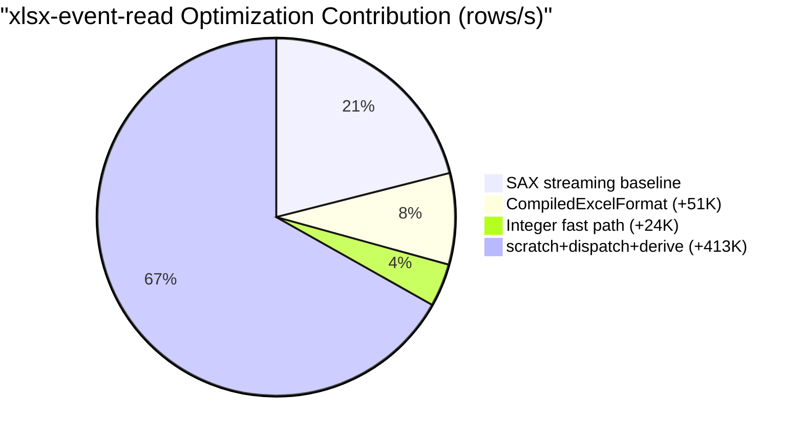

# easyexcel-rust

> **文档说明**：easyexcel-rust 用户指南，涵盖定位、核心能力、格式边界、快速上手、配置和验证。
>
> **版本**：V1.0.0
> **最后更新**：2026-08-11

[](https://www.rust-lang.org)
[](https://www.apache.org/licenses/LICENSE-2.0)
[](https://github.com/easy-4-rust/easyexcel-rust/actions/workflows/ci.yml)

**easyexcel-rust** is a native Rust port of Alibaba [EasyExcel](https://github.com/alibaba/easyexcel) 4.0.3.
It delivers the Java EasyExcel programming model in idiomatic Rust: builders,
typed row mapping, event listeners, converters, streaming reads,
constant-memory writes, template filling, and write handlers.

The workspace also exposes reusable format-neutral foundations (`easyexcel-model`,
`easyexcel-formula`, `easyexcel-io`, XLS/XLSX/CSV backends and tabular conversion).
The independent `xls-cli` product owns its library-first command application layer;
this facade no longer depends on the full `xls` fork.

> [中文 README](README_CN.md) | [Usage Guide](docs/GUIDE.md) | [API reference](docs/API.md) | [Architecture](docs/ARCHITECTURE.md) | [xls-cli integration](docs/superpowers/plans/2026-08-12-xls-cli-integration.md) | [Capability matrix](docs/superpowers/specs/2026-08-12-xls-cli-capability-matrix-design.md)

---

## At a Glance

- **Typed read/write** with `#[derive(ExcelRow)]` -- compile-time column mapping, 60+ built-in converters
- **Streaming reads** (SAX-based) and **constant-memory writes** (SXSSF equivalent) for files with millions of rows
- **Template filling** -- scalar `{key}` and list `{.field}` placeholders for XLSX and XLS
- **Full Java EasyExcel 4.0.3 parity** -- 335 @Test methods mirrored, 88 golden tests, 152 behavioral parity tests
- **Facade + foundation crates** -- application code depends only on `easyexcel`; CSV, I/O, model, formula, markdown, and format backends are reusable building blocks

## Architecture and Core Flow

`easyexcel` is the user-facing facade. It owns builders, listeners, converters, handlers, and the `#[derive(ExcelRow)]` macro. All format parsing, encoding, formula evaluation and I/O contracts live in one-way foundation crates (`easyexcel-io`, `easyexcel-model`, `easyexcel-xls`, `easyexcel-xlsx`, `easyexcel-csv`, `easyexcel-formula`, `easyexcel-markdown`, `easyexcel-tabular`, `easyexcel-cache`, `easyexcel-format`, `easyexcel-utils`).

```
User Code
    │
    ▼
easyexcel (facade)  ──►  easyexcel-io  (format detection, streaming traits, limits)
    │                ──►  easyexcel-model (Workbook / Sheet / Cell)
    │                ──►  easyexcel-xlsx  (OOXML read/write/encrypt)
    │                ──►  easyexcel-xls   (BIFF8 read/write/encrypt)
    │                ──►  easyexcel-csv   (CSV codec)
    │                ──►  easyexcel-formula (AST, evaluator, recalc)
    │                ──►  easyexcel-markdown (GFM projection)
    │                ──►  easyexcel-tabular (HTML/JSON dispatch)
    │                ──►  easyexcel-cache (Moka/File shared-string cache)
    │                ──►  easyexcel-format (Excel 15-digit math context, number formats)
    │                ──►  easyexcel-utils (Java-compatible string/collection/coordinate helpers)
    ▼
Output: XLSX / XLS / CSV / Markdown
```

For a detailed view including web execution, framework adapters, and the xls-cli product, see [Architecture](docs/ARCHITECTURE.md).

## Capabilities and Boundaries

### Format Support Matrix

| Feature | XLSX | XLS | CSV | Markdown |
|---------|:----:|:---:|:---:|:--------:|
| Read (typed rows) | ✅ stable | ✅ stable | ✅ stable | -- |
| Read (dynamic / no-model) | ✅ stable | ✅ stable | ✅ stable | -- |
| Read (event listener) | ✅ stable | ✅ stable | ✅ stable | -- |
| Read (password-protected) | ✅ stable | ✅ RC4 | -- | -- |
| Write (typed rows) | ✅ stable | ✅ BIFF8 stable | ✅ stable | -- |
| Write (with password) | ✅ Agile stable | ✅ RC4 stable | -- | -- |
| Write (constant memory / SXSSF) | ✅ stable | -- | -- | -- |
| Template fill (`{key}`) | ✅ stable | ✅ LABEL stable | -- | -- |
| Template fill (list `{.}`) | ✅ stable | ✅ stable | -- | -- |
| Merge cells | ✅ stable | ✅ stable | -- | -- |
| Column width | ✅ stable | ✅ stable | -- | -- |
| Row height | ✅ stable | ✅ stable | -- | -- |
| Styles (font / fill / alignment) | ✅ stable | ✅ basic | -- | -- |
| Comments / Notes | ✅ read+write | ✅ read-only | -- | -- |
| Hyperlinks | ✅ read+write | ✅ read-only | -- | -- |
| Images | ✅ read+write | ✅ write-only | -- | -- |
| Formulas | ✅ read+write | -- | -- | -- |
| Auto-filter | ✅ stable | -- | -- | -- |
| Export (XLS/XLSX/CSV to Markdown) | ✅ stable | ✅ stable | ✅ stable | -- |
| Import (Markdown to XLSX) | -- | -- | -- | ✅ stable |

### Round-Trip Fidelity

| Content | Read | Modify | Round-Trip Preserve | Validation |
|---------|:----:|:------:|:-------------------:|------------|
| Known text / cells / objects | ✅ | ✅ | ✅ | structural assertion |
| Styles and themes | ✅ | partial | partial | golden fixture comparison |
| Unknown extension nodes | passthrough | -- | ✅ | golden fixture |
| Macros, scripts, active content | reject | -- | -- | security test |

- `read -> write` preserves unmodified content for XLSX (ZIP entry preservation) and XLS (record-preserving template modification).
- Markdown export is a semantic projection with a structured loss report, not a lossless round trip.
- Template fill preserves all non-target content including styles, merged cells, and non-target sheets.
- Edit operations use temporary file + atomic replace; the original is preserved on failure.

### Engine Dependencies

| Format | Read Engine | Write Engine |
|--------|------------|-------------|
| XLSX | Custom SAX parser (`quick-xml`) | `rust_xlsxwriter` |
| XLS | `calamine` + BIFF record handlers | Custom BIFF8 encoder |
| CSV | `csv` crate + `encoding_rs` | `csv` crate |
| Encryption (XLSX) | `office-crypto` | `ms-offcrypto-writer` (Agile) |
| Encryption (XLS) | Custom RC4 (`md-5` + `getrandom`) | Custom RC4 |
| ZIP (XLSX container) | `zip` crate | `zip` crate |
| OLE (XLS container) | `cfb` crate | `cfb` crate |

ODS support is intentionally outside the Java EasyExcel compatibility contract and can be added later as an opt-in extension.

## Quick Start

```toml
[dependencies]
easyexcel = "0.1"
```

### Read Excel

```rust
use easyexcel::{EasyExcel, ExcelRow, PageReadListener};

#[derive(Debug, ExcelRow)]
struct User {
    #[excel(name = "Name", index = 0)]
    name: String,
    #[excel(name = "Age", index = 1)]
    age: Option<u32>,
}

fn main() -> easyexcel::Result<()> {
    // Event-driven for large files
    let listener = PageReadListener::new(1000, |rows, _ctx| {
        println!("received {} rows", rows.len());
    });
    EasyExcel::read::<User, _>("users.xlsx", listener)
        .sheet("Users")
        .do_read()?;

    // Synchronous for small datasets
    let users: Vec<User> = EasyExcel::read_sync::<User>("users.xlsx")
        .sheet("Users")
        .do_read_sync()?;

    Ok(())
}
```

### Write Excel

```rust
use easyexcel::{EasyExcel, ExcelRow};

#[derive(Debug, ExcelRow)]
#[excel(column_width = 18)]
struct User {
    #[excel(name = "Name", column_width = 30)]
    name: String,
    #[excel(name = "Age")]
    age: u32,
    #[excel(name = "Birthday", format = "yyyy-MM-dd")]
    birthday: chrono::NaiveDate,
}

fn main() -> easyexcel::Result<()> {
    let users = vec![
        User { name: "Alice".into(), age: 28, birthday: chrono::NaiveDate::from_ymd_opt(1996, 5, 20).unwrap() },
        User { name: "Bob".into(), age: 32, birthday: chrono::NaiveDate::from_ymd_opt(1992, 3, 15).unwrap() },
    ];

    EasyExcel::write::<User>("users.xlsx")
        .sheet("Users")
        .do_write(users)?;

    Ok(())
}
```

### Template Fill

```rust
use easyexcel::{EasyExcel, TemplateData, FillWrapper, FillConfig};

// Scalar fill {key}
let data = TemplateData::new()
    .with("name", "Alice")
    .with("date", "2024-01-15");
EasyExcel::fill_template("template.xlsx", "output.xlsx", &data)?;

// List fill {.field}
let list = FillWrapper::new([
    TemplateData::new().with("name", "Alice").with("score", 95),
    TemplateData::new().with("name", "Bob").with("score", 88),
]);
EasyExcel::fill_template_list("template.xlsx", "output.xlsx", &list, FillConfig::default())?;
```

### Foundation Component Facade

Downstream projects only need the `easyexcel` dependency to access CSV, I/O,
and workbook model APIs through stable namespaces:

```rust
use easyexcel::csv::{CsvReadOptions, CsvWriteOptions};
use easyexcel::io::{Format, ResourceLimits};
use easyexcel::model::{Cell, Workbook};
```

These are direct re-exports of the foundation crate types, with no wrapper or
conversion overhead.

### Markdown Projection

Use `easyexcel::markdown`, not an internal engine crate, to convert XLS/XLSX/CSV and GFM tables:

```rust
use easyexcel::markdown::{
    MarkdownConversionMode, MarkdownFormulaPolicy, MarkdownMergePolicy,
};
use easyexcel::EasyExcel;

let report = EasyExcel::export_markdown("report.xlsx", "report.md")
    .all_sheets()
    .mode(MarkdownConversionMode::Auto)
    .formula_policy(MarkdownFormulaPolicy::CachedValue)
    .merge_policy(MarkdownMergePolicy::AnchorWithWarning)
    .do_export()?;

for warning in report.warnings {
    eprintln!("{:?}: {}", warning.code, warning.message);
}

EasyExcel::import_markdown("tables.md", "generated.xlsx")
    .conservative_types()
    .apply_header_style(true)
    .do_import()?;
```

The default `AgentStable` profile emits deterministic UTF-8 GFM tables. XLSX and CSV can use Event Mode; XLS, expression output, and merge policies requiring full workbook metadata use Workbook Mode. Markdown is a semantic projection with a structured loss report, not a lossless round trip.

## Configuration

### Annotation Mapping (Java -> Rust)

| Java Annotation | Rust Attribute | Purpose |
|-----------------|---------------|---------|
| `@ExcelProperty` | `#[excel(value/head, name, index, order, converter)]` | Column mapping and multi-level heads |
| `@ExcelIgnore` | `#[excel(ignore)]` | Skip field |
| `@ExcelIgnoreUnannotated` | `#[excel(ignore_unannotated)]` | Skip unannotated |
| `@DateTimeFormat` | `#[excel(date_time_format = "...", use_1904_windowing = true)]` | Date format |
| `@NumberFormat` | `#[excel(number_format = "...", rounding_mode = "HALF_UP")]` | Numeric format |
| `@ColumnWidth` | `#[excel(column_width = N)]` | Column width |
| `@HeadRowHeight` | `#[excel(head_row_height = N)]` | Header row height |
| `@ContentRowHeight` | `#[excel(content_row_height = N)]` | Content row height |
| `@HeadStyle` | `#[excel(head_style(...))]` | Header style |
| `@ContentStyle` | `#[excel(content_style(...))]` | Content style |
| `@HeadFontStyle` | `#[excel(head_font_style(...))]` | Header font |
| `@ContentFontStyle` | `#[excel(content_font_style(...))]` | Content font |
| `@ContentLoopMerge` | `#[excel(content_loop_merge(...))]` | Loop merge |
| `@OnceAbsoluteMerge` | `#[excel(once_absolute_merge(...))]` | Absolute merge |

### Write Handlers

```rust
use easyexcel::{Result, WriteHandler, WriteSheetContext};

struct LoggingHandler;

impl WriteHandler for LoggingHandler {
    fn order(&self) -> i32 { 100 }
    fn after_sheet(&mut self, ctx: &WriteSheetContext) -> Result<()> {
        println!("Sheet '{}' written", ctx.sheet_name());
        Ok(())
    }
}

EasyExcel::write::<User>("output.xlsx")
    .register_write_handler(LoggingHandler)
    .sheet("Sheet1")
    .do_write(data)?;
```

## Operations and Troubleshooting

### Streaming and Memory Modes

| Mode | Memory Complexity | Temp Space | Use Case | Limitation |
|------|-------------------|-----------|----------|------------|
| Full model (`read_sync`) | `O(document)` | low | random access, small files | high memory for large files |
| Streaming read (`read` + listener) | `O(batch)` | low | bulk import of large files | no row backtracking |
| Constant-memory write (SXSSF) | `O(window)` | medium | massive export (>1M rows) | cannot modify after write |
| Template fill | `O(template)` | low | report generation | template must exist upfront |

- **Batch size**: configure via `PageReadListener::new(batch_size, ...)`. Default recommended: 1000 rows.
- **SXSSF window**: XLSX constant-memory write uses a sliding window; rows beyond the window are flushed to temporary files.
- **Password-protected files**: decryption buffers the full encrypted payload before streaming; memory usage equals the encrypted file size.

### Choosing a Read Mode

- Files under ~10 MB: `read_sync` for simplicity.
- Files over ~10 MB or unknown size: `read` with `PageReadListener` for bounded memory.
- Need to process all rows at once: `read_sync` returns `Vec<T>`.
- Need to process in batches: `PageReadListener` delivers chunks of `batch_size` rows.

### Common Issues

| Symptom | Likely Cause | Resolution |
|---------|-------------|------------|
| `SheetNotFound` error | Sheet name mismatch or wrong index | Use `.sheet("exact name")` or `.sheet_index(0)` |
| `Format` error on read | Cell type mismatch with Rust field type | Use `Option<T>` for nullable fields; add a custom `Converter` |
| High memory on large XLSX | Using `read_sync` on a large file | Switch to `read` with `PageReadListener` |
| Template fill missing values | Key mismatch between template and data | Verify template placeholders match `TemplateData::with()` keys exactly |
| CSV encoding issues | Non-UTF-8 source file | Use `CsvReadOptions::charset()` to specify encoding |

## Performance vs Java EasyExcel

### Throughput Comparison

| Scenario | Java (historical) | Rust (macOS 100K) | Ratio |
|----------|------------------|-------------------|-------|
| xlsx event read | 307K-343K rows/s | 618K rows/s | ~2x |
| xlsx stream write | ~105K rows/s (initial) | 277K rows/s | ~2.6x |
| xls event read | — | 70K rows/s | Rust-only optimization |

**Honest notes on data sources:**

- **Java data**: Alibaba EasyExcel 4.0.3 historical benchmark (307K-343K rows/s), recorded in `benchmarks/profiles/HOTSPOTS.md`. These numbers were measured on a different machine and may not reflect current Java performance.
- **Rust data**: macOS Apple Silicon 100K rows measured median (NIGHTLY_DRYRUN_REPORT.md, 2026-08-11).
- **Different environments** — a true A/B comparison requires a Linux release baseline (`benchmarks/baselines/release-ubuntu-x64.json`). The numbers above are from different machines and should be interpreted as directional, not absolute.
- All throughput numbers are **medians** of 3 measurements, not single-peak values.

```mermaid
xychart-beta
    title "Rust vs Java Throughput (rows/s)"
    x-axis ["xlsx-event-read", "xlsx-stream-write"]
    y-axis "rows/s" 0 --> 700000
    bar [307000, 105000]
    bar [618000, 277000]
```



> **Chart legend**: First bar group = Java (historical benchmark, 307K-343K range), Second bar group = Rust (macOS Apple Silicon 100K rows). Java has no historical xls-event-read data; Rust achieves 70K rows/s.

### Full Benchmark Results (macOS 100K rows)

| Scenario | Cold (rows/s) | Steady (rows/s) |
|----------|--------------|-----------------|
| xlsx-stream-write | 277,133 | 243,219 |
| xlsx-event-read | 618,478 | 628,194 |
| xlsx-workbook-read | 558,460 | 576,070 |
| csv-stream-write | 279,913 | 291,230 |
| csv-event-read | 1,227,002 | 1,293,649 |
| xls-event-read | 70,379 | 74,651 |

Source: `docs/superpowers/specs/2026-08-12-nightly-dryrun-report-design.md`

### Optimization Timeline

```
Event read: 130K → 181K (CompiledExcelFormat) → 205K (integer fast path) → 618K (scratch reuse + typed dispatch + derive primitive)
Stream write: 105K → 257K (Handler Arc + Rc<RefCell> + capability fast path)
xls-event-read: 12K → 70K (LazySst deferred SST decode, 61.8x construction speedup)
```



### How to Reproduce

```bash
# Build the benchmark runner
cargo build --release -p easyexcel-benchmark-runner

# Run the full benchmark suite
cargo run --release -p easyexcel-benchmark-runner -- --spec benchmarks/spec/benchmark-suite-v1.json --output results.jsonl

# Compare with baseline
python3 benchmarks/scripts/compare_results.py results.jsonl \
  --spec benchmarks/spec/benchmark-suite-v1.json \
  --profile nightly \
  --baseline benchmarks/baselines/nightly-ubuntu-x64.json
```

For detailed performance architecture (read/write path chains, memory model, and all 10 optimization techniques), see [Architecture - Performance Architecture](docs/ARCHITECTURE.md#performance-architecture).

## Verification and Deep Links

### Test Statistics

| Category | Count | Status |
|----------|-------|--------|
| Java @Test methods mirrored | 335 | All pass |
| Golden tests (byte-level Java output comparison) | 88 | All pass |
| Parity tests (behavioral equivalence) | 152 | All pass |
| 1:1 method tests | 78 | All pass |
| Total workspace tests | 4,451 | 4,447 passed / 2 failed / 2 ignored |
| `#[ignore]` annotations | 2 | 2 (easyexcel-test `temp_1to1_tests/`) |

### Crate Map

| Crate | Purpose | Java Mirror |
|-------|---------|-------------|
| `easyexcel` | User-facing facade | `EasyExcel` / `EasyExcelFactory` |
| `easyexcel-derive` | `#[derive(ExcelRow)]` proc-macro | Annotation processing |
| `easyexcel-model` | Format-neutral workbook and cell model | Core data model |
| `easyexcel-io` | Format detection, I/O contracts and resource limits | Read/write infrastructure |
| `easyexcel-csv` | CSV codec, charset and streaming writer | CSV backend |
| `easyexcel-xls` | BIFF8 parsing, encoding, encryption and formula tokens | XLS backend |
| `easyexcel-xlsx` | OOXML streaming, package handling and encryption | XLSX backend |
| `easyexcel-formula` | Formula AST, parser and evaluator | Formula engine |
| `easyexcel-markdown` | GFM parsing, streaming export, projection policy and loss reports | Markdown projection |
| `easyexcel-tabular` | Static HTML, JSON and generic text-format dispatch | Tabular interchange |
| `easyexcel-cache` | Moka object cache + temporary file cache with auto threshold | Shared string cache |
| `easyexcel-format` | Excel 15-digit math context and number format handling | `EasyExcelConstants` |
| `easyexcel-web` | Framework-neutral streaming import/export, limits, cancellation and error protocol | Web execution kernel |

Foundation crates are internal engine layers. Application code should depend only on `easyexcel`:

```rust
use easyexcel::csv::{CsvCharset, CsvReadOptions, CsvWriteOptions};
use easyexcel::io::{Format, ResourceLimits};
use easyexcel::model::{Cell, Workbook};
use easyexcel::markdown::{MarkdownConversionMode, MarkdownFormulaPolicy};
use easyexcel::xls;
use easyexcel::xlsx;
```

`easyexcel::{csv, io, markdown, model, formula, tabular, xls, xlsx, format, util}` directly re-export the public engine types without creating a second model. The facade continues to own `EasyExcel`, builders, listeners, converters, handlers, and `#[derive(ExcelRow)]`.

Markdown is a semantic projection with an explicit loss report, not a lossless
Excel round trip. XLS uses Workbook Mode; XLSX and CSV also support real Event
Mode. Rust users only need the facade:

```rust
let report = EasyExcel::export_markdown("report.xlsx", "report.md")
    .mode(MarkdownConversionMode::Auto)
    .formula_policy(MarkdownFormulaPolicy::CachedValue)
    .do_export()?;

EasyExcel::import_markdown("report.md", "report.xlsx")
    .conservative_types()
    .do_import()?;
```

Web services additionally depend on `easyexcel-web` and use `ExcelImport<T>`, `ExcelRows<T>`, `ExcelExport<T>`, `ExcelWebPolicy`, and an application-level `ExcelWebRuntime`. Framework crates provide only native extractor/responder adapters; shared buffering, limits, cancellation, cleanup, and error mapping stay in the web kernel.

Axum, Actix Web, Hyper, Poem, Rocket, Salvo, and Warp expose equivalent `ExcelRequest<T>` and `ExcelResponse<T>` semantics. Runnable integrations live under `examples/<framework>` and share the conformance suite in `tests/easyexcel-web-conformance`.

### Documentation Links

| Document | Description |
|----------|-------------|
| [Usage Guide](docs/GUIDE.md) | Detailed usage guide with examples |
| [API Reference](docs/API.md) | Complete API parameter reference |
| [Architecture](docs/ARCHITECTURE.md) | Crate layout, data flow, dependency direction |
| [Migration Audit](docs/superpowers/specs/2026-08-12-test-audit-design.md) | Java-to-Rust test parity report |
| [xls-cli Integration Plan](docs/superpowers/plans/2026-08-12-xls-cli-integration.md) | xls-cli product integration details |
| [Capability Matrix](docs/superpowers/specs/2026-08-12-xls-cli-capability-matrix-design.md) | xls-cli runtime capability matrix |

## License

Apache-2.0

---

**文档版本**：V1.0.0
**创建日期**：2026-08-11
**最后更新**：2026-08-11
**文档状态**：✅ 已评审
