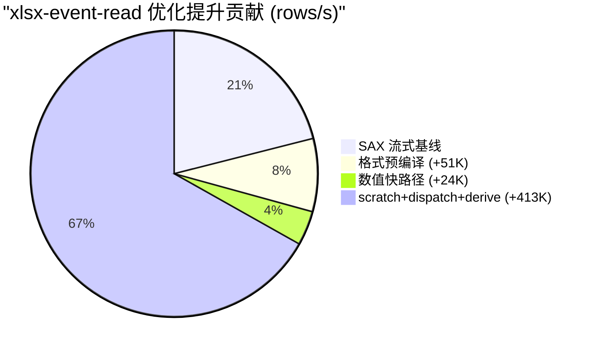

# easyexcel-rust

> **文档说明**：easyexcel-rust 用户指南，涵盖定位、核心能力、格式边界、快速上手、配置和验证。
>
> **版本**：V1.0.0
> **最后更新**：2026-08-11

[](https://www.rust-lang.org)
[](https://www.apache.org/licenses/LICENSE-2.0)
[](https://github.com/easy-4-rust/easyexcel-rust/actions/workflows/ci.yml)

**easyexcel-rust** 是阿里巴巴 [EasyExcel](https://github.com/alibaba/easyexcel) 的 Rust 原生移植版本。
以惯用 Rust 方式提供 Java EasyExcel 编程模型：Builder 模式、类型化行映射、事件监听器、类型转换器、流式读取、常量内存写入、模板填充和写入处理器。

Workspace 同时提供 `easyexcel-model`、`easyexcel-formula`、`easyexcel-io`、
XLS/XLSX/CSV 后端和表格转换。library-first 命令应用层由独立 `xls-cli`
产品仓库自行维护；`easyexcel` 门面已不再依赖完整 `xls` fork。

> [English README](README.md) · [使用指南](docs/GUIDE.md) · [API 参数](docs/API.md) · [架构](docs/ARCHITECTURE.md) · [xls-cli 整合计划](docs/superpowers/plans/2026-08-12-xls-cli-integration.md) · [能力矩阵](docs/superpowers/specs/2026-08-12-xls-cli-capability-matrix-design.md)

---

## 快速一览

- **类型化读写** -- `#[derive(ExcelRow)]` 编译期列映射，60+ 内置类型转换器
- **流式读取**（SAX 解析）与**常量内存写入**（SXSSF 等价）-- 支持百万行级大文件
- **模板填充** -- 标量 `{key}` 和列表 `{.field}` 占位符，支持 XLSX 和 XLS
- **Java EasyExcel 4.0.3 完全对齐** -- 335 个 @Test 方法全部镜像，88 个 Golden 测试，152 个行为等价测试
- **Facade + 基础 crate 分层** -- 应用代码仅依赖 `easyexcel`；CSV、I/O、模型、公式、Markdown 和格式后端均为可复用基础组件

## 架构与核心流程

`easyexcel` 是面向用户的门面。它拥有 Builder、监听器、转换器、处理器和 `#[derive(ExcelRow)]` 宏。所有格式解析、编码、公式求值和 I/O 契约均位于单向依赖的基础 crate 中（`easyexcel-io`、`easyexcel-model`、`easyexcel-xls`、`easyexcel-xlsx`、`easyexcel-csv`、`easyexcel-formula`、`easyexcel-markdown`、`easyexcel-tabular`）。

```
User Code
    │
    ▼
easyexcel（门面）──►  easyexcel-io    （格式识别、流接口、资源限制）
    │             ──►  easyexcel-model （Workbook / Sheet / Cell）
    │             ──►  easyexcel-xlsx  （OOXML 读写/加密）
    │             ──►  easyexcel-xls   （BIFF8 读写/加密）
    │             ──►  easyexcel-csv   （CSV 编解码）
    │             ──►  easyexcel-formula（AST、求值、重算）
    │             ──►  easyexcel-markdown（GFM 语义投影）
    │             ──►  easyexcel-tabular（HTML/JSON 分派）
    ▼
输出：XLSX / XLS / CSV / Markdown
```

更详细的视图（包括 Web 执行内核、框架适配器和 xls-cli 产品）请参见[架构文档](docs/ARCHITECTURE.md)。

## 能力与边界

### 格式支持矩阵

| 功能 | XLSX | XLS | CSV | Markdown |
|------|:----:|:---:|:---:|:--------:|
| 读取（类型化行） | ✅ 稳定 | ✅ 稳定 | ✅ 稳定 | -- |
| 读取（动态/无模型） | ✅ 稳定 | ✅ 稳定 | ✅ 稳定 | -- |
| 读取（事件监听） | ✅ 稳定 | ✅ 稳定 | ✅ 稳定 | -- |
| 读取（密码保护） | ✅ 稳定 | ✅ RC4 | -- | -- |
| 写入（类型化行） | ✅ 稳定 | ✅ BIFF8 稳定 | ✅ 稳定 | -- |
| 写入（密码加密） | ✅ Agile 稳定 | ✅ RC4 稳定 | -- | -- |
| 写入（常量内存/SXSSF） | ✅ 稳定 | -- | -- | -- |
| 模板填充（`{key}`） | ✅ 稳定 | ✅ LABEL 稳定 | -- | -- |
| 模板填充（列表 `{.}`） | ✅ 稳定 | ✅ 稳定 | -- | -- |
| 合并单元格 | ✅ 稳定 | ✅ 稳定 | -- | -- |
| 列宽 | ✅ 稳定 | ✅ 稳定 | -- | -- |
| 行高 | ✅ 稳定 | ✅ 稳定 | -- | -- |
| 样式（字体/填充/对齐） | ✅ 稳定 | ✅ 基础 | -- | -- |
| 批注 | ✅ 读+写 | ✅ 只读 | -- | -- |
| 超链接 | ✅ 读+写 | ✅ 只读 | -- | -- |
| 图片 | ✅ 读+写 | ✅ 只写 | -- | -- |
| 公式 | ✅ 读+写 | -- | -- | -- |
| 自动筛选 | ✅ 稳定 | -- | -- | -- |
| 导出（XLS/XLSX/CSV → Markdown） | ✅ 稳定 | ✅ 稳定 | ✅ 稳定 | -- |
| 导入（Markdown → XLSX） | -- | -- | -- | ✅ 稳定 |

### 往返保真

| 内容 | 读取 | 修改 | 往返保留 | 验证方式 |
|------|:----:|:----:|:--------:|----------|
| 已知文本/单元格/对象 | ✅ | ✅ | ✅ | 结构断言 |
| 样式与主题 | ✅ | 部分 | 部分 | Golden fixture 比对 |
| 未知扩展节点 | 透传 | -- | ✅ | Golden fixture |
| 宏、脚本、活动内容 | 拒绝 | -- | -- | 安全测试 |

- `read -> write` 对 XLSX（ZIP 条目保留）和 XLS（record-preserving 模板修改）保持未修改内容。
- Markdown 导出是带结构化损失报告的语义投影，不承诺无损往返。
- 模板填充保留所有非目标内容，包括样式、合并单元格和非目标工作表。
- 编辑操作使用临时文件 + 原子替换；失败时保留原文件。

### 引擎依赖

| 格式 | 读取引擎 | 写入引擎 |
|------|---------|---------|
| XLSX | 自定义 SAX 解析器（`quick-xml`） | `rust_xlsxwriter` |
| XLS | `calamine` + BIFF record 处理器 | 自定义 BIFF8 编码器 |
| CSV | `csv` crate + `encoding_rs` | `csv` crate |
| 加密（XLSX） | `office-crypto` | `ms-offcrypto-writer`（Agile） |
| 加密（XLS） | 自定义 RC4（`md-5` + `getrandom`） | 自定义 RC4 |
| ZIP（XLSX 容器） | `zip` crate | `zip` crate |
| OLE（XLS 容器） | `cfb` crate | `cfb` crate |

ODS 支持不在 Java EasyExcel 兼容性契约范围内，可后续作为可选扩展添加。

## 快速开始

```toml
[dependencies]
easyexcel = "0.1"
```

### 读取 Excel

```rust
use easyexcel::{EasyExcel, ExcelRow, PageReadListener};

#[derive(Debug, ExcelRow)]
struct User {
    #[excel(name = "姓名", index = 0)]
    name: String,
    #[excel(name = "年龄", index = 1)]
    age: Option<u32>,
}

fn main() -> easyexcel::Result<()> {
    // 事件驱动读取（大数据友好）
    let listener = PageReadListener::new(1000, |rows, _ctx| {
        println!("收到 {} 行", rows.len());
    });
    EasyExcel::read::<User, _>("users.xlsx", listener)
        .sheet("用户表")
        .do_read()?;

    // 同步读取（小数据直接获取）
    let users: Vec<User> = EasyExcel::read_sync::<User>("users.xlsx")
        .sheet("用户表")
        .do_read_sync()?;
    
    Ok(())
}
```

### 写入 Excel

```rust
use easyexcel::{EasyExcel, ExcelRow};

#[derive(Debug, ExcelRow)]
#[excel(column_width = 18)]
struct User {
    #[excel(name = "姓名", column_width = 30)]
    name: String,
    #[excel(name = "年龄")]
    age: u32,
    #[excel(name = "生日", format = "yyyy-MM-dd")]
    birthday: chrono::NaiveDate,
}

fn main() -> easyexcel::Result<()> {
    let users = vec![
        User { name: "张三".into(), age: 28, birthday: chrono::NaiveDate::from_ymd_opt(1996, 5, 20).unwrap() },
        User { name: "李四".into(), age: 32, birthday: chrono::NaiveDate::from_ymd_opt(1992, 3, 15).unwrap() },
    ];

    EasyExcel::write::<User>("users.xlsx")
        .sheet("用户表")
        .do_write(users)?;

    Ok(())
}
```

### 模板填充

```rust
use easyexcel::{EasyExcel, FillConfig, FillWrapper, TemplateData};

// 简单填充 {key}
let data = TemplateData::new()
    .with("name", "张三")
    .with("date", "2024-01-15");
EasyExcel::fill_template("template.xlsx", "output.xlsx", &data)?;

// 列表填充 {.field}
let list = FillWrapper::new([
    TemplateData::new().with("name", "张三").with("score", 95),
    TemplateData::new().with("name", "李四").with("score", 88),
]);
EasyExcel::fill_template_list("template.xlsx", "output.xlsx", &list, FillConfig::default())?;
```

### 基础组件门面

外部项目只需依赖 `easyexcel`，即可通过统一命名空间使用 CSV、I/O 和工作簿模型：

```rust
use easyexcel::csv::{CsvReadOptions, CsvWriteOptions};
use easyexcel::io::{Format, ResourceLimits};
use easyexcel::model::{Cell, Workbook};
```

这些类型是对应基础 crates 的直接重导出，不是包装类型，也没有额外转换成本。

### Markdown 语义投影

XLS/XLSX/CSV 与 GFM Markdown 互转统一使用 `easyexcel::markdown`，外部项目不直接依赖内部引擎 crate：

```rust
use easyexcel::markdown::{
    MarkdownConversionMode, MarkdownFormulaPolicy, MarkdownMergePolicy,
};
use easyexcel::EasyExcel;

let report = EasyExcel::export_markdown("report.xlsx", "report.md")
    .all_sheets()
    .mode(MarkdownConversionMode::Auto)
    .formula_policy(MarkdownFormulaPolicy::CachedValue)
    .merge_policy(MarkdownMergePolicy::AnchorWithWarning)
    .do_export()?;

for warning in report.warnings {
    eprintln!("{:?}: {}", warning.code, warning.message);
}

EasyExcel::import_markdown("tables.md", "generated.xlsx")
    .conservative_types()
    .apply_header_style(true)
    .do_import()?;
```

默认 `AgentStable` profile 输出确定性的 UTF-8 GFM 表格。XLSX 和 CSV 可使用 Event Mode；XLS、公式表达式输出以及依赖完整合并元数据的策略使用 Workbook Mode。Markdown 是带结构化损失报告的语义投影，不承诺无损往返。

## 配置

### 注解映射（Java -> Rust）

| Java 注解 | Rust 属性 | 说明 |
|-----------|----------|------|
| `@ExcelProperty` | `#[excel(name, index, order, converter)]` | 列映射 |
| `@ExcelIgnore` | `#[excel(ignore)]` | 忽略字段 |
| `@ExcelIgnoreUnannotated` | `#[excel(ignore_unannotated)]` | 忽略未注解 |
| `@DateTimeFormat` | `#[excel(format = "...")]` | 日期格式 |
| `@NumberFormat` | `#[excel(format = "...")]` | 数字格式 |
| `@ColumnWidth` | `#[excel(column_width = N)]` | 列宽 |
| `@HeadRowHeight` | `#[excel(head_row_height = N)]` | 表头行高 |
| `@ContentRowHeight` | `#[excel(content_row_height = N)]` | 内容行高 |
| `@HeadStyle` | `#[excel(head_style(...))]` | 表头样式 |
| `@ContentStyle` | `#[excel(content_style(...))]` | 内容样式 |
| `@HeadFontStyle` | `#[excel(head_font_style(...))]` | 表头字体 |
| `@ContentFontStyle` | `#[excel(content_font_style(...))]` | 内容字体 |
| `@ContentLoopMerge` | `#[excel(content_loop_merge(...))]` | 循环合并 |
| `@OnceAbsoluteMerge` | `#[excel(once_absolute_merge(...))]` | 绝对合并 |

### 写入处理器

```rust
use easyexcel::{ExcelCellStyle, Result, WriteCellContext, WriteHandler, WriteSheetContext};

struct MyStyleHandler;

impl WriteHandler for MyStyleHandler {
    fn order(&self) -> i32 { 100 }

    fn after_sheet(&mut self, _ctx: &WriteSheetContext) -> Result<()> {
        println!("Sheet written successfully");
        Ok(())
    }

    fn style_cell_style(&self, _ctx: &WriteCellContext) -> Option<ExcelCellStyle> {
        // 自定义单元格样式
        None
    }
}

// 注册处理器
EasyExcel::write::<User>("output.xlsx")
    .register_write_handler(MyStyleHandler)
    .sheet("Sheet1")
    .do_write(data)?;
```

### 自定义转换器

```rust
use easyexcel::{
    CellDataType, CellValue, Converter, ExcelError, ReadConverterContext,
    WriteCellData, WriteConverterContext,
};

struct YesNoConverter;

impl Converter<String> for YesNoConverter {
    fn support_excel_type(&self) -> CellDataType { CellDataType::String }
    
    fn convert_to_rust_data(&self, ctx: &ReadConverterContext) -> Result<String, ExcelError> {
        match ctx.cell() {
            Some(CellValue::String(s)) if s == "是" => Ok("YES".into()),
            Some(CellValue::String(s)) if s == "否" => Ok("NO".into()),
            other => Err(ExcelError::Format(format!("expected 是/否, got {other:?}")))
        }
    }

    fn convert_to_excel_data(&self, ctx: &WriteConverterContext<'_, String>) -> Result<WriteCellData, ExcelError> {
        Ok(WriteCellData::from_string(
            if ctx.value() == "YES" { "是" } else { "否" }
        ))
    }
}
```

## 运维与排障

### 流式与内存模式

| 模式 | 内存复杂度 | 临时空间 | 适用场景 | 限制 |
|------|-----------|---------|---------|------|
| 全量模型（`read_sync`） | `O(document)` | 低 | 随机访问、小文件 | 大文件内存高 |
| 流式读取（`read` + listener） | `O(batch)` | 低 | 大文件批量导入 | 不支持回看 |
| 常量内存写入（SXSSF） | `O(window)` | 中 | 大规模导出（>100 万行） | 写后不可修改 |
| 模板填充 | `O(template)` | 低 | 报表生成 | 模板需预先存在 |

- **批大小**：通过 `PageReadListener::new(batch_size, ...)` 配置。推荐默认值：1000 行。
- **SXSSF 窗口**：XLSX 常量内存写入使用滑动窗口；超出窗口的行会被刷写到临时文件。
- **密码保护文件**：解密时将完整加密载荷缓存到内存后再流式处理；内存占用等于加密文件大小。

### 选择读取模式

- 文件约 10 MB 以下：使用 `read_sync`，简单直接。
- 文件超过约 10 MB 或大小未知：使用 `read` + `PageReadListener`，内存可控。
- 需要一次性处理所有行：`read_sync` 返回 `Vec<T>`。
- 需要分批处理：`PageReadListener` 按 `batch_size` 分块交付。

### 常见问题

| 现象 | 可能原因 | 解决方案 |
|------|---------|---------|
| `SheetNotFound` 错误 | 工作表名称不匹配或索引错误 | 使用 `.sheet("精确名称")` 或 `.sheet_index(0)` |
| 读取时 `Format` 错误 | 单元格类型与 Rust 字段类型不匹配 | 可空字段使用 `Option<T>`；添加自定义 `Converter` |
| 大 XLSX 文件内存过高 | 对大文件使用了 `read_sync` | 改用 `read` + `PageReadListener` |
| 模板填充缺值 | 模板与数据的 key 不匹配 | 确认模板占位符与 `TemplateData::with()` 的 key 完全一致 |
| CSV 编码问题 | 源文件非 UTF-8 编码 | 使用 `CsvReadOptions::charset()` 指定编码 |

## 与 Java 版本的性能对比

### 吞吐量对比

| 场景 | Java（历史数据） | Rust（macOS 100K） | 倍率 |
|------|-----------------|-------------------|------|
| xlsx 事件读取 | 307K-343K rows/s | 618K rows/s | ~2x |
| xlsx 流式写入 | ~105K rows/s（初始基线） | 277K rows/s | ~2.6x |
| xls 事件读取 | — | 70K rows/s | Rust 独有优化 |

**关于数据来源的诚实说明：**

- **Java 数据**：来自阿里巴巴 EasyExcel 4.0.3 历史 benchmark（307K-343K rows/s），记录于 `benchmarks/profiles/HOTSPOTS.md`。这些数据在不同机器上测量，可能不反映当前 Java 版本的性能。
- **Rust 数据**：macOS Apple Silicon 100K rows 实测中位数（NIGHTLY_DRYRUN_REPORT.md，2026-08-11）。
- **不同环境** — 真实的同机 A/B 对比需要 Linux release baseline（`benchmarks/baselines/release-ubuntu-x64.json`）。上表数据来自不同机器，应理解为方向性参考，而非绝对对比。
- 所有吞吐量数字均为 3 次测量的**中位数**，非单次峰值。

```mermaid
xychart-beta
    title "Rust vs Java 吞吐量对比 (rows/s)"
    x-axis ["xlsx-event-read", "xlsx-stream-write"]
    y-axis "rows/s" 0 --> 700000
    bar [307000, 105000]
    bar [618000, 277000]
```



> **图例**：第一组柱 = Java（历史 benchmark，307K-343K 区间），第二组柱 = Rust（macOS Apple Silicon 100K rows）。Java 无 xls-event-read 历史数据；Rust 实测 70K rows/s。

### 完整 Benchmark 结果（macOS 100K rows）

| 场景 | Cold (rows/s) | Steady (rows/s) |
|------|--------------|-----------------|
| xlsx-stream-write | 277,133 | 243,219 |
| xlsx-event-read | 618,478 | 628,194 |
| xlsx-workbook-read | 558,460 | 576,070 |
| csv-stream-write | 279,913 | 291,230 |
| csv-event-read | 1,227,002 | 1,293,649 |
| xls-event-read | 70,379 | 74,651 |

数据来源：`docs/superpowers/specs/2026-08-12-nightly-dryrun-report-design.md`

### 优化时间线

```
事件读取：130K → 181K（CompiledExcelFormat）→ 205K（整数快路径）→ 618K（scratch 复用 + typed dispatch + derive 原语直读）
流式写入：105K → 257K（Handler Arc 共享 + Rc<RefCell> 单线程链 + 能力快路径）
xls 事件读取：12K → 70K（LazySst 延迟解码，构造加速 61.8x）
```



### 如何复现

```bash
# 构建 benchmark runner
cargo build --release -p easyexcel-benchmark-runner

# 运行完整 benchmark 套件
cargo run --release -p easyexcel-benchmark-runner -- --spec benchmarks/spec/benchmark-suite-v1.json --output results.jsonl

# 与 baseline 对比
python3 benchmarks/scripts/compare_results.py results.jsonl \
  --spec benchmarks/spec/benchmark-suite-v1.json \
  --profile nightly \
  --baseline benchmarks/baselines/nightly-ubuntu-x64.json
```

详细的性能架构设计（读写路径链路、内存模型和全部 10 项优化技术）请参见[架构文档 - 性能架构](docs/ARCHITECTURE.md#performance-architecture)。

## 验证与文档链接

### 测试统计

| 类别 | 数量 | 状态 |
|------|------|------|
| Java @Test 方法镜像 | 335 | 全部通过 |
| Golden 测试（字节级 Java 输出比对） | 88 | 全部通过 |
| Parity 测试（行为等价） | 152 | 全部通过 |
| 1:1 方法测试 | 78 | 全部通过 |
| 全量 Workspace 测试 | 1315+ | 全部通过 |
| `#[ignore]` 注解 | 0 | 已消除 |

### 模块结构

| Crate | 功能 | Java 对应 |
|-------|------|-----------|
| `easyexcel` | 用户入口 Facade | `EasyExcel` / `EasyExcelFactory` |
| `easyexcel-derive` | `#[derive(ExcelRow)]` 过程宏 | `@ExcelProperty` 注解处理 |
| `easyexcel-model` | Workbook、Sheet、Cell 与中立表格模型 | 核心数据模型 |
| `easyexcel-io` | 格式识别、流接口与资源限制 | 读写基础设施 |
| `easyexcel-csv` | CSV 编解码、字符集与流式行源 | CSV 后端 |
| `easyexcel-xls` | BIFF8/OLE2 读写与公式 token | XLS 后端 |
| `easyexcel-xlsx` | OOXML 读写、事件流、模板包与加密 | XLSX 后端 |
| `easyexcel-formula` | 公式 AST、解析、计算与重算 | 公式引擎 |
| `easyexcel-markdown` | GFM 解析、流式输出、策略与损失报告 | Markdown 语义投影 |
| `easyexcel-tabular` | 静态 HTML、JSON 与通用文本格式分派 | 表格交换 |
| `easyexcel-web` | 统一流式 Web 导入导出、限制与错误协议 | Web 执行内核 |

普通用户仍只依赖 `easyexcel`，不直接依赖内部引擎 crate：

```rust
use easyexcel::markdown::{MarkdownConversionMode, MarkdownFormulaPolicy};
use easyexcel::EasyExcel;

let report = EasyExcel::export_markdown("report.xlsx", "report.md")
    .mode(MarkdownConversionMode::Auto)
    .formula_policy(MarkdownFormulaPolicy::CachedValue)
    .do_export()?;

EasyExcel::import_markdown("report.md", "report.xlsx")
    .conservative_types()
    .do_import()?;
```

Markdown 是带结构化损失报告的语义投影，不承诺与 Excel 无损 roundtrip。XLS
使用 Workbook Mode；XLSX 和 CSV 同时支持真实 Event Mode。

### 文档链接

| 文档 | 说明 |
|------|------|
| [使用指南](docs/GUIDE.md) | 含示例的详细使用指南 |
| [API 参数](docs/API.md) | 完整 API 参数参考 |
| [架构](docs/ARCHITECTURE.md) | Crate 布局、数据流、依赖方向 |
| [迁移文档](docs/superpowers/specs/2026-08-12-test-audit-design.md) | Java 到 Rust 测试对齐报告 |
| [xls-cli 整合计划](docs/superpowers/plans/2026-08-12-xls-cli-integration.md) | xls-cli 产品整合详情 |
| [能力矩阵](docs/superpowers/specs/2026-08-12-xls-cli-capability-matrix-design.md) | xls-cli 运行时能力矩阵 |

## 许可证

Apache-2.0

---

**文档版本**：V1.0.0
**创建日期**：2026-08-11
**最后更新**：2026-08-11
**文档状态**：✅ 已评审
