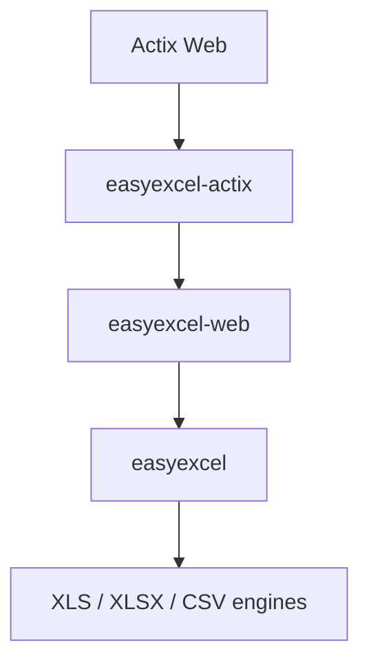

# easyexcel-actix

[English](README.md)

面向 Actix Web 的 EasyExcel 原生请求提取与响应适配器。

> 版本: 0.1.2 · Rust 1.88+ · Edition 2024 · Apache-2.0

## 概述

`easyexcel-actix` 只负责把 Actix Web 传输类型桥接到 `easyexcel-web`。上传落盘、资源限制、行流背压、取消、超时、临时文件清理与稳定错误协议均由共享内核实现，避免各框架产生不同语义。

原生集成方式：`FromRequest` extractor and `Responder`；运行时传递方式：`web::Data<ExcelWebRuntime>`。

## 一览

```text
HTTP 请求 -> easyexcel-actix -> easyexcel-web -> 类型化行 / 流式响应
```

## 架构


适配器不得重新实现 Excel 解析、写入或资源策略。业务行在有界通道中消费，下载通过异步文件流交给 Actix Web。

## 能力矩阵

| 能力 | 状态 | 实现 |
|:---|:---|:---|
| `ExcelRequest<T>` | 可用 | 原生 Actix Web 请求提取，返回类型化背压行流。 |
| `ExcelResponse<T>` | 可用 | 发送响应头前完成受控文件生成，再异步传输。 |
| 资源与并发 | 共享 | `ExcelWebPolicy` + `ExcelWebRuntime` |
| 错误协议 | 稳定 | `ExcelActixError` + `ExcelProblemDetails` |
| TUI / HTML form | 范围外 | 由业务应用或 examples 提供。 |

## 安装

```toml
[dependencies]
easyexcel = "0.1.2"
easyexcel-actix = "0.1.2"
```

`easyexcel` 提供 `ExcelRow`、`Format` 和类型化读写语义；本适配器提供 Actix Web 传输集成。两者必须使用同一版本线。

## 定义行模型

```rust
use easyexcel::ExcelRow;

#[derive(Debug, ExcelRow)]
struct ReportRow {
    #[excel(name = "Name")]
    name: String,

    #[excel(name = "Value", number_format = "0")]
    value: i64,
}

fn report_rows() -> impl Iterator<Item = ReportRow> {
    (0..10).map(|value| ReportRow {
        name: format!("row-{value}"),
        value,
    })
}
```

## 流式下载

```rust
use actix_web::web;
use easyexcel::io::Format;
use easyexcel_actix::{ExcelActixError, ExcelResponse, ExcelWebRuntime};

async fn download(
    runtime: web::Data<ExcelWebRuntime>,
) -> Result<ExcelResponse<ReportRow>, ExcelActixError> {
    ExcelResponse::prepare(
        report_rows(),
        Format::Xlsx,
        "report.xlsx",
        "Data",
        runtime.generated_context(),
    ).await
}
```

`ExcelResponse::prepare` 在返回 Actix Web 响应前完成生成和限制校验；成功后响应体从临时文件异步读取，不把完整文件复制到内存。

## 背压上传

```rust
use easyexcel_actix::{ExcelActixError, ExcelRequest};

async fn upload(
    request: ExcelRequest<ReportRow>,
) -> Result<String, ExcelActixError> {
    let request_id = request.request_id().to_owned();
    let mut rows = request.into_rows();
    let mut count = 0_u64;
    while let Some(row) = rows.next_row().await {
        row.map_err(|error| ExcelActixError::new(error, &request_id))?;
        count += 1;
    }
    Ok(format!("success: {count} rows"))
}
```

上传请求必须提供 `x-excel-file-name`、`Content-Disposition` 或可识别的 `Content-Type`。可选 `x-request-id` 会进入 tracing 与错误响应。

## 运行时接线

```rust
use actix_web::{App, web};
use easyexcel_actix::{ExcelWebPolicy, ExcelWebRuntime};

let runtime = ExcelWebRuntime::new(ExcelWebPolicy::default());
let app = App::new()
    .app_data(web::Data::new(runtime))
    .route("/download", web::get().to(download))
    .route("/upload", web::post().to(upload));
```

应用应创建一个共享 `ExcelWebRuntime`，而不是为每个请求重新创建并发许可池。可通过 `ExcelWebPolicy` 统一设置文件字节数、行数、上传/处理超时、最大任务数、行通道容量和临时目录。

## 响应头与错误

- `Content-Type` 根据 XLSX、XLS 或 CSV 格式生成。
- `Content-Disposition` 使用 UTF-8 文件名编码并清理不安全名称。
- `Content-Length` 来自生成后文件大小。
- `ExcelActixError` 把共享错误映射为框架原生 rejection/error/response。
- 诊断信息进入 tracing；响应体保持稳定问题详情，不泄露内部路径。

## 能力边界

- 流式上传表示请求体分块落盘后再解析，不表示 XLS/XLSX 容器可在未接收完整文件时随机访问。
- 流式下载在生成成功后开始传输，避免客户端收到部分有效工作簿。
- 适配器不承载业务校验、鉴权或持久化；这些职责属于应用 handler/middleware。
- 完整可运行服务位于 `examples/actix`，共享一致性断言位于 `tests/easyexcel-web-conformance`。

## 依赖关系



禁止形成 `easyexcel-web -> easyexcel-actix` 或 `easyexcel -> easyexcel-actix` 的反向依赖。

## 证据索引

| 声明 | 事实来源 |
|:---|:---|
| Extractor/请求行为 | [`src/excel_request.rs`](src/excel_request.rs) |
| Responder/响应行为 | [`src/excel_response.rs`](src/excel_response.rs) |
| 错误映射 | [`src/excel_error.rs`](src/excel_error.rs) |
| 可运行集成 | [`examples/actix`](https://github.com/easy-4-rust/easyexcel-rust/tree/main/examples/actix) |
| 共享适配器契约 | [`tests/easyexcel-web-conformance`](https://github.com/easy-4-rust/easyexcel-rust/tree/main/tests/easyexcel-web-conformance) |

## 相关链接

- [项目仓库](https://github.com/easy-4-rust/easyexcel-rust)
- [API 文档](https://docs.rs/easyexcel-actix)
- [easyexcel-web](https://crates.io/crates/easyexcel-web)
- [可运行示例](https://github.com/easy-4-rust/easyexcel-rust/tree/main/examples/actix)
- [兼容性矩阵](https://github.com/easy-4-rust/easyexcel-rust/blob/main/docs/compatibility.md)
- [英文 README](README.md)
