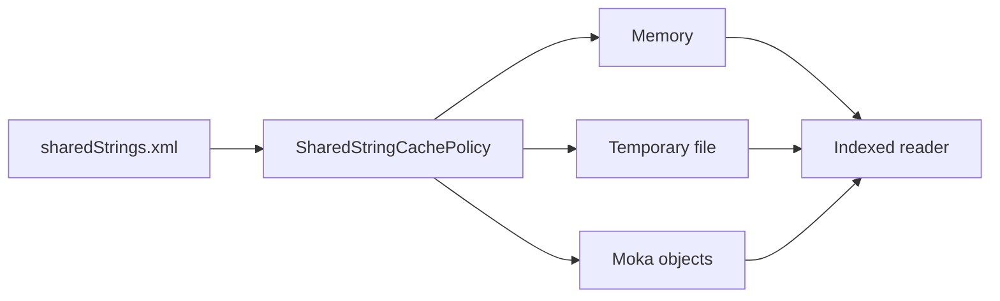

# easyexcel-cache

[简体中文](README.zh-CN.md)

> **Document purpose**: Documents the shared-string cache backends crate for contributors and engine implementors. Application code should depend on `easyexcel` facade.
>
> **Version**: 0.1.3
> **Last updated**: 2026-08-11

Shared-string cache backends used by streaming spreadsheet readers.

> Release: 0.1.3 · Rust 1.88+ · Edition 2024 · Apache-2.0

## Overview

This crate is independently published to support the EasyExcel-Rust internal dependency graph. Its README documents the engine boundary for contributors and engine implementors; application code should depend on `easyexcel` and use the matching `easyexcel::...` facade path.

## At a glance

```text
Application -> easyexcel:: facade -> easyexcel-cache internal engine -> typed result
```

## Architecture



Dependency direction remains from the facade or format engines toward foundations; this crate never depends back on an application.

## Capabilities and boundaries

| Area | Can do | Cannot do |
|:---|:---|:---|
| Memory cache | Store shared strings in a fast sequential-write, immutable-read memory buffer. | Evict individual entries or limit memory dynamically. |
| File cache | Spill shared strings to a temporary file for large tables that exceed memory thresholds. | Guarantee atomic writes on crash; temp file cleanup depends on OS. |
| Moka object cache | Provide concurrent indexed reads via `moka` crate with no mid-read eviction. | Configure capacity limits, TTL or TTI eviction during cache lifetime. |
| Cache policy | Auto-select memory or file backend based on byte threshold (`SharedStringCachePolicy`). | Switch backends mid-read. |
| Cache mode | Expose `ReadCacheMode::Auto`, `Memory`, `File`, `Moka` and `Stored` selection. | Allow application-defined custom backends. |

## Capability matrix

| Capability | Status | Details |
|:---|:---|:---|
| Memory cache | Available | Fast sequential write and immutable read view. |
| File cache | Available | Temporary-file storage for large shared-string tables. |
| Moka object cache | Available | No capacity, TTL or TTI eviction during cache lifetime. |

## Public API

| API | Purpose |
|:---|:---|
| `SharedStringCachePolicy` | Memory/file selection threshold. |
| `ReadCacheMode` | Auto, memory, file or Moka mode. |
| `SharedStringCacheWriter` | Sequential population. |
| `SharedStringCacheReader` | Concurrent indexed reads. |
| `SharedStringCache` | Unified cache handle for read/write. |
| `create_cache` | Factory function for cache creation. |
| `DEFAULT_MAX_MEMORY_SHARED_STRINGS_BYTES` | Default memory threshold (bytes). |

The current `src/lib.rs` re-exports and their implementations are authoritative. This README does not present private implementation objects as stable API.

## Installation

```toml
[dependencies]
easyexcel = "0.1.3"
```

`easyexcel-cache` is the internal shared-string cache engine. Applications configure it through the `EasyExcel` read builder instead of constructing engine caches directly.

| Item | Value |
|:---|:---|
| MSRV | Rust 1.88 |
| Edition | 2024 |
| Resolver | 3 |
| License | Apache-2.0 |

## Basic usage

```rust
fn main() -> Result<(), Box<dyn std::error::Error>> {
use easyexcel::{EasyExcel, ExcelRow, ReadCacheMode};

#[derive(Debug, ExcelRow)]
struct Row {
    name: String,
}

let rows = EasyExcel::read_sync::<Row>("input.xlsx")
    .read_cache(ReadCacheMode::Memory)
    .do_read_sync()?;
println!("rows: {}", rows.len());
Ok(())
}
```

## Advanced usage

```rust
fn main() -> Result<(), Box<dyn std::error::Error>> {
use easyexcel::{
    EasyExcel, ExcelRow, SimpleReadCacheSelector, StoredReadCacheSelector,
};

#[derive(Debug, ExcelRow)]
struct Row {
    value: String,
}

let rows = EasyExcel::read_sync::<Row>("large.xlsx")
    .read_cache_selector(StoredReadCacheSelector::Simple(
        SimpleReadCacheSelector::new(),
    ))
    .do_read_sync()?;
println!("rows: {}", rows.len());
Ok(())
}
```

## Cache mode selection example

```rust
fn main() -> Result<(), Box<dyn std::error::Error>> {
use easyexcel::{EasyExcel, ExcelRow, ReadCacheMode};

#[derive(Debug, ExcelRow)]
struct Row {
    value: String,
}

// Explicit memory mode for small files
let rows = EasyExcel::read_sync::<Row>("small.xlsx")
    .read_cache(ReadCacheMode::Memory)
    .do_read_sync()?;

// Auto mode: memory for small, file for large shared-string tables
let rows = EasyExcel::read_sync::<Row>("large.xlsx")
    .read_cache(ReadCacheMode::Auto)
    .do_read_sync()?;
Ok(())
}
```

## Errors and capability boundaries

- This cache stores decoded shared strings, not arbitrary workbooks or business objects.
- The Moka backend intentionally does not evict entries mid-read; ownership releases the whole cache at the end.

Resource limits, format loss and unsupported behavior must surface through typed errors, `Option`, warnings or conversion reports; silent guessing and downgrade are forbidden.

## Relationship to other crates


The diagram shows the public dependency direction, not that this crate depends on every foundation module. `Cargo.toml` is authoritative.

## Evidence map

| Claim | Source of truth |
|:---|:---|
| Package version, MSRV and dependencies | [`Cargo.toml`](Cargo.toml) |
| Public exports | [`src/lib.rs`](src/lib.rs) |
| Implementation behavior | `src/cache/` |
| Cross-format boundaries | [Workspace compatibility matrix](https://github.com/easy-4-rust/easyexcel-rust/blob/main/docs/compatibility.md) |

## Related links

- [Repository](https://github.com/easy-4-rust/easyexcel-rust)
- [API documentation](https://docs.rs/easyexcel-cache)
- [Compatibility matrix](https://github.com/easy-4-rust/easyexcel-rust/blob/main/docs/compatibility.md)
- [Changelog](https://github.com/easy-4-rust/easyexcel-rust/blob/main/CHANGELOG.md)
- [Chinese README](README.zh-CN.md)

---

**Document version**: V1.0.0
**Created**: 2026-08-11
**Last updated**: 2026-08-11
**Document status**: Pending review
