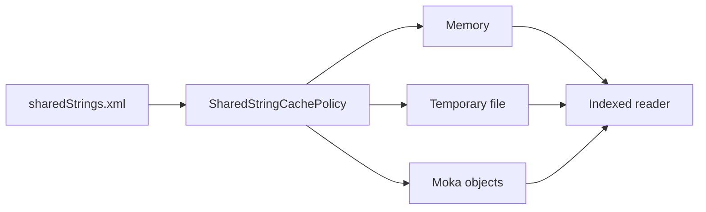

# easyexcel-cache

[简体中文](README.zh-CN.md)

Shared-string cache backends used by streaming spreadsheet readers.

> Release: 0.1.2 · Rust 1.88+ · Edition 2024 · Apache-2.0

## Overview

This crate is a published module in the EasyExcel-Rust workspace. It is intended for Rust developers who need its boundary, direct engine API or implementation details. Application code should normally consume the re-exported surface through the `easyexcel` facade.

## At a glance

```text
Input / public API -> easyexcel-cache -> typed model, stream, file or report
```

## Architecture



Dependency direction remains from the facade or format engines toward foundations; this crate never depends back on an application.

## Capability matrix

| Capability | Status | Details |
|:---|:---|:---|
| Memory cache | Available | Fast sequential write and immutable read view. |
| File cache | Available | Temporary-file storage for large shared-string tables. |
| Moka object cache | Available | No capacity, TTL or TTI eviction during cache lifetime. |

## Public API

| API | Purpose |
|:---|:---|
| `SharedStringCachePolicy` | Memory/file selection threshold. |
| `ReadCacheMode` | Auto, memory, file or Moka mode. |
| `SharedStringCacheWriter` | Sequential population. |
| `SharedStringCacheReader` | Concurrent indexed reads. |

The current `src/lib.rs` re-exports and their implementations are authoritative. This README does not present private implementation objects as stable API.

## Installation

```toml
[dependencies]
easyexcel-cache = "0.1.2"
```

If an application needs several EasyExcel engines, prefer a single `easyexcel = "0.1.2"` dependency and the `easyexcel::...` re-exports to prevent version drift.

## Basic usage

```rust
fn main() -> Result<(), Box<dyn std::error::Error>> {
use easyexcel_cache::{ReadCacheMode, create_cache};

let mut cache = create_cache(ReadCacheMode::Memory, 128)?;
cache.put("Alice".to_owned())?;
cache.put("Bob".to_owned())?;
let reader = cache.finish()?;
assert_eq!(reader.get(1)?, "Bob");
Ok(())
}
```

## Advanced usage

```rust
fn main() -> Result<(), Box<dyn std::error::Error>> {
use easyexcel_cache::{ReadCacheMode, SharedStringCachePolicy};

let policy = SharedStringCachePolicy::new(5_000_000);
assert_eq!(policy.select_mode(4_999_999), ReadCacheMode::Memory);
assert_eq!(policy.select_mode(5_000_000), ReadCacheMode::File);

let cache = policy.create_cache(8_000_000)?;
assert!(cache.is_empty());
Ok(())
}
```

## Errors and capability boundaries

- This cache stores decoded shared strings, not arbitrary workbooks or business objects.
- The Moka backend intentionally does not evict entries mid-read; ownership releases the whole cache at the end.

Resource limits, format loss and unsupported behavior must surface through typed errors, `Option`, warnings or conversion reports; silent guessing and downgrade are forbidden.

## Relationship to other crates


The diagram shows the public dependency direction, not that this crate depends on every foundation module. `Cargo.toml` is authoritative.

## Evidence map

| Claim | Source of truth |
|:---|:---|
| Package version, MSRV and dependencies | [`Cargo.toml`](Cargo.toml) |
| Public exports | [`src/lib.rs`](src/lib.rs) |
| Implementation behavior | `src/cache/` |
| Cross-format boundaries | [Workspace compatibility matrix](https://github.com/easy-4-rust/easyexcel-rust/blob/main/docs/compatibility.md) |

## Related links

- [Repository](https://github.com/easy-4-rust/easyexcel-rust)
- [API documentation](https://docs.rs/easyexcel-cache)
- [Compatibility matrix](https://github.com/easy-4-rust/easyexcel-rust/blob/main/docs/compatibility.md)
- [Changelog](https://github.com/easy-4-rust/easyexcel-rust/blob/main/CHANGELOG.md)
- [Chinese README](README.zh-CN.md)
