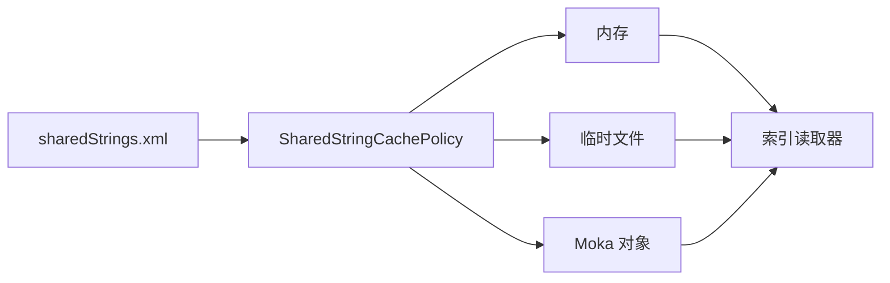

# easyexcel-cache

[English](README.md)

流式电子表格读取器使用的共享字符串缓存后端。

> 版本: 0.1.2 · Rust 1.88+ · Edition 2024 · Apache-2.0

## 概述

本 crate 是 EasyExcel-Rust Workspace 的正式发布模块。本文面向需要理解模块职责、直接调用底层 API 或维护格式引擎的 Rust 开发者。普通业务项目应优先通过 `easyexcel` 门面访问重导出的能力。

## 一览

```text
输入 / 公共 API -> easyexcel-cache -> 类型化模型、行流、文件或报告
```

## 架构



依赖方向必须保持从门面或格式引擎指向基础模块；本 crate 不反向依赖业务应用。

## 能力矩阵

| 能力 | 状态 | 说明 |
|:---|:---|:---|
| 内存缓存 | 可用 | 快速顺序写入与不可变读取视图。 |
| 文件缓存 | 可用 | 大型共享字符串表使用临时文件存储。 |
| Moka 对象缓存 | 可用 | 缓存生命周期内不配置容量、TTL 或 TTI 淘汰。 |

## 公共 API

| API | 用途 |
|:---|:---|
| `SharedStringCachePolicy` | 内存/文件选择阈值。 |
| `ReadCacheMode` | 自动、内存、文件或 Moka 模式。 |
| `SharedStringCacheWriter` | 顺序填充。 |
| `SharedStringCacheReader` | 并发索引读取。 |

API 的权威定义来自当前 `src/lib.rs` 重导出与对应实现；README 不把内部私有对象描述为稳定契约。

## 安装

```toml
[dependencies]
easyexcel-cache = "0.1.2"
```

如果项目同时使用多个 EasyExcel 引擎，请改为只依赖 `easyexcel = "0.1.2"`，并通过 `easyexcel::...` 使用，以避免版本漂移。

## 基础使用

```rust
fn main() -> Result<(), Box<dyn std::error::Error>> {
use easyexcel_cache::{ReadCacheMode, create_cache};

let mut cache = create_cache(ReadCacheMode::Memory, 128)?;
cache.put("Alice".to_owned())?;
cache.put("Bob".to_owned())?;
let reader = cache.finish()?;
assert_eq!(reader.get(1)?, "Bob");
Ok(())
}
```

## 进阶使用

```rust
fn main() -> Result<(), Box<dyn std::error::Error>> {
use easyexcel_cache::{ReadCacheMode, SharedStringCachePolicy};

let policy = SharedStringCachePolicy::new(5_000_000);
assert_eq!(policy.select_mode(4_999_999), ReadCacheMode::Memory);
assert_eq!(policy.select_mode(5_000_000), ReadCacheMode::File);

let cache = policy.create_cache(8_000_000)?;
assert!(cache.is_empty());
Ok(())
}
```

## 错误与能力边界

- 本缓存保存解码后的共享字符串，不缓存任意工作簿或业务对象。
- Moka 后端刻意不在读取过程中淘汰条目，结束时由所有权整体释放。

资源限制、格式损失或未支持能力必须通过类型化错误、`Option`、warning 或转换报告显式呈现，禁止静默猜测或降级。

## 依赖关系


该图表达公共依赖方向，不表示本 crate 必然依赖所有基础模块。实际依赖以 `Cargo.toml` 为准。

## 证据索引

| 声明 | 事实来源 |
|:---|:---|
| 包版本、MSRV 与依赖 | [`Cargo.toml`](Cargo.toml) |
| 公共重导出 | [`src/lib.rs`](src/lib.rs) |
| 实现行为 | `src/cache/` |
| 跨格式边界 | [Workspace 兼容性矩阵](https://github.com/easy-4-rust/easyexcel-rust/blob/main/docs/compatibility.md) |

## 相关链接

- [项目仓库](https://github.com/easy-4-rust/easyexcel-rust)
- [API 文档](https://docs.rs/easyexcel-cache)
- [兼容性矩阵](https://github.com/easy-4-rust/easyexcel-rust/blob/main/docs/compatibility.md)
- [变更日志](https://github.com/easy-4-rust/easyexcel-rust/blob/main/CHANGELOG.md)
- [英文 README](README.md)
