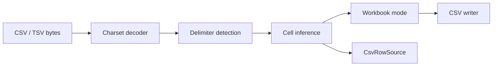

# easyexcel-csv

[简体中文](README.zh-CN.md)

> **文档说明**：easyexcel-csv 引擎层 crate 文档，面向贡献者与引擎实现者说明模块边界。
>
> **版本**：0.1.3
> **最后更新**：2026-08-11

CSV/TSV codec with charset handling, delimiter detection, type inference and incremental row streaming.

> Release: 0.1.3 · Rust 1.88+ · Edition 2024 · Apache-2.0

## Overview

This crate is independently published to support the EasyExcel-Rust internal dependency graph. Its README documents the engine boundary for contributors and engine implementors; application code should depend on `easyexcel` and use the matching `easyexcel::...` facade path.

## At a glance

```text
Application -> easyexcel:: facade -> easyexcel-csv internal engine -> typed result
```

## Architecture



Dependency direction remains from the facade or format engines toward foundations; this crate never depends back on an application.

## Format support matrix

Data source: [`docs/ARCHITECTURE.md` File Format Support](../../docs/ARCHITECTURE.md).

| Dimension | CSV (this crate) | Status |
|:---|:---|:---|
| Read (typed rows) | `csv` crate + `encoding_rs` charset decoder | stable |
| Read (dynamic / no-model) | Supported | stable |
| Read (event listener) | `CsvRowSource` incremental streaming | stable |
| Read (password-protected) | Not applicable to CSV | N/A |
| Write (typed rows) | `csv` crate encoder | stable |
| Write (with password) | Not applicable to CSV | N/A |
| Write (constant memory) | Row-level streaming via `CsvRecordWriter` | stable |
| Template fill | Not applicable to CSV | N/A |
| Merge cells | Not native CSV semantics | not supported |
| Column width | Not native CSV semantics | not supported |
| Row height | Not native CSV semantics | not supported |
| Styles (font / fill / alignment) | Not native CSV semantics | not supported |
| Comments / Notes | Not native CSV semantics | not supported |
| Hyperlinks | Not native CSV semantics | not supported |
| Images | Not native CSV semantics | not supported |
| Formulas | Not native CSV semantics | not supported |
| Auto-filter | Not native CSV semantics | not supported |

## Capabilities and boundaries

### What this crate can do

- Read and write one delimited sheet per CSV/TSV file via `read_csv`/`write_csv`.
- Stream rows incrementally through `CsvRowSource` without reading the entire file.
- Detect delimiter, handle BOM markers and decode multiple charsets via `CsvCharset` (Java-style names).
- Infer cell types (numeric, date, text) with opt-out via `CsvReadOptions.infer_types`.
- Write with configurable delimiter, newline policy and encoding via `CsvWriteOptions`.

### What this crate cannot do

- Multi-sheet workbooks: CSV maps one sheet at a time; callers must select a sheet when exporting.
- Styles, formulas, merge cells, images, comments, hyperlinks and auto-filters: these are not native CSV semantics.
- Password protection: not applicable to the CSV format.
- Full-file `read_to_end`: the streaming `CsvRowSource` does not buffer the entire file.

## Round-trip fidelity

CSV is a lossy projection of spreadsheet data. A round-trip (read then write) preserves:

- Cell values (text, numeric, date) with charset fidelity
- Delimiter and newline policy when configured consistently

The following are lost during CSV export: styles, formulas, merge cells, multiple sheets, images, comments, hyperlinks, row/column dimensions and auto-filters. These losses are inherent to the CSV format, not implementation gaps.

## Large file / streaming / memory

| Mode | Memory complexity | Applicability |
|:---|:---|:---|
| Workbook mode (`read_csv`) | `O(sheet)` | Small to medium files |
| Streaming mode (`CsvRowSource`) | `O(batch)` | Large file batch import |
| Write (`write_csv` / `CsvRecordWriter`) | `O(row)` | All writes are row-level streaming |

CSV naturally supports row-level streaming with no temporary file overhead. The `CsvRowSource` incremental source avoids full-file materialization.

## Format safety

- CSV is a plain-text format with no container, encryption or embedded binary; ZIP bomb and entity expansion are not applicable.
- Charset decoding uses `encoding_rs` with bounded buffer allocation.
- Delimiter detection reads a bounded prefix of the input.
- Resource limits from `easyexcel-io::ResourceLimits` apply when invoked through the facade.

## Public API

| API | Purpose |
|:---|:---|
| `CsvReadOptions`, `CsvWriteOptions` | Delimiter, inference and newline policy. |
| `read_csv`, `write_csv` | Workbook-oriented codec. |
| `CsvRowSource` | One-pass incremental source. |
| `CsvCharset` | Java-style charset name. |

The current `src/lib.rs` re-exports and their implementations are authoritative. This README does not present private implementation objects as stable API.

## Installation

```toml
[dependencies]
easyexcel = "0.1.3"
```

`easyexcel-csv` remains independently publishable for the internal dependency graph. Applications should use the stable `easyexcel::csv` facade.

## Basic usage

```rust
fn main() -> Result<(), Box<dyn std::error::Error>> {
use easyexcel::csv::{CsvReadOptions, CsvWriteOptions, read_csv, write_csv};

let input = "id,name\n1,Alice\n2,Bob\n";
let workbook = read_csv(input.as_bytes(), &CsvReadOptions::default())?;

let mut output = Vec::new();
write_csv(
    &workbook,
    0,
    &mut output,
    &CsvWriteOptions::default(),
)?;
assert!(String::from_utf8(output)?.contains("Alice"));
Ok(())
}
```

## Advanced usage

```rust
fn main() -> Result<(), Box<dyn std::error::Error>> {
use easyexcel::csv::{CsvCharset, CsvReadOptions, CsvRowSource};

let options = CsvReadOptions {
    delimiter: Some(b';'),
    infer_types: false,
    sheet_name: "Imported".to_owned(),
};
let source = CsvRowSource::new(
    "code;phone\n007;01012345678\n".as_bytes(),
    options,
    CsvCharset::utf8(),
);
// Call RowSource::stream with an easyexcel::io::RowSink implementation.
Ok(())
}
```

## Errors and capability boundaries

- Workbook-mode CSV maps one sheet at a time; callers must select a sheet when exporting a multi-sheet workbook.
- Type inference can be disabled when identifiers such as leading-zero codes must remain text.

Resource limits, format loss and unsupported behavior must surface through typed errors, `Option`, warnings or conversion reports; silent guessing and downgrade are forbidden.

## Relationship to other crates


The diagram shows the public dependency direction, not that this crate depends on every foundation module. `Cargo.toml` is authoritative.

## Evidence map

| Claim | Source of truth |
|:---|:---|
| Package version, MSRV and dependencies | [`Cargo.toml`](Cargo.toml) |
| Public exports | [`src/lib.rs`](src/lib.rs) |
| Implementation behavior | `src/csv/` |
| Format support matrix | [ARCHITECTURE.md](../../docs/ARCHITECTURE.md) |
| Cross-format boundaries | [Workspace compatibility matrix](https://github.com/easy-4-rust/easyexcel-rust/blob/main/docs/compatibility.md) |

## Related links

- [Repository](https://github.com/easy-4-rust/easyexcel-rust)
- [API documentation](https://docs.rs/easyexcel-csv)
- [Compatibility matrix](https://github.com/easy-4-rust/easyexcel-rust/blob/main/docs/compatibility.md)
- [Changelog](https://github.com/easy-4-rust/easyexcel-rust/blob/main/CHANGELOG.md)
- [Chinese README](README.zh-CN.md)

---

**文档版本**：V1.0.0
**最后更新**：2026-08-11
**文档状态**：已评审
