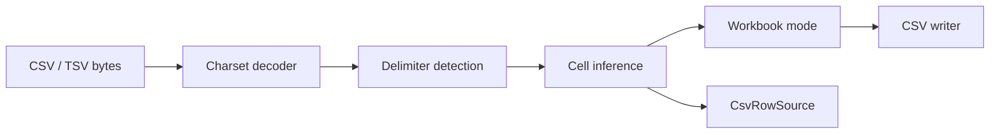

# easyexcel-csv

[简体中文](README.zh-CN.md)

CSV/TSV codec with charset handling, delimiter detection, type inference and incremental row streaming.

> Release: 0.1.2 · Rust 1.88+ · Edition 2024 · Apache-2.0

## Overview

This crate is a published module in the EasyExcel-Rust workspace. It is intended for Rust developers who need its boundary, direct engine API or implementation details. Application code should normally consume the re-exported surface through the `easyexcel` facade.

## At a glance

```text
Input / public API -> easyexcel-csv -> typed model, stream, file or report
```

## Architecture



Dependency direction remains from the facade or format engines toward foundations; this crate never depends back on an application.

## Capability matrix

| Capability | Status | Details |
|:---|:---|:---|
| Workbook codec | Available | Read/write one delimited sheet. |
| Streaming source | Available | Incremental `CsvRowSource`; no full-file `read_to_end`. |
| Spreadsheet-only features | Not representable | Styles, formulas, merges and multiple sheets are not native CSV semantics. |

## Public API

| API | Purpose |
|:---|:---|
| `CsvReadOptions`, `CsvWriteOptions` | Delimiter, inference and newline policy. |
| `read_csv`, `write_csv` | Workbook-oriented codec. |
| `CsvRowSource` | One-pass incremental source. |
| `CsvCharset` | Java-style charset name. |

The current `src/lib.rs` re-exports and their implementations are authoritative. This README does not present private implementation objects as stable API.

## Installation

```toml
[dependencies]
easyexcel-csv = "0.1.2"
```

If an application needs several EasyExcel engines, prefer a single `easyexcel = "0.1.2"` dependency and the `easyexcel::...` re-exports to prevent version drift.

## Basic usage

```rust
fn main() -> Result<(), Box<dyn std::error::Error>> {
use easyexcel_csv::{CsvReadOptions, CsvWriteOptions, read_csv, write_csv};

let input = "id,name\n1,Alice\n2,Bob\n";
let workbook = read_csv(input.as_bytes(), &CsvReadOptions::default())?;

let mut output = Vec::new();
write_csv(
    &workbook,
    0,
    &mut output,
    &CsvWriteOptions::default(),
)?;
assert!(String::from_utf8(output)?.contains("Alice"));
Ok(())
}
```

## Advanced usage

```rust
fn main() -> Result<(), Box<dyn std::error::Error>> {
use easyexcel_csv::{CsvCharset, CsvReadOptions, CsvRowSource};

let options = CsvReadOptions {
    delimiter: Some(b';'),
    infer_types: false,
    sheet_name: "Imported".to_owned(),
};
let source = CsvRowSource::new(
    "code;phone\n007;01012345678\n".as_bytes(),
    options,
    CsvCharset::utf8(),
);
// Call RowSource::stream with an easyexcel_io::RowSink implementation.
Ok(())
}
```

## Errors and capability boundaries

- Workbook-mode CSV maps one sheet at a time; callers must select a sheet when exporting a multi-sheet workbook.
- Type inference can be disabled when identifiers such as leading-zero codes must remain text.

Resource limits, format loss and unsupported behavior must surface through typed errors, `Option`, warnings or conversion reports; silent guessing and downgrade are forbidden.

## Relationship to other crates


The diagram shows the public dependency direction, not that this crate depends on every foundation module. `Cargo.toml` is authoritative.

## Evidence map

| Claim | Source of truth |
|:---|:---|
| Package version, MSRV and dependencies | [`Cargo.toml`](Cargo.toml) |
| Public exports | [`src/lib.rs`](src/lib.rs) |
| Implementation behavior | `src/csv/` |
| Cross-format boundaries | [Workspace compatibility matrix](https://github.com/easy-4-rust/easyexcel-rust/blob/main/docs/compatibility.md) |

## Related links

- [Repository](https://github.com/easy-4-rust/easyexcel-rust)
- [API documentation](https://docs.rs/easyexcel-csv)
- [Compatibility matrix](https://github.com/easy-4-rust/easyexcel-rust/blob/main/docs/compatibility.md)
- [Changelog](https://github.com/easy-4-rust/easyexcel-rust/blob/main/CHANGELOG.md)
- [Chinese README](README.zh-CN.md)
