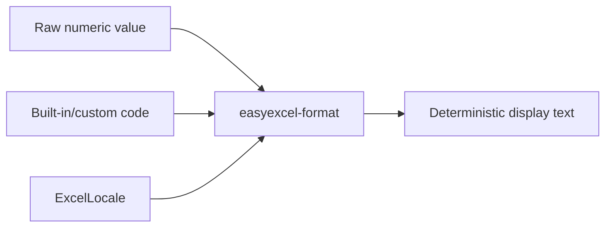

# easyexcel-format

[简体中文](README.zh-CN.md)

Java EasyExcel-compatible number, date and display formatting algorithms.

> Release: 0.1.3 · Rust 1.88+ · Edition 2024 · Apache-2.0

## Overview

This crate is independently published to support the EasyExcel-Rust internal dependency graph. Its README documents the engine boundary for contributors and engine implementors; application code should depend on `easyexcel` and use the matching `easyexcel::...` facade path.

## At a glance

```text
Application -> easyexcel:: facade -> easyexcel-format internal engine -> typed result
```

## Architecture



Dependency direction remains from the facade or format engines toward foundations; this crate never depends back on an application.

## Capability matrix

| Capability | Status | Details |
|:---|:---|:---|
| Built-in formats | Available | EasyExcel/POI priority with ECMA-376 fallback. |
| Locale-aware rendering | Available | Java/POSIX/BCP-47 locale names. |
| Container parsing | Out of scope | Consumes values and format codes only. |

## Public API

| API | Purpose |
|:---|:---|
| `ExcelLocale` | Locale resolution and formatter data. |
| `format_with_code` | Render a numeric value with an Excel format code. |
| `builtin_format_code` | Resolve standard format identifiers. |
| `NumberRoundingMode` | Java-compatible rounding metadata. |

The current `src/lib.rs` re-exports and their implementations are authoritative. This README does not present private implementation objects as stable API.

## Installation

```toml
[dependencies]
easyexcel = "0.1.3"
```

`easyexcel-format` is an internal display-format engine. Applications should use the stable `easyexcel::format` facade.

## Basic usage

```rust
fn main() -> Result<(), Box<dyn std::error::Error>> {
use easyexcel::format::{ExcelLocale, format_with_code};

let locale = ExcelLocale::from_name("zh-CN").expect("supported locale");
let displayed = format_with_code(
    45_292.0,
    "yyyy-mm-dd",
    false,
    &locale.formatter(),
);
assert!(displayed.is_some());
Ok(())
}
```

## Advanced usage

```rust
fn main() -> Result<(), Box<dyn std::error::Error>> {
use easyexcel::format::{
    builtin_format_code, is_date_format_code, resolve_builtin_format_code,
};

assert_eq!(builtin_format_code(0), Some("General"));
assert!(resolve_builtin_format_code(14).is_some());
assert!(is_date_format_code("yyyy-mm-dd"));
Ok(())
}
```

## Errors and capability boundaries

- Formatting follows deterministic spreadsheet display semantics; it does not retain workbook styles or read ZIP/BIFF containers.
- Non-finite values and unsupported format patterns are handled through explicit result/option paths rather than guessed output.

Resource limits, format loss and unsupported behavior must surface through typed errors, `Option`, warnings or conversion reports; silent guessing and downgrade are forbidden.

## Relationship to other crates


The diagram shows the public dependency direction, not that this crate depends on every foundation module. `Cargo.toml` is authoritative.

## Evidence map

| Claim | Source of truth |
|:---|:---|
| Package version, MSRV and dependencies | [`Cargo.toml`](Cargo.toml) |
| Public exports | [`src/lib.rs`](src/lib.rs) |
| Implementation behavior | `src/format/` |
| Cross-format boundaries | [Workspace compatibility matrix](https://github.com/easy-4-rust/easyexcel-rust/blob/main/docs/compatibility.md) |

## Related links

- [Repository](https://github.com/easy-4-rust/easyexcel-rust)
- [API documentation](https://docs.rs/easyexcel-format)
- [Compatibility matrix](https://github.com/easy-4-rust/easyexcel-rust/blob/main/docs/compatibility.md)
- [Changelog](https://github.com/easy-4-rust/easyexcel-rust/blob/main/CHANGELOG.md)
- [Chinese README](README.zh-CN.md)
