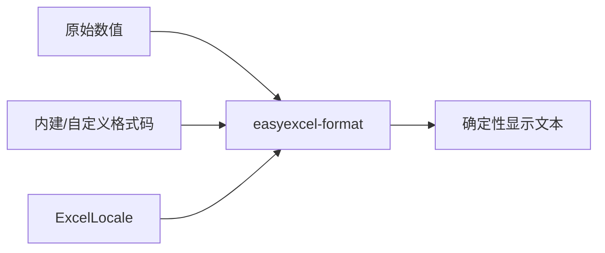

# easyexcel-format

[English](README.md)

> **文档说明**：面向贡献者和引擎实现者说明兼容 Java 语义的数字、日期与显示格式引擎。业务应用应依赖 `easyexcel` 门面。
>
> **版本**：0.1.3
> **最后更新**：2026-08-11

兼容 Java EasyExcel 语义的数字、日期与显示格式算法。

> 版本: 0.1.3 · Rust 1.88+ · Edition 2024 · Apache-2.0

## 概述

本 crate 独立发布是为了支撑 EasyExcel-Rust 内部依赖图。README 面向贡献者和引擎实现者说明模块边界；业务应用应只依赖 `easyexcel`，并使用对应的 `easyexcel::...` 门面路径。

## 一览

```text
业务应用 -> easyexcel:: 门面 -> easyexcel-format 内部引擎 -> 类型化结果
```

## 架构



依赖方向必须保持从门面或格式引擎指向基础模块；本 crate 不反向依赖业务应用。

## 能力与边界

| 领域 | 能做什么 | 不能做什么 |
|:---|:---|:---|
| 数字格式化 | 使用内建 Excel 格式码渲染数字（General、整数、小数、科学计数、百分比、分数）。 | 将数字字符串解析回数值。 |
| 日期格式化 | 使用 `yyyy`、`mm`、`dd`、`hh`、`ss` 模式渲染 Excel 序列日期。 | 从原始文本解析日期字符串。 |
| 区域支持 | 解析 `zh-CN`、`en-US`、`POSIX` 和 BCP-47 locale 名称以获取格式化数据。 | 提供完整 ICU 级别的区域排序或翻译。 |
| 自定义格式码 | 编译并应用用户定义的 Excel 格式码，支持颜色和条件段。 | 对单元格求值条件格式规则。 |
| 舍入 | Java 兼容的 `NumberRoundingMode`，支持可配置精度。 | 任意精度区间算术。 |
| 容器 I/O | 不适用。 | 读写 XLSX/XLS/CSV 容器（委托给格式 crate）。 |

## 能力矩阵

| 能力 | 状态 | 说明 |
|:---|:---|:---|
| 内建格式 | 可用 | EasyExcel/POI 优先级并回退 ECMA-376。 |
| 区域化渲染 | 可用 | 支持 Java、POSIX 与 BCP-47 locale 名称。 |
| 容器解析 | 范围外 | 只消费值与格式代码。 |

## 公共 API

| API | 用途 |
|:---|:---|
| `ExcelLocale` | 区域名称解析与格式化数据。 |
| `format_with_code` | 按 Excel 格式代码渲染数字。 |
| `builtin_format_code` | 解析标准格式编号。 |
| `NumberRoundingMode` | Java 兼容舍入元数据。 |
| `DataFormatter` | 用于重复单元格渲染的有状态格式化器。 |
| `compile_format_code` | 预编译格式码以供重复使用。 |
| `is_date_format_code` | 检测格式码是否为日期类。 |
| `format_raw_cell_contents` | 自动类型检测渲染原始单元格值。 |

API 的权威定义来自当前 `src/lib.rs` 重导出与对应实现；README 不把内部私有对象描述为稳定契约。

## 安装

```toml
[dependencies]
easyexcel = "0.1.3"
```

`easyexcel-format` 是内部显示格式引擎。业务应用应统一使用稳定的 `easyexcel::format` 门面。

| 项目 | 值 |
|:---|:---|
| MSRV | Rust 1.88 |
| Edition | 2024 |
| Resolver | 3 |
| License | Apache-2.0 |

## 基础使用

```rust
fn main() -> Result<(), Box<dyn std::error::Error>> {
use easyexcel::format::{ExcelLocale, format_with_code};

let locale = ExcelLocale::from_name("zh-CN").expect("supported locale");
let displayed = format_with_code(
    45_292.0,
    "yyyy-mm-dd",
    false,
    &locale.formatter(),
);
assert!(displayed.is_some());
Ok(())
}
```

## 进阶使用

```rust
fn main() -> Result<(), Box<dyn std::error::Error>> {
use easyexcel::format::{
    builtin_format_code, is_date_format_code, resolve_builtin_format_code,
};

assert_eq!(builtin_format_code(0), Some("General"));
assert!(resolve_builtin_format_code(14).is_some());
assert!(is_date_format_code("yyyy-mm-dd"));
Ok(())
}
```

## 区域化格式示例

```rust
fn main() -> Result<(), Box<dyn std::error::Error>> {
use easyexcel::format::{ExcelLocale, format_with_code};

let locale_us = ExcelLocale::from_name("en-US").expect("supported locale");
let locale_cn = ExcelLocale::from_name("zh-CN").expect("supported locale");

let value = 1234567.89;
let us_display = format_with_code(value, "#,##0.00", false, &locale_us.formatter());
let cn_display = format_with_code(value, "#,##0.00", false, &locale_cn.formatter());

assert!(us_display.is_some());
assert!(cn_display.is_some());
Ok(())
}
```

## 错误与能力边界

- 格式化遵循确定性的电子表格显示语义，不保存工作簿样式，也不读取 ZIP/BIFF 容器。
- 非有限值与不支持的格式模式通过明确的结果路径处理，不猜测输出。

资源限制、格式损失或未支持能力必须通过类型化错误、`Option`、warning 或转换报告显式呈现，禁止静默猜测或降级。

## 依赖关系


该图表达公共依赖方向，不表示本 crate 必然依赖所有基础模块。实际依赖以 `Cargo.toml` 为准。

## 证据索引

| 声明 | 事实来源 |
|:---|:---|
| 包版本、MSRV 与依赖 | [`Cargo.toml`](Cargo.toml) |
| 公共重导出 | [`src/lib.rs`](src/lib.rs) |
| 实现行为 | `src/format/` |
| 跨格式边界 | [Workspace 兼容性矩阵](https://github.com/easy-4-rust/easyexcel-rust/blob/main/docs/compatibility.md) |

## 相关链接

- [项目仓库](https://github.com/easy-4-rust/easyexcel-rust)
- [API 文档](https://docs.rs/easyexcel-format)
- [兼容性矩阵](https://github.com/easy-4-rust/easyexcel-rust/blob/main/docs/compatibility.md)
- [变更日志](https://github.com/easy-4-rust/easyexcel-rust/blob/main/CHANGELOG.md)
- [英文 README](README.md)

---

**文档版本**：V1.0.0
**创建日期**：2026-08-11
**最后更新**：2026-08-11
**文档状态**：待评审
