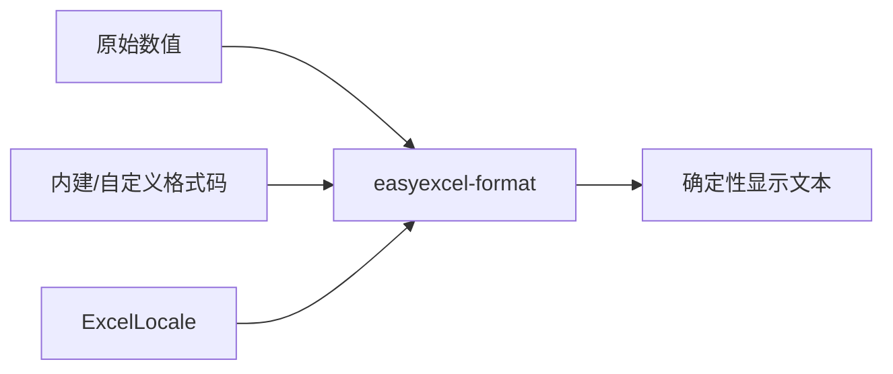

# easyexcel-format

[English](README.md)

兼容 Java EasyExcel 语义的数字、日期与显示格式算法。

> 版本: 0.1.2 · Rust 1.88+ · Edition 2024 · Apache-2.0

## 概述

本 crate 是 EasyExcel-Rust Workspace 的正式发布模块。本文面向需要理解模块职责、直接调用底层 API 或维护格式引擎的 Rust 开发者。普通业务项目应优先通过 `easyexcel` 门面访问重导出的能力。

## 一览

```text
输入 / 公共 API -> easyexcel-format -> 类型化模型、行流、文件或报告
```

## 架构



依赖方向必须保持从门面或格式引擎指向基础模块；本 crate 不反向依赖业务应用。

## 能力矩阵

| 能力 | 状态 | 说明 |
|:---|:---|:---|
| 内建格式 | 可用 | EasyExcel/POI 优先级并回退 ECMA-376。 |
| 区域化渲染 | 可用 | 支持 Java、POSIX 与 BCP-47 locale 名称。 |
| 容器解析 | 范围外 | 只消费值与格式代码。 |

## 公共 API

| API | 用途 |
|:---|:---|
| `ExcelLocale` | 区域名称解析与格式化数据。 |
| `format_with_code` | 按 Excel 格式代码渲染数字。 |
| `builtin_format_code` | 解析标准格式编号。 |
| `NumberRoundingMode` | Java 兼容舍入元数据。 |

API 的权威定义来自当前 `src/lib.rs` 重导出与对应实现；README 不把内部私有对象描述为稳定契约。

## 安装

```toml
[dependencies]
easyexcel-format = "0.1.2"
```

如果项目同时使用多个 EasyExcel 引擎，请改为只依赖 `easyexcel = "0.1.2"`，并通过 `easyexcel::...` 使用，以避免版本漂移。

## 基础使用

```rust
fn main() -> Result<(), Box<dyn std::error::Error>> {
use easyexcel_format::{ExcelLocale, format_with_code};

let locale = ExcelLocale::from_name("zh-CN").expect("supported locale");
let displayed = format_with_code(
    45_292.0,
    "yyyy-mm-dd",
    false,
    &locale.formatter(),
);
assert!(displayed.is_some());
Ok(())
}
```

## 进阶使用

```rust
fn main() -> Result<(), Box<dyn std::error::Error>> {
use easyexcel_format::{
    builtin_format_code, is_date_format_code, resolve_builtin_format_code,
};

assert_eq!(builtin_format_code(0), Some("General"));
assert!(resolve_builtin_format_code(14).is_some());
assert!(is_date_format_code("yyyy-mm-dd"));
Ok(())
}
```

## 错误与能力边界

- 格式化遵循确定性的电子表格显示语义，不保存工作簿样式，也不读取 ZIP/BIFF 容器。
- 非有限值与不支持的格式模式通过明确的结果路径处理，不猜测输出。

资源限制、格式损失或未支持能力必须通过类型化错误、`Option`、warning 或转换报告显式呈现，禁止静默猜测或降级。

## 依赖关系


该图表达公共依赖方向，不表示本 crate 必然依赖所有基础模块。实际依赖以 `Cargo.toml` 为准。

## 证据索引

| 声明 | 事实来源 |
|:---|:---|
| 包版本、MSRV 与依赖 | [`Cargo.toml`](Cargo.toml) |
| 公共重导出 | [`src/lib.rs`](src/lib.rs) |
| 实现行为 | `src/format/` |
| 跨格式边界 | [Workspace 兼容性矩阵](https://github.com/easy-4-rust/easyexcel-rust/blob/main/docs/compatibility.md) |

## 相关链接

- [项目仓库](https://github.com/easy-4-rust/easyexcel-rust)
- [API 文档](https://docs.rs/easyexcel-format)
- [兼容性矩阵](https://github.com/easy-4-rust/easyexcel-rust/blob/main/docs/compatibility.md)
- [变更日志](https://github.com/easy-4-rust/easyexcel-rust/blob/main/CHANGELOG.md)
- [英文 README](README.md)
