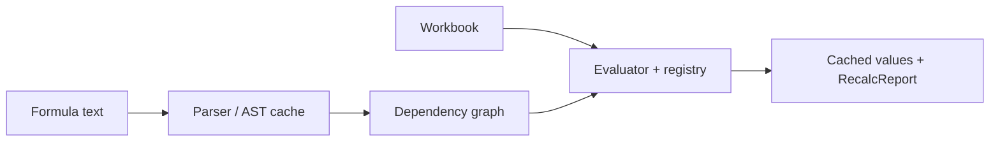

# easyexcel-formula

[简体中文](README.zh-CN.md)

Offline Excel formula parser, evaluator, dependency graph and recalculation engine.

> Release: 0.1.3 · Rust 1.88+ · Edition 2024 · Apache-2.0

## Overview

This crate is independently published to support the EasyExcel-Rust internal dependency graph. Its README documents the engine boundary for contributors and engine implementors; application code should depend on `easyexcel` and use the matching `easyexcel::...` facade path.

## At a glance

```text
Application -> easyexcel:: facade -> easyexcel-formula internal engine -> typed result
```

## Architecture



Dependency direction remains from the facade or format engines toward foundations; this crate never depends back on an application.

## Capability matrix

| Capability | Status | Details |
|:---|:---|:---|
| Parsing and AST | Available | Cell/range references, functions and expressions. |
| Workbook recalculation | Available | Dependency ordering, cached-value updates and circular-reference reporting. |
| External-data functions | Unsupported | Cube, Web, RTD, pivot-host and service-backed functions return explicit errors. |

## Public API

| API | Purpose |
|:---|:---|
| `parse`, `parse_detailed` | Formula text to AST. |
| `Engine::eval_formula` | Evaluate one formula in workbook context. |
| `Engine::recalc` | Recalculate formula cells and update caches. |
| `Value`, `Array`, `CellRef` | Evaluation value and reference types. |

The current `src/lib.rs` re-exports and their implementations are authoritative. This README does not present private implementation objects as stable API.

## Installation

```toml
[dependencies]
easyexcel = "0.1.3"
```

`easyexcel-formula` is an internal calculation engine. Applications should use `easyexcel::formula` together with `easyexcel::model`.

## Basic usage

```rust
fn main() -> Result<(), Box<dyn std::error::Error>> {
use easyexcel::formula::{CellRef, Engine, Value};
use easyexcel::model::Workbook;

let workbook = Workbook::new();
let mut engine = Engine::new();
let value = engine.eval_formula(
    &workbook,
    CellRef { sheet: 0, row: 0, col: 0 },
    "=SUM(1,2,3)",
);
assert_eq!(value, Value::Number(6.0));
Ok(())
}
```

## Advanced usage

```rust
fn main() -> Result<(), Box<dyn std::error::Error>> {
use easyexcel::formula::Engine;
use easyexcel::model::{Cell, CellValue, Workbook};

let mut workbook = Workbook::new();
workbook.sheets[0].set(
    0,
    0,
    Cell::Formula {
        expr: "1+2".to_owned(),
        cached: CellValue::Empty,
    },
);
let report = Engine::new().recalc(&mut workbook);
println!("recalculated: {}", report.evaluated);
Ok(())
}
```

## Errors and capability boundaries

- The engine is offline and intentionally cannot compute functions requiring network services, OLAP connections, real-time data or host-application state.
- Function coverage is explicit; unsupported functions must not be described as complete Excel parity.

Resource limits, format loss and unsupported behavior must surface through typed errors, `Option`, warnings or conversion reports; silent guessing and downgrade are forbidden.

## Relationship to other crates


The diagram shows the public dependency direction, not that this crate depends on every foundation module. `Cargo.toml` is authoritative.

## Evidence map

| Claim | Source of truth |
|:---|:---|
| Package version, MSRV and dependencies | [`Cargo.toml`](Cargo.toml) |
| Public exports | [`src/lib.rs`](src/lib.rs) |
| Implementation behavior | `src/formula/` |
| Cross-format boundaries | [Workspace compatibility matrix](https://github.com/easy-4-rust/easyexcel-rust/blob/main/docs/compatibility.md) |

## Related links

- [Repository](https://github.com/easy-4-rust/easyexcel-rust)
- [API documentation](https://docs.rs/easyexcel-formula)
- [Compatibility matrix](https://github.com/easy-4-rust/easyexcel-rust/blob/main/docs/compatibility.md)
- [Changelog](https://github.com/easy-4-rust/easyexcel-rust/blob/main/CHANGELOG.md)
- [Chinese README](README.zh-CN.md)
