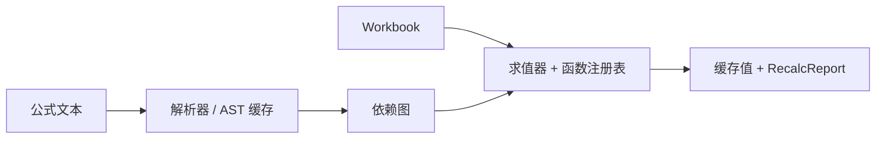

# easyexcel-formula

[English](README.md)

离线 Excel 公式解析、求值、依赖图与重算引擎。

> 版本: 0.1.3 · Rust 1.88+ · Edition 2024 · Apache-2.0

## 概述

本 crate 独立发布是为了支撑 EasyExcel-Rust 内部依赖图。README 面向贡献者和引擎实现者说明模块边界；业务应用应只依赖 `easyexcel`，并使用对应的 `easyexcel::...` 门面路径。

## 一览

```text
业务应用 -> easyexcel:: 门面 -> easyexcel-formula 内部引擎 -> 类型化结果
```

## 架构



依赖方向必须保持从门面或格式引擎指向基础模块；本 crate 不反向依赖业务应用。

## 能力矩阵

| 能力 | 状态 | 说明 |
|:---|:---|:---|
| 解析与 AST | 可用 | 单元格/范围引用、函数与表达式。 |
| 工作簿重算 | 可用 | 依赖排序、缓存值更新与循环引用报告。 |
| 外部数据函数 | 不支持 | Cube、Web、RTD、Pivot 宿主及服务函数返回明确错误。 |

## 公共 API

| API | 用途 |
|:---|:---|
| `parse`、`parse_detailed` | 公式文本转 AST。 |
| `Engine::eval_formula` | 在工作簿上下文中计算单条公式。 |
| `Engine::recalc` | 重算公式单元格并更新缓存。 |
| `Value`、`Array`、`CellRef` | 求值结果与引用类型。 |

API 的权威定义来自当前 `src/lib.rs` 重导出与对应实现；README 不把内部私有对象描述为稳定契约。

## 安装

```toml
[dependencies]
easyexcel = "0.1.3"
```

`easyexcel-formula` 是内部公式计算引擎。业务应用应组合使用 `easyexcel::formula` 与 `easyexcel::model`。

## 基础使用

```rust
fn main() -> Result<(), Box<dyn std::error::Error>> {
use easyexcel::formula::{CellRef, Engine, Value};
use easyexcel::model::Workbook;

let workbook = Workbook::new();
let mut engine = Engine::new();
let value = engine.eval_formula(
    &workbook,
    CellRef { sheet: 0, row: 0, col: 0 },
    "=SUM(1,2,3)",
);
assert_eq!(value, Value::Number(6.0));
Ok(())
}
```

## 进阶使用

```rust
fn main() -> Result<(), Box<dyn std::error::Error>> {
use easyexcel::formula::Engine;
use easyexcel::model::{Cell, CellValue, Workbook};

let mut workbook = Workbook::new();
workbook.sheets[0].set(
    0,
    0,
    Cell::Formula {
        expr: "1+2".to_owned(),
        cached: CellValue::Empty,
    },
);
let report = Engine::new().recalc(&mut workbook);
println!("recalculated: {}", report.evaluated);
Ok(())
}
```

## 错误与能力边界

- 本引擎离线运行，刻意不计算依赖网络服务、OLAP 连接、实时数据或宿主应用状态的函数。
- 函数覆盖范围是显式的，不得把未支持函数描述为完整 Excel 对等。

资源限制、格式损失或未支持能力必须通过类型化错误、`Option`、warning 或转换报告显式呈现，禁止静默猜测或降级。

## 依赖关系


该图表达公共依赖方向，不表示本 crate 必然依赖所有基础模块。实际依赖以 `Cargo.toml` 为准。

## 证据索引

| 声明 | 事实来源 |
|:---|:---|
| 包版本、MSRV 与依赖 | [`Cargo.toml`](Cargo.toml) |
| 公共重导出 | [`src/lib.rs`](src/lib.rs) |
| 实现行为 | `src/formula/` |
| 跨格式边界 | [Workspace 兼容性矩阵](https://github.com/easy-4-rust/easyexcel-rust/blob/main/docs/compatibility.md) |

## 相关链接

- [项目仓库](https://github.com/easy-4-rust/easyexcel-rust)
- [API 文档](https://docs.rs/easyexcel-formula)
- [兼容性矩阵](https://github.com/easy-4-rust/easyexcel-rust/blob/main/docs/compatibility.md)
- [变更日志](https://github.com/easy-4-rust/easyexcel-rust/blob/main/CHANGELOG.md)
- [英文 README](README.md)
