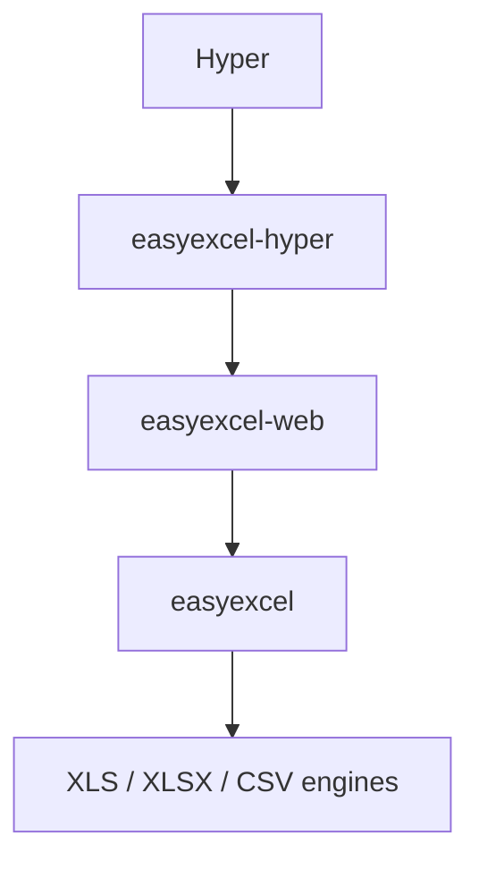

# easyexcel-hyper

[简体中文](README.zh-CN.md)

Native EasyExcel request extraction and response adapter for Hyper.

> Release: 0.1.2 · Rust 1.88+ · Edition 2024 · Apache-2.0

## Overview

`easyexcel-hyper` only bridges Hyper transport types to `easyexcel-web`. Upload spooling, resource limits, row-stream backpressure, cancellation, timeouts, temporary-file cleanup and stable errors remain in the shared runtime, preventing framework-specific semantic drift.

Native integration: explicit request bridge and `Response<ResponseBody>` conversion. Runtime injection: cloned `ExcelWebRuntime` in the service.

## At a glance

```text
HTTP request -> easyexcel-hyper -> easyexcel-web -> typed rows / streamed response
```

## Architecture


The adapter does not reimplement spreadsheet parsing, writing or resource policy. Business rows are consumed through a bounded channel and downloads are exposed to Hyper as an asynchronous file stream.

## Capability matrix

| Capability | Status | Implementation |
|:---|:---|:---|
| `ExcelRequest<T>` | Available | Native Hyper extraction with a typed, backpressured row stream. |
| `ExcelResponse<T>` | Available | Generates a controlled file before committing headers, then streams it asynchronously. |
| Limits and concurrency | Shared | `ExcelWebPolicy` + `ExcelWebRuntime` |
| Error protocol | Stable | `ExcelHyperError` + `ExcelProblemDetails` |
| TUI / HTML form | Out of scope | Owned by the application or examples. |

## Installation

```toml
[dependencies]
easyexcel = "0.1.2"
easyexcel-hyper = "0.1.2"
```

`easyexcel` provides `ExcelRow`, `Format` and typed spreadsheet semantics; this adapter provides Hyper transport integration. Keep both on the same release line.

## Define the row model

```rust
use easyexcel::ExcelRow;

#[derive(Debug, ExcelRow)]
struct ReportRow {
    #[excel(name = "Name")]
    name: String,

    #[excel(name = "Value", number_format = "0")]
    value: i64,
}

fn report_rows() -> impl Iterator<Item = ReportRow> {
    (0..10).map(|value| ReportRow {
        name: format!("row-{value}"),
        value,
    })
}
```

## Streaming download

```rust
use easyexcel::io::Format;
use easyexcel_hyper::{
    ExcelHyperError, ExcelResponse, ExcelWebRuntime, ResponseBody,
};
use http::Response;

async fn download(
    runtime: &ExcelWebRuntime,
) -> Response<ResponseBody> {
    ExcelResponse::prepare(
        report_rows(),
        Format::Xlsx,
        "report.xlsx",
        "Data",
        runtime.generated_context(),
    )
    .await
    .map_or_else(ExcelHyperError::into_response, ExcelResponse::into_response)
}
```

`ExcelResponse::prepare` completes generation and limit checks before returning a Hyper response. The response body then reads the temporary file asynchronously instead of copying the complete file into memory.

## Backpressured upload

```rust
use easyexcel_hyper::{ExcelHyperError, ExcelRequest, ExcelWebRuntime};
use hyper::body::Incoming;
use http::Request;

async fn upload(
    request: Request<Incoming>,
    runtime: &ExcelWebRuntime,
) -> Result<u64, ExcelHyperError> {
    let request = ExcelRequest::<ReportRow>::from_request(request, runtime).await?;
    let request_id = request.request_id().to_owned();
    let mut rows = request.into_rows();
    let mut count = 0_u64;
    while let Some(row) = rows.next_row().await {
        row.map_err(|error| ExcelHyperError::new(error, &request_id))?;
        count += 1;
    }
    Ok(count)
}
```

Uploads must provide `x-excel-file-name`, `Content-Disposition` or a recognizable `Content-Type`. Optional `x-request-id` is propagated into tracing and error responses.

## Runtime wiring

```rust
use easyexcel_hyper::{ExcelWebPolicy, ExcelWebRuntime};

let runtime = ExcelWebRuntime::new(ExcelWebPolicy::default());
// Clone runtime into hyper::service::service_fn and route by method/path.
// The complete HTTP/1 server is in examples/hyper.
```

Create one shared `ExcelWebRuntime` instead of rebuilding the concurrency permit pool per request. `ExcelWebPolicy` configures file bytes, rows, upload/processing timeouts, maximum tasks, row-channel capacity and temporary directory.

## Headers and errors

- `Content-Type` is derived from XLSX, XLS or CSV format.
- `Content-Disposition` uses UTF-8 filename encoding and sanitizes unsafe names.
- `Content-Length` comes from the generated file size.
- `ExcelHyperError` maps shared failures to the framework-native rejection/error/response.
- Diagnostics go to tracing; the stable problem response does not expose internal paths.

## Capability boundaries

- Streaming upload means chunked spooling followed by parsing; it does not make XLS/XLSX random-access containers parseable before the complete upload arrives.
- Streaming download starts after successful generation so clients do not receive a partially valid workbook.
- The adapter does not own business validation, authorization or persistence; those belong to application handlers/middleware.
- The complete runnable service is in `examples/hyper`; shared assertions live in `tests/easyexcel-web-conformance`.

## Dependency relationship



Reverse dependencies such as `easyexcel-web -> easyexcel-hyper` or `easyexcel -> easyexcel-hyper` are forbidden.

## Evidence map

| Claim | Source of truth |
|:---|:---|
| Extractor/request behavior | [`src/excel_request.rs`](src/excel_request.rs) |
| Responder/reply behavior | [`src/excel_response.rs`](src/excel_response.rs) |
| Error mapping | [`src/excel_error.rs`](src/excel_error.rs) |
| Runnable integration | [`examples/hyper`](https://github.com/easy-4-rust/easyexcel-rust/tree/main/examples/hyper) |
| Shared adapter contract | [`tests/easyexcel-web-conformance`](https://github.com/easy-4-rust/easyexcel-rust/tree/main/tests/easyexcel-web-conformance) |

## Related links

- [Repository](https://github.com/easy-4-rust/easyexcel-rust)
- [API documentation](https://docs.rs/easyexcel-hyper)
- [easyexcel-web](https://crates.io/crates/easyexcel-web)
- [Runnable example](https://github.com/easy-4-rust/easyexcel-rust/tree/main/examples/hyper)
- [Compatibility matrix](https://github.com/easy-4-rust/easyexcel-rust/blob/main/docs/compatibility.md)
- [Chinese README](README.zh-CN.md)
