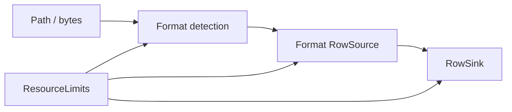

# easyexcel-io

[简体中文](README.zh-CN.md)

Shared format detection, streaming row contracts, modes, resource limits and typed I/O errors.

> Release: 0.1.3 · Rust 1.88+ · Edition 2024 · Apache-2.0

## Overview

This crate is independently published to support the EasyExcel-Rust internal dependency graph. Its README documents the engine boundary for contributors and engine implementors; application code should depend on `easyexcel` and use the matching `easyexcel::...` facade path.

## At a glance

```text
Application -> easyexcel:: facade -> easyexcel-io internal engine -> typed result
```

## Architecture



Dependency direction remains from the facade or format engines toward foundations; this crate never depends back on an application.

## Capability matrix

| Capability | Status | Details |
|:---|:---|:---|
| Format detection | Available | Extension and magic-byte recognition for XLSX/XLS/CSV. |
| Streaming contracts | Available | `RowSource`, `RowSink`, `StreamInfo` and sparse `StreamCell`. |
| Resource limits | Available | Input/output bytes, sheets, rows, formula cells, cell chars and columns. |

## Public API

| API | Purpose |
|:---|:---|
| `Format` | Supported workbook format discriminator. |
| `RowSource`, `RowSink` | Push-based row streaming boundary. |
| `ResourceLimits` | Reusable safety contract. |
| `Error`, `Result` | Stable engine I/O error layer. |

The current `src/lib.rs` re-exports and their implementations are authoritative. This README does not present private implementation objects as stable API.

## Installation

```toml
[dependencies]
easyexcel = "0.1.3"
```

`easyexcel-io` is an independently published internal engine crate. Applications should use `easyexcel::io`; direct dependencies are reserved for EasyExcel engine implementors.

## Basic usage

```rust
fn main() -> Result<(), Box<dyn std::error::Error>> {
use std::path::Path;
use easyexcel::io::Format;

assert_eq!(Format::from_extension("xlsx"), Some(Format::Xlsx));
assert_eq!(Format::from_magic(b"PK\x03\x04"), Format::Xlsx);
let detected = Format::detect_path(Path::new("report.xlsx"))?;
assert_eq!(detected, Format::Xlsx);
Ok(())
}
```

## Advanced usage

```rust
fn main() -> Result<(), Box<dyn std::error::Error>> {
use easyexcel::io::ResourceLimits;

let limits = ResourceLimits::new(
    64 * 1024 * 1024, // input bytes
    32,               // sheets
    1_000_000,        // rows
    100_000,          // formula cells
)
.with_max_output_bytes(128 * 1024 * 1024)
.with_max_cell_chars(256 * 1024)
.with_max_columns(4_096);

assert_eq!(limits.max_sheets(), 32);
Ok(())
}
```

## Errors and capability boundaries

- `Format` deliberately represents XLS, XLSX and CSV only; Markdown/HTML/JSON are projections, not workbook container formats.
- Concrete codecs belong to `easyexcel-xls`, `easyexcel-xlsx` and `easyexcel-csv`.

Resource limits, format loss and unsupported behavior must surface through typed errors, `Option`, warnings or conversion reports; silent guessing and downgrade are forbidden.

## Relationship to other crates


The diagram shows the public dependency direction, not that this crate depends on every foundation module. `Cargo.toml` is authoritative.

## Evidence map

| Claim | Source of truth |
|:---|:---|
| Package version, MSRV and dependencies | [`Cargo.toml`](Cargo.toml) |
| Public exports | [`src/lib.rs`](src/lib.rs) |
| Implementation behavior | `src/io/` |
| Cross-format boundaries | [Workspace compatibility matrix](https://github.com/easy-4-rust/easyexcel-rust/blob/main/docs/compatibility.md) |

## Related links

- [Repository](https://github.com/easy-4-rust/easyexcel-rust)
- [API documentation](https://docs.rs/easyexcel-io)
- [Compatibility matrix](https://github.com/easy-4-rust/easyexcel-rust/blob/main/docs/compatibility.md)
- [Changelog](https://github.com/easy-4-rust/easyexcel-rust/blob/main/CHANGELOG.md)
- [Chinese README](README.zh-CN.md)
