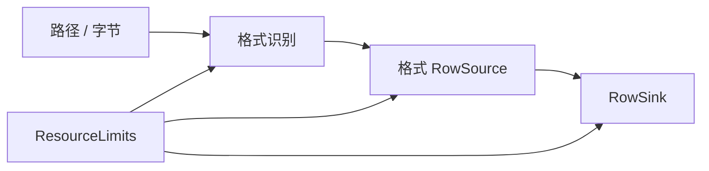

# easyexcel-io

[English](README.md)

> **文档说明**：面向贡献者和引擎实现者说明格式识别、流式行契约、资源限制与 I/O 错误 crate。业务应用应依赖 `easyexcel` 门面。
>
> **版本**：0.1.3
> **最后更新**：2026-08-11

共享的格式识别、流式行契约、模式、资源限制与类型化 I/O 错误。

> 版本: 0.1.3 · Rust 1.88+ · Edition 2024 · Apache-2.0

## 概述

本 crate 独立发布是为了支撑 EasyExcel-Rust 内部依赖图。README 面向贡献者和引擎实现者说明模块边界；业务应用应只依赖 `easyexcel`，并使用对应的 `easyexcel::...` 门面路径。

## 一览

```text
业务应用 -> easyexcel:: 门面 -> easyexcel-io 内部引擎 -> 类型化结果
```

## 架构



依赖方向必须保持从门面或格式引擎指向基础模块；本 crate 不反向依赖业务应用。

## 能力与边界

| 领域 | 能做什么 | 不能做什么 |
|:---|:---|:---|
| 格式识别 | 通过文件扩展名和 magic byte 识别 XLSX、XLS 和 CSV。 | 识别 ODS、Numbers 或其他非 Excel 格式。 |
| 流式契约 | 定义 `RowSource`（推送式读取器）和 `RowSink`（推送式写入器）边界。 | 执行实际文件 I/O（委托给格式 crate）。 |
| 资源限制 | 强制最大输入/输出字节、工作表、行、公式单元格、单元格字符和列数。 | 流式处理过程中动态调整限制。 |
| 错误层 | 为所有引擎 I/O 提供统一的 `Error` 和 `Result` 类型。 | 替代应用级错误处理。 |
| Gzip 单元格记录 | 读写用于大文件的 gzip 压缩单元格记录流。 | 处理非 gzip 的原始单元格流。 |
| 临时文件策略 | 通过 `EasyExcelTempFileCreationStrategy` 创建临时文件。 | 管理超出创建范围的临时文件生命周期。 |
| 工作表选择 | 通过 `SheetSelection` 按工作表名称或索引过滤行。 | 读取过程中修改工作簿结构。 |

## 能力矩阵

| 能力 | 状态 | 说明 |
|:---|:---|:---|
| 格式识别 | 可用 | 按扩展名与 magic byte 识别 XLSX/XLS/CSV。 |
| 流式契约 | 可用 | `RowSource`、`RowSink`、`StreamInfo` 与稀疏 `StreamCell`。 |
| 资源限制 | 可用 | 输入/输出字节、工作表、行、公式单元格、单元格字符和列数。 |

## 公共 API

| API | 用途 |
|:---|:---|
| `Format` | 支持的工作簿格式判别器。 |
| `RowSource`、`RowSink` | 推送式行流边界。 |
| `ResourceLimits` | 可复用安全契约。 |
| `Error`、`Result` | 稳定的引擎 I/O 错误层。 |
| `StreamCell`、`StreamInfo` | 稀疏单元格与流元数据。 |
| `GzipCellRecordReader`、`GzipCellRecordWriter` | Gzip 压缩单元格记录 I/O。 |
| `SheetSelection` | 行选择的工作表名称/索引过滤器。 |
| `ByteOrderMark` | BOM 检测与处理。 |
| `SharedByteBuffer` | 流式处理的可复用字节缓冲区。 |

API 的权威定义来自当前 `src/lib.rs` 重导出与对应实现；README 不把内部私有对象描述为稳定契约。

## 安装

```toml
[dependencies]
easyexcel = "0.1.3"
```

`easyexcel-io` 独立发布是为了内部引擎依赖分层。业务应用应使用 `easyexcel::io`；只有 EasyExcel 引擎实现者才应直接依赖本 crate。

| 项目 | 值 |
|:---|:---|
| MSRV | Rust 1.88 |
| Edition | 2024 |
| Resolver | 3 |
| License | Apache-2.0 |

## 基础使用

```rust
fn main() -> Result<(), Box<dyn std::error::Error>> {
use std::path::Path;
use easyexcel::io::Format;

assert_eq!(Format::from_extension("xlsx"), Some(Format::Xlsx));
assert_eq!(Format::from_magic(b"PK\x03\x04"), Format::Xlsx);
let detected = Format::detect_path(Path::new("report.xlsx"))?;
assert_eq!(detected, Format::Xlsx);
Ok(())
}
```

## 进阶使用

```rust
fn main() -> Result<(), Box<dyn std::error::Error>> {
use easyexcel::io::ResourceLimits;

let limits = ResourceLimits::new(
    64 * 1024 * 1024, // 输入字节
    32,               // 工作表
    1_000_000,        // 行
    100_000,          // 公式单元格
)
.with_max_output_bytes(128 * 1024 * 1024)
.with_max_cell_chars(256 * 1024)
.with_max_columns(4_096);

assert_eq!(limits.max_sheets(), 32);
Ok(())
}
```

## 工作表选择示例

```rust
fn main() -> Result<(), Box<dyn std::error::Error>> {
use easyexcel::io::SheetSelection;

// 按名称选择
let sel = SheetSelection::Name("Orders".to_owned());
assert!(easyexcel::io::row_is_selected(&sel, "Orders", 0));
assert!(!easyexcel::io::row_is_selected(&sel, "Summary", 0));

// 按索引选择
let sel = SheetSelection::Index(0);
assert!(easyexcel::io::row_is_selected(&sel, "Sheet1", 0));
Ok(())
}
```

## 错误与能力边界

- `Format` 刻意只表示 XLS、XLSX 与 CSV；Markdown/HTML/JSON 是投影，不是工作簿容器格式。
- 具体编解码器位于 `easyexcel-xls`、`easyexcel-xlsx` 与 `easyexcel-csv`。

资源限制、格式损失或未支持能力必须通过类型化错误、`Option`、warning 或转换报告显式呈现，禁止静默猜测或降级。

## 依赖关系


该图表达公共依赖方向，不表示本 crate 必然依赖所有基础模块。实际依赖以 `Cargo.toml` 为准。

## 证据索引

| 声明 | 事实来源 |
|:---|:---|
| 包版本、MSRV 与依赖 | [`Cargo.toml`](Cargo.toml) |
| 公共重导出 | [`src/lib.rs`](src/lib.rs) |
| 实现行为 | `src/io/` |
| 跨格式边界 | [Workspace 兼容性矩阵](https://github.com/easy-4-rust/easyexcel-rust/blob/main/docs/compatibility.md) |

## 相关链接

- [项目仓库](https://github.com/easy-4-rust/easyexcel-rust)
- [API 文档](https://docs.rs/easyexcel-io)
- [兼容性矩阵](https://github.com/easy-4-rust/easyexcel-rust/blob/main/docs/compatibility.md)
- [变更日志](https://github.com/easy-4-rust/easyexcel-rust/blob/main/CHANGELOG.md)
- [英文 README](README.md)

---

**文档版本**：V1.0.0
**创建日期**：2026-08-11
**最后更新**：2026-08-11
**文档状态**：待评审
