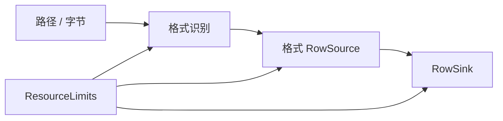

# easyexcel-io

[English](README.md)

共享的格式识别、流式行契约、模式、资源限制与类型化 I/O 错误。

> 版本: 0.1.2 · Rust 1.88+ · Edition 2024 · Apache-2.0

## 概述

本 crate 是 EasyExcel-Rust Workspace 的正式发布模块。本文面向需要理解模块职责、直接调用底层 API 或维护格式引擎的 Rust 开发者。普通业务项目应优先通过 `easyexcel` 门面访问重导出的能力。

## 一览

```text
输入 / 公共 API -> easyexcel-io -> 类型化模型、行流、文件或报告
```

## 架构



依赖方向必须保持从门面或格式引擎指向基础模块；本 crate 不反向依赖业务应用。

## 能力矩阵

| 能力 | 状态 | 说明 |
|:---|:---|:---|
| 格式识别 | 可用 | 按扩展名与 magic byte 识别 XLSX/XLS/CSV。 |
| 流式契约 | 可用 | `RowSource`、`RowSink`、`StreamInfo` 与稀疏 `StreamCell`。 |
| 资源限制 | 可用 | 输入/输出字节、工作表、行、公式单元格、单元格字符和列数。 |

## 公共 API

| API | 用途 |
|:---|:---|
| `Format` | 支持的工作簿格式判别器。 |
| `RowSource`、`RowSink` | 推送式流行边界。 |
| `ResourceLimits` | 可复用安全契约。 |
| `Error`、`Result` | 稳定的引擎 I/O 错误层。 |

API 的权威定义来自当前 `src/lib.rs` 重导出与对应实现；README 不把内部私有对象描述为稳定契约。

## 安装

```toml
[dependencies]
easyexcel-io = "0.1.2"
```

如果项目同时使用多个 EasyExcel 引擎，请改为只依赖 `easyexcel = "0.1.2"`，并通过 `easyexcel::...` 使用，以避免版本漂移。

## 基础使用

```rust
fn main() -> Result<(), Box<dyn std::error::Error>> {
use std::path::Path;
use easyexcel_io::Format;

assert_eq!(Format::from_extension("xlsx"), Some(Format::Xlsx));
assert_eq!(Format::from_magic(b"PK\x03\x04"), Format::Xlsx);
let detected = Format::detect_path(Path::new("report.xlsx"))?;
assert_eq!(detected, Format::Xlsx);
Ok(())
}
```

## 进阶使用

```rust
fn main() -> Result<(), Box<dyn std::error::Error>> {
use easyexcel_io::ResourceLimits;

let limits = ResourceLimits::new(
    64 * 1024 * 1024, // input bytes
    32,               // sheets
    1_000_000,        // rows
    100_000,          // formula cells
)
.with_max_output_bytes(128 * 1024 * 1024)
.with_max_cell_chars(256 * 1024)
.with_max_columns(4_096);

assert_eq!(limits.max_sheets(), 32);
Ok(())
}
```

## 错误与能力边界

- `Format` 刻意只表示 XLS、XLSX 与 CSV；Markdown/HTML/JSON 是投影，不是工作簿容器格式。
- 具体编解码器位于 `easyexcel-xls`、`easyexcel-xlsx` 与 `easyexcel-csv`。

资源限制、格式损失或未支持能力必须通过类型化错误、`Option`、warning 或转换报告显式呈现，禁止静默猜测或降级。

## 依赖关系


该图表达公共依赖方向，不表示本 crate 必然依赖所有基础模块。实际依赖以 `Cargo.toml` 为准。

## 证据索引

| 声明 | 事实来源 |
|:---|:---|
| 包版本、MSRV 与依赖 | [`Cargo.toml`](Cargo.toml) |
| 公共重导出 | [`src/lib.rs`](src/lib.rs) |
| 实现行为 | `src/io/` |
| 跨格式边界 | [Workspace 兼容性矩阵](https://github.com/easy-4-rust/easyexcel-rust/blob/main/docs/compatibility.md) |

## 相关链接

- [项目仓库](https://github.com/easy-4-rust/easyexcel-rust)
- [API 文档](https://docs.rs/easyexcel-io)
- [兼容性矩阵](https://github.com/easy-4-rust/easyexcel-rust/blob/main/docs/compatibility.md)
- [变更日志](https://github.com/easy-4-rust/easyexcel-rust/blob/main/CHANGELOG.md)
- [英文 README](README.md)
