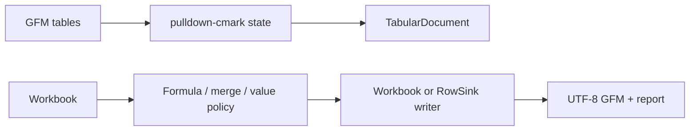

# easyexcel-markdown

[简体中文](README.zh-CN.md)

> **文档说明**：easyexcel-markdown 引擎层 crate 文档，面向贡献者与引擎实现者说明模块边界。
>
> **版本**：0.1.3
> **最后更新**：2026-08-11

Policy-driven GFM table import/export for workbooks and row streams with structured loss reporting.

> Release: 0.1.3 · Rust 1.88+ · Edition 2024 · Apache-2.0

## Overview

This crate is independently published to support the EasyExcel-Rust internal dependency graph. Its README documents the engine boundary for contributors and engine implementors; application code should depend on `easyexcel` and use the matching `easyexcel::...` facade path.

## At a glance

```text
Application -> easyexcel:: facade -> easyexcel-markdown internal engine -> typed result
```

## Architecture



Dependency direction remains from the facade or format engines toward foundations; this crate never depends back on an application.

## Format support matrix

This crate handles GFM (GitHub Flavored Markdown) table projection, not a standalone spreadsheet format.

| Dimension | GFM Table (this crate) | Status |
|:---|:---|:---|
| Read (GFM tables) | Multiple tables, nearest headings, conservative type inference | stable |
| Read (dynamic / no-model) | `TabularDocument` output | stable |
| Read (event listener) | `MarkdownWriter` as `RowSink` | stable |
| Write (workbook to GFM) | Formula/merge/hidden-sheet/display-value policies | stable |
| Write (event mode) | `MarkdownWriter` `RowSink` implementation | stable |
| Loss report | `MarkdownConversionReport` with machine-readable `MarkdownWarning` | stable |
| Merge cells | Policy: `AnchorWithWarning` / `AnchorOnly` / `Error` | policy-driven |
| Formulas | Policy: `ExpressionAndCached` / `CachedOnly` / `Error` | policy-driven |
| Styles | Not representable in GFM | not supported |
| Images | Not representable in GFM tables | not supported |
| Comments / Notes | Not representable in GFM tables | not supported |
| Hyperlinks | Cell text only; no native hyperlink in GFM tables | not supported |
| Password protection | Not applicable | N/A |

## Capabilities and boundaries

### What this crate can do

- Import GFM tables into `TabularDocument` with structured `MarkdownConversionReport`.
- Export workbooks to GFM with configurable policies for formulas, merge cells, hidden sheets and display values.
- Stream rows via `MarkdownWriter` as a `RowSink` implementation for Event Mode.
- Emit machine-readable `MarkdownWarning` codes for every loss or downgrade.

### What this crate cannot do

- Lossless Excel round trip: Markdown is a semantic projection, not a full spreadsheet format.
- Create executable formulas from Markdown text: formula-looking text remains text on import.
- Preserve styles, images, comments, hyperlinks or auto-filters: these are not GFM table constructs.

## Round-trip fidelity

Markdown is a semantic projection. A round-trip (Excel to GFM to Excel) preserves:

- Table structure (rows and columns)
- Text and numeric cell values
- Table names derived from nearest headings

The following are explicitly reported as losses via `MarkdownConversionReport`:

- Merge cells (configurable policy: anchor-only, anchor-with-warning or error)
- Formulas (configurable policy: expression+cached, cached-only or error)
- Hidden sheets (excluded by default)
- Styles, images, comments, hyperlinks, row/column dimensions

All losses surface through `MarkdownWarning` codes; no silent downgrade occurs.

## Large file / streaming / memory

| Mode | Memory complexity | Applicability |
|:---|:---|:---|
| Workbook export (`write_workbook`) | `O(workbook)` | Small to medium workbooks |
| Event mode (`MarkdownWriter` RowSink) | `O(batch)` | Large file streaming export |
| Import (`read_markdown`) | `O(document)` | GFM document parsing |

The `MarkdownWriter` implements `RowSink` for incremental row-by-row emission without buffering the entire workbook.

## Format safety

- GFM parsing uses `pulldown-cmark` event-based streaming; no full DOM materialization.
- Markdown is plain text with no container, encryption or embedded binary; ZIP bomb and entity expansion are not applicable.
- Resource limits from `easyexcel-io::ResourceLimits` apply when invoked through the facade.

## Public API

| API | Purpose |
|:---|:---|
| `MarkdownImportOptions`, `read_markdown` | GFM to `TabularDocument` plus report. |
| `MarkdownExportOptions`, `write_workbook` | Workbook to GFM plus report. |
| `MarkdownWriter` | `RowSink` implementation for Event Mode. |
| `MarkdownWarning`, `MarkdownConversionReport` | Machine-readable loss information. |

The current `src/lib.rs` re-exports and their implementations are authoritative. This README does not present private implementation objects as stable API.

## Installation

```toml
[dependencies]
easyexcel = "0.1.3"
```

`easyexcel-markdown` is the internal projection engine. Applications should use the stable `easyexcel::markdown` facade.

## Basic usage

```rust
fn main() -> Result<(), Box<dyn std::error::Error>> {
use std::io::Cursor;
use easyexcel::markdown::{MarkdownImportOptions, read_markdown};

let source = "## Orders\n\n| id | name |\n| --- | --- |\n| 007 | Alice |\n";
let result = read_markdown(
    Cursor::new(source.as_bytes()),
    &MarkdownImportOptions::default(),
)?;
assert_eq!(result.document.tables()[0].name(), "Orders");
Ok(())
}
```

## Advanced usage

```rust
fn main() -> Result<(), Box<dyn std::error::Error>> {
use std::io::Cursor;
use easyexcel::markdown::{
    MarkdownExportOptions, MarkdownFormulaPolicy, MarkdownMergePolicy,
    write_workbook,
};
use easyexcel::model::Workbook;

let workbook = Workbook::new();
let options = MarkdownExportOptions::default()
    .with_formulas(MarkdownFormulaPolicy::ExpressionAndCached)
    .with_merges(MarkdownMergePolicy::AnchorWithWarning);
let (output, report) =
    write_workbook(&workbook, Cursor::new(Vec::new()), &options)?;
println!("warnings: {}", report.warnings.len());
Ok(())
}
```

## Errors and capability boundaries

- The default `AgentStable` profile emits UTF-8/LF GFM and makes formula/merge losses explicit.
- Formula-looking Markdown text remains text on import; the importer does not create executable formulas.

Resource limits, format loss and unsupported behavior must surface through typed errors, `Option`, warnings or conversion reports; silent guessing and downgrade are forbidden.

## Relationship to other crates


The diagram shows the public dependency direction, not that this crate depends on every foundation module. `Cargo.toml` is authoritative.

## Evidence map

| Claim | Source of truth |
|:---|:---|
| Package version, MSRV and dependencies | [`Cargo.toml`](Cargo.toml) |
| Public exports | [`src/lib.rs`](src/lib.rs) |
| Implementation behavior | `src/markdown/` |
| Format support matrix | [ARCHITECTURE.md](../../docs/ARCHITECTURE.md) |
| Cross-format boundaries | [Workspace compatibility matrix](https://github.com/easy-4-rust/easyexcel-rust/blob/main/docs/compatibility.md) |

## Related links

- [Repository](https://github.com/easy-4-rust/easyexcel-rust)
- [API documentation](https://docs.rs/easyexcel-markdown)
- [Compatibility matrix](https://github.com/easy-4-rust/easyexcel-rust/blob/main/docs/compatibility.md)
- [Changelog](https://github.com/easy-4-rust/easyexcel-rust/blob/main/CHANGELOG.md)
- [Chinese README](README.zh-CN.md)

---

**文档版本**：V1.0.0
**最后更新**：2026-08-11
**文档状态**：已评审
