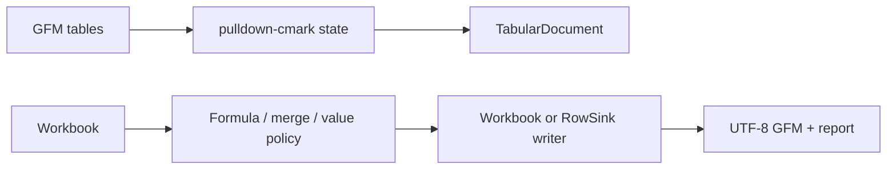

# easyexcel-markdown

[简体中文](README.zh-CN.md)

Policy-driven GFM table import/export for workbooks and row streams with structured loss reporting.

> Release: 0.1.3 · Rust 1.88+ · Edition 2024 · Apache-2.0

## Overview

This crate is independently published to support the EasyExcel-Rust internal dependency graph. Its README documents the engine boundary for contributors and engine implementors; application code should depend on `easyexcel` and use the matching `easyexcel::...` facade path.

## At a glance

```text
Application -> easyexcel:: facade -> easyexcel-markdown internal engine -> typed result
```

## Architecture



Dependency direction remains from the facade or format engines toward foundations; this crate never depends back on an application.

## Capability matrix

| Capability | Status | Details |
|:---|:---|:---|
| GFM import | Available | Multiple tables, nearest headings and conservative type inference. |
| Workbook export | Available | Formula, merge, hidden-sheet and display-value policies. |
| Lossless Excel round trip | Not claimed | Markdown is a semantic projection. |

## Public API

| API | Purpose |
|:---|:---|
| `MarkdownImportOptions`, `read_markdown` | GFM to `TabularDocument` plus report. |
| `MarkdownExportOptions`, `write_workbook` | Workbook to GFM plus report. |
| `MarkdownWriter` | `RowSink` implementation for Event Mode. |
| `MarkdownWarning`, `MarkdownConversionReport` | Machine-readable loss information. |

The current `src/lib.rs` re-exports and their implementations are authoritative. This README does not present private implementation objects as stable API.

## Installation

```toml
[dependencies]
easyexcel = "0.1.3"
```

`easyexcel-markdown` is the internal projection engine. Applications should use the stable `easyexcel::markdown` facade.

## Basic usage

```rust
fn main() -> Result<(), Box<dyn std::error::Error>> {
use std::io::Cursor;
use easyexcel::markdown::{MarkdownImportOptions, read_markdown};

let source = "## Orders\n\n| id | name |\n| --- | --- |\n| 007 | Alice |\n";
let result = read_markdown(
    Cursor::new(source.as_bytes()),
    &MarkdownImportOptions::default(),
)?;
assert_eq!(result.document.tables()[0].name(), "Orders");
Ok(())
}
```

## Advanced usage

```rust
fn main() -> Result<(), Box<dyn std::error::Error>> {
use std::io::Cursor;
use easyexcel::markdown::{
    MarkdownExportOptions, MarkdownFormulaPolicy, MarkdownMergePolicy,
    write_workbook,
};
use easyexcel::model::Workbook;

let workbook = Workbook::new();
let options = MarkdownExportOptions::default()
    .with_formulas(MarkdownFormulaPolicy::ExpressionAndCached)
    .with_merges(MarkdownMergePolicy::AnchorWithWarning);
let (output, report) =
    write_workbook(&workbook, Cursor::new(Vec::new()), &options)?;
println!("warnings: {}", report.warnings.len());
Ok(())
}
```

## Errors and capability boundaries

- The default `AgentStable` profile emits UTF-8/LF GFM and makes formula/merge losses explicit.
- Formula-looking Markdown text remains text on import; the importer does not create executable formulas.

Resource limits, format loss and unsupported behavior must surface through typed errors, `Option`, warnings or conversion reports; silent guessing and downgrade are forbidden.

## Relationship to other crates


The diagram shows the public dependency direction, not that this crate depends on every foundation module. `Cargo.toml` is authoritative.

## Evidence map

| Claim | Source of truth |
|:---|:---|
| Package version, MSRV and dependencies | [`Cargo.toml`](Cargo.toml) |
| Public exports | [`src/lib.rs`](src/lib.rs) |
| Implementation behavior | `src/markdown/` |
| Cross-format boundaries | [Workspace compatibility matrix](https://github.com/easy-4-rust/easyexcel-rust/blob/main/docs/compatibility.md) |

## Related links

- [Repository](https://github.com/easy-4-rust/easyexcel-rust)
- [API documentation](https://docs.rs/easyexcel-markdown)
- [Compatibility matrix](https://github.com/easy-4-rust/easyexcel-rust/blob/main/docs/compatibility.md)
- [Changelog](https://github.com/easy-4-rust/easyexcel-rust/blob/main/CHANGELOG.md)
- [Chinese README](README.zh-CN.md)
