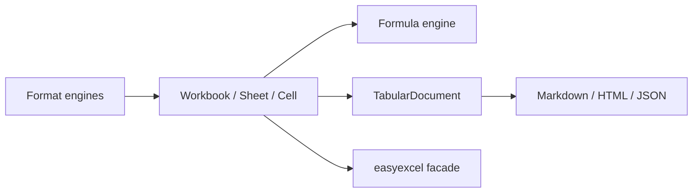

# easyexcel-model

[简体中文](README.zh-CN.md)

> **Document purpose**: Documents the format-neutral workbook and table model crate for contributors and engine implementors. Application code should depend on `easyexcel` facade.
>
> **Version**: 0.1.3
> **Last updated**: 2026-08-11

Format-neutral workbook and table model shared by the XLS, XLSX, CSV, formula and projection engines.

> Release: 0.1.3 · Rust 1.88+ · Edition 2024 · Apache-2.0

## Overview

This crate is independently published to support the EasyExcel-Rust internal dependency graph. Its README documents the engine boundary for contributors and engine implementors; application code should depend on `easyexcel` and use the matching `easyexcel::...` facade path.

## At a glance

```text
Application -> easyexcel:: facade -> easyexcel-model internal engine -> typed result
```

## Architecture



Dependency direction remains from the facade or format engines toward foundations; this crate never depends back on an application.

## Capabilities and boundaries

| Area | Can do | Cannot do |
|:---|:---|:---|
| Workbook graph | Create, query and edit `Workbook`, `Sheet`, `Cell`, styles, names, tables, merges and opaque parts. | Parse or write XLSX/XLS/CSV binary/XML containers. |
| Cell types | Represent `Text`, `Number`, `Bool`, `Error`, `Formula`, `Empty`, `Date` and `RichText` cells. | Execute formula evaluation (delegates to `easyexcel-formula`). |
| Tabular projection | Project workbook data into `TabularDocument` with named tables, headers and merged ranges. | Guarantee lossless style or formula-expression round trips. |
| Coordinates | Parse A1 references, zero-based `CellAddress` and `CellRange`. | Handle R1C1 notation. |
| Date system | Convert between Excel serial dates and `chrono` types. | Parse date strings from raw cell text. |

## Capability matrix

| Capability | Status | Details |
|:---|:---|:---|
| Workbook model | Available | Sheets, cells, styles, names, tables, merges and opaque parts. |
| Tabular model | Available | Multiple named tables, header flags and merged ranges. |
| File codec | Out of scope | Binary, XML, ZIP and delimited-text codecs live in format crates. |

## Public API

| API | Purpose |
|:---|:---|
| `Workbook`, `Sheet` | In-memory workbook graph and sheet lookup/editing. |
| `Cell`, `CellValue` | Typed cell and cached formula values. |
| `CellAddress`, `CellRange` | Zero-based and A1-compatible coordinates. |
| `TabularDocument`, `TabularTable`, `TabularCell` | Loss-aware neutral table representation. |
| `DefinedName` | Named range and formula name definitions. |
| `ChartType`, `ChartSeries`, `ChartRange` | Chart metadata for workbook graph. |
| `date_to_excel_serial`, `excel_parts_to_datetime` | Excel serial date conversion utilities. |

The current `src/lib.rs` re-exports and their implementations are authoritative. This README does not present private implementation objects as stable API.

## Installation

```toml
[dependencies]
easyexcel = "0.1.3"
```

`easyexcel-model` is independently published so workspace crates can express precise dependency boundaries. Application code should depend on `easyexcel` and use its zero-cost re-exports.

| Item | Value |
|:---|:---|
| MSRV | Rust 1.88 |
| Edition | 2024 |
| Resolver | 3 |
| License | Apache-2.0 |

## Basic usage

```rust
fn main() -> Result<(), Box<dyn std::error::Error>> {
use easyexcel::model::{Cell, CellRange, Workbook};

let mut workbook = Workbook::new();
let sheet = &mut workbook.sheets[0];
sheet.name = "Orders".to_owned();
sheet.set_a1("A1", Cell::Text("order_id".to_owned()));
sheet.set_a1("B1", Cell::Text("amount".to_owned()));
sheet.set_a1("A2", Cell::Text("A-001".to_owned()));
sheet.set_a1("B2", Cell::Number(42.5));
sheet.merged.push(CellRange::parse_a1("A3:B3").expect("valid A1 range"));
Ok(())
}
```

## Advanced usage

```rust
fn main() -> Result<(), Box<dyn std::error::Error>> {
use easyexcel::model::{TabularDocument, Workbook};

fn project(workbook: &Workbook) -> Workbook {
    let document = TabularDocument::from_workbook(workbook);
    // Formula expressions and full styles are intentionally not represented.
    document.to_workbook_with_header_style(true)
}
Ok(())
}
```

## Date conversion example

```rust
fn main() -> Result<(), Box<dyn std::error::Error>> {
use easyexcel::model::{date_to_excel_serial, excel_parts_to_datetime};

let serial = date_to_excel_serial(2024, 1, 15);
assert!(serial > 0);

let dt = excel_parts_to_datetime(2024, 1, 15, 10, 30, 0, 0);
assert!(dt.is_some());
Ok(())
}
```

## Errors and capability boundaries

- `TabularDocument::from_workbook` projects formula cached values and does not promise lossless style or formula-expression round trips.
- Application code should normally import these objects through `easyexcel::model` so all engine versions remain aligned.

Resource limits, format loss and unsupported behavior must surface through typed errors, `Option`, warnings or conversion reports; silent guessing and downgrade are forbidden.

## Relationship to other crates


The diagram shows the public dependency direction, not that this crate depends on every foundation module. `Cargo.toml` is authoritative.

## Evidence map

| Claim | Source of truth |
|:---|:---|
| Package version, MSRV and dependencies | [`Cargo.toml`](Cargo.toml) |
| Public exports | [`src/lib.rs`](src/lib.rs) |
| Implementation behavior | `src/model/` |
| Cross-format boundaries | [Workspace compatibility matrix](https://github.com/easy-4-rust/easyexcel-rust/blob/main/docs/compatibility.md) |

## Related links

- [Repository](https://github.com/easy-4-rust/easyexcel-rust)
- [API documentation](https://docs.rs/easyexcel-model)
- [Compatibility matrix](https://github.com/easy-4-rust/easyexcel-rust/blob/main/docs/compatibility.md)
- [Changelog](https://github.com/easy-4-rust/easyexcel-rust/blob/main/CHANGELOG.md)
- [Chinese README](README.zh-CN.md)

---

**Document version**: V1.0.0
**Created**: 2026-08-11
**Last updated**: 2026-08-11
**Document status**: Pending review
