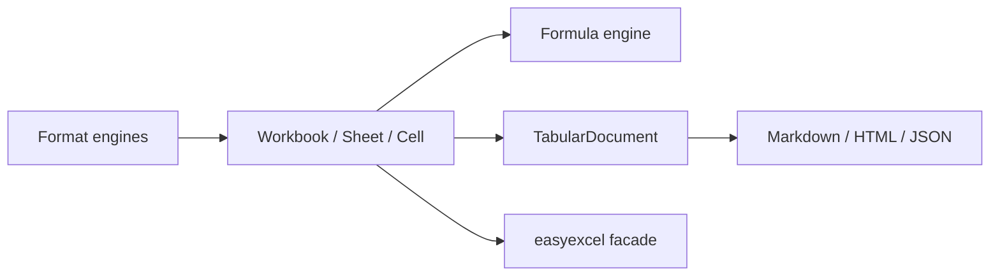

# easyexcel-model

[简体中文](README.zh-CN.md)

Format-neutral workbook and table model shared by the XLS, XLSX, CSV, formula and projection engines.

> Release: 0.1.2 · Rust 1.88+ · Edition 2024 · Apache-2.0

## Overview

This crate is a published module in the EasyExcel-Rust workspace. It is intended for Rust developers who need its boundary, direct engine API or implementation details. Application code should normally consume the re-exported surface through the `easyexcel` facade.

## At a glance

```text
Input / public API -> easyexcel-model -> typed model, stream, file or report
```

## Architecture



Dependency direction remains from the facade or format engines toward foundations; this crate never depends back on an application.

## Capability matrix

| Capability | Status | Details |
|:---|:---|:---|
| Workbook model | Available | Sheets, cells, styles, names, tables, merges and opaque parts. |
| Tabular model | Available | Multiple named tables, header flags and merged ranges. |
| File codec | Out of scope | Binary, XML, ZIP and delimited-text codecs live in format crates. |

## Public API

| API | Purpose |
|:---|:---|
| `Workbook`, `Sheet` | In-memory workbook graph and sheet lookup/editing. |
| `Cell`, `CellValue` | Typed cell and cached formula values. |
| `CellAddress`, `CellRange` | Zero-based and A1-compatible coordinates. |
| `TabularDocument`, `TabularTable`, `TabularCell` | Loss-aware neutral table representation. |

The current `src/lib.rs` re-exports and their implementations are authoritative. This README does not present private implementation objects as stable API.

## Installation

```toml
[dependencies]
easyexcel-model = "0.1.2"
```

If an application needs several EasyExcel engines, prefer a single `easyexcel = "0.1.2"` dependency and the `easyexcel::...` re-exports to prevent version drift.

## Basic usage

```rust
fn main() -> Result<(), Box<dyn std::error::Error>> {
use easyexcel_model::{Cell, CellRange, Workbook};

let mut workbook = Workbook::new();
let sheet = &mut workbook.sheets[0];
sheet.name = "Orders".to_owned();
sheet.set_a1("A1", Cell::Text("order_id".to_owned()));
sheet.set_a1("B1", Cell::Text("amount".to_owned()));
sheet.set_a1("A2", Cell::Text("A-001".to_owned()));
sheet.set_a1("B2", Cell::Number(42.5));
sheet.merged.push(CellRange::parse_a1("A3:B3").expect("valid A1 range"));
Ok(())
}
```

## Advanced usage

```rust
fn main() -> Result<(), Box<dyn std::error::Error>> {
use easyexcel_model::{TabularDocument, Workbook};

fn project(workbook: &Workbook) -> Workbook {
    let document = TabularDocument::from_workbook(workbook);
    // Formula expressions and full styles are intentionally not represented.
    document.to_workbook_with_header_style(true)
}
Ok(())
}
```

## Errors and capability boundaries

- `TabularDocument::from_workbook` projects formula cached values and does not promise lossless style or formula-expression round trips.
- Application code should normally import these objects through `easyexcel::model` so all engine versions remain aligned.

Resource limits, format loss and unsupported behavior must surface through typed errors, `Option`, warnings or conversion reports; silent guessing and downgrade are forbidden.

## Relationship to other crates


The diagram shows the public dependency direction, not that this crate depends on every foundation module. `Cargo.toml` is authoritative.

## Evidence map

| Claim | Source of truth |
|:---|:---|
| Package version, MSRV and dependencies | [`Cargo.toml`](Cargo.toml) |
| Public exports | [`src/lib.rs`](src/lib.rs) |
| Implementation behavior | `src/model/` |
| Cross-format boundaries | [Workspace compatibility matrix](https://github.com/easy-4-rust/easyexcel-rust/blob/main/docs/compatibility.md) |

## Related links

- [Repository](https://github.com/easy-4-rust/easyexcel-rust)
- [API documentation](https://docs.rs/easyexcel-model)
- [Compatibility matrix](https://github.com/easy-4-rust/easyexcel-rust/blob/main/docs/compatibility.md)
- [Changelog](https://github.com/easy-4-rust/easyexcel-rust/blob/main/CHANGELOG.md)
- [Chinese README](README.zh-CN.md)
