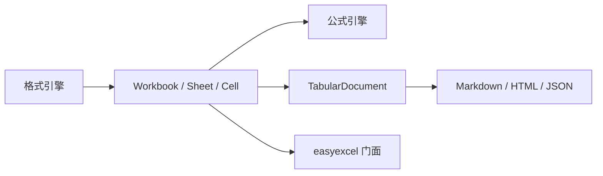

# easyexcel-model

[English](README.md)

> **文档说明**：面向贡献者和引擎实现者说明格式中立的工作簿与表格模型 crate。业务应用应依赖 `easyexcel` 门面。
>
> **版本**：0.1.3
> **最后更新**：2026-08-11

XLS、XLSX、CSV、公式与投影引擎共享的格式中立工作簿和表格模型。

> 版本: 0.1.3 · Rust 1.88+ · Edition 2024 · Apache-2.0

## 概述

本 crate 独立发布是为了支撑 EasyExcel-Rust 内部依赖图。README 面向贡献者和引擎实现者说明模块边界；业务应用应只依赖 `easyexcel`，并使用对应的 `easyexcel::...` 门面路径。

## 一览

```text
业务应用 -> easyexcel:: 门面 -> easyexcel-model 内部引擎 -> 类型化结果
```

## 架构



依赖方向必须保持从门面或格式引擎指向基础模块；本 crate 不反向依赖业务应用。

## 能力与边界

| 领域能做什么 | 能做什么 | 不能做什么 |
|:---|:---|:---|
| 工作簿图 | 创建、查询和编辑 `Workbook`、`Sheet`、`Cell`、样式、名称、表格、合并区域与未知部件。 | 解析或写入 XLSX/XLS/CSV 的二进制/XML 容器。 |
| 单元格类型 | 表示 `Text`、`Number`、`Bool`、`Error`、`Formula`、`Empty`、`Date` 和 `RichText` 单元格。 | 执行公式求值（委托给 `easyexcel-formula`）。 |
| 中立表格投影 | 将工作簿数据投影为 `TabularDocument`，包含命名表格、表头和合并区域。 | 保证样式或公式表达式无损往返。 |
| 坐标 | 解析 A1 引用、零基 `CellAddress` 和 `CellRange`。 | 处理 R1C1 表示法。 |
| 日期系统 | 在 Excel 序列日期与 `chrono` 类型间转换。 | 从原始单元格文本解析日期字符串。 |

## 能力矩阵

| 能力 | 状态 | 说明 |
|:---|:---|:---|
| 工作簿模型 | 可用 | 工作表、单元格、样式、名称、表格、合并区域与未知部件。 |
| 中立表格模型 | 可用 | 多命名表格、表头标记与合并区域。 |
| 文件编解码 | 范围外 | 二进制、XML、ZIP 和分隔文本编解码位于格式 crate。 |

## 公共 API

| API | 用途 |
|:---|:---|
| `Workbook`、`Sheet` | 内存工作簿图及工作表查询、修改。 |
| `Cell`、`CellValue` | 类型化单元格及公式缓存值。 |
| `CellAddress`、`CellRange` | 零基坐标与 A1 范围。 |
| `TabularDocument`、`TabularTable`、`TabularCell` | 明确损失边界的中立表格表示。 |
| `DefinedName` | 命名范围与公式名称定义。 |
| `ChartType`、`ChartSeries`、`ChartRange` | 工作簿图的图表元数据。 |
| `date_to_excel_serial`、`excel_parts_to_datetime` | Excel 序列日期转换工具。 |

API 的权威定义来自当前 `src/lib.rs` 重导出与对应实现；README 不把内部私有对象描述为稳定契约。

## 安装

```toml
[dependencies]
easyexcel = "0.1.3"
```

`easyexcel-model` 独立发布只是为了让 workspace 内部 crate 能表达精确依赖边界。业务应用应只依赖 `easyexcel`，通过它的零成本重导出使用模型类型。

| 项目 | 值 |
|:---|:---|
| MSRV | Rust 1.88 |
| Edition | 2024 |
| Resolver | 3 |
| License | Apache-2.0 |

## 基础使用

```rust
fn main() -> Result<(), Box<dyn std::error::Error>> {
use easyexcel::model::{Cell, CellRange, Workbook};

let mut workbook = Workbook::new();
let sheet = &mut workbook.sheets[0];
sheet.name = "Orders".to_owned();
sheet.set_a1("A1", Cell::Text("order_id".to_owned()));
sheet.set_a1("B1", Cell::Text("amount".to_owned()));
sheet.set_a1("A2", Cell::Text("A-001".to_owned()));
sheet.set_a1("B2", Cell::Number(42.5));
sheet.merged.push(CellRange::parse_a1("A3:B3").expect("valid A1 range"));
Ok(())
}
```

## 进阶使用

```rust
fn main() -> Result<(), Box<dyn std::error::Error>> {
use easyexcel::model::{TabularDocument, Workbook};

fn project(workbook: &Workbook) -> Workbook {
    let document = TabularDocument::from_workbook(workbook);
    // Formula expressions and full styles are intentionally not represented.
    document.to_workbook_with_header_style(true)
}
Ok(())
}
```

## 日期转换示例

```rust
fn main() -> Result<(), Box<dyn std::error::Error>> {
use easyexcel::model::{date_to_excel_serial, excel_parts_to_datetime};

let serial = date_to_excel_serial(2024, 1, 15);
assert!(serial > 0);

let dt = excel_parts_to_datetime(2024, 1, 15, 10, 30, 0, 0);
assert!(dt.is_some());
Ok(())
}
```

## 错误与能力边界

- `TabularDocument::from_workbook` 投影公式缓存值，不承诺样式或公式表达式无损往返。
- 业务代码通常应通过 `easyexcel::model` 导入这些对象，以保持所有引擎版本一致。

资源限制、格式损失或未支持能力必须通过类型化错误、`Option`、warning 或转换报告显式呈现，禁止静默猜测或降级。

## 依赖关系


该图表达公共依赖方向，不表示本 crate 必然依赖所有基础模块。实际依赖以 `Cargo.toml` 为准。

## 证据索引

| 声明 | 事实来源 |
|:---|:---|
| 包版本、MSRV 与依赖 | [`Cargo.toml`](Cargo.toml) |
| 公共重导出 | [`src/lib.rs`](src/lib.rs) |
| 实现行为 | `src/model/` |
| 跨格式边界 | [Workspace 兼容性矩阵](https://github.com/easy-4-rust/easyexcel-rust/blob/main/docs/compatibility.md) |

## 相关链接

- [项目仓库](https://github.com/easy-4-rust/easyexcel-rust)
- [API 文档](https://docs.rs/easyexcel-model)
- [兼容性矩阵](https://github.com/easy-4-rust/easyexcel-rust/blob/main/docs/compatibility.md)
- [变更日志](https://github.com/easy-4-rust/easyexcel-rust/blob/main/CHANGELOG.md)
- [英文 README](README.md)

---

**文档版本**：V1.0.0
**创建日期**：2026-08-11
**最后更新**：2026-08-11
**文档状态**：待评审
