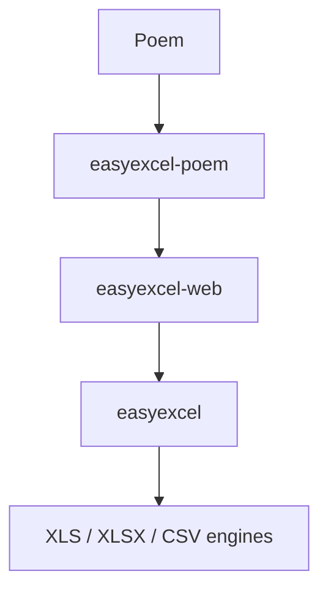

# easyexcel-poem

[简体中文](README.zh-CN.md)

Native EasyExcel request extraction and response adapter for Poem.

> Release: 0.1.3 · Rust 1.88+ · Edition 2024 · Apache-2.0
>
> Last updated: 2026-08-11 · Status: active

## Overview

`easyexcel-poem` only bridges Poem transport types to `easyexcel-web`. Upload spooling, resource limits, row-stream backpressure, cancellation, timeouts, temporary-file cleanup and stable errors remain in the shared runtime, preventing framework-specific semantic drift.

Native integration: `FromRequest` extractor and `IntoResponse` responder. Runtime injection: `Data<&ExcelWebRuntime>` plus `AddData`.

## At a glance

```text
HTTP request -> easyexcel-poem -> easyexcel-web -> typed rows / streamed response
```

## Architecture


The adapter does not reimplement spreadsheet parsing, writing or resource policy. Business rows are consumed through a bounded channel and downloads are exposed to Poem as an asynchronous file stream.

## Capabilities and Boundaries

| What easyexcel-poem does | What easyexcel-poem does NOT do |
|:---|:---|
| `FromRequest` extractor for typed backpressured row stream | Upload spooling / resource limits / timeouts (in `easyexcel-web`) |
| `IntoResponse` responder for streaming XLSX/XLS/CSV download | Business validation, authorization or persistence |
| `ExcelPoemError` mapping to Poem error protocol | Reimplementing spreadsheet parsing or writing |
| `Data<&ExcelWebRuntime>` + `AddData` injection | TUI / HTML form handling |

## Capability matrix

| Capability | Status | Implementation |
|:---|:---|:---|
| `ExcelRequest<T>` | Available | Native Poem extraction with a typed, backpressured row stream. |
| `ExcelResponse<T>` | Available | Generates a controlled file before committing headers, then streams it asynchronously. |
| Limits and concurrency | Shared | `ExcelWebPolicy` + `ExcelWebRuntime` |
| Error protocol | Stable | `ExcelPoemError` + `ExcelProblemDetails` |
| TUI / HTML form | Out of scope | Owned by the application or examples. |

## Installation

```toml
[dependencies]
easyexcel = "0.1.3"
easyexcel-poem = "0.1.3"
```

All workbook APIs remain under `easyexcel::...`; only Poem-native extractor, responder and error types come from this adapter. The adapter depends on `easyexcel`, so facade-side re-export would create a cycle. Keep both crates on the same release line.

## Usage from examples

The runnable example is in [`examples/poem`](https://github.com/easy-4-rust/easyexcel-rust/tree/main/examples/poem). Default port: **8083**.

```bash
cargo run -p example-poem
# Listening on http://127.0.0.1:8083
# POST /upload   - upload an Excel file
# GET  /download - download a sample XLSX
# GET  /health   - health check
```

## Define the row model

```rust
use easyexcel::ExcelRow;

#[derive(Debug, ExcelRow)]
struct ReportRow {
    #[excel(name = "Name")]
    name: String,

    #[excel(name = "Value", number_format = "0")]
    value: i64,
}

fn report_rows() -> impl Iterator<Item = ReportRow> {
    (0..10).map(|value| ReportRow {
        name: format!("row-{value}"),
        value,
    })
}
```

## Streaming download

```rust
use easyexcel::io::Format;
use easyexcel_poem::{ExcelPoemError, ExcelResponse, ExcelWebRuntime};
use poem::web::Data;
use poem::handler;

#[handler]
async fn download(
    Data(runtime): Data<&ExcelWebRuntime>,
) -> Result<ExcelResponse<ReportRow>, ExcelPoemError> {
    ExcelResponse::prepare(
        report_rows(),
        Format::Xlsx,
        "report.xlsx",
        "Data",
        runtime.generated_context(),
    ).await
}
```

`ExcelResponse::prepare` completes generation and limit checks before returning a Poem response. The response body then reads the temporary file asynchronously instead of copying the complete file into memory.

## Backpressured upload

```rust
use easyexcel_poem::{ExcelPoemError, ExcelRequest};
use poem::handler;

#[handler]
async fn upload(request: ExcelRequest<ReportRow>) -> poem::Result<String> {
    let request_id = request.request_id().to_owned();
    let mut rows = request.into_rows();
    let mut count = 0_u64;
    while let Some(row) = rows.next_row().await {
        row.map_err(|error| poem::Error::from(
            ExcelPoemError::new(error, &request_id)
        ))?;
        count += 1;
    }
    Ok(format!("success: {count} rows"))
}
```

Uploads must provide `x-excel-file-name`, `Content-Disposition` or a recognizable `Content-Type`. Optional `x-request-id` is propagated into tracing and error responses.

## Runtime wiring

```rust
use poem::{EndpointExt, Route, get, post};
use poem::middleware::AddData;
use easyexcel_poem::{ExcelWebPolicy, ExcelWebRuntime};

let runtime = ExcelWebRuntime::new(ExcelWebPolicy::default());
let app = Route::new()
    .at("/download", get(download))
    .at("/upload", post(upload))
    .with(AddData::new(runtime));
```

Create one shared `ExcelWebRuntime` instead of rebuilding the concurrency permit pool per request. `ExcelWebPolicy` configures file bytes, rows, upload/processing timeouts, maximum tasks, row-channel capacity and temporary directory.

## Headers and errors

- `Content-Type` is derived from XLSX, XLS or CSV format.
- `Content-Disposition` uses UTF-8 filename encoding and sanitizes unsafe names.
- `Content-Length` comes from the generated file size.
- `ExcelPoemError` maps shared failures to the framework-native rejection/error/response.
- Diagnostics go to tracing; the stable problem response does not expose internal paths.

## Capability boundaries

- Streaming upload means chunked spooling followed by parsing; it does not make XLS/XLSX random-access containers parseable before the complete upload arrives.
- Streaming download starts after successful generation so clients do not receive a partially valid workbook.
- The adapter does not own business validation, authorization or persistence; those belong to application handlers/middleware.
- The complete runnable service is in `examples/poem`; shared assertions live in `tests/easyexcel-web-conformance`.

## Dependency relationship



Reverse dependencies such as `easyexcel-web -> easyexcel-poem` or `easyexcel -> easyexcel-poem` are forbidden.

## Evidence map

| Claim | Source of truth |
|:---|:---|
| Extractor/request behavior | [`src/excel_request.rs`](src/excel_request.rs) |
| Responder/reply behavior | [`src/excel_response.rs`](src/excel_response.rs) |
| Error mapping | [`src/excel_error.rs`](src/excel_error.rs) |
| Runnable integration | [`examples/poem`](https://github.com/easy-4-rust/easyexcel-rust/tree/main/examples/poem) |
| Shared adapter contract | [`tests/easyexcel-web-conformance`](https://github.com/easy-4-rust/easyexcel-rust/tree/main/tests/easyexcel-web-conformance) |

## Related links

- [Repository](https://github.com/easy-4-rust/easyexcel-rust)
- [API documentation](https://docs.rs/easyexcel-poem)
- [easyexcel-web](https://crates.io/crates/easyexcel-web) -- shared Web execution kernel
- [Web conformance suite](https://github.com/easy-4-rust/easyexcel-rust/tree/main/tests/easyexcel-web-conformance)
- [Runnable example](https://github.com/easy-4-rust/easyexcel-rust/tree/main/examples/poem)
- [Compatibility matrix](https://github.com/easy-4-rust/easyexcel-rust/blob/main/docs/compatibility.md)
- [Chinese README](README.zh-CN.md)
