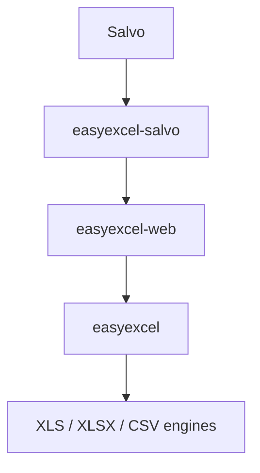

# easyexcel-salvo

[English](README.md)

面向 Salvo 的 EasyExcel 原生请求提取与响应适配器。

> 版本: 0.1.3 · Rust 1.88+ · Edition 2024 · Apache-2.0
>
> 最后更新: 2026-08-11 · 状态: 活跃

## 概述

`easyexcel-salvo` 只负责把 Salvo 传输类型桥接到 `easyexcel-web`。上传落盘、资源限制、行流背压、取消、超时、临时文件清理与稳定错误协议均由共享内核实现，避免各框架产生不同语义。

原生集成方式：`Extractible` request type and Salvo `Writer` response；运行时传递方式：`ExcelWebRuntime` inserted into request extensions by a hoop。

## 一览

```text
HTTP 请求 -> easyexcel-salvo -> easyexcel-web -> 类型化行 / 流式响应
```

## 架构


适配器不得重新实现 Excel 解析、写入或资源策略。业务行在有界通道中消费，下载通过异步文件流交给 Salvo。

## 能力与边界

| easyexcel-salvo 做什么 | easyexcel-salvo 不做什么 |
|:---|:---|
| `Extractible` 请求类型提取类型化背压行流 | 上传落盘 / 资源限制 / 超时（在 `easyexcel-web` 中） |
| Salvo `Writer` 响应流式下载 XLSX/XLS/CSV | 业务校验、鉴权或持久化 |
| `ExcelSalvoError` 映射到 Salvo 错误协议 | 重新实现 Excel 解析或写入 |
| 通过 hoop 将 `ExcelWebRuntime` 注入请求扩展 | TUI / HTML 表单处理 |

## 能力矩阵

| 能力 | 状态 | 实现 |
|:---|:---|:---|
| `ExcelRequest<T>` | 可用 | 原生 Salvo 请求提取，返回类型化背压行流。 |
| `ExcelResponse<T>` | 可用 | 发送响应头前完成受控文件生成，再异步传输。 |
| 资源与并发 | 共享 | `ExcelWebPolicy` + `ExcelWebRuntime` |
| 错误协议 | 稳定 | `ExcelSalvoError` + `ExcelProblemDetails` |
| TUI / HTML form | 范围外 | 由业务应用或 examples 提供。 |

## 安装

```toml
[dependencies]
easyexcel = "0.1.3"
easyexcel-salvo = "0.1.3"
```

所有工作簿 API 仍通过 `easyexcel::...` 使用；只有 Salvo 原生 extractor、writer 与错误类型来自本适配器。适配器依赖 `easyexcel`，门面反向重导出会形成循环依赖。两个 crate 必须保持同一发布线。

## 来自 examples 的用法

可运行示例位于 [`examples/salvo`](https://github.com/easy-4-rust/easyexcel-rust/tree/main/examples/salvo)。默认端口：**8084**。

```bash
cargo run -p example-salvo
# 监听 http://127.0.0.1:8084
# POST /upload   - 上传 Excel 文件
# GET  /download - 下载示例 XLSX
```

## 定义行模型

```rust
use easyexcel::ExcelRow;

#[derive(Debug, ExcelRow)]
struct ReportRow {
    #[excel(name = "Name")]
    name: String,

    #[excel(name = "Value", number_format = "0")]
    value: i64,
}

fn report_rows() -> impl Iterator<Item = ReportRow> {
    (0..10).map(|value| ReportRow {
        name: format!("row-{value}"),
        value,
    })
}
```

## 流式下载

```rust
use easyexcel::io::Format;
use easyexcel_salvo::{ExcelResponse, ExcelWebRuntime};
use salvo::prelude::*;

#[handler]
async fn download(
    request: &mut Request,
    depot: &mut Depot,
    response: &mut Response,
) {
    let runtime = request.extensions()
        .get::<ExcelWebRuntime>()
        .expect("runtime attached")
        .clone();
    match ExcelResponse::<ReportRow>::prepare(
        report_rows(),
        Format::Xlsx,
        "report.xlsx",
        "Data",
        runtime.generated_context(),
    ).await {
        Ok(value) => value.write(request, depot, response).await,
        Err(error) => error.write(request, depot, response).await,
    }
}
```

`ExcelResponse::prepare` 在返回 Salvo 响应前完成生成和限制校验；成功后响应体从临时文件异步读取，不把完整文件复制到内存。

## 背压上传

```rust
use easyexcel_salvo::{ExcelRequest, ExcelSalvoError};
use salvo::prelude::*;

#[handler]
async fn upload(
    request: &mut Request,
    depot: &mut Depot,
    response: &mut Response,
) {
    match ExcelRequest::<ReportRow>::extract(request, depot).await {
        Ok(value) => {
            let request_id = value.request_id().to_owned();
            let mut rows = value.into_rows();
            while let Some(row) = rows.next_row().await {
                if let Err(error) = row {
                    ExcelSalvoError::new(error, &request_id)
                        .write(request, depot, response).await;
                    return;
                }
            }
            response.render("success");
        }
        Err(error) => error.write(request, depot, response).await,
    }
}
```

上传请求必须提供 `x-excel-file-name`、`Content-Disposition` 或可识别的 `Content-Type`。可选 `x-request-id` 会进入 tracing 与错误响应。

## 运行时接线

```rust
use easyexcel_salvo::{ExcelWebPolicy, ExcelWebRuntime};
use salvo::prelude::*;

let runtime = ExcelWebRuntime::new(ExcelWebPolicy::default());
// Add a Salvo hoop that inserts runtime.clone() into request.extensions_mut().
// Then register /download and /upload handlers on Router.
```

应用应创建一个共享 `ExcelWebRuntime`，而不是为每个请求重新创建并发许可池。可通过 `ExcelWebPolicy` 统一设置文件字节数、行数、上传/处理超时、最大任务数、行通道容量和临时目录。

## 响应头与错误

- `Content-Type` 根据 XLSX、XLS 或 CSV 格式生成。
- `Content-Disposition` 使用 UTF-8 文件名编码并清理不安全名称。
- `Content-Length` 来自生成后文件大小。
- `ExcelSalvoError` 把共享错误映射为框架原生 rejection/error/response。
- 诊断信息进入 tracing；响应体保持稳定问题详情，不泄露内部路径。

## 能力边界

- 流式上传表示请求体分块落盘后再解析，不表示 XLS/XLSX 容器可在未接收完整文件时随机访问。
- 流式下载在生成成功后开始传输，避免客户端收到部分有效工作簿。
- 适配器不承载业务校验、鉴权或持久化；这些职责属于应用 handler/middleware。
- 完整可运行服务位于 `examples/salvo`，共享一致性断言位于 `tests/easyexcel-web-conformance`。

## 依赖关系



禁止形成 `easyexcel-web -> easyexcel-salvo` 或 `easyexcel -> easyexcel-salvo` 的反向依赖。

## 证据索引

| 声明 | 事实来源 |
|:---|:---|
| Extractor/请求行为 | [`src/excel_request.rs`](src/excel_request.rs) |
| Responder/响应行为 | [`src/excel_response.rs`](src/excel_response.rs) |
| 错误映射 | [`src/excel_error.rs`](src/excel_error.rs) |
| 可运行集成 | [`examples/salvo`](https://github.com/easy-4-rust/easyexcel-rust/tree/main/examples/salvo) |
| 共享适配器契约 | [`tests/easyexcel-web-conformance`](https://github.com/easy-4-rust/easyexcel-rust/tree/main/tests/easyexcel-web-conformance) |

## 相关链接

- [项目仓库](https://github.com/easy-4-rust/easyexcel-rust)
- [API 文档](https://docs.rs/easyexcel-salvo)
- [easyexcel-web](https://crates.io/crates/easyexcel-web) -- 共享 Web 执行内核
- [Web 一致性测试套件](https://github.com/easy-4-rust/easyexcel-rust/tree/main/tests/easyexcel-web-conformance)
- [可运行示例](https://github.com/easy-4-rust/easyexcel-rust/tree/main/examples/salvo)
- [兼容性矩阵](https://github.com/easy-4-rust/easyexcel-rust/blob/main/docs/compatibility.md)
- [英文 README](README.md)
