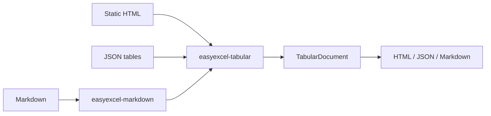

# easyexcel-tabular

[简体中文](README.zh-CN.md)

Safe HTML and JSON table conversion with generic dispatch to the dedicated Markdown codec.

> Release: 0.1.2 · Rust 1.88+ · Edition 2024 · Apache-2.0

## Overview

This crate is a published module in the EasyExcel-Rust workspace. It is intended for Rust developers who need its boundary, direct engine API or implementation details. Application code should normally consume the re-exported surface through the `easyexcel` facade.

## At a glance

```text
Input / public API -> easyexcel-tabular -> typed model, stream, file or report
```

## Architecture



Dependency direction remains from the facade or format engines toward foundations; this crate never depends back on an application.

## Capability matrix

| Capability | Status | Details |
|:---|:---|:---|
| Static HTML | Available | Tables, captions, headers, rowspan and colspan. |
| JSON | Available | Arrays, object arrays and stable tables protocol. |
| Markdown | Delegated | Implemented by `easyexcel-markdown`, not duplicated here. |

## Public API

| API | Purpose |
|:---|:---|
| `parse_html`, `render_html` | Static HTML table codec. |
| `parse_json`, `render_json` | JSON table codec. |
| `parse_document`, `render_document` | `TabularFormat` dispatcher. |
| `TabularDocument` | Re-exported neutral model. |

The current `src/lib.rs` re-exports and their implementations are authoritative. This README does not present private implementation objects as stable API.

## Installation

```toml
[dependencies]
easyexcel-tabular = "0.1.2"
```

If an application needs several EasyExcel engines, prefer a single `easyexcel = "0.1.2"` dependency and the `easyexcel::...` re-exports to prevent version drift.

## Basic usage

```rust
fn main() -> Result<(), Box<dyn std::error::Error>> {
use easyexcel_tabular::{parse_html, render_json};

let html = r#"
<table id="orders">
  <tr><th>id</th><th>name</th></tr>
  <tr><td>1</td><td>Alice</td></tr>
</table>
"#;
let document = parse_html(html)?;
let json = render_json(&document);
assert!(json.contains("Alice"));
Ok(())
}
```

## Advanced usage

```rust
fn main() -> Result<(), Box<dyn std::error::Error>> {
use easyexcel_tabular::{
    TabularFormat, parse_document, render_document,
};

let document = parse_document(
    r#"[{"id":1,"name":"Alice"},{"id":2,"name":"Bob"}]"#,
    TabularFormat::Json,
)?;
let html = render_document(&document, TabularFormat::Html)?;
assert!(html.contains("<table>"));
Ok(())
}
```

## Errors and capability boundaries

- HTML is parsed as static markup only; scripts, network loading and uncontrolled CSS are never executed.
- The neutral model does not preserve every workbook style, formula expression, image, chart or comment.

Resource limits, format loss and unsupported behavior must surface through typed errors, `Option`, warnings or conversion reports; silent guessing and downgrade are forbidden.

## Relationship to other crates


The diagram shows the public dependency direction, not that this crate depends on every foundation module. `Cargo.toml` is authoritative.

## Evidence map

| Claim | Source of truth |
|:---|:---|
| Package version, MSRV and dependencies | [`Cargo.toml`](Cargo.toml) |
| Public exports | [`src/lib.rs`](src/lib.rs) |
| Implementation behavior | `src/tabular/` |
| Cross-format boundaries | [Workspace compatibility matrix](https://github.com/easy-4-rust/easyexcel-rust/blob/main/docs/compatibility.md) |

## Related links

- [Repository](https://github.com/easy-4-rust/easyexcel-rust)
- [API documentation](https://docs.rs/easyexcel-tabular)
- [Compatibility matrix](https://github.com/easy-4-rust/easyexcel-rust/blob/main/docs/compatibility.md)
- [Changelog](https://github.com/easy-4-rust/easyexcel-rust/blob/main/CHANGELOG.md)
- [Chinese README](README.zh-CN.md)
