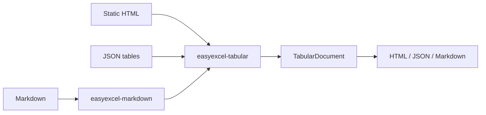

# easyexcel-tabular

[简体中文](README.zh-CN.md)

> **文档说明**：easyexcel-tabular 引擎层 crate 文档，面向贡献者与引擎实现者说明模块边界。
>
> **版本**：0.1.3
> **最后更新**：2026-08-11

Safe HTML and JSON table conversion with generic dispatch to the dedicated Markdown codec.

> Release: 0.1.3 · Rust 1.88+ · Edition 2024 · Apache-2.0

## Overview

This crate is independently published to support the EasyExcel-Rust internal dependency graph. Its README documents the engine boundary for contributors and engine implementors; application code should depend on `easyexcel` and use the matching `easyexcel::...` facade path.

## At a glance

```text
Application -> easyexcel:: facade -> easyexcel-tabular internal engine -> typed result
```

## Architecture



Dependency direction remains from the facade or format engines toward foundations; this crate never depends back on an application.

## Format support matrix

This crate handles static HTML and JSON table conversion; Markdown is delegated to `easyexcel-markdown`.

| Dimension | HTML | JSON | Markdown (delegated) |
|:---|:---|:---|:---|
| Read / Parse | `parse_html` via `scraper` | `parse_json` via `serde_json` | `easyexcel-markdown` |
| Write / Render | `render_html` | `render_json` | `easyexcel-markdown` |
| Round-trip | Lossy: styles/formulas/images not preserved | Lossy: same limitations | Lossy: semantic projection |
| Table features | Tables, captions, headers, rowspan, colspan | Arrays, object arrays, stable tables protocol | GFM tables |
| Styles | Not preserved | Not preserved | Not preserved |
| Formulas | Not preserved | Not preserved | Policy-driven loss report |
| Merge cells | Not preserved | Not preserved | Policy-driven loss report |
| Images | Not preserved | Not preserved | Not supported |
| Comments | Not preserved | Not preserved | Not supported |
| Hyperlinks | Not preserved | Not preserved | Not supported |
| Password protection | Not applicable | Not applicable | Not applicable |

## Capabilities and boundaries

### What this crate can do

- Parse static HTML tables (including captions, headers, rowspan and colspan) into `TabularDocument` via `parse_html`.
- Parse JSON arrays and object arrays into `TabularDocument` via `parse_json`.
- Render `TabularDocument` to HTML or JSON via `render_html`/`render_json`.
- Dispatch to any supported format via `parse_document`/`render_document` with `TabularFormat`.
- Delegate Markdown parsing and rendering to `easyexcel-markdown` without duplication.

### What this crate cannot do

- Execute scripts, load network resources or apply uncontrolled CSS: HTML is parsed as static markup only.
- Preserve workbook styles, formulas, images, charts, comments, hyperlinks or auto-filters: the neutral model does not carry these.
- Handle dynamic or interactive HTML content.

## Round-trip fidelity

HTML and JSON are lossy projections of spreadsheet data. A round-trip preserves:

- Table structure (rows and columns)
- Cell text and numeric values
- Table IDs and captions (HTML)
- Column names (JSON)

The following are lost: styles, formulas, merge cells, images, comments, hyperlinks, row/column dimensions, auto-filters and multiple sheet semantics. These losses are inherent to the target format, not implementation gaps.

## Large file / streaming / memory

| Mode | Memory complexity | Applicability |
|:---|:---|:---|
| HTML parse (`parse_html`) | `O(document)` | Static HTML documents |
| JSON parse (`parse_json`) | `O(document)` | JSON table data |
| Render (`render_html`/`render_json`) | `O(document)` | Output generation |

HTML parsing uses the `scraper` crate which builds a DOM tree; for very large documents, consider streaming alternatives at the application layer.

## Format safety

- HTML parsing uses `scraper` (based on `html5ever`) which is designed for untrusted input; scripts are not executed.
- JSON parsing uses `serde_json` with bounded allocation.
- No encryption, container or embedded binary formats are involved.
- Resource limits from `easyexcel-io::ResourceLimits` apply when invoked through the facade.

## Public API

| API | Purpose |
|:---|:---|
| `parse_html`, `render_html` | Static HTML table codec. |
| `parse_json`, `render_json` | JSON table codec. |
| `parse_document`, `render_document` | `TabularFormat` dispatcher. |
| `TabularDocument` | Re-exported neutral model. |

The current `src/lib.rs` re-exports and their implementations are authoritative. This README does not present private implementation objects as stable API.

## Installation

```toml
[dependencies]
easyexcel = "0.1.3"
```

`easyexcel-tabular` is an internal conversion engine. Applications should use the stable `easyexcel::tabular` facade.

## Basic usage

```rust
fn main() -> Result<(), Box<dyn std::error::Error>> {
use easyexcel::tabular::{parse_html, render_json};

let html = r#"
<table id="orders">
  <tr><th>id</th><th>name</th></tr>
  <tr><td>1</td><td>Alice</td></tr>
</table>
"#;
let document = parse_html(html)?;
let json = render_json(&document);
assert!(json.contains("Alice"));
Ok(())
}
```

## Advanced usage

```rust
fn main() -> Result<(), Box<dyn std::error::Error>> {
use easyexcel::tabular::{
    TabularFormat, parse_document, render_document,
};

let document = parse_document(
    r#"[{"id":1,"name":"Alice"},{"id":2,"name":"Bob"}]"#,
    TabularFormat::Json,
)?;
let html = render_document(&document, TabularFormat::Html)?;
assert!(html.contains("<table>"));
Ok(())
}
```

## Errors and capability boundaries

- HTML is parsed as static markup only; scripts, network loading and uncontrolled CSS are never executed.
- The neutral model does not preserve every workbook style, formula expression, image, chart or comment.

Resource limits, format loss and unsupported behavior must surface through typed errors, `Option`, warnings or conversion reports; silent guessing and downgrade are forbidden.

## Relationship to other crates


The diagram shows the public dependency direction, not that this crate depends on every foundation module. `Cargo.toml` is authoritative.

## Evidence map

| Claim | Source of truth |
|:---|:---|
| Package version, MSRV and dependencies | [`Cargo.toml`](Cargo.toml) |
| Public exports | [`src/lib.rs`](src/lib.rs) |
| Implementation behavior | `src/tabular/` |
| Format support matrix | [ARCHITECTURE.md](../../docs/ARCHITECTURE.md) |
| Cross-format boundaries | [Workspace compatibility matrix](https://github.com/easy-4-rust/easyexcel-rust/blob/main/docs/compatibility.md) |

## Related links

- [Repository](https://github.com/easy-4-rust/easyexcel-rust)
- [API documentation](https://docs.rs/easyexcel-tabular)
- [Compatibility matrix](https://github.com/easy-4-rust/easyexcel-rust/blob/main/docs/compatibility.md)
- [Changelog](https://github.com/easy-4-rust/easyexcel-rust/blob/main/CHANGELOG.md)
- [Chinese README](README.zh-CN.md)

---

**文档版本**：V1.0.0
**最后更新**：2026-08-11
**文档状态**：已评审
