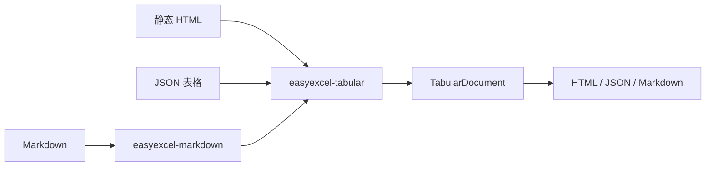

# easyexcel-tabular

[English](README.md)

> **文档说明**：easyexcel-tabular 引擎层 crate 文档，面向贡献者与引擎实现者说明模块边界。
>
> **版本**：0.1.3
> **最后更新**：2026-08-11

安全的 HTML、JSON 表格转换，并通过通用分派调用专用 Markdown 编解码器。

> 版本: 0.1.3 · Rust 1.88+ · Edition 2024 · Apache-2.0

## 概述

本 crate 独立发布是为了支撑 EasyExcel-Rust 内部依赖图。README 面向贡献者和引擎实现者说明模块边界；业务应用应只依赖 `easyexcel`，并使用对应的 `easyexcel::...` 门面路径。

## 一览

```text
业务应用 -> easyexcel:: 门面 -> easyexcel-tabular 内部引擎 -> 类型化结果
```

## 架构



依赖方向必须保持从门面或格式引擎指向基础模块；本 crate 不反向依赖业务应用。

## 格式支持矩阵

本 crate 处理静态 HTML 和 JSON 表格转换；Markdown 委托给 `easyexcel-markdown`。

| 维度 | HTML | JSON | Markdown（委托） |
|:---|:---|:---|:---|
| 读取/解析 | `parse_html`，通过 `scraper` | `parse_json`，通过 `serde_json` | `easyexcel-markdown` |
| 写入/渲染 | `render_html` | `render_json` | `easyexcel-markdown` |
| 往返 | 有损：样式/公式/图片不保留 | 有损：同上限制 | 有损：语义投影 |
| 表格特性 | 表格、标题、表头、rowspan、colspan | 数组、对象数组、稳定 tables 协议 | GFM 表格 |
| 样式 | 不保留 | 不保留 | 不保留 |
| 公式 | 不保留 | 不保留 | 策略驱动损失报告 |
| 合并单元格 | 不保留 | 不保留 | 策略驱动损失报告 |
| 图片 | 不保留 | 不保留 | 不支持 |
| 批注/备注 | 不保留 | 不保留 | 不支持 |
| 超链接 | 不保留 | 不保留 | 不支持 |
| 密码保护 | 不适用 | 不适用 | 不适用 |

## 能力与边界

### 本 crate 能做什么

- 通过 `parse_html` 将静态 HTML 表格（包括标题、表头、rowspan 和 colspan）解析为 `TabularDocument`。
- 通过 `parse_json` 将 JSON 数组和对象数组解析为 `TabularDocument`。
- 通过 `render_html`/`render_json` 将 `TabularDocument` 渲染为 HTML 或 JSON。
- 通过 `parse_document`/`render_document` 配合 `TabularFormat` 分派到任意支持格式。
- 委托 `easyexcel-markdown` 解析和渲染 Markdown，不重复编解码。

### 本 crate 不能做什么

- 执行脚本、加载网络资源或应用不受控 CSS：HTML 仅按静态标记解析。
- 保留工作簿样式、公式、图片、图表、批注、超链接或自动筛选：中立模型不携带这些。
- 处理动态或交互式 HTML 内容。

## 往返保真

HTML 和 JSON 是电子表格数据的有损投影。往返保留：

- 表格结构（行和列）
- 单元格文本和数值
- 表格 ID 和标题（HTML）
- 列名（JSON）

以下内容丢失：样式、公式、合并单元格、图片、批注、超链接、行列尺寸、自动筛选和多工作表语义。这些损失是目标格式的固有特性，不是实现缺陷。

## 大文件 / 流式 / 内存

| 模式 | 内存复杂度 | 适用场景 |
|:---|:---|:---|
| HTML 解析（`parse_html`） | `O(document)` | 静态 HTML 文档 |
| JSON 解析（`parse_json`） | `O(document)` | JSON 表格数据 |
| 渲染（`render_html`/`render_json`） | `O(document)` | 输出生成 |

HTML 解析使用 `scraper` crate，构建 DOM 树；对于非常大的文档，请在应用层考虑流式替代方案。

## 格式安全

- HTML 解析使用 `scraper`（基于 `html5ever`），专为不可信输入设计；不执行脚本。
- JSON 解析使用 `serde_json`，有界分配。
- 不涉及加密、容器或内嵌二进制格式。
- 通过门面调用时，`easyexcel-io::ResourceLimits` 的资源限制生效。

## 公共 API

| API | 用途 |
|:---|:---|
| `parse_html`、`render_html` | 静态 HTML 表格编解码。 |
| `parse_json`、`render_json` | JSON 表格编解码。 |
| `parse_document`、`render_document` | `TabularFormat` 分派入口。 |
| `TabularDocument` | 重导出的中立模型。 |

API 的权威定义来自当前 `src/lib.rs` 重导出与对应实现；README 不把内部私有对象描述为稳定契约。

## 安装

```toml
[dependencies]
easyexcel = "0.1.3"
```

`easyexcel-tabular` 是内部转换引擎。业务应用应统一使用稳定的 `easyexcel::tabular` 门面。

## 基础使用

```rust
fn main() -> Result<(), Box<dyn std::error::Error>> {
use easyexcel::tabular::{parse_html, render_json};

let html = r#"
<table id="orders">
  <tr><th>id</th><th>name</th></tr>
  <tr><td>1</td><td>Alice</td></tr>
</table>
"#;
let document = parse_html(html)?;
let json = render_json(&document);
assert!(json.contains("Alice"));
Ok(())
}
```

## 进阶使用

```rust
fn main() -> Result<(), Box<dyn std::error::Error>> {
use easyexcel::tabular::{
    TabularFormat, parse_document, render_document,
};

let document = parse_document(
    r#"[{"id":1,"name":"Alice"},{"id":2,"name":"Bob"}]"#,
    TabularFormat::Json,
)?;
let html = render_document(&document, TabularFormat::Html)?;
assert!(html.contains("<table>"));
Ok(())
}
```

## 错误与能力边界

- HTML 仅按静态标记解析，不执行脚本、网络加载或不受控 CSS。
- 中立模型不保留全部工作簿样式、公式表达式、图片、图表或批注。

资源限制、格式损失或未支持能力必须通过类型化错误、`Option`、warning 或转换报告显式呈现，禁止静默猜测或降级。

## 依赖关系


该图表达公共依赖方向，不表示本 crate 必然依赖所有基础模块。实际依赖以 `Cargo.toml` 为准。

## 证据索引

| 声明 | 事实来源 |
|:---|:---|
| 包版本、MSRV 与依赖 | [`Cargo.toml`](Cargo.toml) |
| 公共重导出 | [`src/lib.rs`](src/lib.rs) |
| 实现行为 | `src/tabular/` |
| 格式支持矩阵 | [ARCHITECTURE.md](../../docs/ARCHITECTURE.md) |
| 跨格式边界 | [Workspace 兼容性矩阵](https://github.com/easy-4-rust/easyexcel-rust/blob/main/docs/compatibility.md) |

## 相关链接

- [项目仓库](https://github.com/easy-4-rust/easyexcel-rust)
- [API 文档](https://docs.rs/easyexcel-tabular)
- [兼容性矩阵](https://github.com/easy-4-rust/easyexcel-rust/blob/main/docs/compatibility.md)
- [变更日志](https://github.com/easy-4-rust/easyexcel-rust/blob/main/CHANGELOG.md)
- [英文 README](README.md)

---

**文档版本**：V1.0.0
**最后更新**：2026-08-11
**文档状态**：已评审
