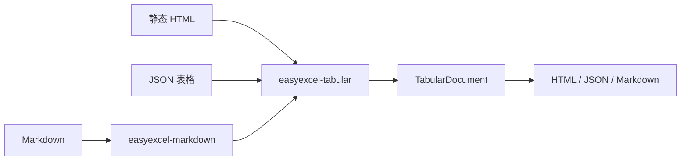

# easyexcel-tabular

[English](README.md)

安全的 HTML、JSON 表格转换，并通过通用分派调用专用 Markdown 编解码器。

> 版本: 0.1.2 · Rust 1.88+ · Edition 2024 · Apache-2.0

## 概述

本 crate 是 EasyExcel-Rust Workspace 的正式发布模块。本文面向需要理解模块职责、直接调用底层 API 或维护格式引擎的 Rust 开发者。普通业务项目应优先通过 `easyexcel` 门面访问重导出的能力。

## 一览

```text
输入 / 公共 API -> easyexcel-tabular -> 类型化模型、行流、文件或报告
```

## 架构



依赖方向必须保持从门面或格式引擎指向基础模块；本 crate 不反向依赖业务应用。

## 能力矩阵

| 能力 | 状态 | 说明 |
|:---|:---|:---|
| 静态 HTML | 可用 | 表格、标题、表头、rowspan 与 colspan。 |
| JSON | 可用 | 数组、对象数组与稳定 tables 协议。 |
| Markdown | 委托 | 由 `easyexcel-markdown` 实现，本 crate 不重复编解码。 |

## 公共 API

| API | 用途 |
|:---|:---|
| `parse_html`、`render_html` | 静态 HTML 表格编解码。 |
| `parse_json`、`render_json` | JSON 表格编解码。 |
| `parse_document`、`render_document` | `TabularFormat` 分派入口。 |
| `TabularDocument` | 重导出的中立模型。 |

API 的权威定义来自当前 `src/lib.rs` 重导出与对应实现；README 不把内部私有对象描述为稳定契约。

## 安装

```toml
[dependencies]
easyexcel-tabular = "0.1.2"
```

如果项目同时使用多个 EasyExcel 引擎，请改为只依赖 `easyexcel = "0.1.2"`，并通过 `easyexcel::...` 使用，以避免版本漂移。

## 基础使用

```rust
fn main() -> Result<(), Box<dyn std::error::Error>> {
use easyexcel_tabular::{parse_html, render_json};

let html = r#"
<table id="orders">
  <tr><th>id</th><th>name</th></tr>
  <tr><td>1</td><td>Alice</td></tr>
</table>
"#;
let document = parse_html(html)?;
let json = render_json(&document);
assert!(json.contains("Alice"));
Ok(())
}
```

## 进阶使用

```rust
fn main() -> Result<(), Box<dyn std::error::Error>> {
use easyexcel_tabular::{
    TabularFormat, parse_document, render_document,
};

let document = parse_document(
    r#"[{"id":1,"name":"Alice"},{"id":2,"name":"Bob"}]"#,
    TabularFormat::Json,
)?;
let html = render_document(&document, TabularFormat::Html)?;
assert!(html.contains("<table>"));
Ok(())
}
```

## 错误与能力边界

- HTML 仅按静态标记解析，不执行脚本、网络加载或不受控 CSS。
- 中立模型不保留全部工作簿样式、公式表达式、图片、图表或批注。

资源限制、格式损失或未支持能力必须通过类型化错误、`Option`、warning 或转换报告显式呈现，禁止静默猜测或降级。

## 依赖关系


该图表达公共依赖方向，不表示本 crate 必然依赖所有基础模块。实际依赖以 `Cargo.toml` 为准。

## 证据索引

| 声明 | 事实来源 |
|:---|:---|
| 包版本、MSRV 与依赖 | [`Cargo.toml`](Cargo.toml) |
| 公共重导出 | [`src/lib.rs`](src/lib.rs) |
| 实现行为 | `src/tabular/` |
| 跨格式边界 | [Workspace 兼容性矩阵](https://github.com/easy-4-rust/easyexcel-rust/blob/main/docs/compatibility.md) |

## 相关链接

- [项目仓库](https://github.com/easy-4-rust/easyexcel-rust)
- [API 文档](https://docs.rs/easyexcel-tabular)
- [兼容性矩阵](https://github.com/easy-4-rust/easyexcel-rust/blob/main/docs/compatibility.md)
- [变更日志](https://github.com/easy-4-rust/easyexcel-rust/blob/main/CHANGELOG.md)
- [英文 README](README.md)
