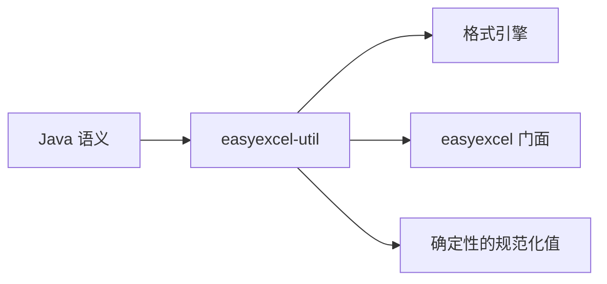

# easyexcel-util

[English](README.md)

> **文档说明**：面向贡献者和引擎实现者说明 Java 兼容工具算法 crate。业务应用应依赖 `easyexcel` 门面。
>
> **版本**：0.1.3
> **最后更新**：2026-08-11

EasyExcel-Rust 引擎复用的小型 Java 兼容工具算法。

> 版本: 0.1.3 · Rust 1.88+ · Edition 2024 · Apache-2.0

## 概述

本 crate 独立发布是为了支撑 EasyExcel-Rust 内部依赖图。README 面向贡献者和引擎实现者说明模块边界；业务应用应只依赖 `easyexcel`，并使用对应的 `easyexcel::...` 门面路径。

## 一览

```text
业务应用 -> easyexcel:: 门面 -> easyexcel-util 内部引擎 -> 类型化结果
```

## 架构



依赖方向必须保持从门面或格式引擎指向基础模块；本 crate 不反向依赖业务应用。

## 能力与边界

| 领域 | 能做什么 | 不能做什么 |
|:---|:---|:---|
| 字符串工具 | Java 兼容的 `trim`、`isBlank`、`isNumeric` 检查与 CGLIB 字段名规范化。 | 完整 Unicode 大小写折叠或 ICU 排序。 |
| 坐标工具 | 将 A1 单元格引用解析为零基行/列；将点转换为 EMU。 | 处理 R1C1 表示法或命名范围。 |
| 位置工具 | 从 A1 风格地址提取行/列索引。 | 解析跨工作表引用。 |
| 集合工具 | 迁移代码使用的 Java 兼容 list 和 map 操作。 | 替代业务代码中的 `std::collections` 或 `itertools`。 |
| 校验 | 与具体错误类型解耦的 `is_true` / `ensure` 条件检查。 | 模式验证或数据完整性检查。 |
| 整数工具 | Java 兼容的整数解析与溢出行为。 | 任意精度算术。 |

## 能力矩阵

| 能力 | 状态 | 说明 |
|:---|:---|:---|
| 字符串兼容 | 可用 | Java trim、空白/数字判断与 CGLIB 字段名规范化。 |
| 坐标工具 | 可用 | 点到 EMU 换算及绝对/相对坐标解析。 |
| 通用工具框架 | 范围外 | 这里只维护电子表格迁移需要的基础原语。 |

## 公共 API

| API | 用途 |
|:---|:---|
| `string_utils` | Java 兼容字符串行为。 |
| `coordinate_utils` | 绘图与单元格坐标。 |
| `position_utils` | A1 地址到行/列索引解析。 |
| `list_utils`、`map_utils` | 迁移代码使用的集合工具。 |
| `boolean_utils`、`int_utils` | Java 兼容布尔与整数操作。 |
| `sheet_utils` | 工作表名称清理工具。 |
| `validation::ensure` | 与具体错误类型解耦的条件校验。 |

API 的权威定义来自当前 `src/lib.rs` 重导出与对应实现；README 不把内部私有对象描述为稳定契约。

## 安装

```toml
[dependencies]
easyexcel = "0.1.3"
```

`easyexcel-util` 是内部算法 crate。业务应用如需 Java 兼容辅助方法，应使用对应的 `easyexcel::util` 门面模块。

| 项目 | 值 |
|:---|:---|
| MSRV | Rust 1.88 |
| Edition | 2024 |
| Resolver | 3 |
| License | Apache-2.0 |

## 基础使用

```rust
fn main() -> Result<(), Box<dyn std::error::Error>> {
use easyexcel::util::{position_utils, string_utils};

assert_eq!(string_utils::java_trim("  Sheet1\t"), "Sheet1");
assert!(string_utils::is_blank(Some(" \n")));
assert_eq!(position_utils::get_row("B12"), 11);
assert_eq!(position_utils::get_col("B12"), 1);
Ok(())
}
```

## 进阶使用

```rust
fn main() -> Result<(), Box<dyn std::error::Error>> {
use easyexcel::util::validate;

fn validate_sheet_count(count: usize) -> easyexcel::Result<()> {
    validate::is_true(count > 0, "workbook must contain a sheet")
}
Ok(())
}
```

## 坐标与集合工具示例

```rust
fn main() -> Result<(), Box<dyn std::error::Error>> {
use easyexcel::util::{coordinate_utils, list_utils};

// 点到 EMU 换算
let emu = coordinate_utils::point_to_emu(72.0);
assert!(emu > 0);

// Java 兼容的 list 操作
let data = vec![1, 2, 3, 4, 5];
let sub = list_utils::sub_list(&data, 1, 3);
assert_eq!(sub, &[2, 3]);
Ok(())
}
```

## 错误与能力边界

- 本 crate 刻意不依赖 `easyexcel` 门面或格式专用错误类型。
- 它不用于替代业务代码中的标准库或成熟生态工具。

资源限制、格式损失或未支持能力必须通过类型化错误、`Option`、warning 或转换报告显式呈现，禁止静默猜测或降级。

## 依赖关系


该图表达公共依赖方向，不表示本 crate 必然依赖所有基础模块。实际依赖以 `Cargo.toml` 为准。

## 证据索引

| 声明 | 事实来源 |
|:---|:---|
| 包版本、MSRV 与依赖 | [`Cargo.toml`](Cargo.toml) |
| 公共重导出 | [`src/lib.rs`](src/lib.rs) |
| 实现行为 | `src/utils/` |
| 跨格式边界 | [Workspace 兼容性矩阵](https://github.com/easy-4-rust/easyexcel-rust/blob/main/docs/compatibility.md) |

## 相关链接

- [项目仓库](https://github.com/easy-4-rust/easyexcel-rust)
- [API 文档](https://docs.rs/easyexcel-util)
- [兼容性矩阵](https://github.com/easy-4-rust/easyexcel-rust/blob/main/docs/compatibility.md)
- [变更日志](https://github.com/easy-4-rust/easyexcel-rust/blob/main/CHANGELOG.md)
- [英文 README](README.md)

---

**文档版本**：V1.0.0
**创建日期**：2026-08-11
**最后更新**：2026-08-11
**文档状态**：待评审
