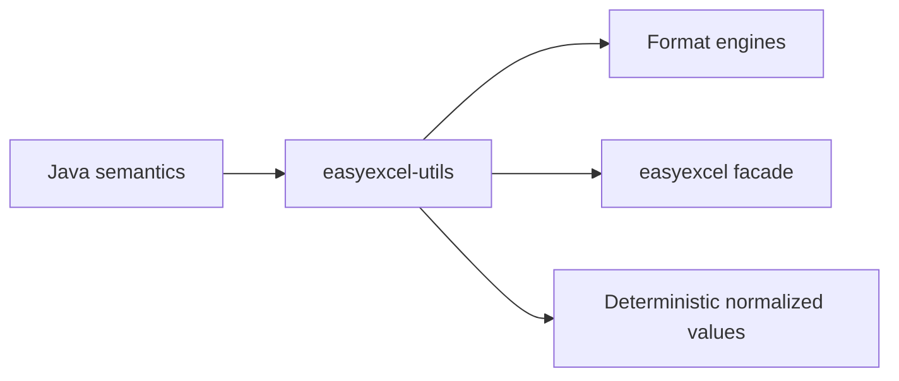

# easyexcel-utils

[简体中文](README.zh-CN.md)

Small Java-compatible utility algorithms reused by EasyExcel-Rust engines.

> Release: 0.1.3 · Rust 1.88+ · Edition 2024 · Apache-2.0

## Overview

This crate is independently published to support the EasyExcel-Rust internal dependency graph. Its README documents the engine boundary for contributors and engine implementors; application code should depend on `easyexcel` and use the matching `easyexcel::...` facade path.

## At a glance

```text
Application -> easyexcel:: facade -> easyexcel-utils internal engine -> typed result
```

## Architecture



Dependency direction remains from the facade or format engines toward foundations; this crate never depends back on an application.

## Capability matrix

| Capability | Status | Details |
|:---|:---|:---|
| String compatibility | Available | Java trim, blank/numeric checks and CGLIB field-name normalization. |
| Coordinate helpers | Available | Point-to-EMU and absolute/relative coordinate resolution. |
| General utility framework | Out of scope | Only spreadsheet migration primitives belong here. |

## Public API

| API | Purpose |
|:---|:---|
| `string_utils` | Java-compatible string behavior. |
| `coordinate_utils` | Drawing and cell coordinates. |
| `list_utils`, `map_utils` | Collection helpers used by migrated code. |
| `validation::ensure` | Error-type-neutral condition validation. |

The current `src/lib.rs` re-exports and their implementations are authoritative. This README does not present private implementation objects as stable API.

## Installation

```toml
[dependencies]
easyexcel = "0.1.3"
```

`easyexcel-utils` is an internal algorithm crate. Applications that need Java-compatible helpers should use the corresponding `easyexcel::util` facade modules.

## Basic usage

```rust
fn main() -> Result<(), Box<dyn std::error::Error>> {
use easyexcel::util::{position_utils, string_utils};

assert_eq!(string_utils::java_trim("  Sheet1\t"), "Sheet1");
assert!(string_utils::is_blank(Some(" \n")));
assert_eq!(position_utils::get_row("B12"), 11);
assert_eq!(position_utils::get_col("B12"), 1);
Ok(())
}
```

## Advanced usage

```rust
fn main() -> Result<(), Box<dyn std::error::Error>> {
use easyexcel::util::validate;

fn validate_sheet_count(count: usize) -> easyexcel::Result<()> {
    validate::is_true(count > 0, "workbook must contain a sheet")
}
Ok(())
}
```

## Errors and capability boundaries

- This crate deliberately has no dependency on the `easyexcel` facade or format-specific error types.
- It is not intended to replace standard-library or established ecosystem utilities in application code.

Resource limits, format loss and unsupported behavior must surface through typed errors, `Option`, warnings or conversion reports; silent guessing and downgrade are forbidden.

## Relationship to other crates


The diagram shows the public dependency direction, not that this crate depends on every foundation module. `Cargo.toml` is authoritative.

## Evidence map

| Claim | Source of truth |
|:---|:---|
| Package version, MSRV and dependencies | [`Cargo.toml`](Cargo.toml) |
| Public exports | [`src/lib.rs`](src/lib.rs) |
| Implementation behavior | `src/utils/` |
| Cross-format boundaries | [Workspace compatibility matrix](https://github.com/easy-4-rust/easyexcel-rust/blob/main/docs/compatibility.md) |

## Related links

- [Repository](https://github.com/easy-4-rust/easyexcel-rust)
- [API documentation](https://docs.rs/easyexcel-utils)
- [Compatibility matrix](https://github.com/easy-4-rust/easyexcel-rust/blob/main/docs/compatibility.md)
- [Changelog](https://github.com/easy-4-rust/easyexcel-rust/blob/main/CHANGELOG.md)
- [Chinese README](README.zh-CN.md)
