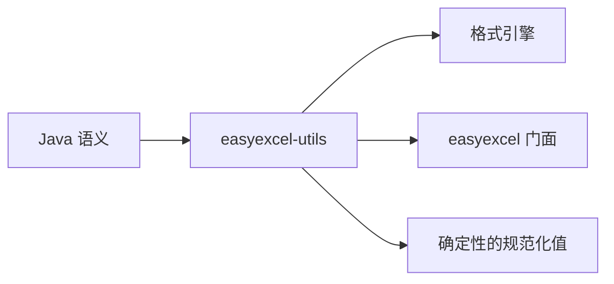

# easyexcel-utils

[English](README.md)

EasyExcel-Rust 引擎复用的小型 Java 兼容工具算法。

> 版本: 0.1.2 · Rust 1.88+ · Edition 2024 · Apache-2.0

## 概述

本 crate 是 EasyExcel-Rust Workspace 的正式发布模块。本文面向需要理解模块职责、直接调用底层 API 或维护格式引擎的 Rust 开发者。普通业务项目应优先通过 `easyexcel` 门面访问重导出的能力。

## 一览

```text
输入 / 公共 API -> easyexcel-utils -> 类型化模型、行流、文件或报告
```

## 架构



依赖方向必须保持从门面或格式引擎指向基础模块；本 crate 不反向依赖业务应用。

## 能力矩阵

| 能力 | 状态 | 说明 |
|:---|:---|:---|
| 字符串兼容 | 可用 | Java trim、空白/数字判断与 CGLIB 字段名规范化。 |
| 坐标工具 | 可用 | 点到 EMU 换算及绝对/相对坐标解析。 |
| 通用工具框架 | 范围外 | 这里只维护电子表格迁移需要的基础原语。 |

## 公共 API

| API | 用途 |
|:---|:---|
| `string_utils` | Java 兼容字符串行为。 |
| `coordinate_utils` | 绘图与单元格坐标。 |
| `list_utils`、`map_utils` | 迁移代码使用的集合工具。 |
| `validation::ensure` | 与具体错误类型解耦的条件校验。 |

API 的权威定义来自当前 `src/lib.rs` 重导出与对应实现；README 不把内部私有对象描述为稳定契约。

## 安装

```toml
[dependencies]
easyexcel-utils = "0.1.2"
```

如果项目同时使用多个 EasyExcel 引擎，请改为只依赖 `easyexcel = "0.1.2"`，并通过 `easyexcel::...` 使用，以避免版本漂移。

## 基础使用

```rust
fn main() -> Result<(), Box<dyn std::error::Error>> {
use easyexcel_utils::{coordinate_utils, string_utils};

assert_eq!(string_utils::java_trim("  Sheet1\t"), "Sheet1");
assert!(string_utils::is_blank(Some(" \n")));
assert_eq!(coordinate_utils::points_to_emu(Some(2)), 25_400);
assert_eq!(
    coordinate_utils::resolve_cell_coordinate(10, None, Some(3)),
    13
);
Ok(())
}
```

## 进阶使用

```rust
fn main() -> Result<(), Box<dyn std::error::Error>> {
use easyexcel_utils::validation;

fn validate_sheet_count(count: usize) -> Result<(), &'static str> {
    validation::ensure(count > 0, "workbook must contain a sheet")
}
Ok(())
}
```

## 错误与能力边界

- 本 crate 刻意不依赖 `easyexcel` 门面或格式专用错误类型。
- 它不用于替代业务代码中的标准库或成熟生态工具。

资源限制、格式损失或未支持能力必须通过类型化错误、`Option`、warning 或转换报告显式呈现，禁止静默猜测或降级。

## 依赖关系


该图表达公共依赖方向，不表示本 crate 必然依赖所有基础模块。实际依赖以 `Cargo.toml` 为准。

## 证据索引

| 声明 | 事实来源 |
|:---|:---|
| 包版本、MSRV 与依赖 | [`Cargo.toml`](Cargo.toml) |
| 公共重导出 | [`src/lib.rs`](src/lib.rs) |
| 实现行为 | `src/utils/` |
| 跨格式边界 | [Workspace 兼容性矩阵](https://github.com/easy-4-rust/easyexcel-rust/blob/main/docs/compatibility.md) |

## 相关链接

- [项目仓库](https://github.com/easy-4-rust/easyexcel-rust)
- [API 文档](https://docs.rs/easyexcel-utils)
- [兼容性矩阵](https://github.com/easy-4-rust/easyexcel-rust/blob/main/docs/compatibility.md)
- [变更日志](https://github.com/easy-4-rust/easyexcel-rust/blob/main/CHANGELOG.md)
- [英文 README](README.md)
