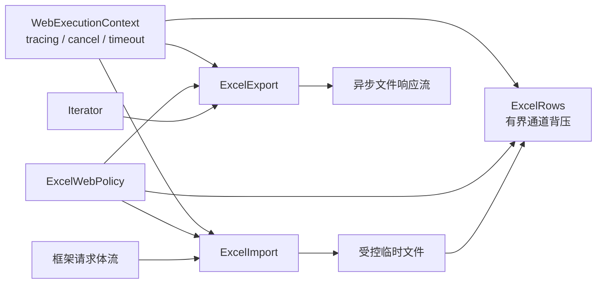

# easyexcel-web

`easyexcel-web` 是 EasyExcel-Rust 唯一的框架中立 Web 执行内核。它不依赖
Axum、Actix Web、Poem、Rocket、Salvo 或 Warp；各框架 crate 只负责把原生
request body、extractor 和 response 类型桥接到这里。

公共 API：

- `ExcelImport<T>`：分块接收 XLSX、XLS、CSV，并增量落入自动清理的临时文件；
- `ExcelRows<T>`：Event Mode 类型化行流，通过有界通道提供真实背压；
- `ExcelExport<T>`：恒定内存生成文件，并实现 Tokio `AsyncRead` 供响应体流式发送；
- `ExcelWebPolicy`：复用 `easyexcel::io::ResourceLimits`，统一字节数、行数、超时和缓冲；
- `ExcelWebRuntime`：应用级共享并发许可池，限制解析和生成任务总数；
- `WebExecutionContext`：传递请求标识和取消令牌；
- `ExcelWebError` / `ExcelProblemDetails`：提供稳定错误码和 RFC 9457 风格响应。

XLSX 和旧 XLS 解析器需要随机访问完整容器，所以“流式上传”指请求体按块落盘，
而不是把整个文件缓存为 `Vec<u8>`；上传完成后，行解析才以有界流向业务代码输出。
这同时保证恒定内存、背压、格式可靠性和失败前不发送不完整下载响应。

V1 已强制执行文件字节数和总行数限制。`ResourceLimits` 中的工作表数量和公式
单元格数量，将在相应解析引擎提供统一计数钩子后执行；在此之前不得声明为已强制。
