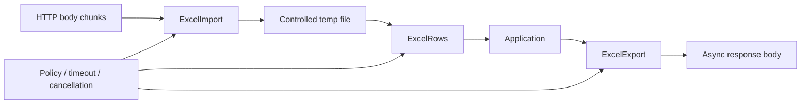

# easyexcel-web

[简体中文](README.zh-CN.md)

Framework-neutral Web runtime for bounded spreadsheet uploads, backpressured row streams and streaming downloads.

> Release: 0.1.2 · Rust 1.88+ · Edition 2024 · Apache-2.0

## Overview

This crate is a published module in the EasyExcel-Rust workspace. It is intended for Rust developers who need its boundary, direct engine API or implementation details. Application code should normally consume the re-exported surface through the `easyexcel` facade.

## At a glance

```text
Input / public API -> easyexcel-web -> typed model, stream, file or report
```

## Architecture



Dependency direction remains from the facade or format engines toward foundations; this crate never depends back on an application.

## Capability matrix

| Capability | Status | Details |
|:---|:---|:---|
| Upload spooling | Available | Chunked request bodies to automatically cleaned temporary files. |
| Backpressure and concurrency | Available | Bounded row channels and shared worker permits. |
| Stable errors | Available | Error codes and RFC 9457-style problem details. |

## Public API

| API | Purpose |
|:---|:---|
| `ExcelImport<T>` | Receive chunks and create a typed row stream. |
| `ExcelRows<T>` | Backpressured asynchronous row consumption. |
| `ExcelExport<T>` | Constant-memory generation and `AsyncRead` download. |
| `ExcelWebPolicy`, `ExcelWebRuntime` | Shared limits, timeouts, concurrency and cleanup policy. |

The current `src/lib.rs` re-exports and their implementations are authoritative. This README does not present private implementation objects as stable API.

## Installation

```toml
[dependencies]
easyexcel-web = "0.1.2"
```

If an application needs several EasyExcel engines, prefer a single `easyexcel = "0.1.2"` dependency and the `easyexcel::...` re-exports to prevent version drift.

## Basic usage

```rust
fn main() -> Result<(), Box<dyn std::error::Error>> {
use std::time::Duration;
use easyexcel::io::ResourceLimits;
use easyexcel_web::{ExcelWebPolicy, ExcelWebRuntime};

let limits = ResourceLimits::default()
    .with_max_output_bytes(128 * 1024 * 1024);
let policy = ExcelWebPolicy::new(limits)
    .with_upload_timeout(Duration::from_secs(30))
    .with_processing_timeout(Duration::from_secs(300))
    .with_max_concurrent_tasks(4)
    .with_row_channel_capacity(32);
let runtime = ExcelWebRuntime::new(policy);
let context = runtime.generated_context();
Ok(())
}
```

## Advanced usage

```rust
fn main() -> Result<(), Box<dyn std::error::Error>> {
use easyexcel::io::Format;
use easyexcel_web::{ExcelExport, ExcelWebRuntime};

async fn export<T, I>(
    runtime: &ExcelWebRuntime,
    rows: I,
) -> Result<ExcelExport<T>, easyexcel_web::ExcelWebError>
where
    T: easyexcel::ExcelRow + Send + 'static,
    I: IntoIterator<Item = T>,
    I::IntoIter: Send + 'static,
{
    ExcelExport::prepare(
        rows,
        Format::Xlsx,
        "report.xlsx",
        "Data",
        runtime.generated_context(),
    )
    .await
}
Ok(())
}
```

## Streaming semantics

XLSX and legacy XLS readers require random access to a complete container. A streaming upload therefore means the HTTP body is incrementally spooled to a bounded temporary artifact, then parsed into a bounded row channel. It does **not** mean buffering the entire workbook in a `Vec<u8>`.

Downloads are generated before response headers are committed. The resulting temporary file implements asynchronous reading, so frameworks can apply transport backpressure without returning a partially valid workbook when generation fails.

Runnable integrations are maintained under `examples/{axum,actix,hyper,poem,rocket,salvo,warp}`; their shared behavior is defined by `tests/easyexcel-web-conformance`.

## Errors and capability boundaries

- V1 enforces file-byte and total-row limits. Sheet-count and formula-cell limits are only enforceable where the selected parser exposes uniform counters.
- This crate has no framework extractor/responder; use one of the seven adapter crates.

Resource limits, format loss and unsupported behavior must surface through typed errors, `Option`, warnings or conversion reports; silent guessing and downgrade are forbidden.

## Relationship to other crates


The diagram shows the public dependency direction, not that this crate depends on every foundation module. `Cargo.toml` is authoritative.

## Evidence map

| Claim | Source of truth |
|:---|:---|
| Package version, MSRV and dependencies | [`Cargo.toml`](Cargo.toml) |
| Public exports | [`src/lib.rs`](src/lib.rs) |
| Implementation behavior | `src/web/` |
| Cross-format boundaries | [Workspace compatibility matrix](https://github.com/easy-4-rust/easyexcel-rust/blob/main/docs/compatibility.md) |

## Related links

- [Repository](https://github.com/easy-4-rust/easyexcel-rust)
- [API documentation](https://docs.rs/easyexcel-web)
- [Compatibility matrix](https://github.com/easy-4-rust/easyexcel-rust/blob/main/docs/compatibility.md)
- [Changelog](https://github.com/easy-4-rust/easyexcel-rust/blob/main/CHANGELOG.md)
- [Chinese README](README.zh-CN.md)
