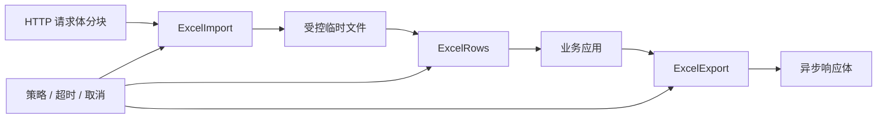

# easyexcel-web

[English](README.md)

框架中立的 Web 运行时，提供有界电子表格上传、背压行流与流式下载。

> 版本: 0.1.2 · Rust 1.88+ · Edition 2024 · Apache-2.0

## 概述

本 crate 是 EasyExcel-Rust Workspace 的正式发布模块。本文面向需要理解模块职责、直接调用底层 API 或维护格式引擎的 Rust 开发者。普通业务项目应优先通过 `easyexcel` 门面访问重导出的能力。

## 一览

```text
输入 / 公共 API -> easyexcel-web -> 类型化模型、行流、文件或报告
```

## 架构



依赖方向必须保持从门面或格式引擎指向基础模块；本 crate 不反向依赖业务应用。

## 能力矩阵

| 能力 | 状态 | 说明 |
|:---|:---|:---|
| 上传落盘 | 可用 | 请求体分块写入自动清理的临时文件。 |
| 背压与并发 | 可用 | 有界行通道与共享 worker 许可。 |
| 稳定错误 | 可用 | 错误码与 RFC 9457 风格问题详情。 |

## 公共 API

| API | 用途 |
|:---|:---|
| `ExcelImport<T>` | 接收分块并创建类型化行流。 |
| `ExcelRows<T>` | 带背压的异步行消费。 |
| `ExcelExport<T>` | 恒定内存生成与 `AsyncRead` 下载。 |
| `ExcelWebPolicy`、`ExcelWebRuntime` | 共享限制、超时、并发与清理策略。 |

API 的权威定义来自当前 `src/lib.rs` 重导出与对应实现；README 不把内部私有对象描述为稳定契约。

## 安装

```toml
[dependencies]
easyexcel-web = "0.1.2"
```

如果项目同时使用多个 EasyExcel 引擎，请改为只依赖 `easyexcel = "0.1.2"`，并通过 `easyexcel::...` 使用，以避免版本漂移。

## 基础使用

```rust
fn main() -> Result<(), Box<dyn std::error::Error>> {
use std::time::Duration;
use easyexcel::io::ResourceLimits;
use easyexcel_web::{ExcelWebPolicy, ExcelWebRuntime};

let limits = ResourceLimits::default()
    .with_max_output_bytes(128 * 1024 * 1024);
let policy = ExcelWebPolicy::new(limits)
    .with_upload_timeout(Duration::from_secs(30))
    .with_processing_timeout(Duration::from_secs(300))
    .with_max_concurrent_tasks(4)
    .with_row_channel_capacity(32);
let runtime = ExcelWebRuntime::new(policy);
let context = runtime.generated_context();
Ok(())
}
```

## 进阶使用

```rust
fn main() -> Result<(), Box<dyn std::error::Error>> {
use easyexcel::io::Format;
use easyexcel_web::{ExcelExport, ExcelWebRuntime};

async fn export<T, I>(
    runtime: &ExcelWebRuntime,
    rows: I,
) -> Result<ExcelExport<T>, easyexcel_web::ExcelWebError>
where
    T: easyexcel::ExcelRow + Send + 'static,
    I: IntoIterator<Item = T>,
    I::IntoIter: Send + 'static,
{
    ExcelExport::prepare(
        rows,
        Format::Xlsx,
        "report.xlsx",
        "Data",
        runtime.generated_context(),
    )
    .await
}
Ok(())
}
```

## 流式语义

XLSX 与旧 XLS 读取器需要随机访问完整容器。因此流式上传表示 HTTP 请求体增量落入受控临时文件，再解析到有界行通道；它**不表示**把整个工作簿缓存在 `Vec<u8>`。

下载会在提交响应头前完成生成，随后通过临时文件异步读取，使框架传输层能够应用背压，同时避免生成失败时返回部分有效的工作簿。

可运行集成位于 `examples/{axum,actix,hyper,poem,rocket,salvo,warp}`，共享行为由 `tests/easyexcel-web-conformance` 定义。

## 错误与能力边界

- V1 强制执行文件字节数与总行数限制；工作表数和公式单元格数仅在所选解析器提供统一计数时可强制。
- 本 crate 不提供具体框架 extractor/responder，请使用七个适配器之一。

资源限制、格式损失或未支持能力必须通过类型化错误、`Option`、warning 或转换报告显式呈现，禁止静默猜测或降级。

## 依赖关系


该图表达公共依赖方向，不表示本 crate 必然依赖所有基础模块。实际依赖以 `Cargo.toml` 为准。

## 证据索引

| 声明 | 事实来源 |
|:---|:---|
| 包版本、MSRV 与依赖 | [`Cargo.toml`](Cargo.toml) |
| 公共重导出 | [`src/lib.rs`](src/lib.rs) |
| 实现行为 | `src/web/` |
| 跨格式边界 | [Workspace 兼容性矩阵](https://github.com/easy-4-rust/easyexcel-rust/blob/main/docs/compatibility.md) |

## 相关链接

- [项目仓库](https://github.com/easy-4-rust/easyexcel-rust)
- [API 文档](https://docs.rs/easyexcel-web)
- [兼容性矩阵](https://github.com/easy-4-rust/easyexcel-rust/blob/main/docs/compatibility.md)
- [变更日志](https://github.com/easy-4-rust/easyexcel-rust/blob/main/CHANGELOG.md)
- [英文 README](README.md)
