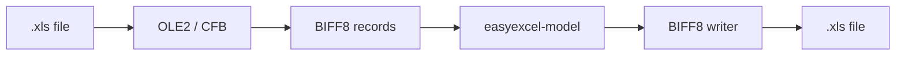

# easyexcel-xls

[简体中文](README.zh-CN.md)

> **文档说明**：easyexcel-xls 引擎层 crate 文档，面向贡献者与引擎实现者说明模块边界。
>
> **版本**：0.1.3
> **最后更新**：2026-08-11

BIFF8/OLE2 `.xls` workbook reader and writer.

> Release: 0.1.3 · Rust 1.88+ · Edition 2024 · Apache-2.0

## Overview

This crate is independently published to support the EasyExcel-Rust internal dependency graph. Its README documents the engine boundary for contributors and engine implementors; application code should depend on `easyexcel` and use the matching `easyexcel::...` facade path.

## At a glance

```text
Application -> easyexcel:: facade -> easyexcel-xls internal engine -> typed result
```

## Architecture



Dependency direction remains from the facade or format engines toward foundations; this crate never depends back on an application.

## Format support matrix

Data source: [`docs/ARCHITECTURE.md` File Format Support](../../docs/ARCHITECTURE.md).

| Dimension | XLS (this crate) | Status |
|:---|:---|:---|
| Read (typed rows) | BIFF8 record parsing via `calamine` + BIFF handlers | stable |
| Read (dynamic / no-model) | Supported | stable |
| Read (event listener) | Workbook Mode only; Event Mode unsupported | N/A |
| Read (password-protected) | BIFF8 CryptoAPI RC4 via `FILEPASS` | stable |
| Write (typed rows) | Custom BIFF8 encoder | stable |
| Write (with password) | BIFF8 CryptoAPI RC4 | stable |
| Write (constant memory) | Not supported; XLS always materializes | not supported |
| Template fill (`{key}` scalar) | LABEL-based scalar replacement | stable |
| Template fill (list `{.}`) | Collection fill with vertical/horizontal/repeat | stable |
| Merge cells | Supported | stable |
| Column width | Supported | stable |
| Row height | Supported | stable |
| Styles (font / fill / alignment) | Basic: FONT/XF/FORMAT/palette allocation | stable |
| Comments / Notes | Read only | stable |
| Hyperlinks | Read only | stable |
| Images | Write only | stable |
| Formulas | Ref3d/Area3d via SUPBOOK/EXTERNSHEET; external workbooks excluded | limited |
| Auto-filter | Not supported | not supported |

## Capabilities and boundaries

### What this crate can do

- Detect OLE2/CFB containers (`looks_like_cfb`, `CFB_MAGIC`) and map BIFF8 records to the shared `Workbook` model.
- Read and write XLS workbooks through `read`/`read_path` and `write`/`write_path`.
- Decrypt and encrypt BIFF8 CryptoAPI RC4 protected files (`read_path_with_password`, `write_path_with_password`).
- Fill XLS templates with scalar and collection placeholders, including `forceNewRow`, style relocation and dependent record migration.
- Preserve the active sheet, default/explicit row and column dimensions, hidden state, row/column XFs, fractional font sizes and all BIFF8 underline modes during round-trip.

### What this crate cannot do

- Event Mode reading: XLS always uses Workbook Mode; requesting Event Mode through higher layers returns a typed unsupported error.
- Constant memory (SXSSF) writing: XLS materializes the full workbook; only XLSX supports `O(window)` writes.
- Write comments, hyperlinks or formulas: these are read-only capabilities for XLS.
- External workbook formula references: only workbook-internal `Ref3d`/`Area3d` through `SUPBOOK`/`EXTERNSHEET` are supported.
- Non-CryptoAPI legacy encryption: these schemes fail explicitly.

## Round-trip fidelity

When reading and then writing an XLS file without modification, this crate preserves:

- Active sheet selection and sheet ordering
- Default/explicit row and column dimensions
- Hidden state for sheets, rows and columns
- Row and column XF (format) records
- Fractional font sizes and all BIFF8 underline modes

Unknown or unsupported BIFF8 record types are retained at the binary level where the record framing allows. Loss must surface through typed errors, `Option`, warnings or conversion reports; silent guessing and downgrade are forbidden.

## Large file / streaming / memory

| Mode | Memory complexity | Applicability |
|:---|:---|:---|
| Workbook Mode (default) | `O(document)` | All XLS reads; full materialization required |
| LazySst (feature `xls-lazy-sst`) | Deferred SST decode | 61.8x construction speedup; strings decoded on first access |
| StreamingRecordIter (feature `xls-streaming-iter`) | No full substream `Vec<u8>` | BIFF record streaming from `BufRead + Seek` |

XLS does not support the XLSX-style `O(window)` constant memory write path. For large-scale exports, consider XLSX format.

## Format safety

- OLE2 container parsing uses the `cfb` crate with bounded record framing; BIFF8 record lengths are fixed to `u8`/`u16`/`u32` bit fields per format specification.
- BIFF8 CryptoAPI RC4 uses `md-5` + `getrandom` for encryption; non-CryptoAPI legacy schemes are rejected explicitly.
- XLS is not a ZIP-based format, so ZIP bomb protection is not applicable.
- Resource limits from `easyexcel-io::ResourceLimits` apply when invoked through the facade.

## Public API

| API | Purpose |
|:---|:---|
| `read`, `read_path` | Parse XLS into `Workbook`. |
| `write`, `write_path` | Encode `Workbook` as XLS. |
| `looks_like_cfb`, `CFB_MAGIC` | Container recognition. |
| `biff8` | Low-level BIFF8 components for engine implementors. |

The current `src/lib.rs` re-exports and their implementations are authoritative. This README does not present private implementation objects as stable API.

## Installation

```toml
[dependencies]
easyexcel = "0.1.3"
```

`easyexcel-xls` is the internal BIFF8 engine. Applications should use `easyexcel::xls` or the high-level `EasyExcel` builders.

## Basic usage

```rust
fn main() -> Result<(), Box<dyn std::error::Error>> {
use std::path::Path;
use easyexcel::xls::{read_path, write_path};

let workbook = read_path(Path::new("input.xls"))?;
write_path(&workbook, Path::new("copy.xls"))?;
Ok(())
}
```

## Advanced usage

```rust
fn main() -> Result<(), Box<dyn std::error::Error>> {
use std::path::Path;
use easyexcel::model::Cell;
use easyexcel::xls::{read_path, write_path};

let mut workbook = read_path(Path::new("input.xls"))?;
workbook.sheets[0].set_a1("B2", Cell::Text("updated".to_owned()));
write_path(&workbook, Path::new("updated.xls"))?;
Ok(())
}
```

## Errors and capability boundaries

- XLS currently uses Workbook Mode. Requesting Event Mode through higher layers must return a typed unsupported error.
- Application code should normally use `easyexcel::xls` or the `EasyExcel` facade rather than coupling to BIFF internals.

Resource limits, format loss and unsupported behavior must surface through typed errors, `Option`, warnings or conversion reports; silent guessing and downgrade are forbidden.

## Relationship to other crates


The diagram shows the public dependency direction, not that this crate depends on every foundation module. `Cargo.toml` is authoritative.

## Evidence map

| Claim | Source of truth |
|:---|:---|
| Package version, MSRV and dependencies | [`Cargo.toml`](Cargo.toml) |
| Public exports | [`src/lib.rs`](src/lib.rs) |
| Implementation behavior | `src/xls/ and src/biff8/` |
| Format support matrix | [ARCHITECTURE.md](../../docs/ARCHITECTURE.md) |
| Cross-format boundaries | [Workspace compatibility matrix](https://github.com/easy-4-rust/easyexcel-rust/blob/main/docs/compatibility.md) |

## Related links

- [Repository](https://github.com/easy-4-rust/easyexcel-rust)
- [API documentation](https://docs.rs/easyexcel-xls)
- [Compatibility matrix](https://github.com/easy-4-rust/easyexcel-rust/blob/main/docs/compatibility.md)
- [Changelog](https://github.com/easy-4-rust/easyexcel-rust/blob/main/CHANGELOG.md)
- [Chinese README](README.zh-CN.md)

---

**文档版本**：V1.0.0
**最后更新**：2026-08-11
**文档状态**：已评审
