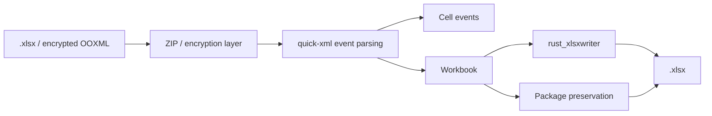

# easyexcel-xlsx

[简体中文](README.zh-CN.md)

> **文档说明**：easyexcel-xlsx 引擎层 crate 文档，面向贡献者与引擎实现者说明模块边界。
>
> **版本**：0.1.3
> **最后更新**：2026-08-11

OOXML `.xlsx` reader, writer, event reader, template package, encryption and preservation-oriented round trip.

> Release: 0.1.3 · Rust 1.88+ · Edition 2024 · Apache-2.0

## Overview

This crate is independently published to support the EasyExcel-Rust internal dependency graph. Its README documents the engine boundary for contributors and engine implementors; application code should depend on `easyexcel` and use the matching `easyexcel::...` facade path.

## At a glance

```text
Application -> easyexcel:: facade -> easyexcel-xlsx internal engine -> typed result
```

## Architecture



Dependency direction remains from the facade or format engines toward foundations; this crate never depends back on an application.

## Format support matrix

Data source: [`docs/ARCHITECTURE.md` File Format Support](../../docs/ARCHITECTURE.md).

| Dimension | XLSX (this crate) | Status |
|:---|:---|:---|
| Read (typed rows) | Custom SAX parser (`quick-xml`) | stable |
| Read (dynamic / no-model) | Supported | stable |
| Read (event listener) | `XlsxCellEventReader` + `stream_sheet_entries` | stable |
| Read (password-protected) | OOXML Agile encryption via `office-crypto` | stable |
| Write (typed rows) | `rust_xlsxwriter` | stable |
| Write (with password) | OOXML Agile encryption via `ms-offcrypto-writer` | stable |
| Write (constant memory / SXSSF) | `O(window)` via gzip spill + streaming readback | stable |
| Template fill (`{key}`) | Scalar replacement in XML templates | stable |
| Template fill (list `{.}`) | Collection fill with direction control | stable |
| Merge cells | Supported | stable |
| Column width | Supported | stable |
| Row height | Supported | stable |
| Styles (font / fill / alignment) | Full style support | stable |
| Comments / Notes | Read + Write | stable |
| Hyperlinks | Read + Write | stable |
| Images | Read + Write with anchor coordinates | stable |
| Formulas | Read + Write | stable |
| Auto-filter | Supported | stable |

## Capabilities and boundaries

### What this crate can do

- Read and write XLSX workbooks through `read_path`/`write_path` and encrypted variants (`read_path_with_password`).
- Stream cell events without materializing every row via `XlsxCellEventReader` and `stream_sheet_entries`.
- Write with constant memory (`O(window)`) using `WriteBackendSelection` 7-state state machine with automatic `AutoStreaming`/`Promoting`/`Explicit` mode selection.
- Fill XLSX templates with scalar and collection placeholders, including comment, hyperlink, image and decoration preservation.
- Preserve unknown ZIP entries and OPC parts during round-trip where supported.
- Read and write comments, hyperlinks, images (with anchor coordinates), formulas and auto-filters.
- Encrypt and decrypt OOXML Agile password-protected files.

### What this crate cannot do

- Lossless edit of macros, charts and every advanced OOXML object: preservation is best-effort.
- Workbook-internal formula references to external workbooks are outside the contract.

## Round-trip fidelity

When reading and then writing an XLSX file without modification, this crate preserves:

- Unknown ZIP entries and OPC package parts retained where supported
- Template source structure including styles.xml component merging
- Sheet ordering, dimension attributes and merged regions

Macro, chart and every advanced OOXML object edit are not promised lossless; preservation warnings should be inspected at higher layers. Loss must surface through typed errors, `Option`, warnings or conversion reports; silent guessing and downgrade are forbidden.

## Large file / streaming / memory

| Mode | Memory complexity | Temporary space | Applicability |
|:---|:---|:---|:---|
| Full read (`read_sync`) | `O(document)` | Low | Random access, small files |
| Event read (`stream` + listener) | `O(batch)` | Low | Large file batch import |
| Constant memory write (SXSSF) | `O(window)` | Medium | Large-scale export (>1M rows) |
| Template edit | `O(template)` | Medium | Template fill, edit operations |

Key performance techniques:

- SAX streaming parse via `quick-xml` pull-based events; does not materialize the entire XML DOM.
- `WriteBackendSelection` 7-state state machine automatically selects optimal write backend.
- Row-level write to gzip temporary file; streaming readback on `finish` for ZIP packaging.
- Handler chain uses `Rc<RefCell<_>>` single-threaded sharing, avoiding `Arc<Mutex<_>>` serialization.

## Format safety

- ZIP container parsing uses the `zip` crate; ZIP bomb protection applies through `easyexcel-io::ResourceLimits`.
- XML parsing uses `quick-xml` pull-based event streaming; no full DOM materialization.
- OOXML Agile encryption uses `ms-offcrypto-writer` for write, `office-crypto` for read.
- Entity expansion and recursion limits are enforced at the IO layer.

## Public API

| API | Purpose |
|:---|:---|
| `read_path`, `write_path` | Workbook-oriented path API. |
| `read_path_with_password` | Password-aware OOXML input. |
| `XlsxCellEventReader`, `stream_sheet_entries` | Event-mode building blocks. |
| `OoxmlPackage`, `OoxmlTemplatePackage` | Package and template preservation types. |

The current `src/lib.rs` re-exports and their implementations are authoritative. This README does not present private implementation objects as stable API.

## Installation

```toml
[dependencies]
easyexcel = "0.1.3"
```

`easyexcel-xlsx` is the internal OOXML engine. Applications should use `easyexcel::xlsx` or the high-level `EasyExcel` builders.

## Basic usage

```rust
fn main() -> Result<(), Box<dyn std::error::Error>> {
use std::path::Path;
use easyexcel::xlsx::{read_path, write_path};

let workbook = read_path(Path::new("input.xlsx"))?;
write_path(&workbook, Path::new("copy.xlsx"))?;
Ok(())
}
```

## Advanced usage

```rust
fn main() -> Result<(), Box<dyn std::error::Error>> {
use std::path::Path;
use easyexcel::xlsx::read_path_with_password;

let password = std::env::var("EASYEXCEL_PASSWORD")?;
let workbook = read_path_with_password(
    Path::new("protected.xlsx"),
    Some(password.as_str()),
)?;
println!("sheets: {}", workbook.sheets.len());
Ok(())
}
```

## Errors and capability boundaries

- Passwords should come from stdin, environment injection or a protected descriptor, not command history or logs.
- Macro, chart and every advanced OOXML object edit are not promised lossless; inspect preservation warnings at higher layers.

Resource limits, format loss and unsupported behavior must surface through typed errors, `Option`, warnings or conversion reports; silent guessing and downgrade are forbidden.

## Relationship to other crates


The diagram shows the public dependency direction, not that this crate depends on every foundation module. `Cargo.toml` is authoritative.

## Evidence map

| Claim | Source of truth |
|:---|:---|
| Package version, MSRV and dependencies | [`Cargo.toml`](Cargo.toml) |
| Public exports | [`src/lib.rs`](src/lib.rs) |
| Implementation behavior | `src/xlsx/` |
| Format support matrix | [ARCHITECTURE.md](../../docs/ARCHITECTURE.md) |
| Cross-format boundaries | [Workspace compatibility matrix](https://github.com/easy-4-rust/easyexcel-rust/blob/main/docs/compatibility.md) |

## Related links

- [Repository](https://github.com/easy-4-rust/easyexcel-rust)
- [API documentation](https://docs.rs/easyexcel-xlsx)
- [Compatibility matrix](https://github.com/easy-4-rust/easyexcel-rust/blob/main/docs/compatibility.md)
- [Changelog](https://github.com/easy-4-rust/easyexcel-rust/blob/main/CHANGELOG.md)
- [Chinese README](README.zh-CN.md)

---

**文档版本**：V1.0.0
**最后更新**：2026-08-11
**文档状态**：已评审
