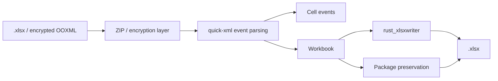

# easyexcel-xlsx

[简体中文](README.zh-CN.md)

OOXML `.xlsx` reader, writer, event reader, template package, encryption and preservation-oriented round trip.

> Release: 0.1.2 · Rust 1.88+ · Edition 2024 · Apache-2.0

## Overview

This crate is a published module in the EasyExcel-Rust workspace. It is intended for Rust developers who need its boundary, direct engine API or implementation details. Application code should normally consume the re-exported surface through the `easyexcel` facade.

## At a glance

```text
Input / public API -> easyexcel-xlsx -> typed model, stream, file or report
```

## Architecture



Dependency direction remains from the facade or format engines toward foundations; this crate never depends back on an application.

## Capability matrix

| Capability | Status | Details |
|:---|:---|:---|
| Workbook read/write | Available | OOXML ZIP package to/from shared model. |
| Event reading | Available | Sheet names, entries and cell events without materializing every row. |
| Round-trip preservation | Best effort | Unknown parts are retained where supported; not every advanced object is lossless. |

## Public API

| API | Purpose |
|:---|:---|
| `read_path`, `write_path` | Workbook-oriented path API. |
| `read_path_with_password` | Password-aware OOXML input. |
| `XlsxCellEventReader`, `stream_sheet_entries` | Event-mode building blocks. |
| `OoxmlPackage`, `OoxmlTemplatePackage` | Package and template preservation types. |

The current `src/lib.rs` re-exports and their implementations are authoritative. This README does not present private implementation objects as stable API.

## Installation

```toml
[dependencies]
easyexcel-xlsx = "0.1.2"
```

If an application needs several EasyExcel engines, prefer a single `easyexcel = "0.1.2"` dependency and the `easyexcel::...` re-exports to prevent version drift.

## Basic usage

```rust
fn main() -> Result<(), Box<dyn std::error::Error>> {
use std::path::Path;
use easyexcel_xlsx::{read_path, write_path};

let workbook = read_path(Path::new("input.xlsx"))?;
write_path(&workbook, Path::new("copy.xlsx"))?;
Ok(())
}
```

## Advanced usage

```rust
fn main() -> Result<(), Box<dyn std::error::Error>> {
use std::path::Path;
use easyexcel_xlsx::read_path_with_password;

let password = std::env::var("EASYEXCEL_PASSWORD")?;
let workbook = read_path_with_password(
    Path::new("protected.xlsx"),
    Some(password.as_str()),
)?;
println!("sheets: {}", workbook.sheets.len());
Ok(())
}
```

## Errors and capability boundaries

- Passwords should come from stdin, environment injection or a protected descriptor, not command history or logs.
- Macro, chart and every advanced OOXML object edit are not promised lossless; inspect preservation warnings at higher layers.

Resource limits, format loss and unsupported behavior must surface through typed errors, `Option`, warnings or conversion reports; silent guessing and downgrade are forbidden.

## Relationship to other crates


The diagram shows the public dependency direction, not that this crate depends on every foundation module. `Cargo.toml` is authoritative.

## Evidence map

| Claim | Source of truth |
|:---|:---|
| Package version, MSRV and dependencies | [`Cargo.toml`](Cargo.toml) |
| Public exports | [`src/lib.rs`](src/lib.rs) |
| Implementation behavior | `src/xlsx/` |
| Cross-format boundaries | [Workspace compatibility matrix](https://github.com/easy-4-rust/easyexcel-rust/blob/main/docs/compatibility.md) |

## Related links

- [Repository](https://github.com/easy-4-rust/easyexcel-rust)
- [API documentation](https://docs.rs/easyexcel-xlsx)
- [Compatibility matrix](https://github.com/easy-4-rust/easyexcel-rust/blob/main/docs/compatibility.md)
- [Changelog](https://github.com/easy-4-rust/easyexcel-rust/blob/main/CHANGELOG.md)
- [Chinese README](README.zh-CN.md)
