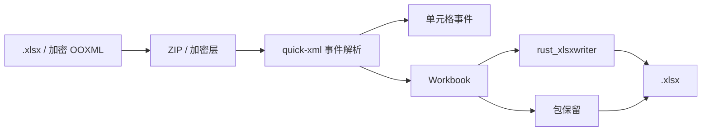

# easyexcel-xlsx

[English](README.md)

OOXML `.xlsx` 读取、写入、事件读取、模板包、加密与面向保留的往返引擎。

> 版本: 0.1.3 · Rust 1.88+ · Edition 2024 · Apache-2.0

## 概述

本 crate 独立发布是为了支撑 EasyExcel-Rust 内部依赖图。README 面向贡献者和引擎实现者说明模块边界；业务应用应只依赖 `easyexcel`，并使用对应的 `easyexcel::...` 门面路径。

## 一览

```text
业务应用 -> easyexcel:: 门面 -> easyexcel-xlsx 内部引擎 -> 类型化结果
```

## 架构



依赖方向必须保持从门面或格式引擎指向基础模块；本 crate 不反向依赖业务应用。

## 能力矩阵

| 能力 | 状态 | 说明 |
|:---|:---|:---|
| 工作簿读写 | 可用 | OOXML ZIP 包与共享模型双向映射。 |
| 事件读取 | 可用 | 无需物化每一行即可读取工作表名称、条目和单元格事件。 |
| 往返保留 | 尽力而为 | 在支持范围保留未知部件，不保证所有高级对象无损。 |

## 公共 API

| API | 用途 |
|:---|:---|
| `read_path`、`write_path` | 工作簿模式路径 API。 |
| `read_path_with_password` | 支持密码的 OOXML 输入。 |
| `XlsxCellEventReader`、`stream_sheet_entries` | 事件模式基础组件。 |
| `OoxmlPackage`、`OoxmlTemplatePackage` | 包与模板保留类型。 |

API 的权威定义来自当前 `src/lib.rs` 重导出与对应实现；README 不把内部私有对象描述为稳定契约。

## 安装

```toml
[dependencies]
easyexcel = "0.1.3"
```

`easyexcel-xlsx` 是内部 OOXML 引擎。业务应用应使用 `easyexcel::xlsx` 或更高层的 `EasyExcel` builder。

## 基础使用

```rust
fn main() -> Result<(), Box<dyn std::error::Error>> {
use std::path::Path;
use easyexcel::xlsx::{read_path, write_path};

let workbook = read_path(Path::new("input.xlsx"))?;
write_path(&workbook, Path::new("copy.xlsx"))?;
Ok(())
}
```

## 进阶使用

```rust
fn main() -> Result<(), Box<dyn std::error::Error>> {
use std::path::Path;
use easyexcel::xlsx::read_path_with_password;

let password = std::env::var("EASYEXCEL_PASSWORD")?;
let workbook = read_path_with_password(
    Path::new("protected.xlsx"),
    Some(password.as_str()),
)?;
println!("sheets: {}", workbook.sheets.len());
Ok(())
}
```

## 错误与能力边界

- 密码应来自 stdin、环境注入或安全描述符，不应写入命令历史或日志。
- 不承诺宏、图表和所有高级 OOXML 对象编辑无损；应检查上层保留警告。

资源限制、格式损失或未支持能力必须通过类型化错误、`Option`、warning 或转换报告显式呈现，禁止静默猜测或降级。

## 依赖关系


该图表达公共依赖方向，不表示本 crate 必然依赖所有基础模块。实际依赖以 `Cargo.toml` 为准。

## 证据索引

| 声明 | 事实来源 |
|:---|:---|
| 包版本、MSRV 与依赖 | [`Cargo.toml`](Cargo.toml) |
| 公共重导出 | [`src/lib.rs`](src/lib.rs) |
| 实现行为 | `src/xlsx/` |
| 跨格式边界 | [Workspace 兼容性矩阵](https://github.com/easy-4-rust/easyexcel-rust/blob/main/docs/compatibility.md) |

## 相关链接

- [项目仓库](https://github.com/easy-4-rust/easyexcel-rust)
- [API 文档](https://docs.rs/easyexcel-xlsx)
- [兼容性矩阵](https://github.com/easy-4-rust/easyexcel-rust/blob/main/docs/compatibility.md)
- [变更日志](https://github.com/easy-4-rust/easyexcel-rust/blob/main/CHANGELOG.md)
- [英文 README](README.md)
