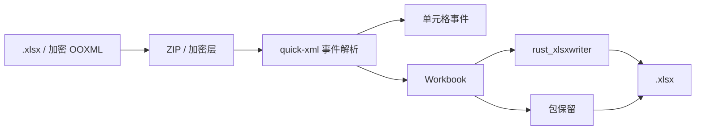

# easyexcel-xlsx

[English](README.md)

> **文档说明**：easyexcel-xlsx 引擎层 crate 文档，面向贡献者与引擎实现者说明模块边界。
>
> **版本**：0.1.3
> **最后更新**：2026-08-11

OOXML `.xlsx` 读取、写入、事件读取、模板包、加密与面向保留的往返引擎。

> 版本: 0.1.3 · Rust 1.88+ · Edition 2024 · Apache-2.0

## 概述

本 crate 独立发布是为了支撑 EasyExcel-Rust 内部依赖图。README 面向贡献者和引擎实现者说明模块边界；业务应用应只依赖 `easyexcel`，并使用对应的 `easyexcel::...` 门面路径。

## 一览

```text
业务应用 -> easyexcel:: 门面 -> easyexcel-xlsx 内部引擎 -> 类型化结果
```

## 架构



依赖方向必须保持从门面或格式引擎指向基础模块；本 crate 不反向依赖业务应用。

## 格式支持矩阵

数据来源：[`docs/ARCHITECTURE.md` File Format Support](../../docs/ARCHITECTURE.md)。

| 维度 | XLSX（本 crate） | 状态 |
|:---|:---|:---|
| 读取（类型化行） | 自定义 SAX 解析器（`quick-xml`） | 稳定 |
| 读取（动态/无模型） | 支持 | 稳定 |
| 读取（事件监听） | `XlsxCellEventReader` + `stream_sheet_entries` | 稳定 |
| 读取（密码保护） | OOXML Agile 加密，通过 `office-crypto` | 稳定 |
| 写入（类型化行） | `rust_xlsxwriter` | 稳定 |
| 写入（带密码） | OOXML Agile 加密，通过 `ms-offcrypto-writer` | 稳定 |
| 写入（常量内存/SXSSF） | `O(window)` 通过 gzip spill + 流式读回 | 稳定 |
| 模板填充（`{key}`） | XML 模板中的标量替换 | 稳定 |
| 模板填充（列表 `{.}`） | 集合填充，支持方向控制 | 稳定 |
| 合并单元格 | 支持 | 稳定 |
| 列宽 | 支持 | 稳定 |
| 行高 | 支持 | 稳定 |
| 样式（字体/填充/对齐） | 完整样式支持 | 稳定 |
| 批注/备注 | 读取 + 写入 | 稳定 |
| 超链接 | 读取 + 写入 | 稳定 |
| 图片 | 读取 + 写入，支持锚点坐标 | 稳定 |
| 公式 | 读取 + 写入 | 稳定 |
| 自动筛选 | 支持 | 稳定 |

## 能力与边界

### 本 crate 能做什么

- 通过 `read_path`/`write_path` 读写 XLSX 工作簿，支持加密变体（`read_path_with_password`）。
- 通过 `XlsxCellEventReader` 和 `stream_sheet_entries` 流式读取单元格事件，无需物化每一行。
- 通过 `WriteBackendSelection` 7 态状态机实现常量内存（`O(window)`）写入，自动选择 `AutoStreaming`/`Promoting`/`Explicit` 模式。
- 用标量和集合占位符填充 XLSX 模板，保留批注、超链接、图片和装饰。
- 往返时在支持范围内保留未知 ZIP 条目和 OPC 部件。
- 读写批注、超链接、图片（含锚点坐标）、公式和自动筛选。
- 加密和解密 OOXML Agile 密码保护文件。

### 本 crate 不能做什么

- 宏、图表和所有高级 OOXML 对象的无损编辑：保留是尽力而为。
- 工作簿内部对外部工作簿的公式引用不在契约内。

## 往返保真

读取后原样写入 XLSX 文件时，本 crate 保留：

- 未知 ZIP 条目和 OPC 包部件在支持范围内保留
- 模板源结构，包括 styles.xml 组件合并
- 工作表排序、dimension 属性和合并区域

宏、图表和所有高级 OOXML 对象编辑不承诺无损；应检查上层保留警告。损失必须通过类型化错误、`Option`、warning 或转换报告显式呈现，禁止静默猜测或降级。

## 大文件 / 流式 / 内存

| 模式 | 内存复杂度 | 临时空间 | 适用场景 |
|:---|:---|:---|:---|
| 全量读取（`read_sync`） | `O(document)` | 低 | 随机访问、小文件 |
| 事件读取（`stream` + listener） | `O(batch)` | 低 | 大文件批量导入 |
| 常量内存写入（SXSSF） | `O(window)` | 中 | 大规模导出（>100 万行） |
| 模板编辑 | `O(template)` | 中 | 模板填充、编辑操作 |

关键性能技术：

- 通过 `quick-xml` pull-based 事件进行 SAX 流式解析，不物化整个 XML DOM。
- `WriteBackendSelection` 7 态状态机自动选择最优写入后端。
- 行级写出到 gzip 临时文件，`finish` 时流式读回打包为 ZIP。
- Handler 链使用 `Rc<RefCell<_>>` 单线程共享，避免 `Arc<Mutex<_>>` 串行加锁。

## 格式安全

- ZIP 容器解析使用 `zip` crate；ZIP bomb 保护通过 `easyexcel-io::ResourceLimits` 生效。
- XML 解析使用 `quick-xml` pull-based 事件流，不物化完整 DOM。
- OOXML Agile 加密写入使用 `ms-offcrypto-writer`，读取使用 `office-crypto`。
- 实体展开和递归限制在 IO 层执行。

## 公共 API

| API | 用途 |
|:---|:---|
| `read_path`、`write_path` | 工作簿模式路径 API。 |
| `read_path_with_password` | 支持密码的 OOXML 输入。 |
| `XlsxCellEventReader`、`stream_sheet_entries` | 事件模式基础组件。 |
| `OoxmlPackage`、`OoxmlTemplatePackage` | 包与模板保留类型。 |

API 的权威定义来自当前 `src/lib.rs` 重导出与对应实现；README 不把内部私有对象描述为稳定契约。

## 安装

```toml
[dependencies]
easyexcel = "0.1.3"
```

`easyexcel-xlsx` 是内部 OOXML 引擎。业务应用应使用 `easyexcel::xlsx` 或更高层的 `EasyExcel` builder。

## 基础使用

```rust
fn main() -> Result<(), Box<dyn std::error::Error>> {
use std::path::Path;
use easyexcel::xlsx::{read_path, write_path};

let workbook = read_path(Path::new("input.xlsx"))?;
write_path(&workbook, Path::new("copy.xlsx"))?;
Ok(())
}
```

## 进阶使用

```rust
fn main() -> Result<(), Box<dyn std::error::Error>> {
use std::path::Path;
use easyexcel::xlsx::read_path_with_password;

let password = std::env::var("EASYEXCEL_PASSWORD")?;
let workbook = read_path_with_password(
    Path::new("protected.xlsx"),
    Some(password.as_str()),
)?;
println!("sheets: {}", workbook.sheets.len());
Ok(())
}
```

## 错误与能力边界

- 密码应来自 stdin、环境注入或安全描述符，不应写入命令历史或日志。
- 不承诺宏、图表和所有高级 OOXML 对象编辑无损；应检查上层保留警告。

资源限制、格式损失或未支持能力必须通过类型化错误、`Option`、warning 或转换报告显式呈现，禁止静默猜测或降级。

## 依赖关系


该图表达公共依赖方向，不表示本 crate 必然依赖所有基础模块。实际依赖以 `Cargo.toml` 为准。

## 证据索引

| 声明 | 事实来源 |
|:---|:---|
| 包版本、MSRV 与依赖 | [`Cargo.toml`](Cargo.toml) |
| 公共重导出 | [`src/lib.rs`](src/lib.rs) |
| 实现行为 | `src/xlsx/` |
| 格式支持矩阵 | [ARCHITECTURE.md](../../docs/ARCHITECTURE.md) |
| 跨格式边界 | [Workspace 兼容性矩阵](https://github.com/easy-4-rust/easyexcel-rust/blob/main/docs/compatibility.md) |

## 相关链接

- [项目仓库](https://github.com/easy-4-rust/easyexcel-rust)
- [API 文档](https://docs.rs/easyexcel-xlsx)
- [兼容性矩阵](https://github.com/easy-4-rust/easyexcel-rust/blob/main/docs/compatibility.md)
- [变更日志](https://github.com/easy-4-rust/easyexcel-rust/blob/main/CHANGELOG.md)
- [英文 README](README.md)

---

**文档版本**：V1.0.0
**最后更新**：2026-08-11
**文档状态**：已评审
