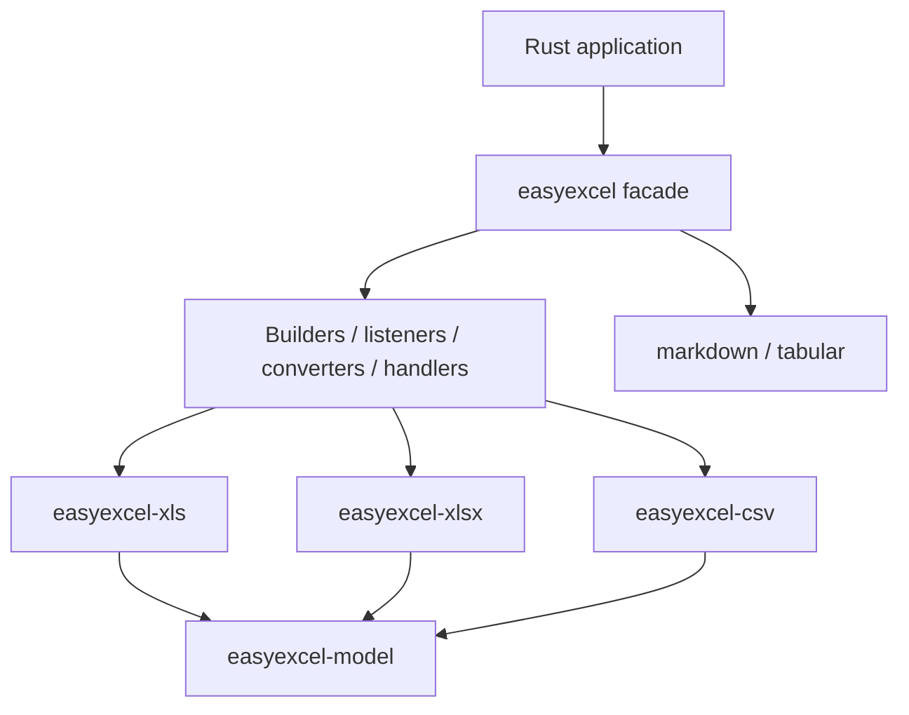

# easyexcel

[简体中文](README.zh-CN.md)

The public EasyExcel-Rust facade with Java EasyExcel-style builders, listeners, converters, handlers and annotation metadata.

> Release: 0.1.3 · Rust 1.88+ · Edition 2024 · Apache-2.0
>
> Last updated: 2026-08-11 · Status: active

## Overview

This crate is a published module in the EasyExcel-Rust workspace. It is intended for Rust developers who need its boundary, direct engine API or implementation details. Application code should normally consume the re-exported surface through the `easyexcel` facade.

## Crate positioning

`easyexcel` is the **public facade** for the entire EasyExcel-Rust workspace. It re-exports typed model, format engines (XLS / XLSX / CSV), formula, markdown projection, template fill and annotation metadata under a single dependency. Application code should depend on `easyexcel` rather than composing individual engine crates to prevent version drift.

Web / HTTP transport concerns (upload spooling, backpressure, streaming download) live in `easyexcel-web` and its seven framework adapters (`easyexcel-axum`, `easyexcel-actix`, `easyexcel-hyper`, `easyexcel-poem`, `easyexcel-rocket`, `easyexcel-salvo`, `easyexcel-warp`).

## At a glance

```text
Input / public API -> easyexcel -> typed model, stream, file or report
```

## Architecture



Dependency direction remains from the facade or format engines toward foundations; this crate never depends back on an application.

## Capabilities and Boundaries

| What easyexcel does | What easyexcel does NOT do |
|:---|:---|
| Typed read/write for XLSX, XLS, CSV via builders | HTTP upload spooling / streaming download (use `easyexcel-web`) |
| Event-driven and workbook read modes | Framework-specific extractor / responder (use adapter crates) |
| Markdown projection with structured loss report | Business validation, authorization or persistence |
| Template fill with loop merge and direction control | |
| Annotation-driven `ExcelRow` derive macro | |

## Capability matrix

| Capability | Status | Details |
|:---|:---|:---|
| Typed read/write | Available | XLSX, XLS and CSV through builders. |
| Event and workbook modes | Available by format | XLSX/CSV event paths; XLS workbook path. |
| Markdown projection | Available | Import/export with policy and structured loss report. |

## Public API

| API | Purpose |
|:---|:---|
| `EasyExcel`, `EasyExcelFactory` | Facade entry points. |
| `ExcelReaderBuilder`, `ExcelWriterBuilder` | Typed read/write configuration. |
| `ReadListener`, `Converter`, `WriteHandler` | Extension contracts. |
| `ExcelRow` | Re-exported typed-row derive macro. |

The current `src/lib.rs` re-exports and their implementations are authoritative. This README does not present private implementation objects as stable API.

## Installation

```toml
[dependencies]
easyexcel = "0.1.3"
```

If an application needs several EasyExcel engines, prefer a single `easyexcel = "0.1.3"` dependency and the `easyexcel::...` re-exports to prevent version drift.

For Web endpoints, also add the appropriate framework adapter:

```toml
[dependencies]
easyexcel = "0.1.3"
easyexcel-web = "0.1.3"
easyexcel-axum = "0.1.3"   # or actix / hyper / poem / rocket / salvo / warp
```

See the [Usage from examples](#usage-from-examples) section below for Web integration code, or jump to [`easyexcel-web`](#relationship-to-other-crates) for the transport runtime.

## Basic usage

```rust
fn main() -> Result<(), Box<dyn std::error::Error>> {
use easyexcel::{EasyExcel, ExcelRow};

#[derive(Debug, ExcelRow)]
struct User {
    #[excel(name = "Name")]
    name: String,
    #[excel(name = "Age")]
    age: i32,
}

let users = EasyExcel::read_sync::<User>("users.xlsx")
    .head_row_number(1)
    .do_read_sync()?;

EasyExcel::write::<User>("copy.xlsx")
    .sheet("Users")
    .do_write(users)?;
Ok(())
}
```

## Advanced usage

```rust
fn main() -> Result<(), Box<dyn std::error::Error>> {
use easyexcel::markdown::{
    MarkdownConversionMode, MarkdownFormulaPolicy,
    MarkdownMergePolicy,
};
use easyexcel::EasyExcel;

let report = EasyExcel::export_markdown("report.xlsx", "report.md")
    .mode(MarkdownConversionMode::Auto)
    .formula_policy(MarkdownFormulaPolicy::CachedValue)
    .merge_policy(MarkdownMergePolicy::AnchorWithWarning)
    .do_export()?;
println!("warnings: {}", report.warnings.len());

EasyExcel::import_markdown("tables.md", "generated.xlsx")
    .conservative_types()
    .apply_header_style(true)
    .do_import()?;
Ok(())
}
```

## Usage from examples

The examples below are extracted from runnable code in [`examples/`](https://github.com/easy-4-rust/easyexcel-rust/tree/main/examples).

**Web download (Axum, port 8080)**

```rust
use axum::extract::State;
use easyexcel::io::Format;
use easyexcel_axum::{ExcelRejection, ExcelResponse, ExcelWebRuntime};

async fn download(
    State(runtime): State<ExcelWebRuntime>,
) -> Result<ExcelResponse<ReportRow>, ExcelRejection> {
    ExcelResponse::prepare(
        report_rows(),
        Format::Xlsx,
        "report.xlsx",
        "Data",
        runtime.generated_context(),
    ).await
}
```

**Web upload (Axum)**

```rust
use easyexcel_axum::{ExcelRejection, ExcelRequest};

async fn upload(
    request: ExcelRequest<ReportRow>,
) -> Result<String, ExcelRejection> {
    let request_id = request.request_id().to_owned();
    let mut rows = request.into_rows();
    let mut count = 0_u64;
    while let Some(row) = rows.next_row().await {
        row.map_err(|error| ExcelRejection::new(error, &request_id))?;
        count += 1;
    }
    Ok(format!("success: {count} rows"))
}
```

Each framework adapter has its own example with a dedicated port. See the [Compatibility matrix](https://github.com/easy-4-rust/easyexcel-rust/blob/main/docs/compatibility.md) for the full adapter list.

## Errors and capability boundaries

- This is the recommended application dependency; use `easyexcel::{model, io, csv, xls, xlsx, formula, markdown, tabular}` instead of versioning engine crates independently.
- Unsupported format behavior returns typed errors or warnings; it must not silently downgrade.

Resource limits, format loss and unsupported behavior must surface through typed errors, `Option`, warnings or conversion reports; silent guessing and downgrade are forbidden.

## Relationship to other crates


The diagram shows the public dependency direction, not that this crate depends on every foundation module. `Cargo.toml` is authoritative.

## Evidence map

| Claim | Source of truth |
|:---|:---|
| Package version, MSRV and dependencies | [`Cargo.toml`](Cargo.toml) |
| Public exports | [`src/lib.rs`](src/lib.rs) |
| Implementation behavior | `src/read/, src/write/ and src/markdown/` |
| Cross-format boundaries | [Workspace compatibility matrix](https://github.com/easy-4-rust/easyexcel-rust/blob/main/docs/compatibility.md) |

## Related links

- [Repository](https://github.com/easy-4-rust/easyexcel-rust)
- [API documentation](https://docs.rs/easyexcel)
- [easyexcel-web](https://crates.io/crates/easyexcel-web) -- Web transport runtime
- [Web conformance suite](https://github.com/easy-4-rust/easyexcel-rust/tree/main/tests/easyexcel-web-conformance)
- [Compatibility matrix](https://github.com/easy-4-rust/easyexcel-rust/blob/main/docs/compatibility.md)
- [Changelog](https://github.com/easy-4-rust/easyexcel-rust/blob/main/CHANGELOG.md)
- [Chinese README](README.zh-CN.md)
