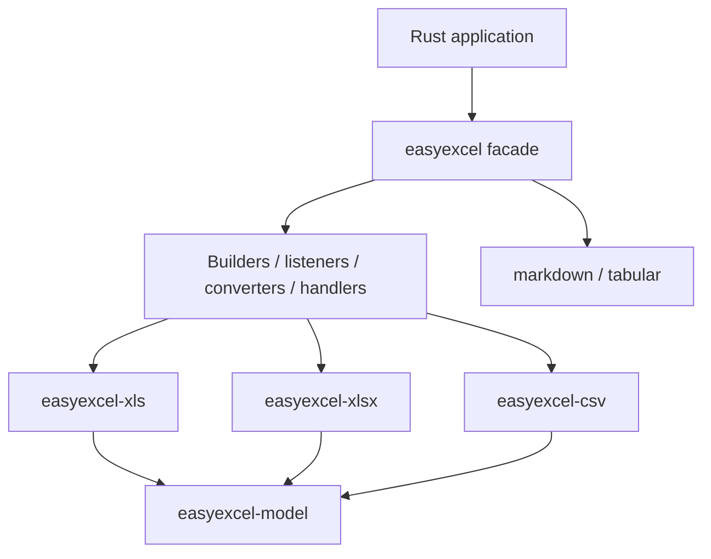

# easyexcel

[简体中文](README.zh-CN.md)

The public EasyExcel-Rust facade with Java EasyExcel-style builders, listeners, converters, handlers and annotation metadata.

> Release: 0.1.2 · Rust 1.88+ · Edition 2024 · Apache-2.0

## Overview

This crate is a published module in the EasyExcel-Rust workspace. It is intended for Rust developers who need its boundary, direct engine API or implementation details. Application code should normally consume the re-exported surface through the `easyexcel` facade.

## At a glance

```text
Input / public API -> easyexcel -> typed model, stream, file or report
```

## Architecture



Dependency direction remains from the facade or format engines toward foundations; this crate never depends back on an application.

## Capability matrix

| Capability | Status | Details |
|:---|:---|:---|
| Typed read/write | Available | XLSX, XLS and CSV through builders. |
| Event and workbook modes | Available by format | XLSX/CSV event paths; XLS workbook path. |
| Markdown projection | Available | Import/export with policy and structured loss report. |

## Public API

| API | Purpose |
|:---|:---|
| `EasyExcel`, `EasyExcelFactory` | Facade entry points. |
| `ExcelReaderBuilder`, `ExcelWriterBuilder` | Typed read/write configuration. |
| `ReadListener`, `Converter`, `WriteHandler` | Extension contracts. |
| `ExcelRow` | Re-exported typed-row derive macro. |

The current `src/lib.rs` re-exports and their implementations are authoritative. This README does not present private implementation objects as stable API.

## Installation

```toml
[dependencies]
easyexcel = "0.1.2"
```

If an application needs several EasyExcel engines, prefer a single `easyexcel = "0.1.2"` dependency and the `easyexcel::...` re-exports to prevent version drift.

## Basic usage

```rust
fn main() -> Result<(), Box<dyn std::error::Error>> {
use easyexcel::{EasyExcel, ExcelRow};

#[derive(Debug, ExcelRow)]
struct User {
    #[excel(name = "Name")]
    name: String,
    #[excel(name = "Age")]
    age: i32,
}

let users = EasyExcel::read_sync::<User>("users.xlsx")
    .head_row_number(1)
    .do_read_sync()?;

EasyExcel::write::<User>("copy.xlsx")
    .sheet("Users")
    .do_write(users)?;
Ok(())
}
```

## Advanced usage

```rust
fn main() -> Result<(), Box<dyn std::error::Error>> {
use easyexcel::markdown::{
    MarkdownConversionMode, MarkdownFormulaPolicy,
    MarkdownMergePolicy,
};
use easyexcel::EasyExcel;

let report = EasyExcel::export_markdown("report.xlsx", "report.md")
    .mode(MarkdownConversionMode::Auto)
    .formula_policy(MarkdownFormulaPolicy::CachedValue)
    .merge_policy(MarkdownMergePolicy::AnchorWithWarning)
    .do_export()?;
println!("warnings: {}", report.warnings.len());

EasyExcel::import_markdown("tables.md", "generated.xlsx")
    .conservative_types()
    .apply_header_style(true)
    .do_import()?;
Ok(())
}
```

## Errors and capability boundaries

- This is the recommended application dependency; use `easyexcel::{model, io, csv, xls, xlsx, formula, markdown, tabular}` instead of versioning engine crates independently.
- Unsupported format behavior returns typed errors or warnings; it must not silently downgrade.

Resource limits, format loss and unsupported behavior must surface through typed errors, `Option`, warnings or conversion reports; silent guessing and downgrade are forbidden.

## Relationship to other crates


The diagram shows the public dependency direction, not that this crate depends on every foundation module. `Cargo.toml` is authoritative.

## Evidence map

| Claim | Source of truth |
|:---|:---|
| Package version, MSRV and dependencies | [`Cargo.toml`](Cargo.toml) |
| Public exports | [`src/lib.rs`](src/lib.rs) |
| Implementation behavior | `src/read/, src/write/ and src/markdown/` |
| Cross-format boundaries | [Workspace compatibility matrix](https://github.com/easy-4-rust/easyexcel-rust/blob/main/docs/compatibility.md) |

## Related links

- [Repository](https://github.com/easy-4-rust/easyexcel-rust)
- [API documentation](https://docs.rs/easyexcel)
- [Compatibility matrix](https://github.com/easy-4-rust/easyexcel-rust/blob/main/docs/compatibility.md)
- [Changelog](https://github.com/easy-4-rust/easyexcel-rust/blob/main/CHANGELOG.md)
- [Chinese README](README.zh-CN.md)
