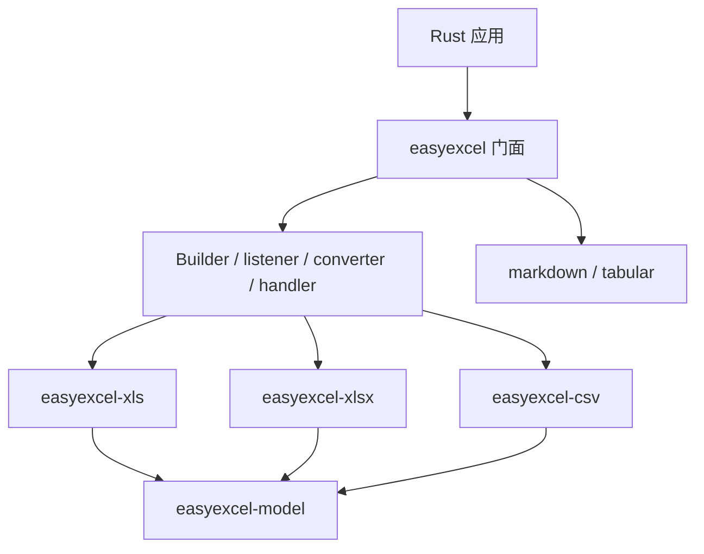

# easyexcel

[English](README.md)

EasyExcel-Rust 面向用户的统一门面，提供 Java EasyExcel 风格 builder、listener、converter、handler 与注解元数据。

> 版本: 0.1.3 · Rust 1.88+ · Edition 2024 · Apache-2.0
>
> 最后更新: 2026-08-11 · 状态: 活跃

## 概述

本 crate 是 EasyExcel-Rust Workspace 的正式发布模块。本文面向需要理解模块职责、直接调用底层 API 或维护格式引擎的 Rust 开发者。普通业务项目应优先通过 `easyexcel` 门面访问重导出的能力。

## Crate 定位

`easyexcel` 是整个 EasyExcel-Rust Workspace 的**公共门面**。它将类型化模型、格式引擎（XLS / XLSX / CSV）、公式、Markdown 投影、模板填充与注解元数据统一重导出到单一依赖下。业务代码应依赖 `easyexcel` 而非自行组合各引擎 crate，以避免版本漂移。

Web / HTTP 传输关注点（上传落盘、背压、流式下载）位于 `easyexcel-web` 及其七个框架适配器（`easyexcel-axum`、`easyexcel-actix`、`easyexcel-hyper`、`easyexcel-poem`、`easyexcel-rocket`、`easyexcel-salvo`、`easyexcel-warp`）。

## 一览

```text
输入 / 公共 API -> easyexcel -> 类型化模型、行流、文件或报告
```

## 架构



依赖方向必须保持从门面或格式引擎指向基础模块；本 crate 不反向依赖业务应用。

## 能力与边界

| easyexcel 做什么 | easyexcel 不做什么 |
|:---|:---|
| 通过 builder 类型化读写 XLSX、XLS、CSV | HTTP 上传落盘 / 流式下载（使用 `easyexcel-web`） |
| 事件驱动与工作簿读取模式 | 框架特定 extractor / responder（使用适配器 crate） |
| 带结构化损失报告的 Markdown 投影 | 业务校验、鉴权或持久化 |
| 带循环合并与方向控制的模板填充 | |
| 注解驱动的 `ExcelRow` derive 宏 | |

## 能力矩阵

| 能力 | 状态 | 说明 |
|:---|:---|:---|
| 类型化读写 | 可用 | 通过 builder 读写 XLSX、XLS 与 CSV。 |
| 事件与工作簿模式 | 按格式可用 | XLSX/CSV 事件路径，XLS 工作簿路径。 |
| Markdown 投影 | 可用 | 带策略和结构化损失报告的导入导出。 |

## 公共 API

| API | 用途 |
|:---|:---|
| `EasyExcel`、`EasyExcelFactory` | 门面入口。 |
| `ExcelReaderBuilder`、`ExcelWriterBuilder` | 类型化读写配置。 |
| `ReadListener`、`Converter`、`WriteHandler` | 扩展契约。 |
| `ExcelRow` | 重导出的类型化行派生宏。 |

API 的权威定义来自当前 `src/lib.rs` 重导出与对应实现；README 不把内部私有对象描述为稳定契约。

## 安装

```toml
[dependencies]
easyexcel = "0.1.3"
```

如果项目同时使用多个 EasyExcel 引擎，请改为只依赖 `easyexcel = "0.1.3"`，并通过 `easyexcel::...` 使用，以避免版本漂移。

如需 Web 端点，还需添加对应的框架适配器：

```toml
[dependencies]
easyexcel = "0.1.3"
easyexcel-web = "0.1.3"
easyexcel-axum = "0.1.3"   # 或 actix / hyper / poem / rocket / salvo / warp
```

参见下方 [来自 examples 的用法](#来自-examples-的用法) 获取 Web 集成代码，或跳转到 [`easyexcel-web`](#依赖关系) 了解传输运行时。

## 基础使用

```rust
fn main() -> Result<(), Box<dyn std::error::Error>> {
use easyexcel::{EasyExcel, ExcelRow};

#[derive(Debug, ExcelRow)]
struct User {
    #[excel(name = "Name")]
    name: String,
    #[excel(name = "Age")]
    age: i32,
}

let users = EasyExcel::read_sync::<User>("users.xlsx")
    .head_row_number(1)
    .do_read_sync()?;

EasyExcel::write::<User>("copy.xlsx")
    .sheet("Users")
    .do_write(users)?;
Ok(())
}
```

## 进阶使用

```rust
fn main() -> Result<(), Box<dyn std::error::Error>> {
use easyexcel::markdown::{
    MarkdownConversionMode, MarkdownFormulaPolicy,
    MarkdownMergePolicy,
};
use easyexcel::EasyExcel;

let report = EasyExcel::export_markdown("report.xlsx", "report.md")
    .mode(MarkdownConversionMode::Auto)
    .formula_policy(MarkdownFormulaPolicy::CachedValue)
    .merge_policy(MarkdownMergePolicy::AnchorWithWarning)
    .do_export()?;
println!("warnings: {}", report.warnings.len());

EasyExcel::import_markdown("tables.md", "generated.xlsx")
    .conservative_types()
    .apply_header_style(true)
    .do_import()?;
Ok(())
}
```

## 来自 examples 的用法

以下代码提取自 [`examples/`](https://github.com/easy-4-rust/easyexcel-rust/tree/main/examples) 中的可运行代码。

**Web 下载（Axum，端口 8080）**

```rust
use axum::extract::State;
use easyexcel::io::Format;
use easyexcel_axum::{ExcelRejection, ExcelResponse, ExcelWebRuntime};

async fn download(
    State(runtime): State<ExcelWebRuntime>,
) -> Result<ExcelResponse<ReportRow>, ExcelRejection> {
    ExcelResponse::prepare(
        report_rows(),
        Format::Xlsx,
        "report.xlsx",
        "Data",
        runtime.generated_context(),
    ).await
}
```

**Web 上传（Axum）**

```rust
use easyexcel_axum::{ExcelRejection, ExcelRequest};

async fn upload(
    request: ExcelRequest<ReportRow>,
) -> Result<String, ExcelRejection> {
    let request_id = request.request_id().to_owned();
    let mut rows = request.into_rows();
    let mut count = 0_u64;
    while let Some(row) = rows.next_row().await {
        row.map_err(|error| ExcelRejection::new(error, &request_id))?;
        count += 1;
    }
    Ok(format!("success: {count} rows"))
}
```

每个框架适配器都有独立示例和专用端口。完整适配器列表参见[兼容性矩阵](https://github.com/easy-4-rust/easyexcel-rust/blob/main/docs/compatibility.md)。

## 错误与能力边界

- 这是推荐的应用依赖；应使用 `easyexcel::{model, io, csv, xls, xlsx, formula, markdown, tabular}`，不要独立组合不同版本的引擎 crate。
- 未支持格式行为返回类型化错误或警告，禁止静默降级。

资源限制、格式损失或未支持能力必须通过类型化错误、`Option`、warning 或转换报告显式呈现，禁止静默猜测或降级。

## 依赖关系


该图表达公共依赖方向，不表示本 crate 必然依赖所有基础模块。实际依赖以 `Cargo.toml` 为准。

## 证据索引

| 声明 | 事实来源 |
|:---|:---|
| 包版本、MSRV 与依赖 | [`Cargo.toml`](Cargo.toml) |
| 公共重导出 | [`src/lib.rs`](src/lib.rs) |
| 实现行为 | `src/read/, src/write/ and src/markdown/` |
| 跨格式边界 | [Workspace 兼容性矩阵](https://github.com/easy-4-rust/easyexcel-rust/blob/main/docs/compatibility.md) |

## 相关链接

- [项目仓库](https://github.com/easy-4-rust/easyexcel-rust)
- [API 文档](https://docs.rs/easyexcel)
- [easyexcel-web](https://crates.io/crates/easyexcel-web) -- Web 传输运行时
- [Web 一致性测试套件](https://github.com/easy-4-rust/easyexcel-rust/tree/main/tests/easyexcel-web-conformance)
- [兼容性矩阵](https://github.com/easy-4-rust/easyexcel-rust/blob/main/docs/compatibility.md)
- [变更日志](https://github.com/easy-4-rust/easyexcel-rust/blob/main/CHANGELOG.md)
- [英文 README](README.md)
