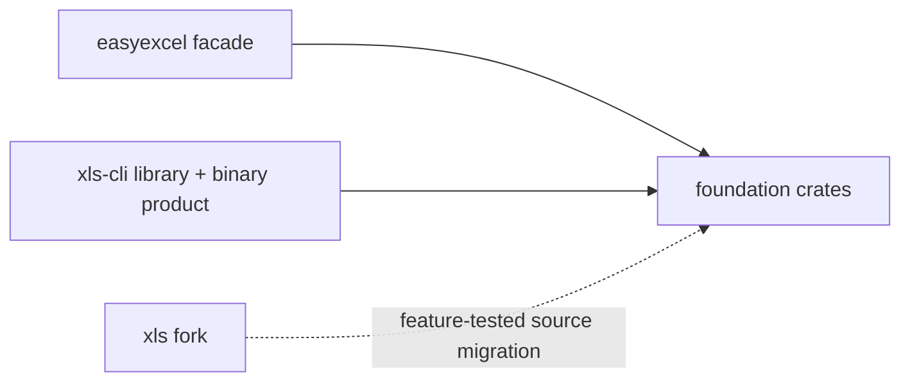
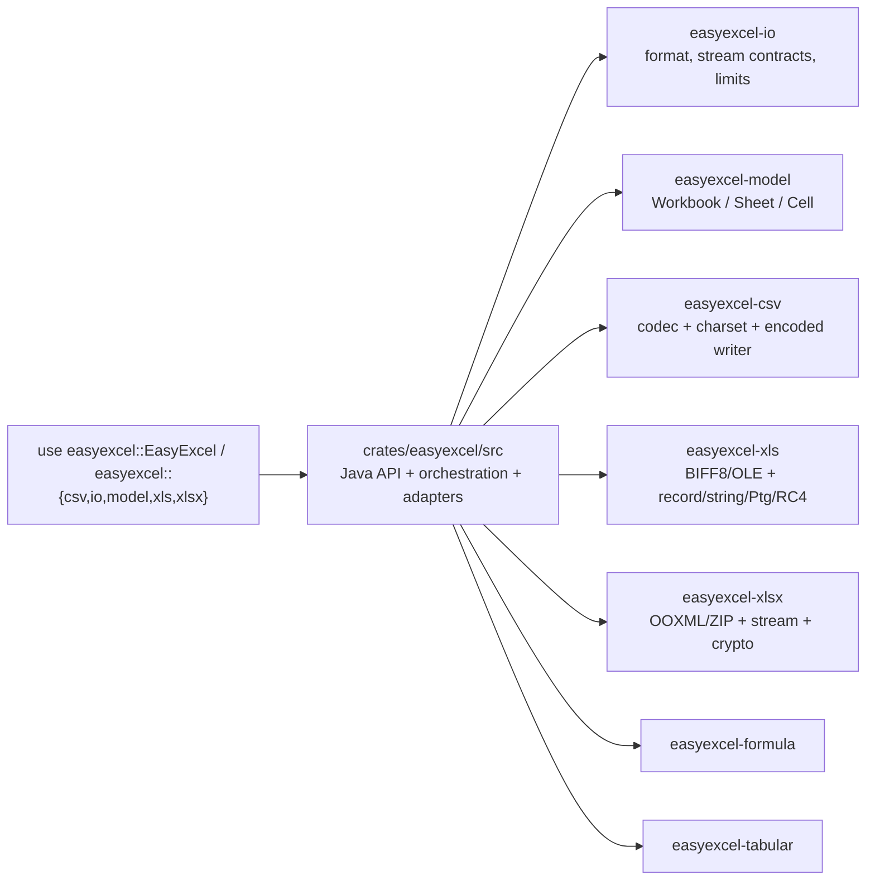

# easyexcel-rust Architecture

> Java EasyExcel 风格门面 + 可复用的 Rust 表格基础能力平台。
>
> `easyexcel` 保持工程 API；格式、模型、公式、转换和命令用例位于单向依赖的基础 crates。

## Current Crate Layout

```
easyexcel-rust/                       (workspace root)
├── crates/
│   ├── easyexcel-model/             ← format-neutral workbook model
│   ├── easyexcel-formula/           ← formula AST/evaluator/recalc
│   ├── easyexcel-io/                ← formats, streaming traits, limits
│   ├── easyexcel-xls/               ← BIFF8/OLE2 backend
│   ├── easyexcel-xlsx/              ← OOXML + event stream backend
│   ├── easyexcel-csv/               ← CSV/TSV codec
│   ├── easyexcel-tabular/           ← Markdown/HTML/JSON conversion
│   ├── easyexcel-derive/            ← internal `#[derive(ExcelRow)]` proc macro
│   ├── easyexcel/                    ← user-facing EasyExcel facade
│   └── easyexcel-{axum,actix,...}/  ← web framework adapters
├── examples/                         ← read/write/fill/web demos
├── tests/easyexcel-test/             ← integration and parity tests
├── xtask/                           ← audit and maintenance commands
├── docs/
├── scripts/
└── ...
```

详细拆分和产品边界见 [`xls-cli-integration-plan.md`](xls-cli-integration-plan.md)，运行时能力见 [`xls-cli-capability-matrix.md`](xls-cli-capability-matrix.md)。

## Dependency Direction



`easyexcel` 与独立 `xls-cli` 是并列消费者；门面不依赖命令层，`xls-cli` 的 library/application、CLI、TUI、npm 和 Skills 位于同一产品仓库，且不依赖旧 fork。

## Code Placement Boundary

`crates/easyexcel/src` 不是第二套格式引擎。它只允许保存 Java EasyExcel 工程体验所需的个性化层：builder、listener、converter、handler、上下文、注解元数据适配，以及把这些契约编排到基础引擎的 adapter。



| 代码类型 | 唯一归属 | `crates/easyexcel/src` 中允许的形态 |
|---|---|---|
| 格式识别、BOM、资源限制、RowSource/RowSink | `easyexcel-io` | `easyexcel::io` 显式重导出及 Java 枚举映射 |
| Workbook/Sheet/Cell/Style 中立模型 | `easyexcel-model` | `easyexcel::model` 显式重导出 |
| CSV 字符集、转码、CSV codec | `easyexcel-csv` | `easyexcel::csv` 与旧 Java 路径兼容重导出 |
| 共享字符串内存/Moka/临时文件缓存 | `easyexcel-cache` | Java `ReadCache` 与 selector 契约适配；`Ehcache` 只保留兼容名称 |
| BIFF8 record、SST/Unicode、Ptg、RC4、OLE | `easyexcel-xls` | 错误类型与 listener 生命周期 adapter |
| OOXML ZIP、流式行、RoundTrip、加解密 | `easyexcel-xlsx` | converter/handler 编排与 `rust_xlsxwriter` 生成 adapter |
| 公式 AST/求值/重算 | `easyexcel-formula` | `easyexcel::formula` 重导出及 Java API 调用适配 |
| Markdown/HTML/JSON 表格转换 | `easyexcel-tabular` | `easyexcel::tabular` 重导出 |
| builder/listener/converter/handler/annotation | `easyexcel` | 真实实现，不下沉 |

当前已经消除的重复实现包括 CSV 字符集与增量转码、BIFF8 record framing、SST/Unicode 解码、公式 Ptg 编码、BIFF8 RC4、OOXML Agile 加密写入，以及以下原先仍位于门面中的底层实现：

| 原 `easyexcel/src` 实现 | 新的唯一实现位置 | 门面保留内容 |
|---|---|---|
| `write/biff8/workbook.rs`、`cached.rs` | `easyexcel-xls::biff8::{workbook,cached}` | 兼容重导出与 `ExcelError` 自动转换 |
| `write/biff8/style.rs` 的 FONT/XF/FORMAT/调色板分配及对齐/填充/颜色协议码 | `easyexcel-xls::biff8::style` | `ExcelCellStyle`、`ExcelFontStyle` 到语义化 `Biff8StyleRequest` 的映射 |
| `write/biff8/template.rs` 的 OLE/BIFF record-preserving 修改与 XLS 占位符解析/替换 | `easyexcel-xls::biff8::template` | `CellValue` 到中立文本或 `Biff8Cell` 的转换 |
| `read/xls_display.rs` 的 FORMAT/XF/NUMBER/RK/MULRK 扫描 | `easyexcel-xls::biff8::numeric` | POI/EasyExcel 本地化显示格式选择 |
| `analysis/v03` 的 BIFF SID、记录长度、CONTINUE 分段状态机与 BOF 子流类型码 | `easyexcel-xls::biff8::{record_sid,event_record,continuation_decoder}` | Java handler 名称、开关、状态与事件路由 |
| BIFF8 OBJ `ftCmo` 子记录与批注对象编号解析 | `easyexcel-xls::biff8::event_record::decode_obj_common_data` | `ObjRecordHandler` 只保留 Java `tempObjectIndex` 状态 |
| BIFF8 行列上限、冻结窗格、行高/列宽坐标与合并区域收窄 | `easyexcel-xls::biff8::workbook::{Biff8Sheet,Biff8Merge}` | `WriteOptions`、注解和 handler 结果到引擎参数的编排 |
| `read/xlsx_rows.rs` 的 OPC 路径与关系解析 | `easyexcel-xlsx::xlsx::package` | listener、读取缓存、extra handler 与 Java 显示语义 |
| `write/template_write.rs` 的 ZIP 条目保留/重打包 | `easyexcel-xlsx::xlsx::ooxml_package` | 模板来源选择与 EasyExcel 写入编排 |
| `write/template_write.rs` 的行 XML、列宽、合并、dimension | `easyexcel-xlsx::xlsx::template_xml` | `CellValue`、`MergeRange` 到中立输入的转换 |
| `write/template_write.rs` 的 styles.xml 组件合并 | `easyexcel-xlsx::xlsx::template_styles` | `rust_xlsxwriter` 样式编译结果的调用编排 |
| 模板目标工作表选择与 `First == Index(0)` 等价规则 | `easyexcel-xlsx::TemplateSheetSelector` | `TemplateSheet` 到引擎选择器的映射与 fill 生命周期 |
| `rust_xlsxwriter::Workbook` 的 XLSX 序列化、落盘、流输出和加密 | `easyexcel-xlsx::xlsx::generation` | 工作簿生成流程与 Java handler/context 编排 |
| XLSX 行列坐标上限 | `easyexcel-xlsx::xlsx::generation::{validate_row_index,validate_column_index}` | Java `WorkBookUtil` creator 生命周期适配 |
| Excel 15 位有效数字数学上下文常量 | `easyexcel-format::EXCEL_MATH_CONTEXT_PRECISION` | Java `EasyExcelConstants` 路径重导出 |
| `util/file_utils.rs`、`util/io_utils.rs` | `easyexcel-io::io::{file_utils,io_utils}` | Java 包路径和错误类型兼容代理 |
| `util` 中与门面类型无关的集合、字符串、坐标和条件校验算法 | `easyexcel-utils::utils` | Java 工具类方法名和 `ExcelError` 映射 |
| `write/gzip_spill.rs` 的临时文件/gzip/framing/单元格协议 | `easyexcel-io::io::{gzip_record,gzip_cell_record}` | EasyExcel `CellValue` 与中立 `GzipCellValue` 的映射 |
| Java `ReadCacheSelector` 的阈值选择，以及旧 `Ehcache` 语义对应的活跃条目淘汰、写入/只读阶段切换和持久后备 | `easyexcel-cache::cache::{SharedStringCachePolicy,SharedStringCacheHandle,shared_string_cache}`（Moka + 临时文件） | selector 参数、`MokaCache` 的 `ReadCache` 适配；内部入口使用 `moka()`，`Ehcache`/`ehcache()` 仅为弃用兼容名称 |
| CSV 物理行列索引的有界转换 | `easyexcel-csv::csv::index` | `ExcelError` 映射与 listener 行调度 |
| 路径扩展名与文件头 magic 的工作簿格式探测、未知格式默认 CSV | `easyexcel-io::Format::detect_path` | `Format` 到 Java `ExcelTypeEnum` 与 executor 的映射 |
| 可克隆输出流的共享所有权、关闭与刷新 | `easyexcel-io::CloseableOutputStream` | `ExcelOutputStream` Java 兼容类型别名 |
| 中立工作表持久化单元格/样式的稀疏边界扫描 | `easyexcel-model::Sheet::stored_range` | 按行映射为 EasyExcel `CellValue`、公式元数据并触发 listener |
| 中立工作表持久化范围的逐行遍历与物理宽度 | `easyexcel-model::{StoredRow,Sheet::stored_rows}` | 把每行中立 `Cell` 映射为 EasyExcel metadata 并触发 listener |
| 未选中工作表可跳过的 BIFF 事件记录分类 | `easyexcel-xls::biff8::record_sid::is_skippable_event_record` | 根据 `SheetSelector` 维护 Java handler 的启停状态与统计信息 |
| 数据格式元数据有效值选择与 `General` 回退 | `easyexcel-model::DataFormatData::{resolve,general}` | 保留 Java `StyleUtil#buildDataFormat` 方法名与参数契约 |
| XLS/XLSX 工作表不存在的强类型错误 | `easyexcel-io::Error::SheetNotFound` | 映射为 Java 风格 `ExcelError::SheetNotFound`，不再解析引擎错误字符串 |
| 按首张、下标、名称或全部选择工作表，以及事件流逐表命中判断 | `easyexcel-io::{SheetSelection,select_sheet_names}`、`SheetSelection::matches` | 把 Java 风格 `SheetSelector` 映射为中立选择请求，并进入 listener 生命周期 |
| 零基闭区间读取行范围校验与表头保留筛选 | `easyexcel-io::{validate_row_range,row_is_selected}` | 从 `ReadOptions` 取值并映射为 EasyExcel 公共错误/回调决策 |
| Java `String#trim` 兼容算法 | `easyexcel-utils::string_utils::java_trim` | 门面决定何时启用 `auto_trim`，基础函数执行字符边界规则 |
| Java `FieldUtils.resolveCglibFieldName` 首字母规范化 | `easyexcel-utils::string_utils::resolve_cglib_field_name` | `FieldUtils` 兼容路径与 `ExcelRow::schema()` 字段查询 |

Java 反射不会以空壳 API 留在 Rust 门面：`ClassUtils`/`FieldUtils` 通过
`#[derive(ExcelRow)]` 生成的静态 schema 提供真实字段与 `ExcelContentProperty` 查询。
Java 中仅用于 JVM 反射可访问性修复的包级 `MemberUtils` 没有 Rust 对应行为，因此不
暴露伪实现；未接入模块树的旧 `read/read.rs` 占位目录也已移除。

`crates/easyexcel/src/analysis/v03` 中保留的同名文件只做 EasyExcel 错误和事件回调适配，不再实现底层格式算法。`read/xlsx_rows.rs` 与 `write/template_write.rs` 仍然较大，是因为它们承载 listener/cache/handler 和 Java 模板语义；其 ZIP、OPC、BIFF、gzip 与 XML 修改原语已经由基础 crate 提供。

基础引擎类型不仅供门面内部使用，也通过 `easyexcel::{csv,io,model,xls,xlsx,...}` 显式重导出。以 XLSX 为例，`XlsxSource`、事件读取器、`OoxmlTemplatePackage`、输入流物化函数和 `template_xml` 等能力均从 `easyexcel::xlsx` 到达，业务用户无需直接依赖 `easyexcel-xlsx`。

边界回归由 `cargo run -p xtask -- facade-boundary-audit` 检查：`easyexcel` 必须依赖各基础引擎 crate，不得在生产依赖中直接引入 `calamine`、`cfb`、`zip`、`quick-xml`、`flate2`、`rust_xlsxwriter`、`moka` 或加密实现库；`Ehcache` 必须保持为 `MokaCache` 的 Java 兼容别名。

## Data Flow

```
User Code
    │
    ▼
┌──────────────────┐
│   EasyExcel      │  ← facade (static factory: read / write / fill)
│   (easyexcel)    │
└──────┬───────────┘
       │
       ├──── read ────► ExcelReaderBuilder ──► ExcelReader
       │                     │                       │
       │                     ▼                       ▼
       │              ReadOptions            ExcelAnalyserImpl
       │                                            │
       │                     ┌──────────────────────┤
       │                     │ XLSX     │ XLS  │ CSV│
       │                     ▼          ▼       ▼   │
       │              XlsxSaxAnalyser  XlsSax  Csv  │
       │                                            │
       │    ┌─────── ReadListener ◄─────────────────┘
       │    │       (invoke / extra / on_exception)
       │    ▼
       │  User Row Type (T: ExcelRow)
       │
       ├──── write ───► ExcelWriterBuilder ──► ExcelWriter
       │                     │                      │
       │                     ▼                      │
       │              WriteOptions          ┌───────┤
       │                                    │XLSX│XLS│CSV
       │                                    ▼    ▼   ▼
       │                            rust_xlsxwriter biff8 csv
       │                                    │
       │    ┌─────── WriteHandler ◄─────────┘
       │    │      (before/after × workbook/sheet/row/cell)
       │    ▼
       │  Style / Merge / Width strategies
       │
       └──── fill ───► fill_xlsx_template / fill_xls_template_scalar
                           │
                           ▼
                    ExcelTemplateWriter (XLSX)
                    Biff8TemplatePackage (XLS)
                           │
                           ▼
                    Output XLSX / XLS / CSV
```

## Core Traits

| Trait | Location | Java Mirror |
|-------|----------|-------------|
| `ExcelRow` | `easyexcel-core` | `@ExcelProperty` + `ModelBuildEventListener` |
| `ReadListener<T>` | `easyexcel-core` | `com.alibaba.excel.read.listener.ReadListener` |
| `WriteHandler` | `easyexcel-core` | `Workbook/Sheet/Row/CellWriteHandler` |
| `Converter<T>` | `easyexcel-core` | `com.alibaba.excel.converters.Converter` |
| `IntoTemplateValue` | `easyexcel-template` | `FillWrapper` / `TemplateData` |
| `ReadCache` | `easyexcel-reader` | `com.alibaba.excel.cache.ReadCache` |

## File Format Support

| Feature | XLSX | XLS | CSV |
|---------|------|-----|-----|
| Read (typed rows) | ✅ | ✅ | ✅ |
| Read (dynamic / no-model) | ✅ | ✅ | ✅ |
| Read (event listener) | ✅ | ✅ | ✅ |
| Read (password-protected) | ✅ | ✅ RC4 | — |
| Write (typed rows) | ✅ | ✅ BIFF8 | ✅ |
| Write (with password) | ✅ Agile | ✅ RC4 | — |
| Write (constant memory / SXSSF) | ✅ | — | — |
| Template fill (`{key}`) | ✅ | ✅ LABEL | — |
| Template fill (list `{.}`) | ✅ | ✅ | — |
| Merge cells | ✅ | ✅ | — |
| Column width | ✅ | ✅ | — |
| Row height | ✅ | ✅ | — |
| Styles (font / fill / alignment) | ✅ | ✅ basic | — |
| Comments / Notes | ✅ read+write | ✅ read | — |
| Hyperlinks | ✅ read+write | ✅ read | — |
| Images | ✅ read+write | ✅ write | — |
| Formulas | ✅ read+write | — | — |
| Auto-filter | ✅ | — | — |

## Engine Dependencies

| Format | Read Engine | Write Engine |
|--------|------------|-------------|
| XLSX | Custom SAX parser (`quick-xml`) | `rust_xlsxwriter` |
| XLS | `calamine` + BIFF record handlers | Custom BIFF8 encoder |
| CSV | `csv` crate + `encoding_rs` | `csv` crate |
| Encryption (XLSX) | `office-crypto` | `ms-offcrypto-writer` (Agile) |
| Encryption (XLS) | Custom RC4 (`md-5` + `getrandom`) | Custom RC4 |
| ZIP (XLSX container) | `zip` crate | `zip` crate |
| OLE (XLS container) | `cfb` crate | `cfb` crate |

`calamine 0.36` remains the compatibility-oriented workbook backend, currently
used for legacy XLS reads. XLSX listener reads stay on the custom `quick-xml`
event pipeline because `worksheet_range` materializes a complete sheet and
`worksheet_range_at` selects a sheet by ordinal rather than reading a rectangular
chunk. ODS support is intentionally outside the Java EasyExcel compatibility
contract and can be added later as an opt-in extension without changing this
core pipeline.

## Derive Macro

`#[derive(ExcelRow)]` replaces Java's runtime annotation processing.
Supported attributes:

```rust
#[derive(ExcelRow)]
#[excel(ignore_unannotated)]           // @ExcelIgnoreUnannotated
#[excel(column_width = 20)]            // @ColumnWidth (type-level)
#[excel(head_row_height = 24)]         // @HeadRowHeight
#[excel(content_row_height = 16)]      // @ContentRowHeight
#[excel(head_style(...))]              // @HeadStyle
#[excel(content_style(...))]           // @ContentStyle
#[excel(head_font_style(...))]         // @HeadFontStyle
#[excel(content_font_style(...))]      // @ContentFontStyle
#[excel(once_absolute_merge(...))]     // @OnceAbsoluteMerge
struct Demo {
    #[excel(value = ["User", "Name"], index = 0)] // @ExcelProperty.value
    name: String,

    #[excel(ignore)]                    // @ExcelIgnore
    internal: String,

    #[excel(date_time_format = "%Y-%m-%d")] // @DateTimeFormat
    date: chrono::NaiveDate,

    #[excel(column_width = 30)]         // @ColumnWidth (field-level)
    #[excel(content_loop_merge(each_row = 2, column_extend = 1))]
    data: String,

    #[excel(converter = MyConverter)]   // @ExcelProperty.converter
    custom: String,
}
```

## Handler Lifecycle

Write handlers follow Java's event order:

```
before_workbook → after_workbook
    ├── before_sheet → after_sheet
    │       ├── before_row → after_row
    │       │       ├── before_cell → after_cell
    │       │       │       └── (style_cell_style / style_column_width / ...)
    │       │       └── ...
    │       └── ...
    └── finish / finish_on_exception
```

## Test Statistics

| Category | Count | Status |
|----------|-------|--------|
| Total tests | 1315+ | All pass |
| Golden tests (Java output comparison) | 88 | All pass |
| Parity tests (behavioral equivalence) | 152 | All pass |
| 1:1 method tests | 78 | All pass |
| `#[ignore]` annotations | 0 | Eliminated |
