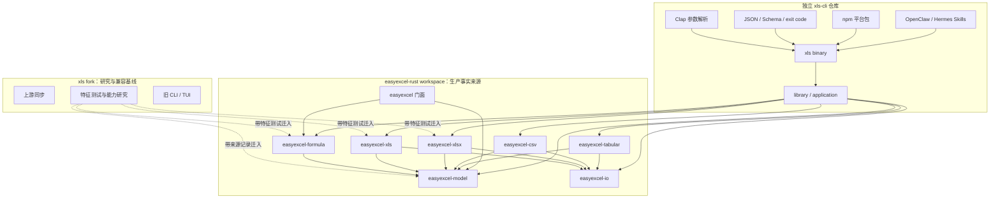
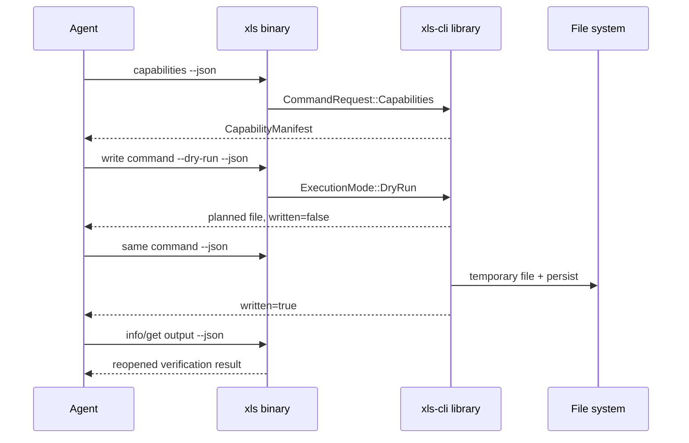

# EasyExcel-Rust 基础能力拆分与 xls-cli 产品化计划

> 状态：Foundation implemented；EasyExcel 门面内的重复格式原语持续下沉
>
> 首次基线：`easy-4-rust/xls` fork commit `4c13da74a87e8c6cc83bbb01c7419b1729684a24`
>
> 证据边界：本文的“已实现”来自当前源码和本地测试；npm 多平台安装仍需在发布流水线与真实注册表完成验证。

## 1. 决策与结果

- 保留 `xls` fork，继续用于上游同步、格式研究、特征对照和兼容性验证。
- `xls-cli` 是独立仓库和独立产品，不是 fork 改名。
- 原 `easyexcel-cli` 的 library-first 应用层已整体迁入独立 `xls-cli` 仓库，不再是 `easyexcel-rust` workspace crate。
- `easyexcel` 门面继续保留 Java EasyExcel 风格 builder、listener、converter、handler 与 derive API。
- `easyexcel/src` 只允许 EasyExcel 个性化实现和基础 crate adapter；通用格式算法必须位于 `crates/`。
- `easyexcel` 已不再依赖完整 `xls` package；其 BIFF8 公式缓存路径改为直接使用 `easyexcel-model` 与 `easyexcel-formula`。
- `xls-cli` 的 Cargo package 为 `xls-cli`，同时提供 library target 与名为 `xls` 的二进制。
- npm 主包为 `@easy4rust/xls-cli`，采用 8 个原生平台包和 `optionalDependencies`。
- 高级命令若尚未迁移，能力清单显示 `unsupported`，执行时返回 `UNSUPPORTED_COMMAND`。

## 2. 当前架构



依赖约束：

```text
easyexcel ──> EasyExcel 基础 crates
xls-cli library/application ──> EasyExcel 基础 crates
xls binary/TUI ──> xls-cli library/application
```

禁止：

```text
easyexcel -> xls-cli
xls-cli -> 旧 xls fork
基础 crates -> easyexcel 门面
```

## 3. 基础 crate 职责与落地状态

| Crate | 当前职责 | 状态 |
| --- | --- | --- |
| `easyexcel-model` | Workbook、Sheet、Cell、Style、Merge、Table、DefinedName、OpaquePart | 已迁入 |
| `easyexcel-formula` | AST、解析、依赖图、重算、函数注册表、动态数组 | 已迁入 |
| `easyexcel-io` | Format、ReadMode、WriteMode、RowSource/RowSink、ResourceLimits、统一错误、临时文件、流复制、gzip record spill | 已实现；Java util 路径为薄代理 |
| `easyexcel-xls` | BIFF8/OLE2 读取、生成、record/string/Ptg/RC4、工作簿生成、模板 roundtrip、公式缓存与数字记录扫描 | 已迁入；门面仅保留 CellValue/样式/事件/错误适配 |
| `easyexcel-xlsx` | OOXML 读取、事件流读取、生成、Agile 加密、opaque part/table roundtrip、OPC 关系、ZIP 保留包、模板 XML 与样式合并 | 已迁入；门面保留 listener/cache/handler/converter 编排 |
| `easyexcel-csv` | 编码、字符集、增量转码、分隔符识别、类型推断、读写 | 已迁入；旧 Java 路径为兼容重导出 |
| `easyexcel-tabular` | Markdown、静态 HTML、JSON 与中立表格模型转换 | 已实现，5 项 crate 测试 |
| `xls-cli` library/application | 请求、执行器、稳定结果/错误、capabilities、schema、文件安全策略 | 已迁入产品仓库，15 项单元测试 |
| `easyexcel` | EasyExcel 风格公共门面与现有工程体验 | 保持原路径与公共 API |

读取保留两条路径：

- Event Mode：现有 EasyExcel listener 读取，以及 `easyexcel-xlsx::stream` 的恒定内存行流。
- Workbook Mode：`easyexcel-model::Workbook`，用于查询、修改、公式重算与 roundtrip。

写入保留两条路径：

- Generate Mode：EasyExcel 门面的 XLSX 新建继续使用 `rust_xlsxwriter`；基础格式 crate 也可生成文件。
- RoundTrip Mode：基础 XLS/XLSX writer 基于统一模型保存既有文件；XLSX 对 opaque parts、defined names 和 tables 有特征测试。

## 4. `xls-cli` library 公共契约

```rust
pub trait CommandExecutor {
    fn execute(
        &self,
        request: CommandRequest,
        context: &ExecutionContext,
    ) -> Result<CommandResult, CommandError>;
}
```

- `CommandRequest`：serde tagged 的带类型请求枚举。
- `ExecutionContext`：`ExecutionMode`、`OverwritePolicy`、`ResourceLimits` 与脱敏 `SecretString`。
- `CommandResult`：协议版本、数据、文件、警告、统计、dry-run 状态。
- `CommandError`：稳定 `ErrorCode`、用户消息、非敏感诊断、可重试标记。
- `CapabilityManifest`：运行时真实命令/格式/模式状态。
- `SchemaVersion`：当前为 `1.0`。

library 层不包含 Clap、stdout/stderr、颜色、TUI 或 `process::exit`。文件写入先写同目录临时文件；默认拒绝已存在目标，原地修改必须显式使用 Replace 策略。

## 5. `xls-cli` 产品契约



- JSON 模式 stdout 只有一个对象；非 JSON 诊断写 stderr。
- 默认不覆盖；`--force` 是显式的 Replace 策略。
- 密码仅从 stdin 或指定环境变量读取，敏感包装类型的 Debug 固定为 `[REDACTED]`。
- 退出码：2 参数，3 unsupported，4 策略/资源限制，5 读写/查询，1 内部错误。
- npm 安装不下载任意 URL；主包选择已签入 npm 注册表的平台可选包。

## 6. 实施阶段状态

| 阶段 | 状态 | 已完成 | 后续门槛 |
| --- | --- | --- | --- |
| 1 能力与兼容基线 | 进行中 | 来源 commit、能力矩阵、格式/公式已有测试清单 | 扩展到旧 CLI 每个命令的完整 golden 对照 |
| 2 基础 crates | 完成 V1 | 7 个基础 crate；`easyexcel -> xls` 已消除 | 公共 API 稳定化与 crates.io 发布顺序 |
| 3 读写与转换 | 完成 V1 | XLS/XLSX/CSV、Markdown/HTML/JSON；静态 HTML 安全解析 | 更复杂 HTML 表头/样式映射与更广 roundtrip corpus |
| 4 `xls-cli` library/application | 完成 V1 | 22 个真实命令、稳定协议、unsupported；已与产品仓库合并 | 按能力矩阵逐个迁入高级命令 |
| 5 `xls-cli` 产品 | 代码完成/发布待验 | library、Rust binary、npm 8 平台包、CI/release workflow | 真实 npm 名称、8 平台构建与安装验证 |
| 6 Skills | 代码完成 | 单一 Skill 源、OpenClaw/Hermes 生成包、OpenAI 元数据、校验 | 在目标 agent 运行两条任务回放 |

## 7. 发布与验证门槛

- `cargo fmt --check`、`cargo clippy`、workspace tests。
- EasyExcel 现有公开 API 测试继续通过。
- `cargo tree -p easyexcel` 不出现 `xls` package。
- `capabilities` 的每个 supported 项均有实现；planned 项必须返回 `UNSUPPORTED_COMMAND`。
- npm 主包、8 个平台包、Cargo、tag 与 JSON 协议可追踪。
- 发布物包含 MIT/Apache 许可证、NOTICE 与 SHA-256 校验和。
- npm 安装、二进制启动、JSON stdout/stderr 和 exit code 在 8 个目标环境冒烟。
- OpenClaw/Hermes 回放“提取数据”和“Markdown/HTML 生成 XLSX”。

## 8. 已知边界

- 当前完成的是可执行 V1，不代表原 `xls` 的所有 41 类命令已经迁入。
- RoundTrip 的“尽可能保留”只对已有特征测试覆盖的 opaque parts、defined names、tables 等成立，不能推导为任意 OOXML 部件 100% 无损。
- npm 包名称和发布授权只有在注册表发布时才能最终确认。
- 多平台 workflow 已定义，但本地 macOS 验证不能替代 Linux/Windows 与 npm 安装验证。
